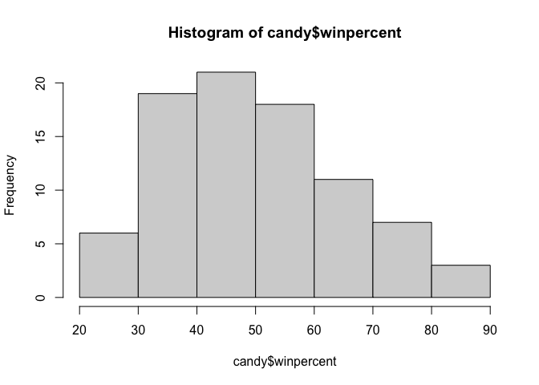

Candy_data
================
Zaida Rodriguez (PID:A59010549)
10/29/2021

``` r
candy_file <- "candy-data.csv"
candy = read.csv("candy-data.csv", row.names=1)
head(candy)
```

    ##              chocolate fruity caramel peanutyalmondy nougat crispedricewafer
    ## 100 Grand            1      0       1              0      0                1
    ## 3 Musketeers         1      0       0              0      1                0
    ## One dime             0      0       0              0      0                0
    ## One quarter          0      0       0              0      0                0
    ## Air Heads            0      1       0              0      0                0
    ## Almond Joy           1      0       0              1      0                0
    ##              hard bar pluribus sugarpercent pricepercent winpercent
    ## 100 Grand       0   1        0        0.732        0.860   66.97173
    ## 3 Musketeers    0   1        0        0.604        0.511   67.60294
    ## One dime        0   0        0        0.011        0.116   32.26109
    ## One quarter     0   0        0        0.011        0.511   46.11650
    ## Air Heads       0   0        0        0.906        0.511   52.34146
    ## Almond Joy      0   1        0        0.465        0.767   50.34755

``` r
#View(candy)
```

> Q1. How many different candy types are in this dataset?

85

``` r
nrow(candy)
```

    ## [1] 85

> Q2. How many fruity candy types are in the dataset?

38

``` r
dim(candy)
```

    ## [1] 85 12

``` r
sum(candy$fruity)
```

    ## [1] 38

``` r
candy["Twix", ]$winpercent
```

    ## [1] 81.64291

> Q3. What is your favorite candy in the dataset and what is it’s
> winpercent value?

37.35%

``` r
candy["Red vines", ]$winpercent
```

    ## [1] 37.34852

> Q4. What is the winpercent value for “Kit Kat”?

76.77%

``` r
candy["Kit Kat", ]$winpercent
```

    ## [1] 76.7686

> Q5. What is the winpercent value for “Tootsie Roll Snack Bars”?

49.65%

``` r
candy["Tootsie Roll Snack Bars", ]$winpercent
```

    ## [1] 49.6535

``` r
library("skimr")
skim(candy)
```

|                                                  |       |
|:-------------------------------------------------|:------|
| Name                                             | candy |
| Number of rows                                   | 85    |
| Number of columns                                | 12    |
| \_\_\_\_\_\_\_\_\_\_\_\_\_\_\_\_\_\_\_\_\_\_\_   |       |
| Column type frequency:                           |       |
| numeric                                          | 12    |
| \_\_\_\_\_\_\_\_\_\_\_\_\_\_\_\_\_\_\_\_\_\_\_\_ |       |
| Group variables                                  | None  |

Data summary

**Variable type: numeric**

| skim_variable    | n_missing | complete_rate |  mean |    sd |    p0 |   p25 |   p50 |   p75 |  p100 | hist  |
|:-----------------|----------:|--------------:|------:|------:|------:|------:|------:|------:|------:|:------|
| chocolate        |         0 |             1 |  0.44 |  0.50 |  0.00 |  0.00 |  0.00 |  1.00 |  1.00 | ▇▁▁▁▆ |
| fruity           |         0 |             1 |  0.45 |  0.50 |  0.00 |  0.00 |  0.00 |  1.00 |  1.00 | ▇▁▁▁▆ |
| caramel          |         0 |             1 |  0.16 |  0.37 |  0.00 |  0.00 |  0.00 |  0.00 |  1.00 | ▇▁▁▁▂ |
| peanutyalmondy   |         0 |             1 |  0.16 |  0.37 |  0.00 |  0.00 |  0.00 |  0.00 |  1.00 | ▇▁▁▁▂ |
| nougat           |         0 |             1 |  0.08 |  0.28 |  0.00 |  0.00 |  0.00 |  0.00 |  1.00 | ▇▁▁▁▁ |
| crispedricewafer |         0 |             1 |  0.08 |  0.28 |  0.00 |  0.00 |  0.00 |  0.00 |  1.00 | ▇▁▁▁▁ |
| hard             |         0 |             1 |  0.18 |  0.38 |  0.00 |  0.00 |  0.00 |  0.00 |  1.00 | ▇▁▁▁▂ |
| bar              |         0 |             1 |  0.25 |  0.43 |  0.00 |  0.00 |  0.00 |  0.00 |  1.00 | ▇▁▁▁▂ |
| pluribus         |         0 |             1 |  0.52 |  0.50 |  0.00 |  0.00 |  1.00 |  1.00 |  1.00 | ▇▁▁▁▇ |
| sugarpercent     |         0 |             1 |  0.48 |  0.28 |  0.01 |  0.22 |  0.47 |  0.73 |  0.99 | ▇▇▇▇▆ |
| pricepercent     |         0 |             1 |  0.47 |  0.29 |  0.01 |  0.26 |  0.47 |  0.65 |  0.98 | ▇▇▇▇▆ |
| winpercent       |         0 |             1 | 50.32 | 14.71 | 22.45 | 39.14 | 47.83 | 59.86 | 84.18 | ▃▇▆▅▂ |

> Q6. Is there any variable/column that looks to be on a different scale
> to the majority of the other columns in the dataset?

winpercent is measured differently

> Q7. What do you think a zero and one represent for the candy$chocolate
> column?

True or false

> Q8. Plot a histogram of winpercent values

``` r
hist(candy$winpercent)
```

<!-- -->

> Q9. Is the distribution of winpercent values symmetrical?

No

> Q10. Is the center of the distribution above or below 50%?

Below

> Q11. On average is chocolate candy higher or lower ranked than fruit
> candy?

chocolate is higher ranked

``` r
as.logical(candy$chocolate)
```

    ##  [1]  TRUE  TRUE FALSE FALSE FALSE  TRUE  TRUE FALSE FALSE FALSE  TRUE FALSE
    ## [13] FALSE FALSE FALSE FALSE FALSE FALSE FALSE FALSE FALSE FALSE  TRUE  TRUE
    ## [25]  TRUE  TRUE FALSE  TRUE  TRUE FALSE FALSE FALSE  TRUE  TRUE FALSE  TRUE
    ## [37]  TRUE  TRUE  TRUE  TRUE  TRUE FALSE  TRUE  TRUE FALSE FALSE FALSE  TRUE
    ## [49] FALSE FALSE FALSE  TRUE  TRUE  TRUE  TRUE FALSE  TRUE FALSE FALSE  TRUE
    ## [61] FALSE FALSE  TRUE FALSE  TRUE  TRUE FALSE FALSE FALSE FALSE FALSE FALSE
    ## [73] FALSE FALSE  TRUE  TRUE  TRUE  TRUE FALSE  TRUE FALSE FALSE FALSE FALSE
    ## [85]  TRUE

``` r
candy[as.logical(candy$chocolate),]
```

    ##                             chocolate fruity caramel peanutyalmondy nougat
    ## 100 Grand                           1      0       1              0      0
    ## 3 Musketeers                        1      0       0              0      1
    ## Almond Joy                          1      0       0              1      0
    ## Baby Ruth                           1      0       1              1      1
    ## Charleston Chew                     1      0       0              0      1
    ## HersheyÕs Kisses                    1      0       0              0      0
    ## HersheyÕs Krackel                   1      0       0              0      0
    ## HersheyÕs Milk Chocolate            1      0       0              0      0
    ## HersheyÕs Special Dark              1      0       0              0      0
    ## Junior Mints                        1      0       0              0      0
    ## Kit Kat                             1      0       0              0      0
    ## Peanut butter M&MÕs                 1      0       0              1      0
    ## M&MÕs                               1      0       0              0      0
    ## Milk Duds                           1      0       1              0      0
    ## Milky Way                           1      0       1              0      1
    ## Milky Way Midnight                  1      0       1              0      1
    ## Milky Way Simply Caramel            1      0       1              0      0
    ## Mounds                              1      0       0              0      0
    ## Mr Good Bar                         1      0       0              1      0
    ## Nestle Butterfinger                 1      0       0              1      0
    ## Nestle Crunch                       1      0       0              0      0
    ## Peanut M&Ms                         1      0       0              1      0
    ## ReeseÕs Miniatures                  1      0       0              1      0
    ## ReeseÕs Peanut Butter cup           1      0       0              1      0
    ## ReeseÕs pieces                      1      0       0              1      0
    ## ReeseÕs stuffed with pieces         1      0       0              1      0
    ## Rolo                                1      0       1              0      0
    ## Sixlets                             1      0       0              0      0
    ## Nestle Smarties                     1      0       0              0      0
    ## Snickers                            1      0       1              1      1
    ## Snickers Crisper                    1      0       1              1      0
    ## Tootsie Pop                         1      1       0              0      0
    ## Tootsie Roll Juniors                1      0       0              0      0
    ## Tootsie Roll Midgies                1      0       0              0      0
    ## Tootsie Roll Snack Bars             1      0       0              0      0
    ## Twix                                1      0       1              0      0
    ## Whoppers                            1      0       0              0      0
    ##                             crispedricewafer hard bar pluribus sugarpercent
    ## 100 Grand                                  1    0   1        0        0.732
    ## 3 Musketeers                               0    0   1        0        0.604
    ## Almond Joy                                 0    0   1        0        0.465
    ## Baby Ruth                                  0    0   1        0        0.604
    ## Charleston Chew                            0    0   1        0        0.604
    ## HersheyÕs Kisses                           0    0   0        1        0.127
    ## HersheyÕs Krackel                          1    0   1        0        0.430
    ## HersheyÕs Milk Chocolate                   0    0   1        0        0.430
    ## HersheyÕs Special Dark                     0    0   1        0        0.430
    ## Junior Mints                               0    0   0        1        0.197
    ## Kit Kat                                    1    0   1        0        0.313
    ## Peanut butter M&MÕs                        0    0   0        1        0.825
    ## M&MÕs                                      0    0   0        1        0.825
    ## Milk Duds                                  0    0   0        1        0.302
    ## Milky Way                                  0    0   1        0        0.604
    ## Milky Way Midnight                         0    0   1        0        0.732
    ## Milky Way Simply Caramel                   0    0   1        0        0.965
    ## Mounds                                     0    0   1        0        0.313
    ## Mr Good Bar                                0    0   1        0        0.313
    ## Nestle Butterfinger                        0    0   1        0        0.604
    ## Nestle Crunch                              1    0   1        0        0.313
    ## Peanut M&Ms                                0    0   0        1        0.593
    ## ReeseÕs Miniatures                         0    0   0        0        0.034
    ## ReeseÕs Peanut Butter cup                  0    0   0        0        0.720
    ## ReeseÕs pieces                             0    0   0        1        0.406
    ## ReeseÕs stuffed with pieces                0    0   0        0        0.988
    ## Rolo                                       0    0   0        1        0.860
    ## Sixlets                                    0    0   0        1        0.220
    ## Nestle Smarties                            0    0   0        1        0.267
    ## Snickers                                   0    0   1        0        0.546
    ## Snickers Crisper                           1    0   1        0        0.604
    ## Tootsie Pop                                0    1   0        0        0.604
    ## Tootsie Roll Juniors                       0    0   0        0        0.313
    ## Tootsie Roll Midgies                       0    0   0        1        0.174
    ## Tootsie Roll Snack Bars                    0    0   1        0        0.465
    ## Twix                                       1    0   1        0        0.546
    ## Whoppers                                   1    0   0        1        0.872
    ##                             pricepercent winpercent
    ## 100 Grand                          0.860   66.97173
    ## 3 Musketeers                       0.511   67.60294
    ## Almond Joy                         0.767   50.34755
    ## Baby Ruth                          0.767   56.91455
    ## Charleston Chew                    0.511   38.97504
    ## HersheyÕs Kisses                   0.093   55.37545
    ## HersheyÕs Krackel                  0.918   62.28448
    ## HersheyÕs Milk Chocolate           0.918   56.49050
    ## HersheyÕs Special Dark             0.918   59.23612
    ## Junior Mints                       0.511   57.21925
    ## Kit Kat                            0.511   76.76860
    ## Peanut butter M&MÕs                0.651   71.46505
    ## M&MÕs                              0.651   66.57458
    ## Milk Duds                          0.511   55.06407
    ## Milky Way                          0.651   73.09956
    ## Milky Way Midnight                 0.441   60.80070
    ## Milky Way Simply Caramel           0.860   64.35334
    ## Mounds                             0.860   47.82975
    ## Mr Good Bar                        0.918   54.52645
    ## Nestle Butterfinger                0.767   70.73564
    ## Nestle Crunch                      0.767   66.47068
    ## Peanut M&Ms                        0.651   69.48379
    ## ReeseÕs Miniatures                 0.279   81.86626
    ## ReeseÕs Peanut Butter cup          0.651   84.18029
    ## ReeseÕs pieces                     0.651   73.43499
    ## ReeseÕs stuffed with pieces        0.651   72.88790
    ## Rolo                               0.860   65.71629
    ## Sixlets                            0.081   34.72200
    ## Nestle Smarties                    0.976   37.88719
    ## Snickers                           0.651   76.67378
    ## Snickers Crisper                   0.651   59.52925
    ## Tootsie Pop                        0.325   48.98265
    ## Tootsie Roll Juniors               0.511   43.06890
    ## Tootsie Roll Midgies               0.011   45.73675
    ## Tootsie Roll Snack Bars            0.325   49.65350
    ## Twix                               0.906   81.64291
    ## Whoppers                           0.848   49.52411

``` r
chocolate <- candy[as.logical(candy$chocolate),]$winpercent
mean(chocolate)
```

    ## [1] 60.92153

``` r
fruity <- candy[(as.logical(candy$fruity)),]$winpercent
mean(fruity)
```

    ## [1] 44.11974

> Q12. Is this difference statistically significant?

Yes because it is not equal, so it is significantly different

``` r
t.test(chocolate,fruity)
```

    ## 
    ##  Welch Two Sample t-test
    ## 
    ## data:  chocolate and fruity
    ## t = 6.2582, df = 68.882, p-value = 2.871e-08
    ## alternative hypothesis: true difference in means is not equal to 0
    ## 95 percent confidence interval:
    ##  11.44563 22.15795
    ## sample estimates:
    ## mean of x mean of y 
    ##  60.92153  44.11974

#3. Candy rankings Lets make a varplot of the winpercent values for the
various candy types

> Q13. What are the five least liked candy types in this set?

Nik L Nip, Boston Baked Beans, Chiclets, Super Bubble, and Jawbusters

``` r
head(candy[order(candy$winpercent),], n=5)
```

    ##                    chocolate fruity caramel peanutyalmondy nougat
    ## Nik L Nip                  0      1       0              0      0
    ## Boston Baked Beans         0      0       0              1      0
    ## Chiclets                   0      1       0              0      0
    ## Super Bubble               0      1       0              0      0
    ## Jawbusters                 0      1       0              0      0
    ##                    crispedricewafer hard bar pluribus sugarpercent pricepercent
    ## Nik L Nip                         0    0   0        1        0.197        0.976
    ## Boston Baked Beans                0    0   0        1        0.313        0.511
    ## Chiclets                          0    0   0        1        0.046        0.325
    ## Super Bubble                      0    0   0        0        0.162        0.116
    ## Jawbusters                        0    1   0        1        0.093        0.511
    ##                    winpercent
    ## Nik L Nip            22.44534
    ## Boston Baked Beans   23.41782
    ## Chiclets             24.52499
    ## Super Bubble         27.30386
    ## Jawbusters           28.12744

``` r
# candy %>% arrange(winpercent) %>% head(5)
```

> Q14. What are the top 5 all time favorite candy types out of this set?

> Q15. Make a first barplot of candy ranking based on winpercent values

``` r
library(ggplot2)

ggplot(candy) +
    aes(winpercent, rownames(candy))+
    geom_col()
```

<!-- -->

> Q16. Improve this by re-ordering the candy by the winpercent value

``` r
ggplot(candy) +
    aes(winpercent, reorder(rownames(candy), winpercent)) +
    geom_col()
```

<!-- -->

add color

``` r
#color vector all black to start
my_cols=rep("black", nrow(candy)) #nrow(candy) is a little vector that is the same lenght as candy file

# now overwrite the chocolate entries with "chocolate"
my_cols[as.logical(candy$chocolate)] = "chocolate" #as.logical (t/f) anything is true will be chocolate
my_cols[as.logical(candy$bar)] = "brown"
my_cols[as.logical(candy$fruity)] = "pink"
```

print it out

``` r
my_cols
```

    ##  [1] "brown"     "brown"     "black"     "black"     "pink"      "brown"    
    ##  [7] "brown"     "black"     "black"     "pink"      "brown"     "pink"     
    ## [13] "pink"      "pink"      "pink"      "pink"      "pink"      "pink"     
    ## [19] "pink"      "black"     "pink"      "pink"      "chocolate" "brown"    
    ## [25] "brown"     "brown"     "pink"      "chocolate" "brown"     "pink"     
    ## [31] "pink"      "pink"      "chocolate" "chocolate" "pink"      "chocolate"
    ## [37] "brown"     "brown"     "brown"     "brown"     "brown"     "pink"     
    ## [43] "brown"     "brown"     "pink"      "pink"      "brown"     "chocolate"
    ## [49] "black"     "pink"      "pink"      "chocolate" "chocolate" "chocolate"
    ## [55] "chocolate" "pink"      "chocolate" "black"     "pink"      "chocolate"
    ## [61] "pink"      "pink"      "chocolate" "pink"      "brown"     "brown"    
    ## [67] "pink"      "pink"      "pink"      "pink"      "black"     "black"    
    ## [73] "pink"      "pink"      "pink"      "chocolate" "chocolate" "brown"    
    ## [79] "pink"      "brown"     "pink"      "pink"      "pink"      "black"    
    ## [85] "chocolate"

``` r
ggplot(candy) +
    aes(winpercent, reorder(rownames(candy), winpercent)) +
    geom_col(fill=my_cols)
```

<!-- -->

> Q17. What is the worst ranked chocolate candy?

The worst ranked chocolate candy is Sixlets

> Q18. What is the best ranked fruity candy?

The best ranked fruity candy is Starburst

# 4. Pricepoint

``` r
library(ggrepel)

# How about a plot of price vs win
ggplot(candy) +
  aes(winpercent, pricepercent, label=rownames(candy)) +
  geom_point(col=my_cols) + 
  geom_text_repel(col=my_cols, size=3.3, max.overlaps = 5)
```

    ## Warning: ggrepel: 50 unlabeled data points (too many overlaps). Consider
    ## increasing max.overlaps

<!-- --> To
remove these weird labels

``` r
rownames(candy) <- gsub("Õ","'", rownames(candy))
```

> Q19. Which candy type is the highest ranked in terms of winpercent for
> the least money - i.e. offers the most bang for your buck?

Reese’s Miniatures

> Q20. What are the top 5 most expensive candy types in the dataset and
> of these which is the least popular?

Nik L Nip, Nestle Smarties, Ring pops, Hershey’s Krackel, Hershey’s Milk
Chocolate

``` r
ord <- order(candy$pricepercent, decreasing = TRUE)
head(candy[ord,c(11,12)], n=5)
```

    ##                          pricepercent winpercent
    ## Nik L Nip                       0.976   22.44534
    ## Nestle Smarties                 0.976   37.88719
    ## Ring pop                        0.965   35.29076
    ## Hershey's Krackel               0.918   62.28448
    ## Hershey's Milk Chocolate        0.918   56.49050

``` r
library(corrplot)
```

    ## corrplot 0.90 loaded

``` r
cij <- cor(candy)
corrplot(cij)
```

<!-- --> this is
a correlation structure. \> Q22. Examining this plot what two variables
are anti-correlated (i.e. have minus values)?

fruity and chocolate

> Q23. Similarly, what two variables are most positively correlated?

winpercent and chocolate

#PCA

``` r
pca <- prcomp(candy, scale = T)
summary(pca)
```

    ## Importance of components:
    ##                           PC1    PC2    PC3     PC4    PC5     PC6     PC7
    ## Standard deviation     2.0788 1.1378 1.1092 1.07533 0.9518 0.81923 0.81530
    ## Proportion of Variance 0.3601 0.1079 0.1025 0.09636 0.0755 0.05593 0.05539
    ## Cumulative Proportion  0.3601 0.4680 0.5705 0.66688 0.7424 0.79830 0.85369
    ##                            PC8     PC9    PC10    PC11    PC12
    ## Standard deviation     0.74530 0.67824 0.62349 0.43974 0.39760
    ## Proportion of Variance 0.04629 0.03833 0.03239 0.01611 0.01317
    ## Cumulative Proportion  0.89998 0.93832 0.97071 0.98683 1.00000

``` r
plot(pca$x[,1:2])
```

<!-- --> change
the colors

``` r
plot(pca$x[,1:2], col=my_cols, pch=16)
```

<!-- -->

``` r
my_data <- cbind(candy, pca$x[,1:3])
p <- ggplot(my_data) + 
        aes(x=PC1, y=PC2, 
            size=winpercent/100,  
            text=rownames(my_data),
            label=rownames(my_data)) +
        geom_point(col=my_cols)
p
```

<!-- -->

``` r
par(mar=c(8,4,2,2))
barplot(pca$rotation[,1], las=2, ylab="PC1 Contribution")
```

<!-- --> \> Q24.
What original variables are picked up strongly by PC1 in the positive
direction? Do these make sense to you?

fruity
