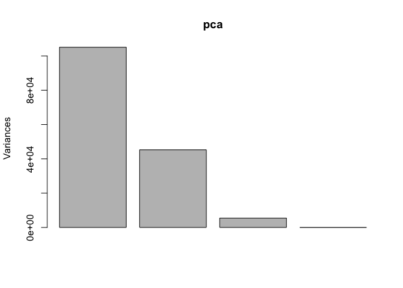

Machine Learning 1
================
Zaida Rodriguez (PID:A59010549)
10/22/2021

#Clustering methods

Kmeans clustering in R is done with the `kmeans()` function Here we make
up some data to test and learn with.

``` r
tmp <- c(rnorm(30, 3), rnorm(30,-3))
data <- cbind(x=tmp, y=rev(tmp))

#the goal of this is to make a data set that has -3 and +3 values in x and y 
# x:(-3, +3) and y:(+3, -3)
plot(data)
```

<!-- -->
Run `kmeans()` set k(centers) to 2 and nstart to 20. The thing with
Kmeans is you have to tell it how many clusters you want.

``` r
km <- kmeans(data, centers=2, nstart=2)
km
```

    ## K-means clustering with 2 clusters of sizes 30, 30
    ## 
    ## Cluster means:
    ##           x         y
    ## 1 -3.117921  3.007528
    ## 2  3.007528 -3.117921
    ## 
    ## Clustering vector:
    ##  [1] 2 2 2 2 2 2 2 2 2 2 2 2 2 2 2 2 2 2 2 2 2 2 2 2 2 2 2 2 2 2 1 1 1 1 1 1 1 1
    ## [39] 1 1 1 1 1 1 1 1 1 1 1 1 1 1 1 1 1 1 1 1 1 1
    ## 
    ## Within cluster sum of squares by cluster:
    ## [1] 56.91592 56.91592
    ##  (between_SS / total_SS =  90.8 %)
    ## 
    ## Available components:
    ## 
    ## [1] "cluster"      "centers"      "totss"        "withinss"     "tot.withinss"
    ## [6] "betweenss"    "size"         "iter"         "ifault"

Clustering vector is telling you for which cluster your element belongs
to.

> Q1. How many points are in each cluster?

``` r
km$size
```

    ## [1] 30 30

> Q2. What ’component of your result object details cluster
> assignment/membership?

``` r
km$cluster
```

    ##  [1] 2 2 2 2 2 2 2 2 2 2 2 2 2 2 2 2 2 2 2 2 2 2 2 2 2 2 2 2 2 2 1 1 1 1 1 1 1 1
    ## [39] 1 1 1 1 1 1 1 1 1 1 1 1 1 1 1 1 1 1 1 1 1 1

> Q3. What ‘component’ of your result object details cluster center?

``` r
km$centers
```

    ##           x         y
    ## 1 -3.117921  3.007528
    ## 2  3.007528 -3.117921

> Q4. Plot x colored by the kmeans cluster assignment and add clsuters
> as blue points (or by clusters)

``` r
plot(data, col=km$cluster)
points(km$centers, col="blue", pch=15, cex=2)
```

<!-- -->

#Hierarchical clustering

We will use the `hclust()` function on the same data as before and see
how this method works.

``` r
hc <- hclust(dist(data))
hc
```

    ## 
    ## Call:
    ## hclust(d = dist(data))
    ## 
    ## Cluster method   : complete 
    ## Distance         : euclidean 
    ## Number of objects: 60

``` r
#this function requires you to tell it the distance from each point
```

hclust has a plot method

``` r
plot(hc)
abline(h=7, col="blue")
```

<!-- -->

``` r
# the bottom (leaves) are your row names
# it puts what is closest to each other together
# 2 main groups; you can "cut it"
```

To find our membership vector we need to “cut” the tree (dendrogram) and
for this we use the `cutree()` fucntion and tell it the height to cut
at.

``` r
cutree(hc,h=7)
```

    ##  [1] 1 1 1 1 1 1 1 1 1 1 1 1 1 1 1 1 1 1 1 1 1 1 1 1 1 1 1 1 1 1 2 2 2 2 2 2 2 2
    ## [39] 2 2 2 2 2 2 2 2 2 2 2 2 2 2 2 2 2 2 2 2 2 2

We can also use t we want …

``` r
grps <- cutree(hc, k=2)
```

``` r
plot(data, col=grps)
```

<!-- -->

# Principal Component Analysis (PCA)

## PCA OF UK Food data

read the file ine

``` r
url <- "https://tinyurl.com/UK-foods"
x <- read.csv(url)
```

> Q1. How many rows and columns are in your new data frame named x? What
> R functions could you use to answer this questions?

``` r
dim(x)
```

    ## [1] 17  5

``` r
# there are 17 rows and 5 columns 
```

view the first 6 rows

``` r
head(x)
```

    ##                X England Wales Scotland N.Ireland
    ## 1         Cheese     105   103      103        66
    ## 2  Carcass_meat      245   227      242       267
    ## 3    Other_meat      685   803      750       586
    ## 4           Fish     147   160      122        93
    ## 5 Fats_and_oils      193   235      184       209
    ## 6         Sugars     156   175      147       139

fix the row names:

``` r
rownames(x) <-  x[,1]
x <- x[,-1]
x
```

    ##                     England Wales Scotland N.Ireland
    ## Cheese                  105   103      103        66
    ## Carcass_meat            245   227      242       267
    ## Other_meat              685   803      750       586
    ## Fish                    147   160      122        93
    ## Fats_and_oils           193   235      184       209
    ## Sugars                  156   175      147       139
    ## Fresh_potatoes          720   874      566      1033
    ## Fresh_Veg               253   265      171       143
    ## Other_Veg               488   570      418       355
    ## Processed_potatoes      198   203      220       187
    ## Processed_Veg           360   365      337       334
    ## Fresh_fruit            1102  1137      957       674
    ## Cereals                1472  1582     1462      1494
    ## Beverages                57    73       53        47
    ## Soft_drinks            1374  1256     1572      1506
    ## Alcoholic_drinks        375   475      458       135
    ## Confectionery            54    64       62        41

> Q2. Which approach to solving the ‘row-names problem’ mentioned above
> do you prefer and why? Is one approach more robust than another under
> certain circumstances?

Don’t do things this way, you will overwrite your object. Instead, read
it in with row names already(seen below). This is the preferred method
as it will not mess with your data and is more robust.

``` r
url <- "https://tinyurl.com/UK-foods"
x <- read.csv(url, row.names = 1)
x
```

    ##                     England Wales Scotland N.Ireland
    ## Cheese                  105   103      103        66
    ## Carcass_meat            245   227      242       267
    ## Other_meat              685   803      750       586
    ## Fish                    147   160      122        93
    ## Fats_and_oils           193   235      184       209
    ## Sugars                  156   175      147       139
    ## Fresh_potatoes          720   874      566      1033
    ## Fresh_Veg               253   265      171       143
    ## Other_Veg               488   570      418       355
    ## Processed_potatoes      198   203      220       187
    ## Processed_Veg           360   365      337       334
    ## Fresh_fruit            1102  1137      957       674
    ## Cereals                1472  1582     1462      1494
    ## Beverages                57    73       53        47
    ## Soft_drinks            1374  1256     1572      1506
    ## Alcoholic_drinks        375   475      458       135
    ## Confectionery            54    64       62        41

now create a barplot. By adding “col=rainbow” you can change the color
of the bars

``` r
barplot(as.matrix(x), beside=T, col=rainbow(nrow(x)))
```

<!-- -->

``` r
# barplot need to be run as a matrix, since we didn't have a matrix, you can force it right into the function. 
```

> Q5. Generating all pairwise plots may help somewhat. Can you make
> sense of the following code and resulting figure? What does it mean if
> a given point lies on the diagonal for a given plot?

This pairwise plot allows you to compare the 4 countries against each
other. The first row compares England (x) and Wales (y), then Scotland
(y), then N. Ireland(y) The 2nd row compares Wales (x) and England(y),
then N. Ireland (y); and so on and so on. The points that are outliers
are visible and those indicate differences in the consumption of the
particular food categories depending on the country. The points that lie
on the diagonal for a given plot indicate that the values are the same
for both countries that are being compared.

``` r
mycols <- rainbow(nrow(x))
pairs(x, col=mycols, pch=16)
```

<!-- -->
\> Q6. What is the main differences in between N. Ireland and the other
countries of the UK interms of this data-set?

N, Ireland has a greater variation of the food consumption in comparison
to England, Wales, and Scotland.

## PCA to the rescue!

Not easy to interpret, takes time. Instead try PCA!

Here we will use the base R function for PCA, which is called
`prcomp()`. This function wants you to first transpose your data (ie:
flip the columns with rows)

``` r
pca <- prcomp(t(x))
summary(pca)
```

    ## Importance of components:
    ##                             PC1      PC2      PC3       PC4
    ## Standard deviation     324.1502 212.7478 73.87622 4.189e-14
    ## Proportion of Variance   0.6744   0.2905  0.03503 0.000e+00
    ## Cumulative Proportion    0.6744   0.9650  1.00000 1.000e+00

``` r
plot(pca)
```

<!-- -->

We want a score plot (aka: PCA plot). Basically plot of PC1 vs PC2

``` r
attributes(pca)
```

    ## $names
    ## [1] "sdev"     "rotation" "center"   "scale"    "x"       
    ## 
    ## $class
    ## [1] "prcomp"

> Q7. Complete the code below to generate a plot of PC1 vs PC2. The
> second line adds text labels over the data points.

``` r
#plot PC1 vs PC2
plot(pca$x[,1:2], xlab="PC1", ylab="PC2", xlim=c(-270,500))
text(pca$x[,1:2], labels=colnames(x))
```

<!-- -->

> Q8. Customize your plot so that the colors of the country names match
> the colors in our UK and Ireland map and table at the start of this
> document.

``` r
plot(pca$x[,1:2], xlab="PC1", ylab="PC2", xlim=c(-270,500))
text(pca$x[,1:2], labels=colnames(x), col=rainbow(nrow(x)))
```

<!-- -->

We can also examine the PCA “loading”, which tells us how much of the
original variables contribute to each new PC.

``` r
barplot(pca$rotation[,1], las=2)
```

<!-- -->
\> Q9. Generate a similar ‘loadings plot’ for PC2. What 2 food gorups
feature prominantely and what does PC2 mainly tell us about?

``` r
barplot(pca$rotation[,2], las=2)
```

<!-- -->

``` r
# the 2 main food groups are fresh potatoes and soft drinks. It tells us how much of the original variables contribute to each new PC.
```

## one more PCA

``` r
url2 <- "https://tinyurl.com/expression-CSV"
rna.data <- read.csv(url2, row.names=1)
head(rna.data)
```

    ##        wt1 wt2  wt3  wt4 wt5 ko1 ko2 ko3 ko4 ko5
    ## gene1  439 458  408  429 420  90  88  86  90  93
    ## gene2  219 200  204  210 187 427 423 434 433 426
    ## gene3 1006 989 1030 1017 973 252 237 238 226 210
    ## gene4  783 792  829  856 760 849 856 835 885 894
    ## gene5  181 249  204  244 225 277 305 272 270 279
    ## gene6  460 502  491  491 493 612 594 577 618 638

> Q10. How many genes are there in this data?

``` r
nrow(rna.data)
```

    ## [1] 100

``` r
# there are 100 genes
```

``` r
ncol(rna.data)
```

    ## [1] 10

``` r
colnames(rna.data)
```

    ##  [1] "wt1" "wt2" "wt3" "wt4" "wt5" "ko1" "ko2" "ko3" "ko4" "ko5"

``` r
pca.rna = prcomp(t(rna.data), scale=TRUE)
summary(pca.rna)
```

    ## Importance of components:
    ##                           PC1    PC2     PC3     PC4     PC5     PC6     PC7
    ## Standard deviation     9.6237 1.5198 1.05787 1.05203 0.88062 0.82545 0.80111
    ## Proportion of Variance 0.9262 0.0231 0.01119 0.01107 0.00775 0.00681 0.00642
    ## Cumulative Proportion  0.9262 0.9493 0.96045 0.97152 0.97928 0.98609 0.99251
    ##                            PC8     PC9      PC10
    ## Standard deviation     0.62065 0.60342 3.348e-15
    ## Proportion of Variance 0.00385 0.00364 0.000e+00
    ## Cumulative Proportion  0.99636 1.00000 1.000e+00

``` r
plot(pca.rna)
```

<!-- -->

``` r
plot(pca.rna$x[,1:2])
text(pca.rna$x[,1:2], labels=colnames(rna.data))
```

<!-- -->
PC1 is telling us which genes are changing the most between KO to KO and
WT to WT. PC2
