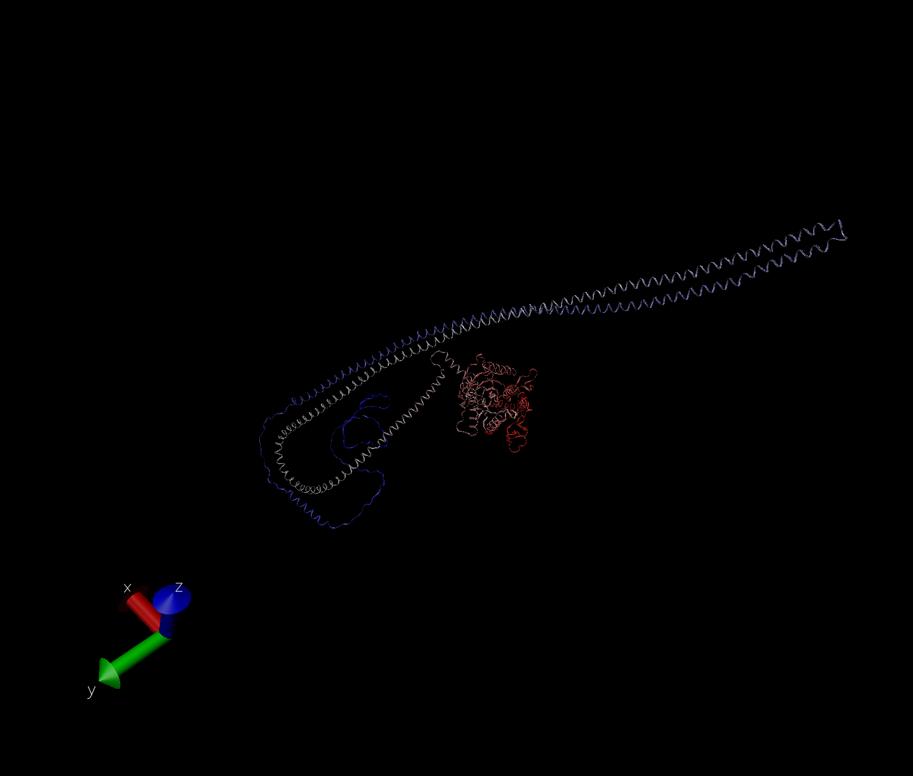

```{r setup, include=FALSE}
knitr::opts_chunk$set(echo = TRUE)
```

```{r}
library(bio3d)
pdb <- read.pdb("1hel")
pdb
```

```{r}
#print out:
head(pdb$atom)
```

Lets do a quick bioinformatic prediction of protein dynamics (aka flexibility). We will use the 'nma()' function, which does Normal Mode Anlysis. 
```{r}
modes <- nma(pdb)

#now plot
plot(modes)
```

Make a trajectory of this prediction with the 'mktrj()'
```{r}
mktrj(modes, file= "nma.pdb")
```

And the image from VMD


## Comparative Structure Analysis

Start by getting a sequence of interest

```{r}
aa <- get.seq("1AKE_A")
aa
```

I want to search the PDB database (the main db for exp structures) for sequences like this aa sequence. 
```{r}
blast <- blast.pdb(aa)
```

plot the blast
```{r}
hits <- plot(blast)
```

Now I have my top hits from the search of the PDB
```{r}
hits$pdb.id
```

Here we download all these similar structures in the PDB and store them on our computer
```{r}
files <- get.pdb(hits$pdb.id, path="pdbs", split=TRUE, gzip=TRUE)
```

Now we want to align all thes structures. We will use the function 'pdbaln()'

```{r}
#Align related PDBs
pdbs <- pdbaln(files, fit = T)
pdbs
```

Let's have a look
```{r}
# bector containing PDB codes for figure axis
ids <- basename.pdb(pdbs$id)

#Draw schematic alignment
plot(pdbs, labels=ids)
```

## Principal Component Analysis (PCA)

Now do a PCA on the xyz coordinate data of all these structures with the 'pca()' function in bio3d.

```{r}
pc <- pca(pdbs)
plot(pc)
```

Let's visualize the displacements (ie: movements of the structe) that are captured by PC1

```{r}
mktrj(pc, pc=1, file="pca.pdb")
```

VMD Image


Save our important results
```{r}
save(blast, hits, pca, pdbs, file = "myresults.RData")
```

Alpha folding

VMD of find a gene sequence


