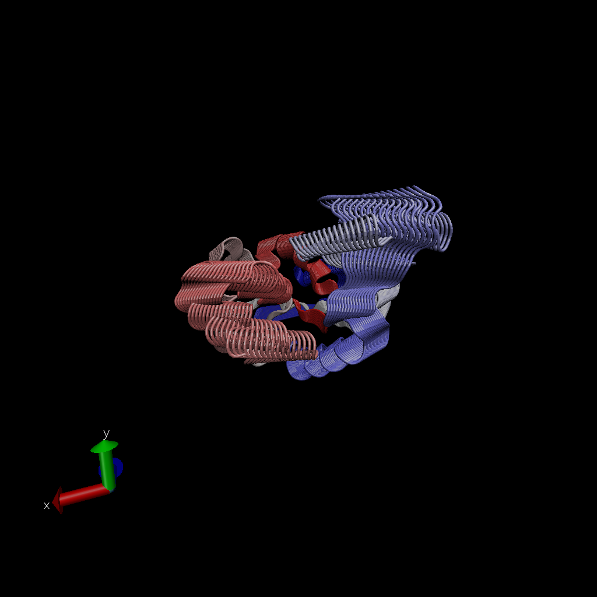

Class_11_pt2
================
Zaida Rodriguez (PID:A59010549)
11/5/2021

``` r
library(bio3d)
pdb <- read.pdb("1hel")
```

    ##   Note: Accessing on-line PDB file

``` r
pdb
```

    ## 
    ##  Call:  read.pdb(file = "1hel")
    ## 
    ##    Total Models#: 1
    ##      Total Atoms#: 1186,  XYZs#: 3558  Chains#: 1  (values: A)
    ## 
    ##      Protein Atoms#: 1001  (residues/Calpha atoms#: 129)
    ##      Nucleic acid Atoms#: 0  (residues/phosphate atoms#: 0)
    ## 
    ##      Non-protein/nucleic Atoms#: 185  (residues: 185)
    ##      Non-protein/nucleic resid values: [ HOH (185) ]
    ## 
    ##    Protein sequence:
    ##       KVFGRCELAAAMKRHGLDNYRGYSLGNWVCAAKFESNFNTQATNRNTDGSTDYGILQINS
    ##       RWWCNDGRTPGSRNLCNIPCSALLSSDITASVNCAKKIVSDGNGMNAWVAWRNRCKGTDV
    ##       QAWIRGCRL
    ## 
    ## + attr: atom, xyz, seqres, helix, sheet,
    ##         calpha, remark, call

``` r
#print out:
head(pdb$atom)
```

    ##   type eleno elety  alt resid chain resno insert      x      y      z o     b
    ## 1 ATOM     1     N <NA>   LYS     A     1   <NA>  3.294 10.164 10.266 1 11.18
    ## 2 ATOM     2    CA <NA>   LYS     A     1   <NA>  2.388 10.533  9.168 1  9.68
    ## 3 ATOM     3     C <NA>   LYS     A     1   <NA>  2.438 12.049  8.889 1 14.00
    ## 4 ATOM     4     O <NA>   LYS     A     1   <NA>  2.406 12.898  9.815 1 14.00
    ## 5 ATOM     5    CB <NA>   LYS     A     1   <NA>  0.949 10.101  9.559 1 13.29
    ## 6 ATOM     6    CG <NA>   LYS     A     1   <NA> -0.050 10.621  8.573 1 13.52
    ##   segid elesy charge
    ## 1  <NA>     N   <NA>
    ## 2  <NA>     C   <NA>
    ## 3  <NA>     C   <NA>
    ## 4  <NA>     O   <NA>
    ## 5  <NA>     C   <NA>
    ## 6  <NA>     C   <NA>

Lets do a quick bioinformatic prediction of protein dynamics (aka
flexibility). We will use the ‘nma()’ function, which does Normal Mode
Anlysis.

``` r
modes <- nma(pdb)
```

    ##  Building Hessian...     Done in 0.029 seconds.
    ##  Diagonalizing Hessian...    Done in 0.283 seconds.

``` r
#now plot
plot(modes)
```

<!-- -->

Make a trajectory of this prediction with the ‘mktrj()’

``` r
mktrj(modes, file= "nma.pdb")
```

And the image from VMD


## Comparative Structure Analysis

Start by getting a sequence of interest

``` r
aa <- get.seq("1AKE_A")
```

    ## Warning in get.seq("1AKE_A"): Removing existing file: seqs.fasta

    ## Fetching... Please wait. Done.

``` r
aa
```

    ##              1        .         .         .         .         .         60 
    ## pdb|1AKE|A   MRIILLGAPGAGKGTQAQFIMEKYGIPQISTGDMLRAAVKSGSELGKQAKDIMDAGKLVT
    ##              1        .         .         .         .         .         60 
    ## 
    ##             61        .         .         .         .         .         120 
    ## pdb|1AKE|A   DELVIALVKERIAQEDCRNGFLLDGFPRTIPQADAMKEAGINVDYVLEFDVPDELIVDRI
    ##             61        .         .         .         .         .         120 
    ## 
    ##            121        .         .         .         .         .         180 
    ## pdb|1AKE|A   VGRRVHAPSGRVYHVKFNPPKVEGKDDVTGEELTTRKDDQEETVRKRLVEYHQMTAPLIG
    ##            121        .         .         .         .         .         180 
    ## 
    ##            181        .         .         .   214 
    ## pdb|1AKE|A   YYSKEAEAGNTKYAKVDGTKPVAEVRADLEKILG
    ##            181        .         .         .   214 
    ## 
    ## Call:
    ##   read.fasta(file = outfile)
    ## 
    ## Class:
    ##   fasta
    ## 
    ## Alignment dimensions:
    ##   1 sequence rows; 214 position columns (214 non-gap, 0 gap) 
    ## 
    ## + attr: id, ali, call

I want to search the PDB database (the main db for exp structures) for
sequences like this aa sequence.

``` r
blast <- blast.pdb(aa)
```

    ##  Searching ... please wait (updates every 5 seconds) RID = UN8WSJR8013 
    ##  ..
    ##  Reporting 100 hits

plot the blast

``` r
hits <- plot(blast)
```

    ##   * Possible cutoff values:    197 -3 
    ##             Yielding Nhits:    16 100 
    ## 
    ##   * Chosen cutoff value of:    197 
    ##             Yielding Nhits:    16

<!-- -->

Now I have my top hits from the search of the PDB

``` r
hits$pdb.id
```

    ##  [1] "1AKE_A" "4X8M_A" "6S36_A" "6RZE_A" "4X8H_A" "3HPR_A" "1E4V_A" "5EJE_A"
    ##  [9] "1E4Y_A" "3X2S_A" "6HAP_A" "6HAM_A" "4K46_A" "4NP6_A" "3GMT_A" "4PZL_A"

Here we download all these similar structures in the PDB and store them
on our computer

``` r
files <- get.pdb(hits$pdb.id, path="pdbs", split=TRUE, gzip=TRUE)
```

    ## Warning in get.pdb(hits$pdb.id, path = "pdbs", split = TRUE, gzip = TRUE): pdbs/
    ## 1AKE.pdb.gz exists. Skipping download

    ## Warning in get.pdb(hits$pdb.id, path = "pdbs", split = TRUE, gzip = TRUE): pdbs/
    ## 4X8M.pdb.gz exists. Skipping download

    ## Warning in get.pdb(hits$pdb.id, path = "pdbs", split = TRUE, gzip = TRUE): pdbs/
    ## 6S36.pdb.gz exists. Skipping download

    ## Warning in get.pdb(hits$pdb.id, path = "pdbs", split = TRUE, gzip = TRUE): pdbs/
    ## 6RZE.pdb.gz exists. Skipping download

    ## Warning in get.pdb(hits$pdb.id, path = "pdbs", split = TRUE, gzip = TRUE): pdbs/
    ## 4X8H.pdb.gz exists. Skipping download

    ## Warning in get.pdb(hits$pdb.id, path = "pdbs", split = TRUE, gzip = TRUE): pdbs/
    ## 3HPR.pdb.gz exists. Skipping download

    ## Warning in get.pdb(hits$pdb.id, path = "pdbs", split = TRUE, gzip = TRUE): pdbs/
    ## 1E4V.pdb.gz exists. Skipping download

    ## Warning in get.pdb(hits$pdb.id, path = "pdbs", split = TRUE, gzip = TRUE): pdbs/
    ## 5EJE.pdb.gz exists. Skipping download

    ## Warning in get.pdb(hits$pdb.id, path = "pdbs", split = TRUE, gzip = TRUE): pdbs/
    ## 1E4Y.pdb.gz exists. Skipping download

    ## Warning in get.pdb(hits$pdb.id, path = "pdbs", split = TRUE, gzip = TRUE): pdbs/
    ## 3X2S.pdb.gz exists. Skipping download

    ## Warning in get.pdb(hits$pdb.id, path = "pdbs", split = TRUE, gzip = TRUE): pdbs/
    ## 6HAP.pdb.gz exists. Skipping download

    ## Warning in get.pdb(hits$pdb.id, path = "pdbs", split = TRUE, gzip = TRUE): pdbs/
    ## 6HAM.pdb.gz exists. Skipping download

    ## Warning in get.pdb(hits$pdb.id, path = "pdbs", split = TRUE, gzip = TRUE): pdbs/
    ## 4K46.pdb.gz exists. Skipping download

    ## Warning in get.pdb(hits$pdb.id, path = "pdbs", split = TRUE, gzip = TRUE): pdbs/
    ## 4NP6.pdb.gz exists. Skipping download

    ## Warning in get.pdb(hits$pdb.id, path = "pdbs", split = TRUE, gzip = TRUE): pdbs/
    ## 3GMT.pdb.gz exists. Skipping download

    ## Warning in get.pdb(hits$pdb.id, path = "pdbs", split = TRUE, gzip = TRUE): pdbs/
    ## 4PZL.pdb.gz exists. Skipping download

    ##   |                                                                              |                                                                      |   0%  |                                                                              |====                                                                  |   6%  |                                                                              |=========                                                             |  12%  |                                                                              |=============                                                         |  19%  |                                                                              |==================                                                    |  25%  |                                                                              |======================                                                |  31%  |                                                                              |==========================                                            |  38%  |                                                                              |===============================                                       |  44%  |                                                                              |===================================                                   |  50%  |                                                                              |=======================================                               |  56%  |                                                                              |============================================                          |  62%  |                                                                              |================================================                      |  69%  |                                                                              |====================================================                  |  75%  |                                                                              |=========================================================             |  81%  |                                                                              |=============================================================         |  88%  |                                                                              |==================================================================    |  94%  |                                                                              |======================================================================| 100%

Now we want to align all thes structures. We will use the function
‘pdbaln()’

``` r
#Align related PDBs
pdbs <- pdbaln(files, fit = T)
```

    ## Reading PDB files:
    ## pdbs/split_chain/1AKE_A.pdb
    ## pdbs/split_chain/4X8M_A.pdb
    ## pdbs/split_chain/6S36_A.pdb
    ## pdbs/split_chain/6RZE_A.pdb
    ## pdbs/split_chain/4X8H_A.pdb
    ## pdbs/split_chain/3HPR_A.pdb
    ## pdbs/split_chain/1E4V_A.pdb
    ## pdbs/split_chain/5EJE_A.pdb
    ## pdbs/split_chain/1E4Y_A.pdb
    ## pdbs/split_chain/3X2S_A.pdb
    ## pdbs/split_chain/6HAP_A.pdb
    ## pdbs/split_chain/6HAM_A.pdb
    ## pdbs/split_chain/4K46_A.pdb
    ## pdbs/split_chain/4NP6_A.pdb
    ## pdbs/split_chain/3GMT_A.pdb
    ## pdbs/split_chain/4PZL_A.pdb
    ##    PDB has ALT records, taking A only, rm.alt=TRUE
    ## ..   PDB has ALT records, taking A only, rm.alt=TRUE
    ## .   PDB has ALT records, taking A only, rm.alt=TRUE
    ## ..   PDB has ALT records, taking A only, rm.alt=TRUE
    ## ..   PDB has ALT records, taking A only, rm.alt=TRUE
    ## ....   PDB has ALT records, taking A only, rm.alt=TRUE
    ## .   PDB has ALT records, taking A only, rm.alt=TRUE
    ## ....
    ## 
    ## Extracting sequences
    ## 
    ## pdb/seq: 1   name: pdbs/split_chain/1AKE_A.pdb 
    ##    PDB has ALT records, taking A only, rm.alt=TRUE
    ## pdb/seq: 2   name: pdbs/split_chain/4X8M_A.pdb 
    ## pdb/seq: 3   name: pdbs/split_chain/6S36_A.pdb 
    ##    PDB has ALT records, taking A only, rm.alt=TRUE
    ## pdb/seq: 4   name: pdbs/split_chain/6RZE_A.pdb 
    ##    PDB has ALT records, taking A only, rm.alt=TRUE
    ## pdb/seq: 5   name: pdbs/split_chain/4X8H_A.pdb 
    ## pdb/seq: 6   name: pdbs/split_chain/3HPR_A.pdb 
    ##    PDB has ALT records, taking A only, rm.alt=TRUE
    ## pdb/seq: 7   name: pdbs/split_chain/1E4V_A.pdb 
    ## pdb/seq: 8   name: pdbs/split_chain/5EJE_A.pdb 
    ##    PDB has ALT records, taking A only, rm.alt=TRUE
    ## pdb/seq: 9   name: pdbs/split_chain/1E4Y_A.pdb 
    ## pdb/seq: 10   name: pdbs/split_chain/3X2S_A.pdb 
    ## pdb/seq: 11   name: pdbs/split_chain/6HAP_A.pdb 
    ## pdb/seq: 12   name: pdbs/split_chain/6HAM_A.pdb 
    ##    PDB has ALT records, taking A only, rm.alt=TRUE
    ## pdb/seq: 13   name: pdbs/split_chain/4K46_A.pdb 
    ##    PDB has ALT records, taking A only, rm.alt=TRUE
    ## pdb/seq: 14   name: pdbs/split_chain/4NP6_A.pdb 
    ## pdb/seq: 15   name: pdbs/split_chain/3GMT_A.pdb 
    ## pdb/seq: 16   name: pdbs/split_chain/4PZL_A.pdb

``` r
pdbs
```

    ##                                 1        .         .         .         40 
    ## [Truncated_Name:1]1AKE_A.pdb    ----------MRIILLGAPGAGKGTQAQFIMEKYGIPQIS
    ## [Truncated_Name:2]4X8M_A.pdb    ----------MRIILLGAPGAGKGTQAQFIMEKYGIPQIS
    ## [Truncated_Name:3]6S36_A.pdb    ----------MRIILLGAPGAGKGTQAQFIMEKYGIPQIS
    ## [Truncated_Name:4]6RZE_A.pdb    ----------MRIILLGAPGAGKGTQAQFIMEKYGIPQIS
    ## [Truncated_Name:5]4X8H_A.pdb    ----------MRIILLGAPGAGKGTQAQFIMEKYGIPQIS
    ## [Truncated_Name:6]3HPR_A.pdb    ----------MRIILLGAPGAGKGTQAQFIMEKYGIPQIS
    ## [Truncated_Name:7]1E4V_A.pdb    ----------MRIILLGAPVAGKGTQAQFIMEKYGIPQIS
    ## [Truncated_Name:8]5EJE_A.pdb    ----------MRIILLGAPGAGKGTQAQFIMEKYGIPQIS
    ## [Truncated_Name:9]1E4Y_A.pdb    ----------MRIILLGALVAGKGTQAQFIMEKYGIPQIS
    ## [Truncated_Name:10]3X2S_A.pdb   ----------MRIILLGAPGAGKGTQAQFIMEKYGIPQIS
    ## [Truncated_Name:11]6HAP_A.pdb   ----------MRIILLGAPGAGKGTQAQFIMEKYGIPQIS
    ## [Truncated_Name:12]6HAM_A.pdb   ----------MRIILLGAPGAGKGTQAQFIMEKYGIPQIS
    ## [Truncated_Name:13]4K46_A.pdb   ----------MRIILLGAPGAGKGTQAQFIMAKFGIPQIS
    ## [Truncated_Name:14]4NP6_A.pdb   --------NAMRIILLGAPGAGKGTQAQFIMEKFGIPQIS
    ## [Truncated_Name:15]3GMT_A.pdb   ----------MRLILLGAPGAGKGTQANFIKEKFGIPQIS
    ## [Truncated_Name:16]4PZL_A.pdb   TENLYFQSNAMRIILLGAPGAGKGTQAKIIEQKYNIAHIS
    ##                                           **^*****  *******  *  *^ *  ** 
    ##                                 1        .         .         .         40 
    ## 
    ##                                41        .         .         .         80 
    ## [Truncated_Name:1]1AKE_A.pdb    TGDMLRAAVKSGSELGKQAKDIMDAGKLVTDELVIALVKE
    ## [Truncated_Name:2]4X8M_A.pdb    TGDMLRAAVKSGSELGKQAKDIMDAGKLVTDELVIALVKE
    ## [Truncated_Name:3]6S36_A.pdb    TGDMLRAAVKSGSELGKQAKDIMDAGKLVTDELVIALVKE
    ## [Truncated_Name:4]6RZE_A.pdb    TGDMLRAAVKSGSELGKQAKDIMDAGKLVTDELVIALVKE
    ## [Truncated_Name:5]4X8H_A.pdb    TGDMLRAAVKSGSELGKQAKDIMDAGKLVTDELVIALVKE
    ## [Truncated_Name:6]3HPR_A.pdb    TGDMLRAAVKSGSELGKQAKDIMDAGKLVTDELVIALVKE
    ## [Truncated_Name:7]1E4V_A.pdb    TGDMLRAAVKSGSELGKQAKDIMDAGKLVTDELVIALVKE
    ## [Truncated_Name:8]5EJE_A.pdb    TGDMLRAAVKSGSELGKQAKDIMDACKLVTDELVIALVKE
    ## [Truncated_Name:9]1E4Y_A.pdb    TGDMLRAAVKSGSELGKQAKDIMDAGKLVTDELVIALVKE
    ## [Truncated_Name:10]3X2S_A.pdb   TGDMLRAAVKSGSELGKQAKDIMDCGKLVTDELVIALVKE
    ## [Truncated_Name:11]6HAP_A.pdb   TGDMLRAAVKSGSELGKQAKDIMDAGKLVTDELVIALVRE
    ## [Truncated_Name:12]6HAM_A.pdb   TGDMLRAAIKSGSELGKQAKDIMDAGKLVTDEIIIALVKE
    ## [Truncated_Name:13]4K46_A.pdb   TGDMLRAAIKAGTELGKQAKSVIDAGQLVSDDIILGLVKE
    ## [Truncated_Name:14]4NP6_A.pdb   TGDMLRAAIKAGTELGKQAKAVIDAGQLVSDDIILGLIKE
    ## [Truncated_Name:15]3GMT_A.pdb   TGDMLRAAVKAGTPLGVEAKTYMDEGKLVPDSLIIGLVKE
    ## [Truncated_Name:16]4PZL_A.pdb   TGDMIRETIKSGSALGQELKKVLDAGELVSDEFIIKIVKD
    ##                                 ****^*  ^* *^ **   *  ^*   ** *  ^^ ^^^^ 
    ##                                41        .         .         .         80 
    ## 
    ##                                81        .         .         .         120 
    ## [Truncated_Name:1]1AKE_A.pdb    RIAQEDCRNGFLLDGFPRTIPQADAMKEAGINVDYVLEFD
    ## [Truncated_Name:2]4X8M_A.pdb    RIAQEDCRNGFLLDGFPRTIPQADAMKEAGINVDYVLEFD
    ## [Truncated_Name:3]6S36_A.pdb    RIAQEDCRNGFLLDGFPRTIPQADAMKEAGINVDYVLEFD
    ## [Truncated_Name:4]6RZE_A.pdb    RIAQEDCRNGFLLDGFPRTIPQADAMKEAGINVDYVLEFD
    ## [Truncated_Name:5]4X8H_A.pdb    RIAQEDCRNGFLLDGFPRTIPQADAMKEAGINVDYVLEFD
    ## [Truncated_Name:6]3HPR_A.pdb    RIAQEDCRNGFLLDGFPRTIPQADAMKEAGINVDYVLEFD
    ## [Truncated_Name:7]1E4V_A.pdb    RIAQEDCRNGFLLDGFPRTIPQADAMKEAGINVDYVLEFD
    ## [Truncated_Name:8]5EJE_A.pdb    RIAQEDCRNGFLLDGFPRTIPQADAMKEAGINVDYVLEFD
    ## [Truncated_Name:9]1E4Y_A.pdb    RIAQEDCRNGFLLDGFPRTIPQADAMKEAGINVDYVLEFD
    ## [Truncated_Name:10]3X2S_A.pdb   RIAQEDSRNGFLLDGFPRTIPQADAMKEAGINVDYVLEFD
    ## [Truncated_Name:11]6HAP_A.pdb   RICQEDSRNGFLLDGFPRTIPQADAMKEAGINVDYVLEFD
    ## [Truncated_Name:12]6HAM_A.pdb   RICQEDSRNGFLLDGFPRTIPQADAMKEAGINVDYVLEFD
    ## [Truncated_Name:13]4K46_A.pdb   RIAQDDCAKGFLLDGFPRTIPQADGLKEVGVVVDYVIEFD
    ## [Truncated_Name:14]4NP6_A.pdb   RIAQADCEKGFLLDGFPRTIPQADGLKEMGINVDYVIEFD
    ## [Truncated_Name:15]3GMT_A.pdb   RLKEADCANGYLFDGFPRTIAQADAMKEAGVAIDYVLEID
    ## [Truncated_Name:16]4PZL_A.pdb   RISKNDCNNGFLLDGVPRTIPQAQELDKLGVNIDYIVEVD
    ##                                 *^   *   *^* ** **** **  ^   *^ ^**^^* * 
    ##                                81        .         .         .         120 
    ## 
    ##                               121        .         .         .         160 
    ## [Truncated_Name:1]1AKE_A.pdb    VPDELIVDRIVGRRVHAPSGRVYHVKFNPPKVEGKDDVTG
    ## [Truncated_Name:2]4X8M_A.pdb    VPDELIVDRIVGRRVHAPSGRVYHVKFNPPKVEGKDDVTG
    ## [Truncated_Name:3]6S36_A.pdb    VPDELIVDKIVGRRVHAPSGRVYHVKFNPPKVEGKDDVTG
    ## [Truncated_Name:4]6RZE_A.pdb    VPDELIVDAIVGRRVHAPSGRVYHVKFNPPKVEGKDDVTG
    ## [Truncated_Name:5]4X8H_A.pdb    VPDELIVDRIVGRRVHAPSGRVYHVKFNPPKVEGKDDVTG
    ## [Truncated_Name:6]3HPR_A.pdb    VPDELIVDRIVGRRVHAPSGRVYHVKFNPPKVEGKDDGTG
    ## [Truncated_Name:7]1E4V_A.pdb    VPDELIVDRIVGRRVHAPSGRVYHVKFNPPKVEGKDDVTG
    ## [Truncated_Name:8]5EJE_A.pdb    VPDELIVDRIVGRRVHAPSGRVYHVKFNPPKVEGKDDVTG
    ## [Truncated_Name:9]1E4Y_A.pdb    VPDELIVDRIVGRRVHAPSGRVYHVKFNPPKVEGKDDVTG
    ## [Truncated_Name:10]3X2S_A.pdb   VPDELIVDRIVGRRVHAPSGRVYHVKFNPPKVEGKDDVTG
    ## [Truncated_Name:11]6HAP_A.pdb   VPDELIVDRIVGRRVHAPSGRVYHVKFNPPKVEGKDDVTG
    ## [Truncated_Name:12]6HAM_A.pdb   VPDELIVDRIVGRRVHAPSGRVYHVKFNPPKVEGKDDVTG
    ## [Truncated_Name:13]4K46_A.pdb   VADSVIVERMAGRRAHLASGRTYHNVYNPPKVEGKDDVTG
    ## [Truncated_Name:14]4NP6_A.pdb   VADDVIVERMAGRRAHLPSGRTYHVVYNPPKVEGKDDVTG
    ## [Truncated_Name:15]3GMT_A.pdb   VPFSEIIERMSGRRTHPASGRTYHVKFNPPKVEGKDDVTG
    ## [Truncated_Name:16]4PZL_A.pdb   VADNLLIERITGRRIHPASGRTYHTKFNPPKVADKDDVTG
    ##                                 *    ^^^ ^ *** *  *** **  ^*****  *** ** 
    ##                               121        .         .         .         160 
    ## 
    ##                               161        .         .         .         200 
    ## [Truncated_Name:1]1AKE_A.pdb    EELTTRKDDQEETVRKRLVEYHQMTAPLIGYYSKEAEAGN
    ## [Truncated_Name:2]4X8M_A.pdb    EELTTRKDDQEETVRKRLVEWHQMTAPLIGYYSKEAEAGN
    ## [Truncated_Name:3]6S36_A.pdb    EELTTRKDDQEETVRKRLVEYHQMTAPLIGYYSKEAEAGN
    ## [Truncated_Name:4]6RZE_A.pdb    EELTTRKDDQEETVRKRLVEYHQMTAPLIGYYSKEAEAGN
    ## [Truncated_Name:5]4X8H_A.pdb    EELTTRKDDQEETVRKRLVEYHQMTAALIGYYSKEAEAGN
    ## [Truncated_Name:6]3HPR_A.pdb    EELTTRKDDQEETVRKRLVEYHQMTAPLIGYYSKEAEAGN
    ## [Truncated_Name:7]1E4V_A.pdb    EELTTRKDDQEETVRKRLVEYHQMTAPLIGYYSKEAEAGN
    ## [Truncated_Name:8]5EJE_A.pdb    EELTTRKDDQEECVRKRLVEYHQMTAPLIGYYSKEAEAGN
    ## [Truncated_Name:9]1E4Y_A.pdb    EELTTRKDDQEETVRKRLVEYHQMTAPLIGYYSKEAEAGN
    ## [Truncated_Name:10]3X2S_A.pdb   EELTTRKDDQEETVRKRLCEYHQMTAPLIGYYSKEAEAGN
    ## [Truncated_Name:11]6HAP_A.pdb   EELTTRKDDQEETVRKRLVEYHQMTAPLIGYYSKEAEAGN
    ## [Truncated_Name:12]6HAM_A.pdb   EELTTRKDDQEETVRKRLVEYHQMTAPLIGYYSKEAEAGN
    ## [Truncated_Name:13]4K46_A.pdb   EDLVIREDDKEETVLARLGVYHNQTAPLIAYYGKEAEAGN
    ## [Truncated_Name:14]4NP6_A.pdb   EDLVIREDDKEETVRARLNVYHTQTAPLIEYYGKEAAAGK
    ## [Truncated_Name:15]3GMT_A.pdb   EPLVQRDDDKEETVKKRLDVYEAQTKPLITYYGDWARRGA
    ## [Truncated_Name:16]4PZL_A.pdb   EPLITRTDDNEDTVKQRLSVYHAQTAKLIDFYRNFSSTNT
    ##                                 * *  * ** *^ *  **  ^   *  ** ^*         
    ##                               161        .         .         .         200 
    ## 
    ##                               201        .         .      227 
    ## [Truncated_Name:1]1AKE_A.pdb    T--KYAKVDGTKPVAEVRADLEKILG-
    ## [Truncated_Name:2]4X8M_A.pdb    T--KYAKVDGTKPVAEVRADLEKILG-
    ## [Truncated_Name:3]6S36_A.pdb    T--KYAKVDGTKPVAEVRADLEKILG-
    ## [Truncated_Name:4]6RZE_A.pdb    T--KYAKVDGTKPVAEVRADLEKILG-
    ## [Truncated_Name:5]4X8H_A.pdb    T--KYAKVDGTKPVAEVRADLEKILG-
    ## [Truncated_Name:6]3HPR_A.pdb    T--KYAKVDGTKPVAEVRADLEKILG-
    ## [Truncated_Name:7]1E4V_A.pdb    T--KYAKVDGTKPVAEVRADLEKILG-
    ## [Truncated_Name:8]5EJE_A.pdb    T--KYAKVDGTKPVAEVRADLEKILG-
    ## [Truncated_Name:9]1E4Y_A.pdb    T--KYAKVDGTKPVAEVRADLEKILG-
    ## [Truncated_Name:10]3X2S_A.pdb   T--KYAKVDGTKPVAEVRADLEKILG-
    ## [Truncated_Name:11]6HAP_A.pdb   T--KYAKVDGTKPVCEVRADLEKILG-
    ## [Truncated_Name:12]6HAM_A.pdb   T--KYAKVDGTKPVCEVRADLEKILG-
    ## [Truncated_Name:13]4K46_A.pdb   T--QYLKFDGTKAVAEVSAELEKALA-
    ## [Truncated_Name:14]4NP6_A.pdb   T--QYLKFDGTKQVSEVSADIAKALA-
    ## [Truncated_Name:15]3GMT_A.pdb   E-------NGLKAPA-----YRKISG-
    ## [Truncated_Name:16]4PZL_A.pdb   KIPKYIKINGDQAVEKVSQDIFDQLNK
    ##                                          *                  
    ##                               201        .         .      227 
    ## 
    ## Call:
    ##   pdbaln(files = files, fit = T)
    ## 
    ## Class:
    ##   pdbs, fasta
    ## 
    ## Alignment dimensions:
    ##   16 sequence rows; 227 position columns (204 non-gap, 23 gap) 
    ## 
    ## + attr: xyz, resno, b, chain, id, ali, resid, sse, call

Let’s have a look

``` r
# bector containing PDB codes for figure axis
ids <- basename.pdb(pdbs$id)

#Draw schematic alignment
plot(pdbs, labels=ids)
```

<!-- -->

## Principal Component Analysis (PCA)

Now do a PCA on the xyz coordinate data of all these structures with the
‘pca()’ function in bio3d.

``` r
pc <- pca(pdbs)
plot(pc)
```

<!-- -->

Let’s visualize the displacements (ie: movements of the structe) that
are captured by PC1

``` r
mktrj(pc, pc=1, file="pca.pdb")
```

VMD Image 

Save our important results

``` r
save(blast, hits, pca, pdbs, file = "myresults.RData")
```

Alpha folding

VMD of find a gene sequence 
