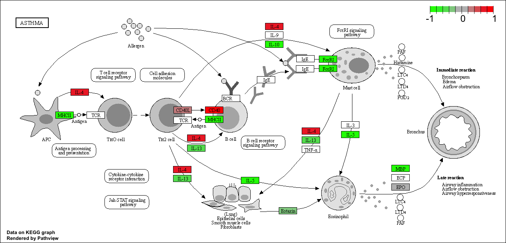

## Load the contData and colData

it requires 2 things:
1. count data
2. colData (the metadata that tells us about the design of the experiment)

```{r}
library(BiocManager)
```

read in the data 
```{r}
counts <- read.csv("airway_scaledcounts.csv", row.names=1)
metadata <-  read.csv("airway_metadata.csv")
```

look at the files

```{r}
head(counts)
```

```{r}
head(metadata)
```

Side-note: Lets check the correspondence of the metadata and count data setup. 

```{r}
metadata$id
```

or we can use:

```{r}
colnames(counts)
```

We can use the `==` things to see if they are the same. 

```{r}
metadata$id==colnames(counts)
```

This function will look at what you are telling it to and tell if you it is true or not

```{r}
all( c(T,T,F))
```

For example:

```{r}
all(metadata$id==colnames(counts))
```

> Q1.How many genes ?

```{r}
nrow(counts)
```

> Q2.How many control groups are there?

```{r}
head(metadata)
```

There are `r nrow(counts)` rows/genes in this dataset. There are 3 control gorups in this dataset. 

## Compare control to treated

First, extract the data from the control groups(columns) in our counts data

```{r}
control.inds <- metadata$dex=="control"
metadata[control.inds, ]
```

Just to get the ID use:

```{r}
control.inds <- metadata[control.inds, ]$id
```

Now we use these ids to access just the control columns for our `counts` data

```{r}
head(counts[, control.inds])
```
this is the count data just for the control groups. 

now get the mean of the genes (rows):
```{r}
control.mean <- rowMeans(counts[, control.inds])
head(control.mean)
```

Now do the same for the treated groups:

```{r}
treated.id <- metadata[ metadata$dex=="treated",] $id
head(treated.id)
treated.mean <- rowMeans(counts[, treated.id])
head(treated.mean)
```

Now combine these two means 
```{r}
meancounts <- data.frame(control.mean, treated.mean)
# meancounts
colSums(meancounts)
```
The colSums shows you the summary for both columns


Now visualize by plotting
```{r}
library(ggplot2)
```

```{r}
plot(meancounts[,1],meancounts[,2], xlab="Control", ylab="Treated")
```

This would benefit from a log transformation. 

```{r}
plot(meancounts, log="xy")
```

We often use log transformations as they make life much nicer in this world.

For example:
```{r}
log2(20/20)
# this indicates that there is no change
```

```{r}
log2(40/20)
```

```{r}
log2(10/20)
```

```{r}
log2(80/20)
#this is doubling. Gene expression would be doubling
```

```{r}
meancounts$log2fc <- log2(meancounts[,"treated.mean"]/meancounts[,"control.mean"])
head(meancounts)
```

Now remove the genes that have 0 values
```{r}
head(meancounts[,1:2])
```
Lets look at which ones have zero values
```{r}
head(meancounts[,1:2] ==0)
```

Now remove those that have zero values

The `which` function tells us teh indices of the TRUE entries in a logical vector. 
```{r}
which(c(T,F,T))
```

However, it isnt that useful in the default mode on our type of multi column input ...

```{r}
ind <- which(meancounts[,1:2] == 0, arr.ind=T)[,"row"]
head(ind)
```

I only care about the rows here (if there is a zero in any column I will exclude this row eventually)

```{r}
to.rm <- unique(sort(ind))
mycounts <- meancounts[-to.rm,]
head(mycounts)
```

We now hae `r nrow(mycounts)` genes remaining

```{r}
nrow(mycounts)
```

How many of these genes are upregulated at the log2 fold-change threshold of +2 or greater?
```{r}
sum(mycounts$log2fc > +2)
```

What percetnage is this?

```{r}
round(sum(mycounts$log2fc > +2) / nrow(mycounts) * 100, 2)
```

How many of these genes are down regulated at the log2 fold-change threshold of -2 or greater?
```{r}
sum(mycounts$log2fc < -2)
```


```{r}
round(sum(mycounts$log2fc < -2) / nrow(mycounts) * 100, 2)
```

## DESeq Analysis

First set it up
```{r}
library(DESeq2)
dds <- DESeqDataSetFromMatrix(countData=counts, 
                              colData=metadata, 
                              design=~dex)
dds
```

Run the DESeq analysis pipeline.
```{r}
dds <- DESeq(dds)
```

```{r}
res <- results(dds)
res
```

# A Volcano Plot 

This is a very common

```{r}
plot(res$log2FoldChange, res$padj)
```

Run it but take the log 
```{r}
plot(res$log2FoldChange, -log(res$padj))
# add a line
abline(v=c(-2,2), col="yellow")
abline(h=-log(0.05), col="blue")
```

Add extra information by annotating gene names and colors. Adding meaningful gene names to our dataset allows us to make sense of what is going on here. 

```{r}
library("AnnotationDbi")
library("org.Hs.eg.db")
```

```{r}
columns(org.Hs.eg.db)
```

Here we map to "SYMBOL" the common gene name that the world understands and wants. 
```{r}
res$symbol <- mapIds(org.Hs.eg.db,
                     keys=row.names(res),
                     keytype="ENSEMBL",
                     column="SYMBOL",
                     multiVals="first")
head(res$symbol)
```

```{r}
head(res)
```


# Lets save our results to date

```{r}
write.csv(res,file="allmyresults.csv")
```


We will be merging some files using the `merge() function` 

# PATHWAY ANALYSIS

Let's try to bring some biology insight back into our first analysis


```{r}
library(pathview)
library(gage)
library(gageData)
```

Visualize the first rows of data
```{r}
data(kegg.sets.hs)
head(kegg.sets.hs, 2)
```

Before we can use KEGG we need to get our gene identifiers in the correct format for KEGG, which is ENTREZ format in  this case. 

```{r}
head(res)
head(rownames(res))
```


```{r}
res$entrez <- mapIds(org.Hs.eg.db,
                     keys=row.names(res),
                     keytype="ENSEMBL",
                     column="ENTREZID",
                     multiVals="first")

res$genename <- mapIds(org.Hs.eg.db,
                     keys=row.names(res),
                     keytype="ENSEMBL",
                     column="GENENAME",
                     multiVals="first")

```

The main **gage()** function requires a named vector of fold changes, where the names of the values are the Entrez gene IDs.

Note that we used the mapIDs() function above to obtain Entrez gene IDs (stored in res$entrez) and we have the fold change results from DESeq2 analysis (stored in res$log2FoldChange).

```{r}
foldchanges <- res$log2FoldChange
head(foldchanges)
```

Assign names to this vector that are the gene IDs that KEGG wants

```{r}
names(foldchanges) = res$entrez
head(foldchanges)
#not meaningful so you could change to symbol, but not necessary at this time because...
```

Now we are ready for the **gage()** function. Get the results

```{r}
keggres = gage(foldchanges, gsets=kegg.sets.hs)
View(keggres)
```


We can look at the attributes() of this or any R object.

```{r}
attributes(keggres)
```

```{r}
head(keggres$less)
```

The pathview() function will add our genes to a KEGG pathway 

```{r}
pathview(gene.data=foldchanges, pathway.id="hsa05310")
```




