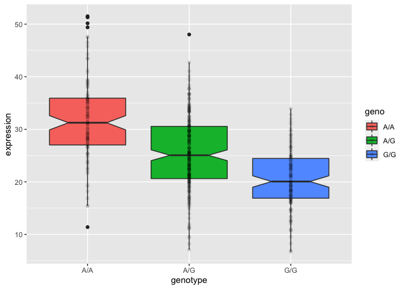
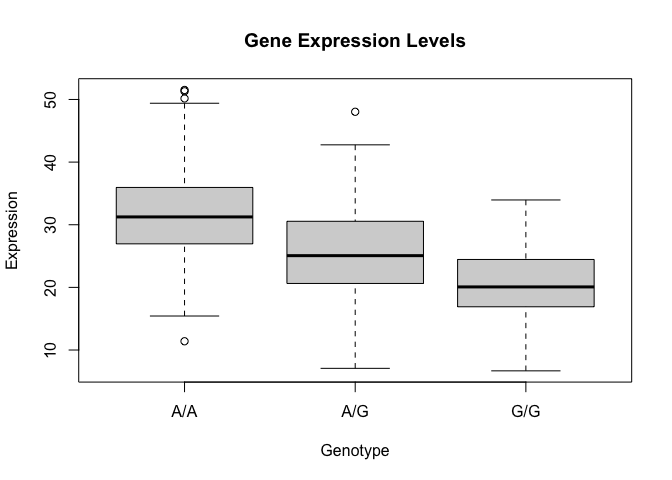

Class_19.pdf
================
Zaida Rodriguez (PID:A59010549)
12/1/2021

# Section 1. Proportion on G/G in a population.

Downloaded a CSV and read in

``` r
mxl <- read.csv("SampleGenotypes.csv")
head(mxl)
```

    ##   Sample..Male.Female.Unknown. Genotype..forward.strand. Population.s. Father
    ## 1                  NA19648 (F)                       A|A ALL, AMR, MXL      -
    ## 2                  NA19649 (M)                       G|G ALL, AMR, MXL      -
    ## 3                  NA19651 (F)                       A|A ALL, AMR, MXL      -
    ## 4                  NA19652 (M)                       G|G ALL, AMR, MXL      -
    ## 5                  NA19654 (F)                       G|G ALL, AMR, MXL      -
    ## 6                  NA19655 (M)                       A|G ALL, AMR, MXL      -
    ##   Mother
    ## 1      -
    ## 2      -
    ## 3      -
    ## 4      -
    ## 5      -
    ## 6      -

``` r
mxl$Genotype..forward.strand.
```

    ##  [1] "A|A" "G|G" "A|A" "G|G" "G|G" "A|G" "A|G" "A|A" "A|G" "A|A" "G|A" "A|A"
    ## [13] "A|A" "G|G" "A|A" "A|G" "A|G" "A|G" "A|G" "G|A" "A|G" "G|G" "G|G" "G|A"
    ## [25] "G|G" "A|G" "A|A" "A|A" "A|G" "A|A" "A|G" "G|A" "G|G" "A|A" "A|A" "A|A"
    ## [37] "G|A" "A|G" "A|G" "A|G" "A|A" "G|A" "A|G" "G|A" "G|A" "A|A" "A|A" "A|G"
    ## [49] "A|A" "A|A" "A|G" "A|G" "A|A" "G|A" "A|A" "G|A" "A|G" "A|A" "G|A" "A|G"
    ## [61] "G|G" "A|A" "G|A" "A|G"

``` r
table(mxl$Genotype..forward.strand.)
```

    ## 
    ## A|A A|G G|A G|G 
    ##  22  21  12   9

Q. what is the proportion of G\|G

``` r
table(mxl$Genotype..forward.strand.)/nrow(mxl) * 100
```

    ## 
    ##     A|A     A|G     G|A     G|G 
    ## 34.3750 32.8125 18.7500 14.0625

> Q13: Read this file into R and determine the sample size for each
> genotype and their corresponding median expression levels for each of
> these genotypes.

Read in file

``` r
expr <- read.table("sample_geno_exp.txt")
head(expr)
```

    ##    sample geno      exp
    ## 1 HG00367  A/G 28.96038
    ## 2 NA20768  A/G 20.24449
    ## 3 HG00361  A/A 31.32628
    ## 4 HG00135  A/A 34.11169
    ## 5 NA18870  G/G 18.25141
    ## 6 NA11993  A/A 32.89721

``` r
nrow(expr)
```

    ## [1] 462

``` r
table(expr$geno)
```

    ## 
    ## A/A A/G G/G 
    ## 108 233 121

``` r
library(ggplot2)
ggplot(expr) + 
  aes(geno, exp, fill=geno) +
  labs(x="genotype", y="expression")+
  geom_boxplot(notch=T) +
  geom_point(alpha=0.1)
```

<!-- -->
\>Q14. Generate a boxplot with a box per genotype, what could you infer
from the relative expression value between A/A and G/G displayed in this
plot? Does the SNP effect the expression of ORMDL3?

A/A expression is higher compared to the G/G plot. Therefore, having the
G/G in this location leads to reduced expression of this gene. This SNP
effects the expression of ORMDL3

``` r
gel <- boxplot(expr$exp~expr$geno, main="Gene Expression Levels", xlab="Genotype", ylab="Expression")
```

<!-- --> To
find the median:

``` r
head(gel)
```

    ## $stats
    ##          [,1]     [,2]     [,3]
    ## [1,] 15.42908  7.07505  6.67482
    ## [2,] 26.95022 20.62572 16.90256
    ## [3,] 31.24847 25.06486 20.07363
    ## [4,] 35.95503 30.55183 24.45672
    ## [5,] 49.39612 42.75662 33.95602
    ## 
    ## $n
    ## [1] 108 233 121
    ## 
    ## $conf
    ##          [,1]     [,2]     [,3]
    ## [1,] 29.87942 24.03742 18.98858
    ## [2,] 32.61753 26.09230 21.15868
    ## 
    ## $out
    ## [1] 51.51787 50.16704 51.30170 11.39643 48.03410
    ## 
    ## $group
    ## [1] 1 1 1 1 2
    ## 
    ## $names
    ## [1] "A/A" "A/G" "G/G"

We know in `$stats` the third row stands for the median, therefore, we
can focus in on that

``` r
gel$stats[3,]
```

    ## [1] 31.24847 25.06486 20.07363
