class09_mini_project
================
Zaida Rodriguez (PID:A59010549)
10/27/2021

load in data

``` r
read.csv("WisconsinCancer.csv")
```

    ##            id diagnosis radius_mean texture_mean perimeter_mean area_mean
    ## 1      842302         M      17.990        10.38         122.80    1001.0
    ## 2      842517         M      20.570        17.77         132.90    1326.0
    ## 3    84300903         M      19.690        21.25         130.00    1203.0
    ## 4    84348301         M      11.420        20.38          77.58     386.1
    ## 5    84358402         M      20.290        14.34         135.10    1297.0
    ## 6      843786         M      12.450        15.70          82.57     477.1
    ## 7      844359         M      18.250        19.98         119.60    1040.0
    ## 8    84458202         M      13.710        20.83          90.20     577.9
    ## 9      844981         M      13.000        21.82          87.50     519.8
    ## 10   84501001         M      12.460        24.04          83.97     475.9
    ## 11     845636         M      16.020        23.24         102.70     797.8
    ## 12   84610002         M      15.780        17.89         103.60     781.0
    ## 13     846226         M      19.170        24.80         132.40    1123.0
    ## 14     846381         M      15.850        23.95         103.70     782.7
    ## 15   84667401         M      13.730        22.61          93.60     578.3
    ## 16   84799002         M      14.540        27.54          96.73     658.8
    ## 17     848406         M      14.680        20.13          94.74     684.5
    ## 18   84862001         M      16.130        20.68         108.10     798.8
    ## 19     849014         M      19.810        22.15         130.00    1260.0
    ## 20    8510426         B      13.540        14.36          87.46     566.3
    ## 21    8510653         B      13.080        15.71          85.63     520.0
    ## 22    8510824         B       9.504        12.44          60.34     273.9
    ## 23    8511133         M      15.340        14.26         102.50     704.4
    ## 24     851509         M      21.160        23.04         137.20    1404.0
    ## 25     852552         M      16.650        21.38         110.00     904.6
    ## 26     852631         M      17.140        16.40         116.00     912.7
    ## 27     852763         M      14.580        21.53          97.41     644.8
    ## 28     852781         M      18.610        20.25         122.10    1094.0
    ## 29     852973         M      15.300        25.27         102.40     732.4
    ## 30     853201         M      17.570        15.05         115.00     955.1
    ## 31     853401         M      18.630        25.11         124.80    1088.0
    ## 32     853612         M      11.840        18.70          77.93     440.6
    ## 33   85382601         M      17.020        23.98         112.80     899.3
    ## 34     854002         M      19.270        26.47         127.90    1162.0
    ## 35     854039         M      16.130        17.88         107.00     807.2
    ## 36     854253         M      16.740        21.59         110.10     869.5
    ## 37     854268         M      14.250        21.72          93.63     633.0
    ## 38     854941         B      13.030        18.42          82.61     523.8
    ## 39     855133         M      14.990        25.20          95.54     698.8
    ## 40     855138         M      13.480        20.82          88.40     559.2
    ## 41     855167         M      13.440        21.58          86.18     563.0
    ## 42     855563         M      10.950        21.35          71.90     371.1
    ## 43     855625         M      19.070        24.81         128.30    1104.0
    ## 44     856106         M      13.280        20.28          87.32     545.2
    ## 45   85638502         M      13.170        21.81          85.42     531.5
    ## 46     857010         M      18.650        17.60         123.70    1076.0
    ## 47   85713702         B       8.196        16.84          51.71     201.9
    ## 48      85715         M      13.170        18.66          85.98     534.6
    ## 49     857155         B      12.050        14.63          78.04     449.3
    ## 50     857156         B      13.490        22.30          86.91     561.0
    ## 51     857343         B      11.760        21.60          74.72     427.9
    ## 52     857373         B      13.640        16.34          87.21     571.8
    ## 53     857374         B      11.940        18.24          75.71     437.6
    ## 54     857392         M      18.220        18.70         120.30    1033.0
    ## 55     857438         M      15.100        22.02          97.26     712.8
    ## 56   85759902         B      11.520        18.75          73.34     409.0
    ## 57     857637         M      19.210        18.57         125.50    1152.0
    ## 58     857793         M      14.710        21.59          95.55     656.9
    ## 59     857810         B      13.050        19.31          82.61     527.2
    ## 60     858477         B       8.618        11.79          54.34     224.5
    ## 61     858970         B      10.170        14.88          64.55     311.9
    ## 62     858981         B       8.598        20.98          54.66     221.8
    ## 63     858986         M      14.250        22.15          96.42     645.7
    ## 64     859196         B       9.173        13.86          59.20     260.9
    ## 65   85922302         M      12.680        23.84          82.69     499.0
    ## 66     859283         M      14.780        23.94          97.40     668.3
    ## 67     859464         B       9.465        21.01          60.11     269.4
    ## 68     859465         B      11.310        19.04          71.80     394.1
    ## 69     859471         B       9.029        17.33          58.79     250.5
    ## 70     859487         B      12.780        16.49          81.37     502.5
    ## 71     859575         M      18.940        21.31         123.60    1130.0
    ## 72     859711         B       8.888        14.64          58.79     244.0
    ## 73     859717         M      17.200        24.52         114.20     929.4
    ## 74     859983         M      13.800        15.79          90.43     584.1
    ## 75    8610175         B      12.310        16.52          79.19     470.9
    ## 76    8610404         M      16.070        19.65         104.10     817.7
    ## 77    8610629         B      13.530        10.94          87.91     559.2
    ## 78    8610637         M      18.050        16.15         120.20    1006.0
    ## 79    8610862         M      20.180        23.97         143.70    1245.0
    ## 80    8610908         B      12.860        18.00          83.19     506.3
    ## 81     861103         B      11.450        20.97          73.81     401.5
    ## 82    8611161         B      13.340        15.86          86.49     520.0
    ## 83    8611555         M      25.220        24.91         171.50    1878.0
    ## 84    8611792         M      19.100        26.29         129.10    1132.0
    ## 85    8612080         B      12.000        15.65          76.95     443.3
    ## 86    8612399         M      18.460        18.52         121.10    1075.0
    ## 87   86135501         M      14.480        21.46          94.25     648.2
    ## 88   86135502         M      19.020        24.59         122.00    1076.0
    ## 89     861597         B      12.360        21.80          79.78     466.1
    ## 90     861598         B      14.640        15.24          95.77     651.9
    ## 91     861648         B      14.620        24.02          94.57     662.7
    ## 92     861799         M      15.370        22.76         100.20     728.2
    ## 93     861853         B      13.270        14.76          84.74     551.7
    ## 94     862009         B      13.450        18.30          86.60     555.1
    ## 95     862028         M      15.060        19.83         100.30     705.6
    ## 96      86208         M      20.260        23.03         132.40    1264.0
    ## 97      86211         B      12.180        17.84          77.79     451.1
    ## 98     862261         B       9.787        19.94          62.11     294.5
    ## 99     862485         B      11.600        12.84          74.34     412.6
    ## 100    862548         M      14.420        19.77          94.48     642.5
    ## 101    862717         M      13.610        24.98          88.05     582.7
    ## 102    862722         B       6.981        13.43          43.79     143.5
    ## 103    862965         B      12.180        20.52          77.22     458.7
    ## 104    862980         B       9.876        19.40          63.95     298.3
    ## 105    862989         B      10.490        19.29          67.41     336.1
    ## 106    863030         M      13.110        15.56          87.21     530.2
    ## 107    863031         B      11.640        18.33          75.17     412.5
    ## 108    863270         B      12.360        18.54          79.01     466.7
    ## 109     86355         M      22.270        19.67         152.80    1509.0
    ## 110    864018         B      11.340        21.26          72.48     396.5
    ## 111    864033         B       9.777        16.99          62.50     290.2
    ## 112     86408         B      12.630        20.76          82.15     480.4
    ## 113     86409         B      14.260        19.65          97.83     629.9
    ## 114    864292         B      10.510        20.19          68.64     334.2
    ## 115    864496         B       8.726        15.83          55.84     230.9
    ## 116    864685         B      11.930        21.53          76.53     438.6
    ## 117    864726         B       8.950        15.76          58.74     245.2
    ## 118    864729         M      14.870        16.67          98.64     682.5
    ## 119    864877         M      15.780        22.91         105.70     782.6
    ## 120    865128         M      17.950        20.01         114.20     982.0
    ## 121    865137         B      11.410        10.82          73.34     403.3
    ## 122     86517         M      18.660        17.12         121.40    1077.0
    ## 123    865423         M      24.250        20.20         166.20    1761.0
    ## 124    865432         B      14.500        10.89          94.28     640.7
    ## 125    865468         B      13.370        16.39          86.10     553.5
    ## 126     86561         B      13.850        17.21          88.44     588.7
    ## 127    866083         M      13.610        24.69          87.76     572.6
    ## 128    866203         M      19.000        18.91         123.40    1138.0
    ## 129    866458         B      15.100        16.39          99.58     674.5
    ## 130    866674         M      19.790        25.12         130.40    1192.0
    ## 131    866714         B      12.190        13.29          79.08     455.8
    ## 132      8670         M      15.460        19.48         101.70     748.9
    ## 133  86730502         M      16.160        21.54         106.20     809.8
    ## 134    867387         B      15.710        13.93         102.00     761.7
    ## 135    867739         M      18.450        21.91         120.20    1075.0
    ## 136    868202         M      12.770        22.47          81.72     506.3
    ## 137    868223         B      11.710        16.67          74.72     423.6
    ## 138    868682         B      11.430        15.39          73.06     399.8
    ## 139    868826         M      14.950        17.57          96.85     678.1
    ## 140    868871         B      11.280        13.39          73.00     384.8
    ## 141    868999         B       9.738        11.97          61.24     288.5
    ## 142    869104         M      16.110        18.05         105.10     813.0
    ## 143    869218         B      11.430        17.31          73.66     398.0
    ## 144    869224         B      12.900        15.92          83.74     512.2
    ## 145    869254         B      10.750        14.97          68.26     355.3
    ## 146    869476         B      11.900        14.65          78.11     432.8
    ## 147    869691         M      11.800        16.58          78.99     432.0
    ## 148  86973701         B      14.950        18.77          97.84     689.5
    ## 149  86973702         B      14.440        15.18          93.97     640.1
    ## 150    869931         B      13.740        17.91          88.12     585.0
    ## 151 871001501         B      13.000        20.78          83.51     519.4
    ## 152 871001502         B       8.219        20.70          53.27     203.9
    ## 153   8710441         B       9.731        15.34          63.78     300.2
    ## 154     87106         B      11.150        13.08          70.87     381.9
    ## 155   8711002         B      13.150        15.34          85.31     538.9
    ## 156   8711003         B      12.250        17.94          78.27     460.3
    ## 157   8711202         M      17.680        20.74         117.40     963.7
    ## 158   8711216         B      16.840        19.46         108.40     880.2
    ## 159    871122         B      12.060        12.74          76.84     448.6
    ## 160    871149         B      10.900        12.96          68.69     366.8
    ## 161   8711561         B      11.750        20.18          76.10     419.8
    ## 162   8711803         M      19.190        15.94         126.30    1157.0
    ## 163    871201         M      19.590        18.15         130.70    1214.0
    ## 164   8712064         B      12.340        22.22          79.85     464.5
    ## 165   8712289         M      23.270        22.04         152.10    1686.0
    ## 166   8712291         B      14.970        19.76          95.50     690.2
    ## 167     87127         B      10.800         9.71          68.77     357.6
    ## 168   8712729         M      16.780        18.80         109.30     886.3
    ## 169   8712766         M      17.470        24.68         116.10     984.6
    ## 170   8712853         B      14.970        16.95          96.22     685.9
    ## 171  87139402         B      12.320        12.39          78.85     464.1
    ## 172     87163         M      13.430        19.63          85.84     565.4
    ## 173     87164         M      15.460        11.89         102.50     736.9
    ## 174    871641         B      11.080        14.71          70.21     372.7
    ## 175    871642         B      10.660        15.15          67.49     349.6
    ## 176    872113         B       8.671        14.45          54.42     227.2
    ## 177    872608         B       9.904        18.06          64.60     302.4
    ## 178  87281702         M      16.460        20.11         109.30     832.9
    ## 179    873357         B      13.010        22.22          82.01     526.4
    ## 180    873586         B      12.810        13.06          81.29     508.8
    ## 181    873592         M      27.220        21.87         182.10    2250.0
    ## 182    873593         M      21.090        26.57         142.70    1311.0
    ## 183    873701         M      15.700        20.31         101.20     766.6
    ## 184    873843         B      11.410        14.92          73.53     402.0
    ## 185    873885         M      15.280        22.41          98.92     710.6
    ## 186    874158         B      10.080        15.11          63.76     317.5
    ## 187    874217         M      18.310        18.58         118.60    1041.0
    ## 188    874373         B      11.710        17.19          74.68     420.3
    ## 189    874662         B      11.810        17.39          75.27     428.9
    ## 190    874839         B      12.300        15.90          78.83     463.7
    ## 191    874858         M      14.220        23.12          94.37     609.9
    ## 192    875093         B      12.770        21.41          82.02     507.4
    ## 193    875099         B       9.720        18.22          60.73     288.1
    ## 194    875263         M      12.340        26.86          81.15     477.4
    ## 195  87556202         M      14.860        23.21         100.40     671.4
    ## 196    875878         B      12.910        16.33          82.53     516.4
    ## 197    875938         M      13.770        22.29          90.63     588.9
    ## 198    877159         M      18.080        21.84         117.40    1024.0
    ## 199    877486         M      19.180        22.49         127.50    1148.0
    ## 200    877500         M      14.450        20.22          94.49     642.7
    ## 201    877501         B      12.230        19.56          78.54     461.0
    ## 202    877989         M      17.540        19.32         115.10     951.6
    ## 203    878796         M      23.290        26.67         158.90    1685.0
    ## 204     87880         M      13.810        23.75          91.56     597.8
    ## 205     87930         B      12.470        18.60          81.09     481.9
    ## 206    879523         M      15.120        16.68          98.78     716.6
    ## 207    879804         B       9.876        17.27          62.92     295.4
    ## 208    879830         M      17.010        20.26         109.70     904.3
    ## 209   8810158         B      13.110        22.54          87.02     529.4
    ## 210   8810436         B      15.270        12.91          98.17     725.5
    ## 211 881046502         M      20.580        22.14         134.70    1290.0
    ## 212   8810528         B      11.840        18.94          75.51     428.0
    ## 213   8810703         M      28.110        18.47         188.50    2499.0
    ## 214 881094802         M      17.420        25.56         114.50     948.0
    ## 215   8810955         M      14.190        23.81          92.87     610.7
    ## 216   8810987         M      13.860        16.93          90.96     578.9
    ## 217   8811523         B      11.890        18.35          77.32     432.2
    ## 218   8811779         B      10.200        17.48          65.05     321.2
    ## 219   8811842         M      19.800        21.56         129.70    1230.0
    ## 220  88119002         M      19.530        32.47         128.00    1223.0
    ## 221   8812816         B      13.650        13.16          87.88     568.9
    ## 222   8812818         B      13.560        13.90          88.59     561.3
    ## 223   8812844         B      10.180        17.53          65.12     313.1
    ## 224   8812877         M      15.750        20.25         102.60     761.3
    ## 225   8813129         B      13.270        17.02          84.55     546.4
    ## 226  88143502         B      14.340        13.47          92.51     641.2
    ## 227  88147101         B      10.440        15.46          66.62     329.6
    ## 228  88147102         B      15.000        15.51          97.45     684.5
    ## 229  88147202         B      12.620        23.97          81.35     496.4
    ## 230    881861         M      12.830        22.33          85.26     503.2
    ## 231    881972         M      17.050        19.08         113.40     895.0
    ## 232  88199202         B      11.320        27.08          71.76     395.7
    ## 233  88203002         B      11.220        33.81          70.79     386.8
    ## 234  88206102         M      20.510        27.81         134.40    1319.0
    ## 235    882488         B       9.567        15.91          60.21     279.6
    ## 236  88249602         B      14.030        21.25          89.79     603.4
    ## 237  88299702         M      23.210        26.97         153.50    1670.0
    ## 238    883263         M      20.480        21.46         132.50    1306.0
    ## 239    883270         B      14.220        27.85          92.55     623.9
    ## 240  88330202         M      17.460        39.28         113.40     920.6
    ## 241  88350402         B      13.640        15.60          87.38     575.3
    ## 242    883539         B      12.420        15.04          78.61     476.5
    ## 243    883852         B      11.300        18.19          73.93     389.4
    ## 244  88411702         B      13.750        23.77          88.54     590.0
    ## 245    884180         M      19.400        23.50         129.10    1155.0
    ## 246    884437         B      10.480        19.86          66.72     337.7
    ## 247    884448         B      13.200        17.43          84.13     541.6
    ## 248    884626         B      12.890        14.11          84.95     512.2
    ## 249  88466802         B      10.650        25.22          68.01     347.0
    ## 250    884689         B      11.520        14.93          73.87     406.3
    ## 251    884948         M      20.940        23.56         138.90    1364.0
    ## 252  88518501         B      11.500        18.45          73.28     407.4
    ## 253    885429         M      19.730        19.82         130.70    1206.0
    ## 254   8860702         M      17.300        17.08         113.00     928.2
    ## 255    886226         M      19.450        19.33         126.50    1169.0
    ## 256    886452         M      13.960        17.05          91.43     602.4
    ## 257  88649001         M      19.550        28.77         133.60    1207.0
    ## 258    886776         M      15.320        17.27         103.20     713.3
    ## 259    887181         M      15.660        23.20         110.20     773.5
    ## 260  88725602         M      15.530        33.56         103.70     744.9
    ## 261    887549         M      20.310        27.06         132.90    1288.0
    ## 262    888264         M      17.350        23.06         111.00     933.1
    ## 263    888570         M      17.290        22.13         114.40     947.8
    ## 264    889403         M      15.610        19.38         100.00     758.6
    ## 265    889719         M      17.190        22.07         111.60     928.3
    ## 266  88995002         M      20.730        31.12         135.70    1419.0
    ## 267   8910251         B      10.600        18.95          69.28     346.4
    ## 268   8910499         B      13.590        21.84          87.16     561.0
    ## 269   8910506         B      12.870        16.21          82.38     512.2
    ## 270   8910720         B      10.710        20.39          69.50     344.9
    ## 271   8910721         B      14.290        16.82          90.30     632.6
    ## 272   8910748         B      11.290        13.04          72.23     388.0
    ## 273   8910988         M      21.750        20.99         147.30    1491.0
    ## 274   8910996         B       9.742        15.67          61.50     289.9
    ## 275   8911163         M      17.930        24.48         115.20     998.9
    ## 276   8911164         B      11.890        17.36          76.20     435.6
    ## 277   8911230         B      11.330        14.16          71.79     396.6
    ## 278   8911670         M      18.810        19.98         120.90    1102.0
    ## 279   8911800         B      13.590        17.84          86.24     572.3
    ## 280   8911834         B      13.850        15.18          88.99     587.4
    ## 281   8912049         M      19.160        26.60         126.20    1138.0
    ## 282   8912055         B      11.740        14.02          74.24     427.3
    ## 283     89122         M      19.400        18.18         127.20    1145.0
    ## 284   8912280         M      16.240        18.77         108.80     805.1
    ## 285   8912284         B      12.890        15.70          84.08     516.6
    ## 286   8912521         B      12.580        18.40          79.83     489.0
    ## 287   8912909         B      11.940        20.76          77.87     441.0
    ## 288      8913         B      12.890        13.12          81.89     515.9
    ## 289   8913049         B      11.260        19.96          73.72     394.1
    ## 290  89143601         B      11.370        18.89          72.17     396.0
    ## 291  89143602         B      14.410        19.73          96.03     651.0
    ## 292      8915         B      14.960        19.10          97.03     687.3
    ## 293    891670         B      12.950        16.02          83.14     513.7
    ## 294    891703         B      11.850        17.46          75.54     432.7
    ## 295    891716         B      12.720        13.78          81.78     492.1
    ## 296    891923         B      13.770        13.27          88.06     582.7
    ## 297    891936         B      10.910        12.35          69.14     363.7
    ## 298    892189         M      11.760        18.14          75.00     431.1
    ## 299    892214         B      14.260        18.17          91.22     633.1
    ## 300    892399         B      10.510        23.09          66.85     334.2
    ## 301    892438         M      19.530        18.90         129.50    1217.0
    ## 302    892604         B      12.460        19.89          80.43     471.3
    ## 303  89263202         M      20.090        23.86         134.70    1247.0
    ## 304    892657         B      10.490        18.61          66.86     334.3
    ## 305     89296         B      11.460        18.16          73.59     403.1
    ## 306    893061         B      11.600        24.49          74.23     417.2
    ## 307     89344         B      13.200        15.82          84.07     537.3
    ## 308     89346         B       9.000        14.40          56.36     246.3
    ## 309    893526         B      13.500        12.71          85.69     566.2
    ## 310    893548         B      13.050        13.84          82.71     530.6
    ## 311    893783         B      11.700        19.11          74.33     418.7
    ## 312  89382601         B      14.610        15.69          92.68     664.9
    ## 313  89382602         B      12.760        13.37          82.29     504.1
    ## 314    893988         B      11.540        10.72          73.73     409.1
    ## 315    894047         B       8.597        18.60          54.09     221.2
    ## 316    894089         B      12.490        16.85          79.19     481.6
    ## 317    894090         B      12.180        14.08          77.25     461.4
    ## 318    894326         M      18.220        18.87         118.70    1027.0
    ## 319    894329         B       9.042        18.90          60.07     244.5
    ## 320    894335         B      12.430        17.00          78.60     477.3
    ## 321    894604         B      10.250        16.18          66.52     324.2
    ## 322    894618         M      20.160        19.66         131.10    1274.0
    ## 323    894855         B      12.860        13.32          82.82     504.8
    ## 324    895100         M      20.340        21.51         135.90    1264.0
    ## 325  89511501         B      12.200        15.21          78.01     457.9
    ## 326  89511502         B      12.670        17.30          81.25     489.9
    ## 327     89524         B      14.110        12.88          90.03     616.5
    ## 328    895299         B      12.030        17.93          76.09     446.0
    ## 329   8953902         M      16.270        20.71         106.90     813.7
    ## 330    895633         M      16.260        21.88         107.50     826.8
    ## 331    896839         M      16.030        15.51         105.80     793.2
    ## 332    896864         B      12.980        19.35          84.52     514.0
    ## 333    897132         B      11.220        19.86          71.94     387.3
    ## 334    897137         B      11.250        14.78          71.38     390.0
    ## 335    897374         B      12.300        19.02          77.88     464.4
    ## 336  89742801         M      17.060        21.00         111.80     918.6
    ## 337    897604         B      12.990        14.23          84.08     514.3
    ## 338    897630         M      18.770        21.43         122.90    1092.0
    ## 339    897880         B      10.050        17.53          64.41     310.8
    ## 340     89812         M      23.510        24.27         155.10    1747.0
    ## 341     89813         B      14.420        16.54          94.15     641.2
    ## 342    898143         B       9.606        16.84          61.64     280.5
    ## 343     89827         B      11.060        14.96          71.49     373.9
    ## 344    898431         M      19.680        21.68         129.90    1194.0
    ## 345  89864002         B      11.710        15.45          75.03     420.3
    ## 346    898677         B      10.260        14.71          66.20     321.6
    ## 347    898678         B      12.060        18.90          76.66     445.3
    ## 348     89869         B      14.760        14.74          94.87     668.7
    ## 349    898690         B      11.470        16.03          73.02     402.7
    ## 350    899147         B      11.950        14.96          77.23     426.7
    ## 351    899187         B      11.660        17.07          73.70     421.0
    ## 352    899667         M      15.750        19.22         107.10     758.6
    ## 353    899987         M      25.730        17.46         174.20    2010.0
    ## 354   9010018         M      15.080        25.74          98.00     716.6
    ## 355    901011         B      11.140        14.07          71.24     384.6
    ## 356   9010258         B      12.560        19.07          81.92     485.8
    ## 357   9010259         B      13.050        18.59          85.09     512.0
    ## 358    901028         B      13.870        16.21          88.52     593.7
    ## 359   9010333         B       8.878        15.49          56.74     241.0
    ## 360 901034301         B       9.436        18.32          59.82     278.6
    ## 361 901034302         B      12.540        18.07          79.42     491.9
    ## 362    901041         B      13.300        21.57          85.24     546.1
    ## 363   9010598         B      12.760        18.84          81.87     496.6
    ## 364   9010872         B      16.500        18.29         106.60     838.1
    ## 365   9010877         B      13.400        16.95          85.48     552.4
    ## 366    901088         M      20.440        21.78         133.80    1293.0
    ## 367   9011494         M      20.200        26.83         133.70    1234.0
    ## 368   9011495         B      12.210        18.02          78.31     458.4
    ## 369   9011971         M      21.710        17.25         140.90    1546.0
    ## 370   9012000         M      22.010        21.90         147.20    1482.0
    ## 371   9012315         M      16.350        23.29         109.00     840.4
    ## 372   9012568         B      15.190        13.21          97.65     711.8
    ## 373   9012795         M      21.370        15.10         141.30    1386.0
    ## 374    901288         M      20.640        17.35         134.80    1335.0
    ## 375   9013005         B      13.690        16.07          87.84     579.1
    ## 376    901303         B      16.170        16.07         106.30     788.5
    ## 377    901315         B      10.570        20.22          70.15     338.3
    ## 378   9013579         B      13.460        28.21          85.89     562.1
    ## 379   9013594         B      13.660        15.15          88.27     580.6
    ## 380   9013838         M      11.080        18.83          73.30     361.6
    ## 381    901549         B      11.270        12.96          73.16     386.3
    ## 382    901836         B      11.040        14.93          70.67     372.7
    ## 383     90250         B      12.050        22.72          78.75     447.8
    ## 384     90251         B      12.390        17.48          80.64     462.9
    ## 385    902727         B      13.280        13.72          85.79     541.8
    ## 386     90291         M      14.600        23.29          93.97     664.7
    ## 387    902975         B      12.210        14.09          78.78     462.0
    ## 388    902976         B      13.880        16.16          88.37     596.6
    ## 389    903011         B      11.270        15.50          73.38     392.0
    ## 390     90312         M      19.550        23.21         128.90    1174.0
    ## 391  90317302         B      10.260        12.22          65.75     321.6
    ## 392    903483         B       8.734        16.84          55.27     234.3
    ## 393    903507         M      15.490        19.97         102.40     744.7
    ## 394    903516         M      21.610        22.28         144.40    1407.0
    ## 395    903554         B      12.100        17.72          78.07     446.2
    ## 396    903811         B      14.060        17.18          89.75     609.1
    ## 397  90401601         B      13.510        18.89          88.10     558.1
    ## 398  90401602         B      12.800        17.46          83.05     508.3
    ## 399    904302         B      11.060        14.83          70.31     378.2
    ## 400    904357         B      11.800        17.26          75.26     431.9
    ## 401  90439701         M      17.910        21.02         124.40     994.0
    ## 402    904647         B      11.930        10.91          76.14     442.7
    ## 403    904689         B      12.960        18.29          84.18     525.2
    ## 404      9047         B      12.940        16.17          83.18     507.6
    ## 405    904969         B      12.340        14.95          78.29     469.1
    ## 406    904971         B      10.940        18.59          70.39     370.0
    ## 407    905189         B      16.140        14.86         104.30     800.0
    ## 408    905190         B      12.850        21.37          82.63     514.5
    ## 409  90524101         M      17.990        20.66         117.80     991.7
    ## 410    905501         B      12.270        17.92          78.41     466.1
    ## 411    905502         B      11.360        17.57          72.49     399.8
    ## 412    905520         B      11.040        16.83          70.92     373.2
    ## 413    905539         B       9.397        21.68          59.75     268.8
    ## 414    905557         B      14.990        22.11          97.53     693.7
    ## 415    905680         M      15.130        29.81          96.71     719.5
    ## 416    905686         B      11.890        21.17          76.39     433.8
    ## 417    905978         B       9.405        21.70          59.60     271.2
    ## 418  90602302         M      15.500        21.08         102.90     803.1
    ## 419    906024         B      12.700        12.17          80.88     495.0
    ## 420    906290         B      11.160        21.41          70.95     380.3
    ## 421    906539         B      11.570        19.04          74.20     409.7
    ## 422    906564         B      14.690        13.98          98.22     656.1
    ## 423    906616         B      11.610        16.02          75.46     408.2
    ## 424    906878         B      13.660        19.13          89.46     575.3
    ## 425    907145         B       9.742        19.12          61.93     289.7
    ## 426    907367         B      10.030        21.28          63.19     307.3
    ## 427    907409         B      10.480        14.98          67.49     333.6
    ## 428     90745         B      10.800        21.98          68.79     359.9
    ## 429  90769601         B      11.130        16.62          70.47     381.1
    ## 430  90769602         B      12.720        17.67          80.98     501.3
    ## 431    907914         M      14.900        22.53         102.10     685.0
    ## 432    907915         B      12.400        17.68          81.47     467.8
    ## 433    908194         M      20.180        19.54         133.80    1250.0
    ## 434    908445         M      18.820        21.97         123.70    1110.0
    ## 435    908469         B      14.860        16.94          94.89     673.7
    ## 436    908489         M      13.980        19.62          91.12     599.5
    ## 437    908916         B      12.870        19.54          82.67     509.2
    ## 438    909220         B      14.040        15.98          89.78     611.2
    ## 439    909231         B      13.850        19.60          88.68     592.6
    ## 440    909410         B      14.020        15.66          89.59     606.5
    ## 441    909411         B      10.970        17.20          71.73     371.5
    ## 442    909445         M      17.270        25.42         112.40     928.8
    ## 443  90944601         B      13.780        15.79          88.37     585.9
    ## 444    909777         B      10.570        18.32          66.82     340.9
    ## 445   9110127         M      18.030        16.85         117.50     990.0
    ## 446   9110720         B      11.990        24.89          77.61     441.3
    ## 447   9110732         M      17.750        28.03         117.30     981.6
    ## 448   9110944         B      14.800        17.66          95.88     674.8
    ## 449    911150         B      14.530        19.34          94.25     659.7
    ## 450 911157302         M      21.100        20.52         138.10    1384.0
    ## 451   9111596         B      11.870        21.54          76.83     432.0
    ## 452   9111805         M      19.590        25.00         127.70    1191.0
    ## 453   9111843         B      12.000        28.23          76.77     442.5
    ## 454    911201         B      14.530        13.98          93.86     644.2
    ## 455    911202         B      12.620        17.15          80.62     492.9
    ## 456   9112085         B      13.380        30.72          86.34     557.2
    ## 457   9112366         B      11.630        29.29          74.87     415.1
    ## 458   9112367         B      13.210        25.25          84.10     537.9
    ## 459   9112594         B      13.000        25.13          82.61     520.2
    ## 460   9112712         B       9.755        28.20          61.68     290.9
    ## 461 911296201         M      17.080        27.15         111.20     930.9
    ## 462 911296202         M      27.420        26.27         186.90    2501.0
    ## 463   9113156         B      14.400        26.99          92.25     646.1
    ## 464 911320501         B      11.600        18.36          73.88     412.7
    ## 465 911320502         B      13.170        18.22          84.28     537.3
    ## 466   9113239         B      13.240        20.13          86.87     542.9
    ## 467   9113455         B      13.140        20.74          85.98     536.9
    ## 468   9113514         B       9.668        18.10          61.06     286.3
    ## 469   9113538         M      17.600        23.33         119.00     980.5
    ## 470    911366         B      11.620        18.18          76.38     408.8
    ## 471   9113778         B       9.667        18.49          61.49     289.1
    ## 472   9113816         B      12.040        28.14          76.85     449.9
    ## 473    911384         B      14.920        14.93          96.45     686.9
    ## 474   9113846         B      12.270        29.97          77.42     465.4
    ## 475    911391         B      10.880        15.62          70.41     358.9
    ## 476    911408         B      12.830        15.73          82.89     506.9
    ## 477    911654         B      14.200        20.53          92.41     618.4
    ## 478    911673         B      13.900        16.62          88.97     599.4
    ## 479    911685         B      11.490        14.59          73.99     404.9
    ## 480    911916         M      16.250        19.51         109.80     815.8
    ## 481    912193         B      12.160        18.03          78.29     455.3
    ## 482     91227         B      13.900        19.24          88.73     602.9
    ## 483    912519         B      13.470        14.06          87.32     546.3
    ## 484    912558         B      13.700        17.64          87.76     571.1
    ## 485    912600         B      15.730        11.28         102.80     747.2
    ## 486    913063         B      12.450        16.41          82.85     476.7
    ## 487    913102         B      14.640        16.85          94.21     666.0
    ## 488    913505         M      19.440        18.82         128.10    1167.0
    ## 489    913512         B      11.680        16.17          75.49     420.5
    ## 490    913535         M      16.690        20.20         107.10     857.6
    ## 491  91376701         B      12.250        22.44          78.18     466.5
    ## 492  91376702         B      17.850        13.23         114.60     992.1
    ## 493    914062         M      18.010        20.56         118.40    1007.0
    ## 494    914101         B      12.460        12.83          78.83     477.3
    ## 495    914102         B      13.160        20.54          84.06     538.7
    ## 496    914333         B      14.870        20.21          96.12     680.9
    ## 497    914366         B      12.650        18.17          82.69     485.6
    ## 498    914580         B      12.470        17.31          80.45     480.1
    ## 499    914769         M      18.490        17.52         121.30    1068.0
    ## 500     91485         M      20.590        21.24         137.80    1320.0
    ## 501    914862         B      15.040        16.74          98.73     689.4
    ## 502     91504         M      13.820        24.49          92.33     595.9
    ## 503     91505         B      12.540        16.32          81.25     476.3
    ## 504    915143         M      23.090        19.83         152.10    1682.0
    ## 505    915186         B       9.268        12.87          61.49     248.7
    ## 506    915276         B       9.676        13.14          64.12     272.5
    ## 507  91544001         B      12.220        20.04          79.47     453.1
    ## 508  91544002         B      11.060        17.12          71.25     366.5
    ## 509    915452         B      16.300        15.70         104.70     819.8
    ## 510    915460         M      15.460        23.95         103.80     731.3
    ## 511     91550         B      11.740        14.69          76.31     426.0
    ## 512    915664         B      14.810        14.70          94.66     680.7
    ## 513    915691         M      13.400        20.52          88.64     556.7
    ## 514    915940         B      14.580        13.66          94.29     658.8
    ## 515  91594602         M      15.050        19.07          97.26     701.9
    ## 516    916221         B      11.340        18.61          72.76     391.2
    ## 517    916799         M      18.310        20.58         120.80    1052.0
    ## 518    916838         M      19.890        20.26         130.50    1214.0
    ## 519    917062         B      12.880        18.22          84.45     493.1
    ## 520    917080         B      12.750        16.70          82.51     493.8
    ## 521    917092         B       9.295        13.90          59.96     257.8
    ## 522  91762702         M      24.630        21.60         165.50    1841.0
    ## 523     91789         B      11.260        19.83          71.30     388.1
    ## 524    917896         B      13.710        18.68          88.73     571.0
    ## 525    917897         B       9.847        15.68          63.00     293.2
    ## 526     91805         B       8.571        13.10          54.53     221.3
    ## 527  91813701         B      13.460        18.75          87.44     551.1
    ## 528  91813702         B      12.340        12.27          78.94     468.5
    ## 529    918192         B      13.940        13.17          90.31     594.2
    ## 530    918465         B      12.070        13.44          77.83     445.2
    ## 531     91858         B      11.750        17.56          75.89     422.9
    ## 532  91903901         B      11.670        20.02          75.21     416.2
    ## 533  91903902         B      13.680        16.33          87.76     575.5
    ## 534  91930402         M      20.470        20.67         134.70    1299.0
    ## 535    919537         B      10.960        17.62          70.79     365.6
    ## 536    919555         M      20.550        20.86         137.80    1308.0
    ## 537  91979701         M      14.270        22.55          93.77     629.8
    ## 538    919812         B      11.690        24.44          76.37     406.4
    ## 539    921092         B       7.729        25.49          47.98     178.8
    ## 540    921362         B       7.691        25.44          48.34     170.4
    ## 541    921385         B      11.540        14.44          74.65     402.9
    ## 542    921386         B      14.470        24.99          95.81     656.4
    ## 543    921644         B      14.740        25.42          94.70     668.6
    ## 544    922296         B      13.210        28.06          84.88     538.4
    ## 545    922297         B      13.870        20.70          89.77     584.8
    ## 546    922576         B      13.620        23.23          87.19     573.2
    ## 547    922577         B      10.320        16.35          65.31     324.9
    ## 548    922840         B      10.260        16.58          65.85     320.8
    ## 549    923169         B       9.683        19.34          61.05     285.7
    ## 550    923465         B      10.820        24.21          68.89     361.6
    ## 551    923748         B      10.860        21.48          68.51     360.5
    ## 552    923780         B      11.130        22.44          71.49     378.4
    ## 553    924084         B      12.770        29.43          81.35     507.9
    ## 554    924342         B       9.333        21.94          59.01     264.0
    ## 555    924632         B      12.880        28.92          82.50     514.3
    ## 556    924934         B      10.290        27.61          65.67     321.4
    ## 557    924964         B      10.160        19.59          64.73     311.7
    ## 558    925236         B       9.423        27.88          59.26     271.3
    ## 559    925277         B      14.590        22.68          96.39     657.1
    ## 560    925291         B      11.510        23.93          74.52     403.5
    ## 561    925292         B      14.050        27.15          91.38     600.4
    ## 562    925311         B      11.200        29.37          70.67     386.0
    ## 563    925622         M      15.220        30.62         103.40     716.9
    ## 564    926125         M      20.920        25.09         143.00    1347.0
    ## 565    926424         M      21.560        22.39         142.00    1479.0
    ## 566    926682         M      20.130        28.25         131.20    1261.0
    ## 567    926954         M      16.600        28.08         108.30     858.1
    ## 568    927241         M      20.600        29.33         140.10    1265.0
    ## 569     92751         B       7.760        24.54          47.92     181.0
    ##     smoothness_mean compactness_mean concavity_mean concave.points_mean
    ## 1           0.11840          0.27760      0.3001000            0.147100
    ## 2           0.08474          0.07864      0.0869000            0.070170
    ## 3           0.10960          0.15990      0.1974000            0.127900
    ## 4           0.14250          0.28390      0.2414000            0.105200
    ## 5           0.10030          0.13280      0.1980000            0.104300
    ## 6           0.12780          0.17000      0.1578000            0.080890
    ## 7           0.09463          0.10900      0.1127000            0.074000
    ## 8           0.11890          0.16450      0.0936600            0.059850
    ## 9           0.12730          0.19320      0.1859000            0.093530
    ## 10          0.11860          0.23960      0.2273000            0.085430
    ## 11          0.08206          0.06669      0.0329900            0.033230
    ## 12          0.09710          0.12920      0.0995400            0.066060
    ## 13          0.09740          0.24580      0.2065000            0.111800
    ## 14          0.08401          0.10020      0.0993800            0.053640
    ## 15          0.11310          0.22930      0.2128000            0.080250
    ## 16          0.11390          0.15950      0.1639000            0.073640
    ## 17          0.09867          0.07200      0.0739500            0.052590
    ## 18          0.11700          0.20220      0.1722000            0.102800
    ## 19          0.09831          0.10270      0.1479000            0.094980
    ## 20          0.09779          0.08129      0.0666400            0.047810
    ## 21          0.10750          0.12700      0.0456800            0.031100
    ## 22          0.10240          0.06492      0.0295600            0.020760
    ## 23          0.10730          0.21350      0.2077000            0.097560
    ## 24          0.09428          0.10220      0.1097000            0.086320
    ## 25          0.11210          0.14570      0.1525000            0.091700
    ## 26          0.11860          0.22760      0.2229000            0.140100
    ## 27          0.10540          0.18680      0.1425000            0.087830
    ## 28          0.09440          0.10660      0.1490000            0.077310
    ## 29          0.10820          0.16970      0.1683000            0.087510
    ## 30          0.09847          0.11570      0.0987500            0.079530
    ## 31          0.10640          0.18870      0.2319000            0.124400
    ## 32          0.11090          0.15160      0.1218000            0.051820
    ## 33          0.11970          0.14960      0.2417000            0.120300
    ## 34          0.09401          0.17190      0.1657000            0.075930
    ## 35          0.10400          0.15590      0.1354000            0.077520
    ## 36          0.09610          0.13360      0.1348000            0.060180
    ## 37          0.09823          0.10980      0.1319000            0.055980
    ## 38          0.08983          0.03766      0.0256200            0.029230
    ## 39          0.09387          0.05131      0.0239800            0.028990
    ## 40          0.10160          0.12550      0.1063000            0.054390
    ## 41          0.08162          0.06031      0.0311000            0.020310
    ## 42          0.12270          0.12180      0.1044000            0.056690
    ## 43          0.09081          0.21900      0.2107000            0.099610
    ## 44          0.10410          0.14360      0.0984700            0.061580
    ## 45          0.09714          0.10470      0.0825900            0.052520
    ## 46          0.10990          0.16860      0.1974000            0.100900
    ## 47          0.08600          0.05943      0.0158800            0.005917
    ## 48          0.11580          0.12310      0.1226000            0.073400
    ## 49          0.10310          0.09092      0.0659200            0.027490
    ## 50          0.08752          0.07698      0.0475100            0.033840
    ## 51          0.08637          0.04966      0.0165700            0.011150
    ## 52          0.07685          0.06059      0.0185700            0.017230
    ## 53          0.08261          0.04751      0.0197200            0.013490
    ## 54          0.11480          0.14850      0.1772000            0.106000
    ## 55          0.09056          0.07081      0.0525300            0.033340
    ## 56          0.09524          0.05473      0.0303600            0.022780
    ## 57          0.10530          0.12670      0.1323000            0.089940
    ## 58          0.11370          0.13650      0.1293000            0.081230
    ## 59          0.08060          0.03789      0.0006920            0.004167
    ## 60          0.09752          0.05272      0.0206100            0.007799
    ## 61          0.11340          0.08061      0.0108400            0.012900
    ## 62          0.12430          0.08963      0.0300000            0.009259
    ## 63          0.10490          0.20080      0.2135000            0.086530
    ## 64          0.07721          0.08751      0.0598800            0.021800
    ## 65          0.11220          0.12620      0.1128000            0.068730
    ## 66          0.11720          0.14790      0.1267000            0.090290
    ## 67          0.10440          0.07773      0.0217200            0.015040
    ## 68          0.08139          0.04701      0.0370900            0.022300
    ## 69          0.10660          0.14130      0.3130000            0.043750
    ## 70          0.09831          0.05234      0.0365300            0.028640
    ## 71          0.09009          0.10290      0.1080000            0.079510
    ## 72          0.09783          0.15310      0.0860600            0.028720
    ## 73          0.10710          0.18300      0.1692000            0.079440
    ## 74          0.10070          0.12800      0.0778900            0.050690
    ## 75          0.09172          0.06829      0.0337200            0.022720
    ## 76          0.09168          0.08424      0.0976900            0.066380
    ## 77          0.12910          0.10470      0.0687700            0.065560
    ## 78          0.10650          0.21460      0.1684000            0.108000
    ## 79          0.12860          0.34540      0.3754000            0.160400
    ## 80          0.09934          0.09546      0.0388900            0.023150
    ## 81          0.11020          0.09362      0.0459100            0.022330
    ## 82          0.10780          0.15350      0.1169000            0.069870
    ## 83          0.10630          0.26650      0.3339000            0.184500
    ## 84          0.12150          0.17910      0.1937000            0.146900
    ## 85          0.09723          0.07165      0.0415100            0.018630
    ## 86          0.09874          0.10530      0.1335000            0.087950
    ## 87          0.09444          0.09947      0.1204000            0.049380
    ## 88          0.09029          0.12060      0.1468000            0.082710
    ## 89          0.08772          0.09445      0.0601500            0.037450
    ## 90          0.11320          0.13390      0.0996600            0.070640
    ## 91          0.08974          0.08606      0.0310200            0.029570
    ## 92          0.09200          0.10360      0.1122000            0.074830
    ## 93          0.07355          0.05055      0.0326100            0.026480
    ## 94          0.10220          0.08165      0.0397400            0.027800
    ## 95          0.10390          0.15530      0.1700000            0.088150
    ## 96          0.09078          0.13130      0.1465000            0.086830
    ## 97          0.10450          0.07057      0.0249000            0.029410
    ## 98          0.10240          0.05301      0.0068290            0.007937
    ## 99          0.08983          0.07525      0.0419600            0.033500
    ## 100         0.09752          0.11410      0.0938800            0.058390
    ## 101         0.09488          0.08511      0.0862500            0.044890
    ## 102         0.11700          0.07568      0.0000000            0.000000
    ## 103         0.08013          0.04038      0.0238300            0.017700
    ## 104         0.10050          0.09697      0.0615400            0.030290
    ## 105         0.09989          0.08578      0.0299500            0.012010
    ## 106         0.13980          0.17650      0.2071000            0.096010
    ## 107         0.11420          0.10170      0.0707000            0.034850
    ## 108         0.08477          0.06815      0.0264300            0.019210
    ## 109         0.13260          0.27680      0.4264000            0.182300
    ## 110         0.08759          0.06575      0.0513300            0.018990
    ## 111         0.10370          0.08404      0.0433400            0.017780
    ## 112         0.09933          0.12090      0.1065000            0.060210
    ## 113         0.07837          0.22330      0.3003000            0.077980
    ## 114         0.11220          0.13030      0.0647600            0.030680
    ## 115         0.11500          0.08201      0.0413200            0.019240
    ## 116         0.09768          0.07849      0.0332800            0.020080
    ## 117         0.09462          0.12430      0.0926300            0.023080
    ## 118         0.11620          0.16490      0.1690000            0.089230
    ## 119         0.11550          0.17520      0.2133000            0.094790
    ## 120         0.08402          0.06722      0.0729300            0.055960
    ## 121         0.09373          0.06685      0.0351200            0.026230
    ## 122         0.10540          0.11000      0.1457000            0.086650
    ## 123         0.14470          0.28670      0.4268000            0.201200
    ## 124         0.11010          0.10990      0.0884200            0.057780
    ## 125         0.07115          0.07325      0.0809200            0.028000
    ## 126         0.08785          0.06136      0.0142000            0.011410
    ## 127         0.09258          0.07862      0.0528500            0.030850
    ## 128         0.08217          0.08028      0.0927100            0.056270
    ## 129         0.11500          0.18070      0.1138000            0.085340
    ## 130         0.10150          0.15890      0.2545000            0.114900
    ## 131         0.10660          0.09509      0.0285500            0.028820
    ## 132         0.10920          0.12230      0.1466000            0.080870
    ## 133         0.10080          0.12840      0.1043000            0.056130
    ## 134         0.09462          0.09462      0.0713500            0.059330
    ## 135         0.09430          0.09709      0.1153000            0.068470
    ## 136         0.09055          0.05761      0.0471100            0.027040
    ## 137         0.10510          0.06095      0.0359200            0.026000
    ## 138         0.09639          0.06889      0.0350300            0.028750
    ## 139         0.11670          0.13050      0.1539000            0.086240
    ## 140         0.11640          0.11360      0.0463500            0.047960
    ## 141         0.09250          0.04102      0.0000000            0.000000
    ## 142         0.09721          0.11370      0.0944700            0.059430
    ## 143         0.10920          0.09486      0.0203100            0.018610
    ## 144         0.08677          0.09509      0.0489400            0.030880
    ## 145         0.07793          0.05139      0.0225100            0.007875
    ## 146         0.11520          0.12960      0.0371000            0.030030
    ## 147         0.10910          0.17000      0.1659000            0.074150
    ## 148         0.08138          0.11670      0.0905000            0.035620
    ## 149         0.09970          0.10210      0.0848700            0.055320
    ## 150         0.07944          0.06376      0.0288100            0.013290
    ## 151         0.11350          0.07589      0.0313600            0.026450
    ## 152         0.09405          0.13050      0.1321000            0.021680
    ## 153         0.10720          0.15990      0.4108000            0.078570
    ## 154         0.09754          0.05113      0.0198200            0.017860
    ## 155         0.09384          0.08498      0.0929300            0.034830
    ## 156         0.08654          0.06679      0.0388500            0.023310
    ## 157         0.11150          0.16650      0.1855000            0.105400
    ## 158         0.07445          0.07223      0.0515000            0.027710
    ## 159         0.09311          0.05241      0.0197200            0.019630
    ## 160         0.07515          0.03718      0.0030900            0.006588
    ## 161         0.10890          0.11410      0.0684300            0.037380
    ## 162         0.08694          0.11850      0.1193000            0.096670
    ## 163         0.11200          0.16660      0.2508000            0.128600
    ## 164         0.10120          0.10150      0.0537000            0.028220
    ## 165         0.08439          0.11450      0.1324000            0.097020
    ## 166         0.08421          0.05352      0.0194700            0.019390
    ## 167         0.09594          0.05736      0.0253100            0.016980
    ## 168         0.08865          0.09182      0.0842200            0.065760
    ## 169         0.10490          0.16030      0.2159000            0.104300
    ## 170         0.09855          0.07885      0.0260200            0.037810
    ## 171         0.10280          0.06981      0.0398700            0.037000
    ## 172         0.09048          0.06288      0.0585800            0.034380
    ## 173         0.12570          0.15550      0.2032000            0.109700
    ## 174         0.10060          0.05743      0.0236300            0.025830
    ## 175         0.08792          0.04302      0.0000000            0.000000
    ## 176         0.09138          0.04276      0.0000000            0.000000
    ## 177         0.09699          0.12940      0.1307000            0.037160
    ## 178         0.09831          0.15560      0.1793000            0.088660
    ## 179         0.06251          0.01938      0.0015950            0.001852
    ## 180         0.08739          0.03774      0.0091930            0.013300
    ## 181         0.10940          0.19140      0.2871000            0.187800
    ## 182         0.11410          0.28320      0.2487000            0.149600
    ## 183         0.09597          0.08799      0.0659300            0.051890
    ## 184         0.09059          0.08155      0.0618100            0.023610
    ## 185         0.09057          0.10520      0.0537500            0.032630
    ## 186         0.09267          0.04695      0.0015970            0.002404
    ## 187         0.08588          0.08468      0.0816900            0.058140
    ## 188         0.09774          0.06141      0.0380900            0.032390
    ## 189         0.10070          0.05562      0.0235300            0.015530
    ## 190         0.08080          0.07253      0.0384400            0.016540
    ## 191         0.10750          0.24130      0.1981000            0.066180
    ## 192         0.08749          0.06601      0.0311200            0.028640
    ## 193         0.06950          0.02344      0.0000000            0.000000
    ## 194         0.10340          0.13530      0.1085000            0.045620
    ## 195         0.10440          0.19800      0.1697000            0.088780
    ## 196         0.07941          0.05366      0.0387300            0.023770
    ## 197         0.12000          0.12670      0.1385000            0.065260
    ## 198         0.07371          0.08642      0.1103000            0.057780
    ## 199         0.08523          0.14280      0.1114000            0.067720
    ## 200         0.09872          0.12060      0.1180000            0.059800
    ## 201         0.09586          0.08087      0.0418700            0.041070
    ## 202         0.08968          0.11980      0.1036000            0.074880
    ## 203         0.11410          0.20840      0.3523000            0.162000
    ## 204         0.13230          0.17680      0.1558000            0.091760
    ## 205         0.09965          0.10580      0.0800500            0.038210
    ## 206         0.08876          0.09588      0.0755000            0.040790
    ## 207         0.10890          0.07232      0.0175600            0.019520
    ## 208         0.08772          0.07304      0.0695000            0.053900
    ## 209         0.10020          0.14830      0.0870500            0.051020
    ## 210         0.08182          0.06230      0.0589200            0.031570
    ## 211         0.09090          0.13480      0.1640000            0.095610
    ## 212         0.08871          0.06900      0.0266900            0.013930
    ## 213         0.11420          0.15160      0.3201000            0.159500
    ## 214         0.10060          0.11460      0.1682000            0.065970
    ## 215         0.09463          0.13060      0.1115000            0.064620
    ## 216         0.10260          0.15170      0.0990100            0.056020
    ## 217         0.09363          0.11540      0.0663600            0.031420
    ## 218         0.08054          0.05907      0.0577400            0.010710
    ## 219         0.09383          0.13060      0.1272000            0.086910
    ## 220         0.08420          0.11300      0.1145000            0.066370
    ## 221         0.09646          0.08711      0.0388800            0.025630
    ## 222         0.10510          0.11920      0.0786000            0.044510
    ## 223         0.10610          0.08502      0.0176800            0.019150
    ## 224         0.10250          0.12040      0.1147000            0.064620
    ## 225         0.08445          0.04994      0.0355400            0.024560
    ## 226         0.09906          0.07624      0.0572400            0.046030
    ## 227         0.10530          0.07722      0.0066430            0.012160
    ## 228         0.08371          0.10960      0.0650500            0.037800
    ## 229         0.07903          0.07529      0.0543800            0.020360
    ## 230         0.10880          0.17990      0.1695000            0.068610
    ## 231         0.11410          0.15720      0.1910000            0.109000
    ## 232         0.06883          0.03813      0.0163300            0.003125
    ## 233         0.07780          0.03574      0.0049670            0.006434
    ## 234         0.09159          0.10740      0.1554000            0.083400
    ## 235         0.08464          0.04087      0.0165200            0.016670
    ## 236         0.09070          0.06945      0.0146200            0.018960
    ## 237         0.09509          0.16820      0.1950000            0.123700
    ## 238         0.08355          0.08348      0.0904200            0.060220
    ## 239         0.08223          0.10390      0.1103000            0.044080
    ## 240         0.09812          0.12980      0.1417000            0.088110
    ## 241         0.09423          0.06630      0.0470500            0.037310
    ## 242         0.07926          0.03393      0.0105300            0.011080
    ## 243         0.09592          0.13250      0.1548000            0.028540
    ## 244         0.08043          0.06807      0.0469700            0.023440
    ## 245         0.10270          0.15580      0.2049000            0.088860
    ## 246         0.10700          0.05971      0.0483100            0.030700
    ## 247         0.07215          0.04524      0.0433600            0.011050
    ## 248         0.08760          0.13460      0.1374000            0.039800
    ## 249         0.09657          0.07234      0.0237900            0.016150
    ## 250         0.10130          0.07808      0.0432800            0.029290
    ## 251         0.10070          0.16060      0.2712000            0.131000
    ## 252         0.09345          0.05991      0.0263800            0.020690
    ## 253         0.10620          0.18490      0.2417000            0.097400
    ## 254         0.10080          0.10410      0.1266000            0.083530
    ## 255         0.10350          0.11880      0.1379000            0.085910
    ## 256         0.10960          0.12790      0.0978900            0.052460
    ## 257         0.09260          0.20630      0.1784000            0.114400
    ## 258         0.13350          0.22840      0.2448000            0.124200
    ## 259         0.11090          0.31140      0.3176000            0.137700
    ## 260         0.10630          0.16390      0.1751000            0.083990
    ## 261         0.10000          0.10880      0.1519000            0.093330
    ## 262         0.08662          0.06290      0.0289100            0.028370
    ## 263         0.08999          0.12730      0.0969700            0.075070
    ## 264         0.07840          0.05616      0.0420900            0.028470
    ## 265         0.09726          0.08995      0.0906100            0.065270
    ## 266         0.09469          0.11430      0.1367000            0.086460
    ## 267         0.09688          0.11470      0.0638700            0.026420
    ## 268         0.07956          0.08259      0.0407200            0.021420
    ## 269         0.09425          0.06219      0.0390000            0.016150
    ## 270         0.10820          0.12890      0.0844800            0.028670
    ## 271         0.06429          0.02675      0.0072500            0.006250
    ## 272         0.09834          0.07608      0.0326500            0.027550
    ## 273         0.09401          0.19610      0.2195000            0.108800
    ## 274         0.09037          0.04689      0.0110300            0.014070
    ## 275         0.08855          0.07027      0.0569900            0.047440
    ## 276         0.12250          0.07210      0.0592900            0.074040
    ## 277         0.09379          0.03872      0.0014870            0.003333
    ## 278         0.08923          0.05884      0.0802000            0.058430
    ## 279         0.07948          0.04052      0.0199700            0.012380
    ## 280         0.09516          0.07688      0.0447900            0.037110
    ## 281         0.10200          0.14530      0.1921000            0.096640
    ## 282         0.07813          0.04340      0.0224500            0.027630
    ## 283         0.10370          0.14420      0.1626000            0.094640
    ## 284         0.10660          0.18020      0.1948000            0.090520
    ## 285         0.07818          0.09580      0.1115000            0.033900
    ## 286         0.08393          0.04216      0.0018600            0.002924
    ## 287         0.08605          0.10110      0.0657400            0.037910
    ## 288         0.06955          0.03729      0.0226000            0.011710
    ## 289         0.08020          0.11810      0.0927400            0.055880
    ## 290         0.08713          0.05008      0.0239900            0.021730
    ## 291         0.08757          0.16760      0.1362000            0.066020
    ## 292         0.08992          0.09823      0.0594000            0.048190
    ## 293         0.10050          0.07943      0.0615500            0.033700
    ## 294         0.08372          0.05642      0.0268800            0.022800
    ## 295         0.09667          0.08393      0.0128800            0.019240
    ## 296         0.09198          0.06221      0.0106300            0.019170
    ## 297         0.08518          0.04721      0.0123600            0.013690
    ## 298         0.09968          0.05914      0.0268500            0.035150
    ## 299         0.06576          0.05220      0.0247500            0.013740
    ## 300         0.10150          0.06797      0.0249500            0.018750
    ## 301         0.11500          0.16420      0.2197000            0.106200
    ## 302         0.08451          0.10140      0.0683000            0.030990
    ## 303         0.10800          0.18380      0.2283000            0.128000
    ## 304         0.10680          0.06678      0.0229700            0.017800
    ## 305         0.08853          0.07694      0.0334400            0.015020
    ## 306         0.07474          0.05688      0.0197400            0.013130
    ## 307         0.08511          0.05251      0.0014610            0.003261
    ## 308         0.07005          0.03116      0.0036810            0.003472
    ## 309         0.07376          0.03614      0.0027580            0.004419
    ## 310         0.08352          0.03735      0.0045590            0.008829
    ## 311         0.08814          0.05253      0.0158300            0.011480
    ## 312         0.07618          0.03515      0.0144700            0.018770
    ## 313         0.08794          0.07948      0.0405200            0.025480
    ## 314         0.08597          0.05969      0.0136700            0.008907
    ## 315         0.10740          0.05847      0.0000000            0.000000
    ## 316         0.08511          0.03834      0.0044730            0.006423
    ## 317         0.07734          0.03212      0.0112300            0.005051
    ## 318         0.09746          0.11170      0.1130000            0.079500
    ## 319         0.09968          0.19720      0.1975000            0.049080
    ## 320         0.07557          0.03454      0.0134200            0.016990
    ## 321         0.10610          0.11110      0.0672600            0.039650
    ## 322         0.08020          0.08564      0.1155000            0.077260
    ## 323         0.11340          0.08834      0.0380000            0.034000
    ## 324         0.11700          0.18750      0.2565000            0.150400
    ## 325         0.08673          0.06545      0.0199400            0.016920
    ## 326         0.10280          0.07664      0.0319300            0.021070
    ## 327         0.09309          0.05306      0.0176500            0.027330
    ## 328         0.07683          0.03892      0.0015460            0.005592
    ## 329         0.11690          0.13190      0.1478000            0.084880
    ## 330         0.11650          0.12830      0.1799000            0.079810
    ## 331         0.09491          0.13710      0.1204000            0.070410
    ## 332         0.09579          0.11250      0.0710700            0.029500
    ## 333         0.10540          0.06779      0.0050060            0.007583
    ## 334         0.08306          0.04458      0.0009737            0.002941
    ## 335         0.08313          0.04202      0.0077560            0.008535
    ## 336         0.11190          0.10560      0.1508000            0.099340
    ## 337         0.09462          0.09965      0.0373800            0.020980
    ## 338         0.09116          0.14020      0.1060000            0.060900
    ## 339         0.10070          0.07326      0.0251100            0.017750
    ## 340         0.10690          0.12830      0.2308000            0.141000
    ## 341         0.09751          0.11390      0.0800700            0.042230
    ## 342         0.08481          0.09228      0.0842200            0.022920
    ## 343         0.10330          0.09097      0.0539700            0.033410
    ## 344         0.09797          0.13390      0.1863000            0.110300
    ## 345         0.11500          0.07281      0.0400600            0.032500
    ## 346         0.09882          0.09159      0.0358100            0.020370
    ## 347         0.08386          0.05794      0.0075100            0.008488
    ## 348         0.08875          0.07780      0.0460800            0.035280
    ## 349         0.09076          0.05886      0.0258700            0.023220
    ## 350         0.11580          0.12060      0.0117100            0.017870
    ## 351         0.07561          0.03630      0.0083060            0.011620
    ## 352         0.12430          0.23640      0.2914000            0.124200
    ## 353         0.11490          0.23630      0.3368000            0.191300
    ## 354         0.10240          0.09769      0.1235000            0.065530
    ## 355         0.07274          0.06064      0.0450500            0.014710
    ## 356         0.08760          0.10380      0.1030000            0.043910
    ## 357         0.10820          0.13040      0.0960300            0.056030
    ## 358         0.08743          0.05492      0.0150200            0.020880
    ## 359         0.08293          0.07698      0.0472100            0.023810
    ## 360         0.10090          0.05956      0.0271000            0.014060
    ## 361         0.07436          0.02650      0.0011940            0.005449
    ## 362         0.08582          0.06373      0.0334400            0.024240
    ## 363         0.09676          0.07952      0.0268800            0.017810
    ## 364         0.09686          0.08468      0.0586200            0.048350
    ## 365         0.07937          0.05696      0.0218100            0.014730
    ## 366         0.09150          0.11310      0.0979900            0.077850
    ## 367         0.09905          0.16690      0.1641000            0.126500
    ## 368         0.09231          0.07175      0.0439200            0.020270
    ## 369         0.09384          0.08562      0.1168000            0.084650
    ## 370         0.10630          0.19540      0.2448000            0.150100
    ## 371         0.09742          0.14970      0.1811000            0.087730
    ## 372         0.07963          0.06934      0.0339300            0.026570
    ## 373         0.10010          0.15150      0.1932000            0.125500
    ## 374         0.09446          0.10760      0.1527000            0.089410
    ## 375         0.08302          0.06374      0.0255600            0.020310
    ## 376         0.09880          0.14380      0.0665100            0.053970
    ## 377         0.09073          0.16600      0.2280000            0.059410
    ## 378         0.07517          0.04726      0.0127100            0.011170
    ## 379         0.08268          0.07548      0.0424900            0.024710
    ## 380         0.12160          0.21540      0.1689000            0.063670
    ## 381         0.12370          0.11110      0.0790000            0.055500
    ## 382         0.07987          0.07079      0.0354600            0.020740
    ## 383         0.06935          0.10730      0.0794300            0.029780
    ## 384         0.10420          0.12970      0.0589200            0.028800
    ## 385         0.08363          0.08575      0.0507700            0.028640
    ## 386         0.08682          0.06636      0.0839000            0.052710
    ## 387         0.08108          0.07823      0.0683900            0.025340
    ## 388         0.07026          0.04831      0.0204500            0.008507
    ## 389         0.08365          0.11140      0.1007000            0.027570
    ## 390         0.10100          0.13180      0.1856000            0.102100
    ## 391         0.09996          0.07542      0.0192300            0.019680
    ## 392         0.10390          0.07428      0.0000000            0.000000
    ## 393         0.11600          0.15620      0.1891000            0.091130
    ## 394         0.11670          0.20870      0.2810000            0.156200
    ## 395         0.10290          0.09758      0.0478300            0.033260
    ## 396         0.08045          0.05361      0.0268100            0.032510
    ## 397         0.10590          0.11470      0.0858000            0.053810
    ## 398         0.08044          0.08895      0.0739000            0.040830
    ## 399         0.07741          0.04768      0.0271200            0.007246
    ## 400         0.09087          0.06232      0.0285300            0.016380
    ## 401         0.12300          0.25760      0.3189000            0.119800
    ## 402         0.08872          0.05242      0.0260600            0.017960
    ## 403         0.07351          0.07899      0.0405700            0.018830
    ## 404         0.09879          0.08836      0.0329600            0.023900
    ## 405         0.08682          0.04571      0.0210900            0.020540
    ## 406         0.10040          0.07460      0.0494400            0.029320
    ## 407         0.09495          0.08501      0.0550000            0.045280
    ## 408         0.07551          0.08316      0.0612600            0.018670
    ## 409         0.10360          0.13040      0.1201000            0.088240
    ## 410         0.08685          0.06526      0.0321100            0.026530
    ## 411         0.08858          0.05313      0.0278300            0.021000
    ## 412         0.10770          0.07804      0.0304600            0.024800
    ## 413         0.07969          0.06053      0.0373500            0.005128
    ## 414         0.08515          0.10250      0.0685900            0.038760
    ## 415         0.08320          0.04605      0.0468600            0.027390
    ## 416         0.09773          0.08120      0.0255500            0.021790
    ## 417         0.10440          0.06159      0.0204700            0.012570
    ## 418         0.11200          0.15710      0.1522000            0.084810
    ## 419         0.08785          0.05794      0.0236000            0.024020
    ## 420         0.10180          0.05978      0.0089550            0.010760
    ## 421         0.08546          0.07722      0.0548500            0.014280
    ## 422         0.10310          0.18360      0.1450000            0.063000
    ## 423         0.10880          0.11680      0.0709700            0.044970
    ## 424         0.09057          0.11470      0.0965700            0.048120
    ## 425         0.10750          0.08333      0.0089340            0.019670
    ## 426         0.08117          0.03912      0.0024700            0.005159
    ## 427         0.09816          0.10130      0.0633500            0.022180
    ## 428         0.08801          0.05743      0.0361400            0.014040
    ## 429         0.08151          0.03834      0.0136900            0.013700
    ## 430         0.07896          0.04522      0.0140200            0.018350
    ## 431         0.09947          0.22250      0.2733000            0.097110
    ## 432         0.10540          0.13160      0.0774100            0.027990
    ## 433         0.11330          0.14890      0.2133000            0.125900
    ## 434         0.10180          0.13890      0.1594000            0.087440
    ## 435         0.08924          0.07074      0.0334600            0.028770
    ## 436         0.10600          0.11330      0.1126000            0.064630
    ## 437         0.09136          0.07883      0.0179700            0.020900
    ## 438         0.08458          0.05895      0.0353400            0.029440
    ## 439         0.08684          0.06330      0.0134200            0.022930
    ## 440         0.07966          0.05581      0.0208700            0.026520
    ## 441         0.08915          0.11130      0.0945700            0.036130
    ## 442         0.08331          0.11090      0.1204000            0.057360
    ## 443         0.08817          0.06718      0.0105500            0.009937
    ## 444         0.08142          0.04462      0.0199300            0.011110
    ## 445         0.08947          0.12320      0.1090000            0.062540
    ## 446         0.10300          0.09218      0.0544100            0.042740
    ## 447         0.09997          0.13140      0.1698000            0.082930
    ## 448         0.09179          0.08890      0.0406900            0.022600
    ## 449         0.08388          0.07800      0.0881700            0.029250
    ## 450         0.09684          0.11750      0.1572000            0.115500
    ## 451         0.06613          0.10640      0.0877700            0.023860
    ## 452         0.10320          0.09871      0.1655000            0.090630
    ## 453         0.08437          0.06450      0.0405500            0.019450
    ## 454         0.10990          0.09242      0.0689500            0.064950
    ## 455         0.08583          0.05430      0.0296600            0.022720
    ## 456         0.09245          0.07426      0.0281900            0.032640
    ## 457         0.09357          0.08574      0.0716000            0.020170
    ## 458         0.08791          0.05205      0.0277200            0.020680
    ## 459         0.08369          0.05073      0.0120600            0.017620
    ## 460         0.07984          0.04626      0.0154100            0.010430
    ## 461         0.09898          0.11100      0.1007000            0.064310
    ## 462         0.10840          0.19880      0.3635000            0.168900
    ## 463         0.06995          0.05223      0.0347600            0.017370
    ## 464         0.08508          0.05855      0.0336700            0.017770
    ## 465         0.07466          0.05994      0.0485900            0.028700
    ## 466         0.08284          0.12230      0.1010000            0.028330
    ## 467         0.08675          0.10890      0.1085000            0.035100
    ## 468         0.08311          0.05428      0.0147900            0.005769
    ## 469         0.09289          0.20040      0.2136000            0.100200
    ## 470         0.11750          0.14830      0.1020000            0.055640
    ## 471         0.08946          0.06258      0.0294800            0.015140
    ## 472         0.08752          0.06000      0.0236700            0.023770
    ## 473         0.08098          0.08549      0.0553900            0.032210
    ## 474         0.07699          0.03398      0.0000000            0.000000
    ## 475         0.10070          0.10690      0.0511500            0.015710
    ## 476         0.09040          0.08269      0.0583500            0.030780
    ## 477         0.08931          0.11080      0.0506300            0.030580
    ## 478         0.06828          0.05319      0.0222400            0.013390
    ## 479         0.10460          0.08228      0.0530800            0.019690
    ## 480         0.10260          0.18930      0.2236000            0.091940
    ## 481         0.09087          0.07838      0.0291600            0.015270
    ## 482         0.07991          0.05326      0.0299500            0.020700
    ## 483         0.10710          0.11550      0.0578600            0.052660
    ## 484         0.09950          0.07957      0.0454800            0.031600
    ## 485         0.10430          0.12990      0.1191000            0.062110
    ## 486         0.09514          0.15110      0.1544000            0.048460
    ## 487         0.08641          0.06698      0.0519200            0.027910
    ## 488         0.10890          0.14480      0.2256000            0.119400
    ## 489         0.11280          0.09263      0.0427900            0.031320
    ## 490         0.07497          0.07112      0.0364900            0.023070
    ## 491         0.08192          0.05200      0.0171400            0.012610
    ## 492         0.07838          0.06217      0.0444500            0.041780
    ## 493         0.10010          0.12890      0.1170000            0.077620
    ## 494         0.07372          0.04043      0.0071730            0.011490
    ## 495         0.07335          0.05275      0.0180000            0.012560
    ## 496         0.09587          0.08345      0.0682400            0.049510
    ## 497         0.10760          0.13340      0.0801700            0.050740
    ## 498         0.08928          0.07630      0.0360900            0.023690
    ## 499         0.10120          0.13170      0.1491000            0.091830
    ## 500         0.10850          0.16440      0.2188000            0.112100
    ## 501         0.09883          0.13640      0.0772100            0.061420
    ## 502         0.11620          0.16810      0.1357000            0.067590
    ## 503         0.11580          0.10850      0.0592800            0.032790
    ## 504         0.09342          0.12750      0.1676000            0.100300
    ## 505         0.16340          0.22390      0.0973000            0.052520
    ## 506         0.12550          0.22040      0.1188000            0.070380
    ## 507         0.10960          0.11520      0.0817500            0.021660
    ## 508         0.11940          0.10710      0.0406300            0.042680
    ## 509         0.09427          0.06712      0.0552600            0.045630
    ## 510         0.11830          0.18700      0.2030000            0.085200
    ## 511         0.08099          0.09661      0.0672600            0.026390
    ## 512         0.08472          0.05016      0.0341600            0.025410
    ## 513         0.11060          0.14690      0.1445000            0.081720
    ## 514         0.09832          0.08918      0.0822200            0.043490
    ## 515         0.09215          0.08597      0.0748600            0.043350
    ## 516         0.10490          0.08499      0.0430200            0.025940
    ## 517         0.10680          0.12480      0.1569000            0.094510
    ## 518         0.10370          0.13100      0.1411000            0.094310
    ## 519         0.12180          0.16610      0.0482500            0.053030
    ## 520         0.11250          0.11170      0.0388000            0.029950
    ## 521         0.13710          0.12250      0.0333200            0.024210
    ## 522         0.10300          0.21060      0.2310000            0.147100
    ## 523         0.08511          0.04413      0.0050670            0.005664
    ## 524         0.09916          0.10700      0.0538500            0.037830
    ## 525         0.09492          0.08419      0.0233000            0.024160
    ## 526         0.10360          0.07632      0.0256500            0.015100
    ## 527         0.10750          0.11380      0.0420100            0.031520
    ## 528         0.09003          0.06307      0.0295800            0.026470
    ## 529         0.12480          0.09755      0.1010000            0.066150
    ## 530         0.11000          0.09009      0.0378100            0.027980
    ## 531         0.10730          0.09713      0.0528200            0.044400
    ## 532         0.10160          0.09453      0.0420000            0.021570
    ## 533         0.09277          0.07255      0.0175200            0.018800
    ## 534         0.09156          0.13130      0.1523000            0.101500
    ## 535         0.09687          0.09752      0.0526300            0.027880
    ## 536         0.10460          0.17390      0.2085000            0.132200
    ## 537         0.10380          0.11540      0.1463000            0.061390
    ## 538         0.12360          0.15520      0.0451500            0.045310
    ## 539         0.08098          0.04878      0.0000000            0.000000
    ## 540         0.08668          0.11990      0.0925200            0.013640
    ## 541         0.09984          0.11200      0.0673700            0.025940
    ## 542         0.08837          0.12300      0.1009000            0.038900
    ## 543         0.08275          0.07214      0.0410500            0.030270
    ## 544         0.08671          0.06877      0.0298700            0.032750
    ## 545         0.09578          0.10180      0.0368800            0.023690
    ## 546         0.09246          0.06747      0.0297400            0.024430
    ## 547         0.09434          0.04994      0.0101200            0.005495
    ## 548         0.08877          0.08066      0.0435800            0.024380
    ## 549         0.08491          0.05030      0.0233700            0.009615
    ## 550         0.08192          0.06602      0.0154800            0.008160
    ## 551         0.07431          0.04227      0.0000000            0.000000
    ## 552         0.09566          0.08194      0.0482400            0.022570
    ## 553         0.08276          0.04234      0.0199700            0.014990
    ## 554         0.09240          0.05605      0.0399600            0.012820
    ## 555         0.08123          0.05824      0.0619500            0.023430
    ## 556         0.09030          0.07658      0.0599900            0.027380
    ## 557         0.10030          0.07504      0.0050250            0.011160
    ## 558         0.08123          0.04971      0.0000000            0.000000
    ## 559         0.08473          0.13300      0.1029000            0.037360
    ## 560         0.09261          0.10210      0.1112000            0.041050
    ## 561         0.09929          0.11260      0.0446200            0.043040
    ## 562         0.07449          0.03558      0.0000000            0.000000
    ## 563         0.10480          0.20870      0.2550000            0.094290
    ## 564         0.10990          0.22360      0.3174000            0.147400
    ## 565         0.11100          0.11590      0.2439000            0.138900
    ## 566         0.09780          0.10340      0.1440000            0.097910
    ## 567         0.08455          0.10230      0.0925100            0.053020
    ## 568         0.11780          0.27700      0.3514000            0.152000
    ## 569         0.05263          0.04362      0.0000000            0.000000
    ##     symmetry_mean fractal_dimension_mean radius_se texture_se perimeter_se
    ## 1          0.2419                0.07871    1.0950     0.9053       8.5890
    ## 2          0.1812                0.05667    0.5435     0.7339       3.3980
    ## 3          0.2069                0.05999    0.7456     0.7869       4.5850
    ## 4          0.2597                0.09744    0.4956     1.1560       3.4450
    ## 5          0.1809                0.05883    0.7572     0.7813       5.4380
    ## 6          0.2087                0.07613    0.3345     0.8902       2.2170
    ## 7          0.1794                0.05742    0.4467     0.7732       3.1800
    ## 8          0.2196                0.07451    0.5835     1.3770       3.8560
    ## 9          0.2350                0.07389    0.3063     1.0020       2.4060
    ## 10         0.2030                0.08243    0.2976     1.5990       2.0390
    ## 11         0.1528                0.05697    0.3795     1.1870       2.4660
    ## 12         0.1842                0.06082    0.5058     0.9849       3.5640
    ## 13         0.2397                0.07800    0.9555     3.5680      11.0700
    ## 14         0.1847                0.05338    0.4033     1.0780       2.9030
    ## 15         0.2069                0.07682    0.2121     1.1690       2.0610
    ## 16         0.2303                0.07077    0.3700     1.0330       2.8790
    ## 17         0.1586                0.05922    0.4727     1.2400       3.1950
    ## 18         0.2164                0.07356    0.5692     1.0730       3.8540
    ## 19         0.1582                0.05395    0.7582     1.0170       5.8650
    ## 20         0.1885                0.05766    0.2699     0.7886       2.0580
    ## 21         0.1967                0.06811    0.1852     0.7477       1.3830
    ## 22         0.1815                0.06905    0.2773     0.9768       1.9090
    ## 23         0.2521                0.07032    0.4388     0.7096       3.3840
    ## 24         0.1769                0.05278    0.6917     1.1270       4.3030
    ## 25         0.1995                0.06330    0.8068     0.9017       5.4550
    ## 26         0.3040                0.07413    1.0460     0.9760       7.2760
    ## 27         0.2252                0.06924    0.2545     0.9832       2.1100
    ## 28         0.1697                0.05699    0.8529     1.8490       5.6320
    ## 29         0.1926                0.06540    0.4390     1.0120       3.4980
    ## 30         0.1739                0.06149    0.6003     0.8225       4.6550
    ## 31         0.2183                0.06197    0.8307     1.4660       5.5740
    ## 32         0.2301                0.07799    0.4825     1.0300       3.4750
    ## 33         0.2248                0.06382    0.6009     1.3980       3.9990
    ## 34         0.1853                0.06261    0.5558     0.6062       3.5280
    ## 35         0.1998                0.06515    0.3340     0.6857       2.1830
    ## 36         0.1896                0.05656    0.4615     0.9197       3.0080
    ## 37         0.1885                0.06125    0.2860     1.0190       2.6570
    ## 38         0.1467                0.05863    0.1839     2.3420       1.1700
    ## 39         0.1565                0.05504    1.2140     2.1880       8.0770
    ## 40         0.1720                0.06419    0.2130     0.5914       1.5450
    ## 41         0.1784                0.05587    0.2385     0.8265       1.5720
    ## 42         0.1895                0.06870    0.2366     1.4280       1.8220
    ## 43         0.2310                0.06343    0.9811     1.6660       8.8300
    ## 44         0.1974                0.06782    0.3704     0.8249       2.4270
    ## 45         0.1746                0.06177    0.1938     0.6123       1.3340
    ## 46         0.1907                0.06049    0.6289     0.6633       4.2930
    ## 47         0.1769                0.06503    0.1563     0.9567       1.0940
    ## 48         0.2128                0.06777    0.2871     0.8937       1.8970
    ## 49         0.1675                0.06043    0.2636     0.7294       1.8480
    ## 50         0.1809                0.05718    0.2338     1.3530       1.7350
    ## 51         0.1495                0.05888    0.4062     1.2100       2.6350
    ## 52         0.1353                0.05953    0.1872     0.9234       1.4490
    ## 53         0.1868                0.06110    0.2273     0.6329       1.5200
    ## 54         0.2092                0.06310    0.8337     1.5930       4.8770
    ## 55         0.1616                0.05684    0.3105     0.8339       2.0970
    ## 56         0.1920                0.05907    0.3249     0.9591       2.1830
    ## 57         0.1917                0.05961    0.7275     1.1930       4.8370
    ## 58         0.2027                0.06758    0.4226     1.1500       2.7350
    ## 59         0.1819                0.05501    0.4040     1.2140       2.5950
    ## 60         0.1683                0.07187    0.1559     0.5796       1.0460
    ## 61         0.2743                0.06960    0.5158     1.4410       3.3120
    ## 62         0.1828                0.06757    0.3582     2.0670       2.4930
    ## 63         0.1949                0.07292    0.7036     1.2680       5.3730
    ## 64         0.2341                0.06963    0.4098     2.2650       2.6080
    ## 65         0.1905                0.06590    0.4255     1.1780       2.9270
    ## 66         0.1953                0.06654    0.3577     1.2810       2.4500
    ## 67         0.1717                0.06899    0.2351     2.0110       1.6600
    ## 68         0.1516                0.05667    0.2727     0.9429       1.8310
    ## 69         0.2111                0.08046    0.3274     1.1940       1.8850
    ## 70         0.1590                0.05653    0.2368     0.8732       1.4710
    ## 71         0.1582                0.05461    0.7888     0.7975       5.4860
    ## 72         0.1902                0.08980    0.5262     0.8522       3.1680
    ## 73         0.1927                0.06487    0.5907     1.0410       3.7050
    ## 74         0.1662                0.06566    0.2787     0.6205       1.9570
    ## 75         0.1720                0.05914    0.2505     1.0250       1.7400
    ## 76         0.1798                0.05391    0.7474     1.0160       5.0290
    ## 77         0.2403                0.06641    0.4101     1.0140       2.6520
    ## 78         0.2152                0.06673    0.9806     0.5505       6.3110
    ## 79         0.2906                0.08142    0.9317     1.8850       8.6490
    ## 80         0.1718                0.05997    0.2655     1.0950       1.7780
    ## 81         0.1842                0.07005    0.3251     2.1740       2.0770
    ## 82         0.1942                0.06902    0.2860     1.0160       1.5350
    ## 83         0.1829                0.06782    0.8973     1.4740       7.3820
    ## 84         0.1634                0.07224    0.5190     2.9100       5.8010
    ## 85         0.2079                0.05968    0.2271     1.2550       1.4410
    ## 86         0.2132                0.06022    0.6997     1.4750       4.7820
    ## 87         0.2075                0.05636    0.4204     2.2200       3.3010
    ## 88         0.1953                0.05629    0.5495     0.6636       3.0550
    ## 89         0.1930                0.06404    0.2978     1.5020       2.2030
    ## 90         0.2116                0.06346    0.5115     0.7372       3.8140
    ## 91         0.1685                0.05866    0.3721     1.1110       2.2790
    ## 92         0.1717                0.06097    0.3129     0.8413       2.0750
    ## 93         0.1386                0.05318    0.4057     1.1530       2.7010
    ## 94         0.1638                0.05710    0.2950     1.3730       2.0990
    ## 95         0.1855                0.06284    0.4768     0.9644       3.7060
    ## 96         0.2095                0.05649    0.7576     1.5090       4.5540
    ## 97         0.1900                0.06635    0.3661     1.5110       2.4100
    ## 98         0.1350                0.06890    0.3350     2.0430       2.1320
    ## 99         0.1620                0.06582    0.2315     0.5391       1.4750
    ## 100        0.1879                0.06390    0.2895     1.8510       2.3760
    ## 101        0.1609                0.05871    0.4565     1.2900       2.8610
    ## 102        0.1930                0.07818    0.2241     1.5080       1.5530
    ## 103        0.1739                0.05677    0.1924     1.5710       1.1830
    ## 104        0.1945                0.06322    0.1803     1.2220       1.5280
    ## 105        0.2217                0.06481    0.3550     1.5340       2.3020
    ## 106        0.1925                0.07692    0.3908     0.9238       2.4100
    ## 107        0.1801                0.06520    0.3060     1.6570       2.1550
    ## 108        0.1602                0.06066    0.1199     0.8944       0.8484
    ## 109        0.2556                0.07039    1.2150     1.5450      10.0500
    ## 110        0.1487                0.06529    0.2344     0.9861       1.5970
    ## 111        0.1584                0.07065    0.4030     1.4240       2.7470
    ## 112        0.1735                0.07070    0.3424     1.8030       2.7110
    ## 113        0.1704                0.07769    0.3628     1.4900       3.3990
    ## 114        0.1922                0.07782    0.3336     1.8600       2.0410
    ## 115        0.1649                0.07633    0.1665     0.5864       1.3540
    ## 116        0.1688                0.06194    0.3118     0.9227       2.0000
    ## 117        0.1305                0.07163    0.3132     0.9789       3.2800
    ## 118        0.2157                0.06768    0.4266     0.9489       2.9890
    ## 119        0.2096                0.07331    0.5520     1.0720       3.5980
    ## 120        0.2129                0.05025    0.5506     1.2140       3.3570
    ## 121        0.1667                0.06113    0.1408     0.4607       1.1030
    ## 122        0.1966                0.06213    0.7128     1.5810       4.8950
    ## 123        0.2655                0.06877    1.5090     3.1200       9.8070
    ## 124        0.1856                0.06402    0.2929     0.8570       1.9280
    ## 125        0.1422                0.05823    0.1639     1.1400       1.2230
    ## 126        0.1614                0.05890    0.2185     0.8561       1.4950
    ## 127        0.1761                0.06130    0.2310     1.0050       1.7520
    ## 128        0.1946                0.05044    0.6896     1.3420       5.2160
    ## 129        0.2001                0.06467    0.4309     1.0680       2.7960
    ## 130        0.2202                0.06113    0.4953     1.1990       2.7650
    ## 131        0.1880                0.06471    0.2005     0.8163       1.9730
    ## 132        0.1931                0.05796    0.4743     0.7859       3.0940
    ## 133        0.2160                0.05891    0.4332     1.2650       2.8440
    ## 134        0.1816                0.05723    0.3117     0.8155       1.9720
    ## 135        0.1692                0.05727    0.5959     1.2020       3.7660
    ## 136        0.1585                0.06065    0.2367     1.3800       1.4570
    ## 137        0.1339                0.05945    0.4489     2.5080       3.2580
    ## 138        0.1734                0.05865    0.1759     0.9938       1.1430
    ## 139        0.1957                0.06216    1.2960     1.4520       8.4190
    ## 140        0.1771                0.06072    0.3384     1.3430       1.8510
    ## 141        0.1903                0.06422    0.1988     0.4960       1.2180
    ## 142        0.1861                0.06248    0.7049     1.3320       4.5330
    ## 143        0.1645                0.06562    0.2843     1.9080       1.9370
    ## 144        0.1778                0.06235    0.2143     0.7712       1.6890
    ## 145        0.1399                0.05688    0.2525     1.2390       1.8060
    ## 146        0.1995                0.07839    0.3962     0.6538       3.0210
    ## 147        0.2678                0.07371    0.3197     1.4260       2.2810
    ## 148        0.1744                0.06493    0.4220     1.9090       3.2710
    ## 149        0.1724                0.06081    0.2406     0.7394       2.1200
    ## 150        0.1473                0.05580    0.2500     0.7574       1.5730
    ## 151        0.2540                0.06087    0.4202     1.3220       2.8730
    ## 152        0.2222                0.08261    0.1935     1.9620       1.2430
    ## 153        0.2548                0.09296    0.8245     2.6640       4.0730
    ## 154        0.1830                0.06105    0.2251     0.7815       1.4290
    ## 155        0.1822                0.06207    0.2710     0.7927       1.8190
    ## 156        0.1970                0.06228    0.2200     0.9823       1.4840
    ## 157        0.1971                0.06166    0.8113     1.4000       5.5400
    ## 158        0.1844                0.05268    0.4789     2.0600       3.4790
    ## 159        0.1590                0.05907    0.1822     0.7285       1.1710
    ## 160        0.1442                0.05743    0.2818     0.7614       1.8080
    ## 161        0.1993                0.06453    0.5018     1.6930       3.9260
    ## 162        0.1741                0.05176    1.0000     0.6336       6.9710
    ## 163        0.2027                0.06082    0.7364     1.0480       4.7920
    ## 164        0.1551                0.06761    0.2949     1.6560       1.9550
    ## 165        0.1801                0.05553    0.6642     0.8561       4.6030
    ## 166        0.1515                0.05266    0.1840     1.0650       1.2860
    ## 167        0.1381                0.06400    0.1728     0.4064       1.1260
    ## 168        0.1893                0.05534    0.5990     1.3910       4.1290
    ## 169        0.1538                0.06365    1.0880     1.4100       7.3370
    ## 170        0.1780                0.05650    0.2713     1.2170       1.8930
    ## 171        0.1959                0.05955    0.2360     0.6656       1.6700
    ## 172        0.1598                0.05671    0.4697     1.1470       3.1420
    ## 173        0.1966                0.07069    0.4209     0.6583       2.8050
    ## 174        0.1566                0.06669    0.2073     1.8050       1.3770
    ## 175        0.1928                0.05975    0.3309     1.9250       2.1550
    ## 176        0.1722                0.06724    0.2204     0.7873       1.4350
    ## 177        0.1669                0.08116    0.4311     2.2610       3.1320
    ## 178        0.1794                0.06323    0.3037     1.2840       2.4820
    ## 179        0.1395                0.05234    0.1731     1.1420       1.1010
    ## 180        0.1466                0.06133    0.2889     0.9899       1.7780
    ## 181        0.1800                0.05770    0.8361     1.4810       5.8200
    ## 182        0.2395                0.07398    0.6298     0.7629       4.4140
    ## 183        0.1618                0.05549    0.3699     1.1500       2.4060
    ## 184        0.1167                0.06217    0.3344     1.1080       1.9020
    ## 185        0.1727                0.06317    0.2054     0.4956       1.3440
    ## 186        0.1703                0.06048    0.4245     1.2680       2.6800
    ## 187        0.1621                0.05425    0.2577     0.4757       1.8170
    ## 188        0.1516                0.06095    0.2451     0.7655       1.7420
    ## 189        0.1718                0.05780    0.1859     1.9260       1.0110
    ## 190        0.1667                0.05474    0.2382     0.8355       1.6870
    ## 191        0.2384                0.07542    0.2860     2.1100       2.1120
    ## 192        0.1694                0.06287    0.7311     1.7480       5.1180
    ## 193        0.1653                0.06447    0.3539     4.8850       2.2300
    ## 194        0.1943                0.06937    0.4053     1.8090       2.6420
    ## 195        0.1737                0.06672    0.2796     0.9622       3.5910
    ## 196        0.1829                0.05667    0.1942     0.9086       1.4930
    ## 197        0.1834                0.06877    0.6191     2.1120       4.9060
    ## 198        0.1770                0.05340    0.6362     1.3050       4.3120
    ## 199        0.1767                0.05529    0.4357     1.0730       3.8330
    ## 200        0.1950                0.06466    0.2092     0.6509       1.4460
    ## 201        0.1979                0.06013    0.3534     1.3260       2.3080
    ## 202        0.1506                0.05491    0.3971     0.8282       3.0880
    ## 203        0.2200                0.06229    0.5539     1.5600       4.6670
    ## 204        0.2251                0.07421    0.5648     1.9300       3.9090
    ## 205        0.1925                0.06373    0.3961     1.0440       2.4970
    ## 206        0.1594                0.05986    0.2711     0.3621       1.9740
    ## 207        0.1934                0.06285    0.2137     1.3420       1.5170
    ## 208        0.2026                0.05223    0.5858     0.8554       4.1060
    ## 209        0.1850                0.07310    0.1931     0.9223       1.4910
    ## 210        0.1359                0.05526    0.2134     0.3628       1.5250
    ## 211        0.1765                0.05024    0.8601     1.4800       7.0290
    ## 212        0.1533                0.06057    0.2222     0.8652       1.4440
    ## 213        0.1648                0.05525    2.8730     1.4760      21.9800
    ## 214        0.1308                0.05866    0.5296     1.6670       3.7670
    ## 215        0.2235                0.06433    0.4207     1.8450       3.5340
    ## 216        0.2106                0.06916    0.2563     1.1940       1.9330
    ## 217        0.1967                0.06314    0.2963     1.5630       2.0870
    ## 218        0.1964                0.06315    0.3567     1.9220       2.7470
    ## 219        0.2094                0.05581    0.9553     1.1860       6.4870
    ## 220        0.1428                0.05313    0.7392     1.3210       4.7220
    ## 221        0.1360                0.06344    0.2102     0.4336       1.3910
    ## 222        0.1962                0.06303    0.2569     0.4981       2.0110
    ## 223        0.1910                0.06908    0.2467     1.2170       1.6410
    ## 224        0.1935                0.06303    0.3473     0.9209       2.2440
    ## 225        0.1496                0.05674    0.2927     0.8907       2.0440
    ## 226        0.2075                0.05448    0.5220     0.8121       3.7630
    ## 227        0.1788                0.06450    0.1913     0.9027       1.2080
    ## 228        0.1881                0.05907    0.2318     0.4966       2.2760
    ## 229        0.1514                0.06019    0.2449     1.0660       1.4450
    ## 230        0.2123                0.07254    0.3061     1.0690       2.2570
    ## 231        0.2131                0.06325    0.2959     0.6790       2.1530
    ## 232        0.1869                0.05628    0.1210     0.8927       1.0590
    ## 233        0.1845                0.05828    0.2239     1.6470       1.4890
    ## 234        0.1448                0.05592    0.5240     1.1890       3.7670
    ## 235        0.1551                0.06403    0.2152     0.8301       1.2150
    ## 236        0.1517                0.05835    0.2589     1.5030       1.6670
    ## 237        0.1909                0.06309    1.0580     0.9635       7.2470
    ## 238        0.1467                0.05177    0.6874     1.0410       5.1440
    ## 239        0.1342                0.06129    0.3354     2.3240       2.1050
    ## 240        0.1809                0.05966    0.5366     0.8561       3.0020
    ## 241        0.1717                0.05660    0.3242     0.6612       1.9960
    ## 242        0.1546                0.05754    0.1153     0.6745       0.7570
    ## 243        0.2054                0.07669    0.2428     1.6420       2.3690
    ## 244        0.1773                0.05429    0.4347     1.0570       2.8290
    ## 245        0.1978                0.06000    0.5243     1.8020       4.0370
    ## 246        0.1737                0.06440    0.3719     2.6120       2.5170
    ## 247        0.1487                0.05635    0.1630     1.6010       0.8730
    ## 248        0.1596                0.06409    0.2025     0.4402       2.3930
    ## 249        0.1897                0.06329    0.2497     1.4930       1.4970
    ## 250        0.1883                0.06168    0.2562     1.0380       1.6860
    ## 251        0.2205                0.05898    1.0040     0.8208       6.3720
    ## 252        0.1834                0.05934    0.3927     0.8429       2.6840
    ## 253        0.1733                0.06697    0.7661     0.7800       4.1150
    ## 254        0.1813                0.05613    0.3093     0.8568       2.1930
    ## 255        0.1776                0.05647    0.5959     0.6342       3.7970
    ## 256        0.1908                0.06130    0.4250     0.8098       2.5630
    ## 257        0.1893                0.06232    0.8426     1.1990       7.1580
    ## 258        0.2398                0.07596    0.6592     1.0590       4.0610
    ## 259        0.2495                0.08104    1.2920     2.4540      10.1200
    ## 260        0.2091                0.06650    0.2419     1.2780       1.9030
    ## 261        0.1814                0.05572    0.3977     1.0330       2.5870
    ## 262        0.1564                0.05307    0.4007     1.3170       2.5770
    ## 263        0.2108                0.05464    0.8348     1.6330       6.1460
    ## 264        0.1547                0.05443    0.2298     0.9988       1.5340
    ## 265        0.1867                0.05580    0.4203     0.7383       2.8190
    ## 266        0.1769                0.05674    1.1720     1.6170       7.7490
    ## 267        0.1922                0.06491    0.4505     1.1970       3.4300
    ## 268        0.1635                0.05859    0.3380     1.9160       2.5910
    ## 269        0.2010                0.05769    0.2345     1.2190       1.5460
    ## 270        0.1668                0.06862    0.3198     1.4890       2.2300
    ## 271        0.1508                0.05376    0.1302     0.7198       0.8439
    ## 272        0.1769                0.06270    0.1904     0.5293       1.1640
    ## 273        0.1721                0.06194    1.1670     1.3520       8.8670
    ## 274        0.2081                0.06312    0.2684     1.4090       1.7500
    ## 275        0.1538                0.05510    0.4212     1.4330       2.7650
    ## 276        0.2015                0.05875    0.6412     2.2930       4.0210
    ## 277        0.1954                0.05821    0.2375     1.2800       1.5650
    ## 278        0.1550                0.04996    0.3283     0.8280       2.3630
    ## 279        0.1573                0.05520    0.2580     1.1660       1.6830
    ## 280        0.2110                0.05853    0.2479     0.9195       1.8300
    ## 281        0.1902                0.06220    0.6361     1.0010       4.3210
    ## 282        0.2101                0.06113    0.5619     1.2680       3.7170
    ## 283        0.1893                0.05892    0.4709     0.9951       2.9030
    ## 284        0.1876                0.06684    0.2873     0.9173       2.4640
    ## 285        0.1432                0.05935    0.2913     1.3890       2.3470
    ## 286        0.1697                0.05855    0.2719     1.3500       1.7210
    ## 287        0.1588                0.06766    0.2742     1.3900       3.1980
    ## 288        0.1337                0.05581    0.1532     0.4690       1.1150
    ## 289        0.2595                0.06233    0.4866     1.9050       2.8770
    ## 290        0.2013                0.05955    0.2656     1.9740       1.9540
    ## 291        0.1714                0.07192    0.8811     1.7700       4.3600
    ## 292        0.1879                0.05852    0.2877     0.9480       2.1710
    ## 293        0.1730                0.06470    0.2094     0.7636       1.2310
    ## 294        0.1875                0.05715    0.2070     1.2380       1.2340
    ## 295        0.1638                0.06100    0.1807     0.6931       1.3400
    ## 296        0.1592                0.05912    0.2191     0.6946       1.4790
    ## 297        0.1449                0.06031    0.1753     1.0270       1.2670
    ## 298        0.1619                0.06287    0.6450     2.1050       4.1380
    ## 299        0.1635                0.05586    0.2300     0.6690       1.6610
    ## 300        0.1695                0.06556    0.2868     1.1430       2.2890
    ## 301        0.1792                0.06552    1.1110     1.1610       7.2370
    ## 302        0.1781                0.06249    0.3642     1.0400       2.5790
    ## 303        0.2249                0.07469    1.0720     1.7430       7.8040
    ## 304        0.1482                0.06600    0.1485     1.5630       1.0350
    ## 305        0.1411                0.06243    0.3278     1.0590       2.4750
    ## 306        0.1935                0.05878    0.2512     1.7860       1.9610
    ## 307        0.1632                0.05894    0.1903     0.5735       1.2040
    ## 308        0.1788                0.06833    0.1746     1.3050       1.1440
    ## 309        0.1365                0.05335    0.2244     0.6864       1.5090
    ## 310        0.1453                0.05518    0.3975     0.8285       2.5670
    ## 311        0.1936                0.06128    0.1601     1.4300       1.1090
    ## 312        0.1632                0.05255    0.3160     0.9115       1.9540
    ## 313        0.1601                0.06140    0.3265     0.6594       2.3460
    ## 314        0.1833                0.06100    0.1312     0.3602       1.1070
    ## 315        0.2163                0.07359    0.3368     2.7770       2.2220
    ## 316        0.1215                0.05673    0.1716     0.7151       1.0470
    ## 317        0.1673                0.05649    0.2113     0.5996       1.4380
    ## 318        0.1807                0.05664    0.4041     0.5503       2.5470
    ## 319        0.2330                0.08743    0.4653     1.9110       3.7690
    ## 320        0.1472                0.05561    0.3778     2.2000       2.4870
    ## 321        0.1743                0.07279    0.3677     1.4710       1.5970
    ## 322        0.1928                0.05096    0.5925     0.6863       3.8680
    ## 323        0.1543                0.06476    0.2212     1.0420       1.6140
    ## 324        0.2569                0.06670    0.5702     1.0230       4.0120
    ## 325        0.1638                0.06129    0.2575     0.8073       1.9590
    ## 326        0.1707                0.05984    0.2100     0.9505       1.5660
    ## 327        0.1373                0.05700    0.2571     1.0810       1.5580
    ## 328        0.1382                0.06070    0.2335     0.9097       1.4660
    ## 329        0.1948                0.06277    0.4375     1.2320       3.2700
    ## 330        0.1869                0.06532    0.5706     1.4570       2.9610
    ## 331        0.1782                0.05976    0.3371     0.7476       2.6290
    ## 332        0.1761                0.06540    0.2684     0.5664       2.4650
    ## 333        0.1940                0.06028    0.2976     1.9660       1.9590
    ## 334        0.1773                0.06081    0.2144     0.9961       1.5290
    ## 335        0.1539                0.05945    0.1840     1.5320       1.1990
    ## 336        0.1727                0.06071    0.8161     2.1290       6.0760
    ## 337        0.1652                0.07238    0.1814     0.6412       0.9219
    ## 338        0.1953                0.06083    0.6422     1.5300       4.3690
    ## 339        0.1890                0.06331    0.2619     2.0150       1.7780
    ## 340        0.1797                0.05506    1.0090     0.9245       6.4620
    ## 341        0.1912                0.06412    0.3491     0.7706       2.6770
    ## 342        0.2036                0.07125    0.1844     0.9429       1.4290
    ## 343        0.1776                0.06907    0.1601     0.8225       1.3550
    ## 344        0.2082                0.05715    0.6226     2.2840       5.1730
    ## 345        0.2009                0.06506    0.3446     0.7395       2.3550
    ## 346        0.1633                0.07005    0.3380     2.5090       2.3940
    ## 347        0.1555                0.06048    0.2430     1.1520       1.5590
    ## 348        0.1521                0.05912    0.3428     0.3981       2.5370
    ## 349        0.1634                0.06372    0.1707     0.7615       1.0900
    ## 350        0.2459                0.06581    0.3610     1.0500       2.4550
    ## 351        0.1671                0.05731    0.3534     0.6724       2.2250
    ## 352        0.2375                0.07603    0.5204     1.3240       3.4770
    ## 353        0.1956                0.06121    0.9948     0.8509       7.2220
    ## 354        0.1647                0.06464    0.6534     1.5060       4.1740
    ## 355        0.1690                0.06083    0.4222     0.8092       3.3300
    ## 356        0.1533                0.06184    0.3602     1.4780       3.2120
    ## 357        0.2035                0.06501    0.3106     1.5100       2.5900
    ## 358        0.1424                0.05883    0.2543     1.3630       1.7370
    ## 359        0.1930                0.06621    0.5381     1.2000       4.2770
    ## 360        0.1506                0.06959    0.5079     1.2470       3.2670
    ## 361        0.1528                0.05185    0.3511     0.9527       2.3290
    ## 362        0.1815                0.05696    0.2621     1.5390       2.0280
    ## 363        0.1759                0.06183    0.2213     1.2850       1.5350
    ## 364        0.1495                0.05593    0.3389     1.4390       2.3440
    ## 365        0.1650                0.05701    0.1584     0.6124       1.0360
    ## 366        0.1618                0.05557    0.5781     0.9168       4.2180
    ## 367        0.1875                0.06020    0.9761     1.8920       7.1280
    ## 368        0.1695                0.05916    0.2527     0.7786       1.8740
    ## 369        0.1717                0.05054    1.2070     1.0510       7.7330
    ## 370        0.1824                0.06140    1.0080     0.6999       7.5610
    ## 371        0.2175                0.06218    0.4312     1.0220       2.9720
    ## 372        0.1721                0.05544    0.1783     0.4125       1.3380
    ## 373        0.1973                0.06183    0.3414     1.3090       2.4070
    ## 374        0.1571                0.05478    0.6137     0.6575       4.1190
    ## 375        0.1872                0.05669    0.1705     0.5066       1.3720
    ## 376        0.1990                0.06572    0.1745     0.4890       1.3490
    ## 377        0.2188                0.08450    0.1115     1.2310       2.3630
    ## 378        0.1421                0.05763    0.1689     1.1500       1.4000
    ## 379        0.1792                0.05897    0.1402     0.5417       1.1010
    ## 380        0.2196                0.07950    0.2114     1.0270       1.7190
    ## 381        0.2018                0.06914    0.2562     0.9858       1.8090
    ## 382        0.2003                0.06246    0.1642     1.0310       1.2810
    ## 383        0.1203                0.06659    0.1194     1.4340       1.7780
    ## 384        0.1779                0.06588    0.2608     0.8730       2.1170
    ## 385        0.1617                0.05594    0.1833     0.5308       1.5920
    ## 386        0.1627                0.05416    0.4157     1.6270       2.9140
    ## 387        0.1646                0.06154    0.2666     0.8309       2.0970
    ## 388        0.1607                0.05474    0.2541     0.6218       1.7090
    ## 389        0.1810                0.07252    0.3305     1.0670       2.5690
    ## 390        0.1989                0.05884    0.6107     2.8360       5.3830
    ## 391        0.1800                0.06569    0.1911     0.5477       1.3480
    ## 392        0.1985                0.07098    0.5169     2.0790       3.1670
    ## 393        0.1929                0.06744    0.6470     1.3310       4.6750
    ## 394        0.2162                0.06606    0.6242     0.9209       4.1580
    ## 395        0.1937                0.06161    0.2841     1.6520       1.8690
    ## 396        0.1641                0.05764    0.1504     1.6850       1.2370
    ## 397        0.1806                0.06079    0.2136     1.3320       1.5130
    ## 398        0.1574                0.05750    0.3639     1.2650       2.6680
    ## 399        0.1535                0.06214    0.1855     0.6881       1.2630
    ## 400        0.1847                0.06019    0.3438     1.1400       2.2250
    ## 401        0.2113                0.07115    0.4030     0.7747       3.1230
    ## 402        0.1601                0.05541    0.2522     1.0450       1.6490
    ## 403        0.1874                0.05899    0.2357     1.2990       2.3970
    ## 404        0.1735                0.06200    0.1458     0.9050       0.9975
    ## 405        0.1571                0.05708    0.3833     0.9078       2.6020
    ## 406        0.1486                0.06615    0.3796     1.7430       3.0180
    ## 407        0.1735                0.05875    0.2387     0.6372       1.7290
    ## 408        0.1580                0.06114    0.4993     1.7980       2.5520
    ## 409        0.1992                0.06069    0.4537     0.8733       3.0610
    ## 410        0.1966                0.05597    0.3342     1.7810       2.0790
    ## 411        0.1601                0.05913    0.1916     1.5550       1.3590
    ## 412        0.1714                0.06340    0.1967     1.3870       1.3420
    ## 413        0.1274                0.06724    0.1186     1.1820       1.1740
    ## 414        0.1944                0.05913    0.3186     1.3360       2.3100
    ## 415        0.1852                0.05294    0.4681     1.6270       3.0430
    ## 416        0.2019                0.06290    0.2747     1.2030       1.9300
    ## 417        0.2025                0.06601    0.4302     2.8780       2.7590
    ## 418        0.2085                0.06864    1.3700     1.2130       9.4240
    ## 419        0.1583                0.06275    0.2253     0.6457       1.5270
    ## 420        0.1615                0.06144    0.2865     1.6780       1.9680
    ## 421        0.2031                0.06267    0.2864     1.4400       2.2060
    ## 422        0.2086                0.07406    0.5462     1.5110       4.7950
    ## 423        0.1886                0.06320    0.2456     0.7339       1.6670
    ## 424        0.1848                0.06181    0.2244     0.8950       1.8040
    ## 425        0.2538                0.07029    0.6965     1.7470       4.6070
    ## 426        0.1630                0.06439    0.1851     1.3410       1.1840
    ## 427        0.1925                0.06915    0.3276     1.1270       2.5640
    ## 428        0.2016                0.05977    0.3077     1.6210       2.2400
    ## 429        0.1511                0.06148    0.1415     0.9671       0.9680
    ## 430        0.1459                0.05544    0.2954     0.8836       2.1090
    ## 431        0.2041                0.06898    0.2530     0.8749       3.4660
    ## 432        0.1811                0.07102    0.1767     1.4600       2.2040
    ## 433        0.1724                0.06053    0.4331     1.0010       3.0080
    ## 434        0.1943                0.06132    0.8191     1.9310       4.4930
    ## 435        0.1573                0.05703    0.3028     0.6683       1.6120
    ## 436        0.1669                0.06544    0.2208     0.9533       1.6020
    ## 437        0.1861                0.06347    0.3665     0.7693       2.5970
    ## 438        0.1714                0.05898    0.3892     1.0460       2.6440
    ## 439        0.1555                0.05673    0.3419     1.6780       2.3310
    ## 440        0.1589                0.05586    0.2142     0.6549       1.6060
    ## 441        0.1489                0.06640    0.2574     1.3760       2.8060
    ## 442        0.1467                0.05407    0.5100     1.6790       3.2830
    ## 443        0.1405                0.05848    0.3563     0.4833       2.2350
    ## 444        0.2372                0.05768    0.1818     2.5420       1.2770
    ## 445        0.1720                0.05780    0.2986     0.5906       1.9210
    ## 446        0.1820                0.06850    0.2623     1.2040       1.8650
    ## 447        0.1713                0.05916    0.3897     1.0770       2.8730
    ## 448        0.1893                0.05886    0.2204     0.6221       1.4820
    ## 449        0.1473                0.05746    0.2535     1.3540       1.9940
    ## 450        0.1554                0.05661    0.6643     1.3610       4.5420
    ## 451        0.1349                0.06612    0.2560     1.5540       1.9550
    ## 452        0.1663                0.05391    0.4674     1.3750       2.9160
    ## 453        0.1615                0.06104    0.1912     1.7050       1.5160
    ## 454        0.1650                0.06121    0.3060     0.7213       2.1430
    ## 455        0.1799                0.05826    0.1692     0.6674       1.1160
    ## 456        0.1375                0.06016    0.3408     1.9240       2.2870
    ## 457        0.1799                0.06166    0.3135     2.4260       2.1500
    ## 458        0.1619                0.05584    0.2084     1.3500       1.3140
    ## 459        0.1667                0.05449    0.2621     1.2320       1.6570
    ## 460        0.1621                0.05952    0.1781     1.6870       1.2430
    ## 461        0.1793                0.06281    0.9291     1.1520       6.0510
    ## 462        0.2061                0.05623    2.5470     1.3060      18.6500
    ## 463        0.1707                0.05433    0.2315     0.9112       1.7270
    ## 464        0.1516                0.05859    0.1816     0.7656       1.3030
    ## 465        0.1454                0.05549    0.2023     0.6850       1.2360
    ## 466        0.1601                0.06432    0.2810     0.8135       3.3690
    ## 467        0.1562                0.06020    0.3152     0.7884       2.3120
    ## 468        0.1680                0.06412    0.3416     1.3120       2.2750
    ## 469        0.1696                0.07369    0.9289     1.4650       5.8010
    ## 470        0.1957                0.07255    0.4101     1.7400       3.0270
    ## 471        0.2238                0.06413    0.3776     1.3500       2.5690
    ## 472        0.1854                0.05698    0.6061     2.6430       4.0990
    ## 473        0.1687                0.05669    0.2446     0.4334       1.8260
    ## 474        0.1701                0.05960    0.4455     3.6470       2.8840
    ## 475        0.1861                0.06837    0.1482     0.5380       1.3010
    ## 476        0.1705                0.05913    0.1499     0.4875       1.1950
    ## 477        0.1506                0.06009    0.3478     1.0180       2.7490
    ## 478        0.1813                0.05536    0.1555     0.5762       1.3920
    ## 479        0.1779                0.06574    0.2034     1.1660       1.5670
    ## 480        0.2151                0.06578    0.3147     0.9857       3.0700
    ## 481        0.1464                0.06284    0.2194     1.1900       1.6780
    ## 482        0.1579                0.05594    0.3316     0.9264       2.0560
    ## 483        0.1779                0.06639    0.1588     0.5733       1.1020
    ## 484        0.1732                0.06088    0.2431     0.9462       1.5640
    ## 485        0.1784                0.06259    0.1630     0.3871       1.1430
    ## 486        0.2082                0.07325    0.3921     1.2070       5.0040
    ## 487        0.1409                0.05355    0.2204     1.0060       1.4710
    ## 488        0.1823                0.06115    0.5659     1.4080       3.6310
    ## 489        0.1853                0.06401    0.3713     1.1540       2.5540
    ## 490        0.1846                0.05325    0.2473     0.5679       1.7750
    ## 491        0.1544                0.05976    0.2239     1.1390       1.5770
    ## 492        0.1220                0.05243    0.4834     1.0460       3.1630
    ## 493        0.2116                0.06077    0.7548     1.2880       5.3530
    ## 494        0.1613                0.06013    0.3276     1.4860       2.1080
    ## 495        0.1713                0.05888    0.3237     1.4730       2.3260
    ## 496        0.1487                0.05748    0.2323     1.6360       1.5960
    ## 497        0.1641                0.06854    0.2324     0.6332       1.6960
    ## 498        0.1526                0.06046    0.1532     0.7810       1.2530
    ## 499        0.1832                0.06697    0.7923     1.0450       4.8510
    ## 500        0.1848                0.06222    0.5904     1.2160       4.2060
    ## 501        0.1668                0.06869    0.3720     0.8423       2.3040
    ## 502        0.2275                0.07237    0.4751     1.5280       2.9740
    ## 503        0.1943                0.06612    0.2577     1.0950       1.5660
    ## 504        0.1505                0.05484    1.2910     0.7452       9.6350
    ## 505        0.2378                0.09502    0.4076     1.0930       3.0140
    ## 506        0.2057                0.09575    0.2744     1.3900       1.7870
    ## 507        0.2124                0.06894    0.1811     0.7959       0.9857
    ## 508        0.1954                0.07976    0.1779     1.0300       1.3180
    ## 509        0.1711                0.05657    0.2067     0.4706       1.1460
    ## 510        0.1807                0.07083    0.3331     1.9610       2.9370
    ## 511        0.1499                0.06758    0.1924     0.6417       1.3450
    ## 512        0.1659                0.05348    0.2182     0.6232       1.6770
    ## 513        0.2116                0.07325    0.3906     0.9306       3.0930
    ## 514        0.1739                0.05640    0.4165     0.6237       2.5610
    ## 515        0.1561                0.05915    0.3860     1.1980       2.6300
    ## 516        0.1927                0.06211    0.2430     1.0100       1.4910
    ## 517        0.1860                0.05941    0.5449     0.9225       3.2180
    ## 518        0.1802                0.06188    0.5079     0.8737       3.6540
    ## 519        0.1709                0.07253    0.4426     1.1690       3.1760
    ## 520        0.2120                0.06623    0.3834     1.0030       2.4950
    ## 521        0.2197                0.07696    0.3538     1.1300       2.3880
    ## 522        0.1991                0.06739    0.9915     0.9004       7.0500
    ## 523        0.1637                0.06343    0.1344     1.0830       0.9812
    ## 524        0.1714                0.06843    0.3191     1.2490       2.2840
    ## 525        0.1387                0.06891    0.2498     1.2160       1.9760
    ## 526        0.1678                0.07126    0.1267     0.6793       1.0690
    ## 527        0.1723                0.06317    0.1998     0.6068       1.4430
    ## 528        0.1689                0.05808    0.1166     0.4957       0.7714
    ## 529        0.1976                0.06457    0.5461     2.6350       4.0910
    ## 530        0.1657                0.06608    0.2513     0.5040       1.7140
    ## 531        0.1598                0.06677    0.4384     1.9070       3.1490
    ## 532        0.1859                0.06461    0.2067     0.8745       1.3930
    ## 533        0.1631                0.06155    0.2047     0.4801       1.3730
    ## 534        0.2166                0.05419    0.8336     1.7360       5.1680
    ## 535        0.1619                0.06408    0.1507     1.5830       1.1650
    ## 536        0.2127                0.06251    0.6986     0.9901       4.7060
    ## 537        0.1926                0.05982    0.2027     1.8510       1.8950
    ## 538        0.2131                0.07405    0.2957     1.9780       2.1580
    ## 539        0.1870                0.07285    0.3777     1.4620       2.4920
    ## 540        0.2037                0.07751    0.2196     1.4790       1.4450
    ## 541        0.1818                0.06782    0.2784     1.7680       1.6280
    ## 542        0.1872                0.06341    0.2542     1.0790       2.6150
    ## 543        0.1840                0.05680    0.3031     1.3850       2.1770
    ## 544        0.1628                0.05781    0.2351     1.5970       1.5390
    ## 545        0.1620                0.06688    0.2720     1.0470       2.0760
    ## 546        0.1664                0.05801    0.3460     1.3360       2.0660
    ## 547        0.1885                0.06201    0.2104     0.9670       1.3560
    ## 548        0.1669                0.06714    0.1144     1.0230       0.9887
    ## 549        0.1580                0.06235    0.2957     1.3630       2.0540
    ## 550        0.1976                0.06328    0.5196     1.9180       3.5640
    ## 551        0.1661                0.05948    0.3163     1.3040       2.1150
    ## 552        0.2030                0.06552    0.2800     1.4670       1.9940
    ## 553        0.1539                0.05637    0.2409     1.3670       1.4770
    ## 554        0.1692                0.06576    0.3013     1.8790       2.1210
    ## 555        0.1566                0.05708    0.2116     1.3600       1.5020
    ## 556        0.1593                0.06127    0.2199     2.2390       1.4370
    ## 557        0.1791                0.06331    0.2441     2.0900       1.6480
    ## 558        0.1742                0.06059    0.5375     2.9270       3.6180
    ## 559        0.1454                0.06147    0.2254     1.1080       2.2240
    ## 560        0.1388                0.06570    0.2388     2.9040       1.9360
    ## 561        0.1537                0.06171    0.3645     1.4920       2.8880
    ## 562        0.1060                0.05502    0.3141     3.8960       2.0410
    ## 563        0.2128                0.07152    0.2602     1.2050       2.3620
    ## 564        0.2149                0.06879    0.9622     1.0260       8.7580
    ## 565        0.1726                0.05623    1.1760     1.2560       7.6730
    ## 566        0.1752                0.05533    0.7655     2.4630       5.2030
    ## 567        0.1590                0.05648    0.4564     1.0750       3.4250
    ## 568        0.2397                0.07016    0.7260     1.5950       5.7720
    ## 569        0.1587                0.05884    0.3857     1.4280       2.5480
    ##     area_se smoothness_se compactness_se concavity_se concave.points_se
    ## 1   153.400      0.006399       0.049040    0.0537300          0.015870
    ## 2    74.080      0.005225       0.013080    0.0186000          0.013400
    ## 3    94.030      0.006150       0.040060    0.0383200          0.020580
    ## 4    27.230      0.009110       0.074580    0.0566100          0.018670
    ## 5    94.440      0.011490       0.024610    0.0568800          0.018850
    ## 6    27.190      0.007510       0.033450    0.0367200          0.011370
    ## 7    53.910      0.004314       0.013820    0.0225400          0.010390
    ## 8    50.960      0.008805       0.030290    0.0248800          0.014480
    ## 9    24.320      0.005731       0.035020    0.0355300          0.012260
    ## 10   23.940      0.007149       0.072170    0.0774300          0.014320
    ## 11   40.510      0.004029       0.009269    0.0110100          0.007591
    ## 12   54.160      0.005771       0.040610    0.0279100          0.012820
    ## 13  116.200      0.003139       0.082970    0.0889000          0.040900
    ## 14   36.580      0.009769       0.031260    0.0505100          0.019920
    ## 15   19.210      0.006429       0.059360    0.0550100          0.016280
    ## 16   32.550      0.005607       0.042400    0.0474100          0.010900
    ## 17   45.400      0.005718       0.011620    0.0199800          0.011090
    ## 18   54.180      0.007026       0.025010    0.0318800          0.012970
    ## 19  112.400      0.006494       0.018930    0.0339100          0.015210
    ## 20   23.560      0.008462       0.014600    0.0238700          0.013150
    ## 21   14.670      0.004097       0.018980    0.0169800          0.006490
    ## 22   15.700      0.009606       0.014320    0.0198500          0.014210
    ## 23   44.910      0.006789       0.053280    0.0644600          0.022520
    ## 24   93.990      0.004728       0.012590    0.0171500          0.010380
    ## 25  102.600      0.006048       0.018820    0.0274100          0.011300
    ## 26  111.400      0.008029       0.037990    0.0373200          0.023970
    ## 27   21.050      0.004452       0.030550    0.0268100          0.013520
    ## 28   93.540      0.010750       0.027220    0.0508100          0.019110
    ## 29   43.500      0.005233       0.030570    0.0357600          0.010830
    ## 30   61.100      0.005627       0.030330    0.0340700          0.013540
    ## 31  105.000      0.006248       0.033740    0.0519600          0.011580
    ## 32   41.000      0.005551       0.034140    0.0420500          0.010440
    ## 33   67.780      0.008268       0.030820    0.0504200          0.011120
    ## 34   68.170      0.005015       0.033180    0.0349700          0.009643
    ## 35   35.030      0.004185       0.028680    0.0266400          0.009067
    ## 36   45.190      0.005776       0.024990    0.0369500          0.011950
    ## 37   24.910      0.005878       0.029950    0.0481500          0.011610
    ## 38   14.160      0.004352       0.004899    0.0134300          0.011640
    ## 39  106.000      0.006883       0.010940    0.0181800          0.019170
    ## 40   18.520      0.005367       0.022390    0.0304900          0.012620
    ## 41   20.530      0.003280       0.011020    0.0139000          0.006881
    ## 42   16.970      0.008064       0.017640    0.0259500          0.010370
    ## 43  104.900      0.006548       0.100600    0.0972300          0.026380
    ## 44   31.330      0.005072       0.021470    0.0218500          0.009560
    ## 45   14.490      0.003350       0.013840    0.0145200          0.006853
    ## 46   71.560      0.006294       0.039940    0.0555400          0.016950
    ## 47    8.205      0.008968       0.016460    0.0158800          0.005917
    ## 48   24.250      0.006532       0.023360    0.0290500          0.012150
    ## 49   19.870      0.005488       0.014270    0.0232200          0.005660
    ## 50   20.200      0.004455       0.013820    0.0209500          0.011840
    ## 51   28.470      0.005857       0.009758    0.0116800          0.007445
    ## 52   14.550      0.004477       0.011770    0.0107900          0.007956
    ## 53   17.470      0.007210       0.008380    0.0131100          0.008000
    ## 54   98.810      0.003899       0.029610    0.0281700          0.009222
    ## 55   29.910      0.004675       0.010300    0.0160300          0.009222
    ## 56   23.470      0.008328       0.008722    0.0134900          0.008670
    ## 57  102.500      0.006458       0.023060    0.0294500          0.015380
    ## 58   40.090      0.003659       0.028550    0.0257200          0.012720
    ## 59   32.960      0.007491       0.008593    0.0006920          0.004167
    ## 60    8.322      0.010110       0.010550    0.0198100          0.005742
    ## 61   34.620      0.007514       0.010990    0.0076650          0.008193
    ## 62   18.390      0.011930       0.031620    0.0300000          0.009259
    ## 63   60.780      0.009407       0.070560    0.0689900          0.018480
    ## 64   23.520      0.008738       0.039380    0.0431200          0.015600
    ## 65   36.460      0.007781       0.026480    0.0297300          0.012900
    ## 66   35.240      0.006703       0.023100    0.0231500          0.011840
    ## 67   14.200      0.010520       0.017550    0.0171400          0.009333
    ## 68   18.150      0.009282       0.009216    0.0206300          0.008965
    ## 69   17.670      0.009549       0.086060    0.3038000          0.033220
    ## 70   18.330      0.007962       0.005612    0.0158500          0.008662
    ## 71   96.050      0.004444       0.016520    0.0226900          0.013700
    ## 72   25.440      0.017210       0.093680    0.0567100          0.017660
    ## 73   69.470      0.005820       0.056160    0.0425200          0.011270
    ## 74   23.350      0.004717       0.020650    0.0175900          0.009206
    ## 75   19.680      0.004854       0.018190    0.0182600          0.007965
    ## 76   79.250      0.010820       0.022030    0.0350000          0.018090
    ## 77   32.650      0.013400       0.028390    0.0116200          0.008239
    ## 78  134.800      0.007940       0.058390    0.0465800          0.020700
    ## 79  116.400      0.010380       0.068350    0.1091000          0.025930
    ## 80   20.350      0.005293       0.016610    0.0207100          0.008179
    ## 81   24.620      0.010370       0.017060    0.0258600          0.007506
    ## 82   12.960      0.006794       0.035750    0.0398000          0.013830
    ## 83  120.000      0.008166       0.056930    0.0573000          0.020300
    ## 84   67.100      0.007545       0.060500    0.0213400          0.018430
    ## 85   16.160      0.005969       0.018120    0.0200700          0.007027
    ## 86   80.600      0.006471       0.016490    0.0280600          0.014200
    ## 87   38.870      0.009369       0.029830    0.0537100          0.017610
    ## 88   57.650      0.003872       0.018420    0.0371000          0.012000
    ## 89   20.950      0.007112       0.024930    0.0270300          0.012930
    ## 90   42.760      0.005508       0.044120    0.0443600          0.016230
    ## 91   33.760      0.004868       0.018180    0.0112100          0.008606
    ## 92   29.440      0.009882       0.024440    0.0453100          0.017630
    ## 93   36.350      0.004481       0.010380    0.0135800          0.010820
    ## 94   25.220      0.005884       0.014910    0.0187200          0.009366
    ## 95   47.140      0.009250       0.037150    0.0486700          0.018510
    ## 96   87.870      0.006016       0.034820    0.0423200          0.012690
    ## 97   24.440      0.005433       0.011790    0.0113100          0.015190
    ## 98   20.050      0.011130       0.014630    0.0053080          0.005250
    ## 99   15.750      0.006153       0.013300    0.0169300          0.006884
    ## 100  26.850      0.008005       0.028950    0.0332100          0.014240
    ## 101  43.140      0.005872       0.014880    0.0264700          0.009921
    ## 102   9.833      0.010190       0.010840    0.0000000          0.000000
    ## 103  14.680      0.005080       0.006098    0.0106900          0.006797
    ## 104  11.770      0.009058       0.021960    0.0302900          0.011120
    ## 105  23.130      0.007595       0.022190    0.0288000          0.008614
    ## 106  34.660      0.007162       0.029120    0.0547300          0.013880
    ## 107  20.620      0.008540       0.023100    0.0294500          0.013980
    ## 108   9.227      0.003457       0.010470    0.0116700          0.005558
    ## 109 170.000      0.006515       0.086680    0.1040000          0.024800
    ## 110  16.410      0.009113       0.015570    0.0244300          0.006435
    ## 111  22.870      0.013850       0.029320    0.0272200          0.010230
    ## 112  20.480      0.012910       0.040420    0.0510100          0.022950
    ## 113  29.250      0.005298       0.074460    0.1435000          0.022920
    ## 114  19.910      0.011880       0.037470    0.0459100          0.015440
    ## 115   8.966      0.008261       0.022130    0.0325900          0.010400
    ## 116  24.790      0.007803       0.025070    0.0183500          0.007711
    ## 117  16.940      0.018350       0.067600    0.0926300          0.023080
    ## 118  41.180      0.006985       0.025630    0.0301100          0.012710
    ## 119  58.630      0.008699       0.039760    0.0595000          0.013900
    ## 120  54.040      0.004024       0.008422    0.0229100          0.009863
    ## 121  10.500      0.006040       0.015290    0.0151400          0.006460
    ## 122  90.470      0.008102       0.021010    0.0334200          0.016010
    ## 123 233.000      0.023330       0.098060    0.1278000          0.018220
    ## 124  24.190      0.003818       0.012760    0.0288200          0.012000
    ## 125  14.660      0.005919       0.032700    0.0495700          0.010380
    ## 126  17.910      0.004599       0.009169    0.0091270          0.004814
    ## 127  19.830      0.004088       0.011740    0.0179600          0.006880
    ## 128  81.230      0.004428       0.027310    0.0404000          0.013610
    ## 129  39.840      0.009006       0.041850    0.0320400          0.022580
    ## 130  63.330      0.005033       0.031790    0.0475500          0.010430
    ## 131  15.240      0.006773       0.024560    0.0101800          0.008094
    ## 132  48.310      0.006240       0.014840    0.0281300          0.010930
    ## 133  43.680      0.004877       0.019520    0.0221900          0.009231
    ## 134  27.940      0.005217       0.015150    0.0167800          0.012680
    ## 135  68.350      0.006001       0.014220    0.0285500          0.009148
    ## 136  19.870      0.007499       0.012020    0.0233200          0.008920
    ## 137  34.370      0.006578       0.013800    0.0266200          0.013070
    ## 138  12.670      0.005133       0.015210    0.0143400          0.008602
    ## 139 101.900      0.010000       0.034800    0.0657700          0.028010
    ## 140  26.330      0.011270       0.034980    0.0218700          0.019650
    ## 141  12.260      0.006040       0.005656    0.0000000          0.000000
    ## 142  74.080      0.006770       0.019380    0.0306700          0.011670
    ## 143  21.380      0.006664       0.017350    0.0115800          0.009520
    ## 144  16.640      0.005324       0.015630    0.0151000          0.007584
    ## 145  17.740      0.006547       0.017810    0.0201800          0.005612
    ## 146  25.030      0.010170       0.047410    0.0278900          0.011100
    ## 147  24.720      0.005427       0.036330    0.0464900          0.018430
    ## 148  39.430      0.005790       0.048770    0.0530300          0.015270
    ## 149  21.200      0.005706       0.022970    0.0311400          0.014930
    ## 150  21.470      0.002838       0.015920    0.0178000          0.005828
    ## 151  34.780      0.007017       0.011420    0.0194900          0.011530
    ## 152  10.210      0.012430       0.054160    0.0775300          0.010220
    ## 153  49.850      0.010970       0.095860    0.3960000          0.052790
    ## 154  15.480      0.009019       0.008985    0.0119600          0.008232
    ## 155  22.790      0.008584       0.020170    0.0304700          0.009536
    ## 156  16.510      0.005518       0.015620    0.0199400          0.007924
    ## 157  93.910      0.009037       0.049540    0.0520600          0.018410
    ## 158  46.610      0.003443       0.026610    0.0305600          0.011100
    ## 159  13.250      0.005528       0.009789    0.0083420          0.006273
    ## 160  18.540      0.006142       0.006134    0.0018350          0.003576
    ## 161  38.340      0.009433       0.024050    0.0416700          0.011520
    ## 162 119.300      0.009406       0.030550    0.0434400          0.027940
    ## 163  97.070      0.004057       0.022770    0.0402900          0.013030
    ## 164  21.550      0.011340       0.031750    0.0312500          0.011350
    ## 165  97.850      0.004910       0.025440    0.0282200          0.016230
    ## 166  16.640      0.003634       0.007983    0.0082680          0.006432
    ## 167  11.480      0.007809       0.009816    0.0109900          0.005344
    ## 168  67.340      0.006123       0.024700    0.0262600          0.016040
    ## 169 122.300      0.006174       0.036340    0.0464400          0.015690
    ## 170  24.280      0.005080       0.013700    0.0072760          0.009073
    ## 171  17.430      0.008045       0.011800    0.0168300          0.012410
    ## 172  43.400      0.006003       0.010630    0.0215100          0.009443
    ## 173  44.640      0.005393       0.023210    0.0430300          0.013200
    ## 174  19.080      0.014960       0.021210    0.0145300          0.015830
    ## 175  21.980      0.008713       0.010170    0.0000000          0.000000
    ## 176  11.360      0.009172       0.008007    0.0000000          0.000000
    ## 177  27.480      0.012860       0.088080    0.1197000          0.024600
    ## 178  31.590      0.006627       0.040940    0.0537100          0.018130
    ## 179  14.340      0.003418       0.002252    0.0015950          0.001852
    ## 180  21.790      0.008534       0.006364    0.0061800          0.007408
    ## 181 128.700      0.004631       0.025370    0.0310900          0.012410
    ## 182  81.460      0.004253       0.047590    0.0387200          0.015670
    ## 183  40.980      0.004626       0.022630    0.0195400          0.009767
    ## 184  22.770      0.007356       0.037280    0.0591500          0.017120
    ## 185  19.530      0.003290       0.013950    0.0177400          0.006009
    ## 186  26.430      0.014390       0.012000    0.0015970          0.002404
    ## 187  28.920      0.002866       0.009181    0.0141200          0.006719
    ## 188  17.860      0.006905       0.008704    0.0197800          0.011850
    ## 189  14.470      0.007831       0.008776    0.0155600          0.006240
    ## 190  18.320      0.005996       0.022120    0.0211700          0.006433
    ## 191  31.720      0.007970       0.135400    0.1166000          0.016660
    ## 192  53.650      0.004571       0.017900    0.0217600          0.017570
    ## 193  21.690      0.001713       0.006736    0.0000000          0.000000
    ## 194  34.440      0.009098       0.038450    0.0376300          0.013210
    ## 195  25.200      0.008081       0.051220    0.0555100          0.018830
    ## 196  15.750      0.005298       0.015870    0.0232100          0.008420
    ## 197  49.700      0.013800       0.033480    0.0466500          0.020600
    ## 198  76.360      0.005530       0.052960    0.0611000          0.014440
    ## 199  54.220      0.005524       0.036980    0.0270600          0.012210
    ## 200  19.420      0.004044       0.015970    0.0200000          0.007303
    ## 201  27.240      0.007514       0.017790    0.0140100          0.011400
    ## 202  40.730      0.006090       0.025690    0.0271300          0.013450
    ## 203  83.160      0.009327       0.051210    0.0895800          0.024650
    ## 204  52.720      0.008824       0.031080    0.0311200          0.012910
    ## 205  30.290      0.006953       0.019110    0.0270100          0.010370
    ## 206  26.440      0.005472       0.019190    0.0203900          0.008260
    ## 207  12.330      0.009719       0.012490    0.0079750          0.007527
    ## 208  68.460      0.005038       0.015030    0.0194600          0.011230
    ## 209  15.090      0.005251       0.030410    0.0252600          0.008304
    ## 210  20.000      0.004291       0.012360    0.0184100          0.007373
    ## 211 111.700      0.008124       0.036110    0.0548900          0.027650
    ## 212  17.120      0.005517       0.017270    0.0204500          0.006747
    ## 213 525.600      0.013450       0.027720    0.0638900          0.014070
    ## 214  58.530      0.031130       0.085550    0.1438000          0.039270
    ## 215  31.000      0.010880       0.037100    0.0368800          0.016270
    ## 216  22.690      0.005960       0.034380    0.0390900          0.014350
    ## 217  21.460      0.008872       0.041920    0.0594600          0.017850
    ## 218  22.790      0.004680       0.031200    0.0577400          0.010710
    ## 219 124.400      0.006804       0.031690    0.0344600          0.017120
    ## 220 109.900      0.005539       0.026440    0.0266400          0.010780
    ## 221  17.400      0.004133       0.016950    0.0165200          0.006659
    ## 222  21.030      0.005851       0.023140    0.0254400          0.008360
    ## 223  15.050      0.007899       0.014000    0.0085340          0.007624
    ## 224  32.190      0.004766       0.023740    0.0238400          0.008637
    ## 225  24.680      0.006032       0.011040    0.0225900          0.009057
    ## 226  48.290      0.007089       0.014280    0.0236000          0.012860
    ## 227  11.860      0.006513       0.008061    0.0028170          0.004972
    ## 228  19.880      0.004119       0.032070    0.0364400          0.011550
    ## 229  18.510      0.005169       0.022940    0.0301600          0.008691
    ## 230  25.130      0.006983       0.038580    0.0468300          0.014990
    ## 231  31.980      0.005532       0.020080    0.0305500          0.013840
    ## 232   8.605      0.003653       0.016470    0.0163300          0.003125
    ## 233  15.460      0.004359       0.006813    0.0032230          0.003419
    ## 234  70.010      0.005020       0.020620    0.0345700          0.010910
    ## 235  12.640      0.011640       0.010400    0.0118600          0.009623
    ## 236  22.070      0.007389       0.013830    0.0073020          0.010040
    ## 237 155.800      0.006428       0.028630    0.0449700          0.017160
    ## 238  83.500      0.007959       0.031330    0.0425700          0.016710
    ## 239  29.960      0.006307       0.028450    0.0385000          0.010110
    ## 240  49.000      0.004860       0.027850    0.0260200          0.013740
    ## 241  27.190      0.006470       0.012480    0.0181000          0.011030
    ## 242   9.006      0.003265       0.004930    0.0064930          0.003762
    ## 243  16.390      0.006663       0.059140    0.0888000          0.013140
    ## 244  39.930      0.004351       0.026670    0.0337100          0.010070
    ## 245  60.410      0.010610       0.032520    0.0391500          0.015590
    ## 246  23.220      0.016040       0.013860    0.0186500          0.011330
    ## 247  13.560      0.006261       0.015690    0.0307900          0.005383
    ## 248  16.350      0.005501       0.055920    0.0815800          0.013700
    ## 249  16.640      0.007189       0.010350    0.0108100          0.006245
    ## 250  18.620      0.006662       0.012280    0.0210500          0.010060
    ## 251 137.900      0.005283       0.039080    0.0951800          0.018640
    ## 252  26.990      0.006380       0.010650    0.0124500          0.009175
    ## 253  92.810      0.008482       0.050570    0.0680000          0.019710
    ## 254  33.630      0.004757       0.015030    0.0233200          0.012620
    ## 255  71.000      0.004649       0.018000    0.0274900          0.012670
    ## 256  35.740      0.006351       0.026790    0.0311900          0.013420
    ## 257 106.400      0.006356       0.047650    0.0386300          0.015190
    ## 258  59.460      0.010150       0.045880    0.0498300          0.021270
    ## 259 138.500      0.012360       0.059950    0.0823200          0.030240
    ## 260  23.020      0.005345       0.025560    0.0288900          0.010220
    ## 261  52.340      0.005043       0.015780    0.0211700          0.008185
    ## 262  44.410      0.005726       0.011060    0.0124600          0.007671
    ## 263  90.940      0.006717       0.059810    0.0463800          0.021490
    ## 264  22.180      0.002826       0.009105    0.0131100          0.005174
    ## 265  45.420      0.004493       0.012060    0.0204800          0.009875
    ## 266 199.700      0.004551       0.014780    0.0214300          0.009280
    ## 267  27.100      0.007470       0.035810    0.0335400          0.013650
    ## 268  26.760      0.005436       0.024060    0.0309900          0.009919
    ## 269  18.240      0.005518       0.021780    0.0258900          0.006330
    ## 270  20.740      0.008902       0.047850    0.0733900          0.017450
    ## 271  10.770      0.003492       0.003710    0.0048260          0.003608
    ## 272  13.170      0.006472       0.011220    0.0128200          0.008849
    ## 273 156.800      0.005687       0.049600    0.0632900          0.015610
    ## 274  16.390      0.013800       0.010670    0.0083470          0.009472
    ## 275  45.810      0.005444       0.011690    0.0162200          0.008522
    ## 276  48.840      0.014180       0.014890    0.0126700          0.019100
    ## 277  17.090      0.008426       0.008998    0.0014870          0.003333
    ## 278  36.740      0.007571       0.011140    0.0262300          0.014630
    ## 279  22.220      0.003741       0.005274    0.0106500          0.005044
    ## 280  19.410      0.004235       0.015410    0.0145700          0.010430
    ## 281  69.650      0.007392       0.024490    0.0398800          0.012930
    ## 282  37.830      0.008034       0.014420    0.0151400          0.018460
    ## 283  53.160      0.005654       0.021990    0.0305900          0.014990
    ## 284  28.090      0.004563       0.034810    0.0387200          0.012090
    ## 285  23.290      0.006418       0.039610    0.0792700          0.017740
    ## 286  22.450      0.006383       0.008008    0.0018600          0.002924
    ## 287  21.910      0.006719       0.051560    0.0438700          0.016330
    ## 288  12.680      0.004731       0.013450    0.0165200          0.005905
    ## 289  34.680      0.015740       0.082620    0.0809900          0.034870
    ## 290  17.490      0.006538       0.013950    0.0137600          0.009924
    ## 291  77.110      0.007762       0.106400    0.0996000          0.027710
    ## 292  24.870      0.005332       0.021150    0.0153600          0.011870
    ## 293  17.670      0.008725       0.020030    0.0233500          0.011320
    ## 294  13.880      0.007595       0.015000    0.0141200          0.008578
    ## 295  13.380      0.006064       0.011800    0.0065640          0.007978
    ## 296  17.740      0.004348       0.008153    0.0042720          0.006829
    ## 297  11.090      0.003478       0.012210    0.0107200          0.009393
    ## 298  49.110      0.005596       0.010050    0.0127200          0.014320
    ## 299  20.560      0.003169       0.013770    0.0107900          0.005243
    ## 300  20.560      0.010170       0.014430    0.0186100          0.012500
    ## 301 133.000      0.006056       0.032030    0.0563800          0.017330
    ## 302  28.320      0.006530       0.033690    0.0471200          0.014030
    ## 303 130.800      0.007964       0.047320    0.0764900          0.019360
    ## 304  10.080      0.008875       0.009362    0.0180800          0.009199
    ## 305  22.930      0.006652       0.026520    0.0222100          0.007807
    ## 306  18.210      0.006122       0.023370    0.0159600          0.006998
    ## 307  15.500      0.003632       0.007861    0.0011280          0.002386
    ## 308   9.789      0.007389       0.004883    0.0036810          0.003472
    ## 309  20.390      0.003338       0.003746    0.0020300          0.003242
    ## 310  33.010      0.004148       0.004711    0.0028310          0.004821
    ## 311  11.280      0.006064       0.009110    0.0104200          0.007638
    ## 312  28.900      0.005031       0.006021    0.0053250          0.006324
    ## 313  25.180      0.006494       0.027680    0.0313700          0.010690
    ## 314   9.438      0.004124       0.013400    0.0100300          0.004667
    ## 315  17.810      0.020750       0.014030    0.0000000          0.000000
    ## 316  12.690      0.004928       0.003012    0.0026200          0.003390
    ## 317  15.820      0.005343       0.005767    0.0112300          0.005051
    ## 318  48.900      0.004821       0.016590    0.0240800          0.011430
    ## 319  24.200      0.009845       0.065900    0.1027000          0.025270
    ## 320  31.160      0.007357       0.010790    0.0099590          0.011200
    ## 321  22.680      0.010490       0.042650    0.0400400          0.015440
    ## 322  74.850      0.004536       0.013760    0.0264500          0.012470
    ## 323  16.570      0.005910       0.020160    0.0190200          0.010110
    ## 324  69.060      0.005485       0.024310    0.0319000          0.013690
    ## 325  19.010      0.005403       0.014180    0.0105100          0.005142
    ## 326  17.610      0.006809       0.009514    0.0132900          0.006474
    ## 327  23.920      0.006692       0.011320    0.0057170          0.006627
    ## 328  16.970      0.004729       0.006887    0.0011840          0.003951
    ## 329  44.410      0.006697       0.020830    0.0324800          0.013920
    ## 330  57.720      0.010560       0.037560    0.0583900          0.011860
    ## 331  33.270      0.005839       0.032450    0.0371500          0.014590
    ## 332  20.650      0.005727       0.032550    0.0439300          0.009811
    ## 333  19.620      0.012890       0.011040    0.0032970          0.004967
    ## 334  15.070      0.005617       0.007124    0.0009737          0.002941
    ## 335  13.240      0.007881       0.008432    0.0070040          0.006522
    ## 336  87.170      0.006455       0.017970    0.0450200          0.017440
    ## 337  14.410      0.005231       0.023050    0.0311300          0.007315
    ## 338  88.250      0.007548       0.038970    0.0391400          0.018160
    ## 339  16.850      0.007803       0.014490    0.0169000          0.008043
    ## 340 164.100      0.006292       0.019710    0.0358200          0.013010
    ## 341  32.140      0.004577       0.030530    0.0384000          0.012430
    ## 342  12.070      0.005954       0.034710    0.0502800          0.008510
    ## 343  10.800      0.007416       0.018770    0.0275800          0.010100
    ## 344  67.660      0.004756       0.033680    0.0434500          0.018060
    ## 345  24.530      0.009536       0.010970    0.0165100          0.011210
    ## 346  19.330      0.017360       0.046710    0.0261100          0.012960
    ## 347  18.020      0.007180       0.010960    0.0058320          0.005495
    ## 348  29.060      0.004732       0.015060    0.0185500          0.010670
    ## 349  12.250      0.009191       0.008548    0.0094000          0.006315
    ## 350  26.650      0.005800       0.024170    0.0078160          0.010520
    ## 351  26.030      0.006583       0.006991    0.0059490          0.006296
    ## 352  51.220      0.009329       0.065590    0.0995300          0.022830
    ## 353 153.100      0.006369       0.042430    0.0426600          0.015080
    ## 354  63.370      0.010520       0.024310    0.0491200          0.017460
    ## 355  28.840      0.005541       0.033870    0.0450500          0.014710
    ## 356  27.490      0.009853       0.042350    0.0627100          0.019660
    ## 357  21.570      0.007807       0.039320    0.0511200          0.018760
    ## 358  20.740      0.005638       0.007939    0.0052540          0.006042
    ## 359  30.180      0.010930       0.028990    0.0321400          0.015060
    ## 360  30.480      0.006836       0.008982    0.0234800          0.006565
    ## 361  28.300      0.005783       0.004693    0.0007929          0.003617
    ## 362  20.980      0.005498       0.020450    0.0179500          0.006399
    ## 363  17.260      0.005608       0.016460    0.0152900          0.009997
    ## 364  33.580      0.007257       0.018050    0.0183200          0.010330
    ## 365  13.220      0.004394       0.012500    0.0145100          0.005484
    ## 366  72.440      0.006208       0.019060    0.0237500          0.014610
    ## 367 103.600      0.008439       0.046740    0.0590400          0.025360
    ## 368  18.570      0.005833       0.013880    0.0200000          0.007087
    ## 369 224.100      0.005568       0.011120    0.0209600          0.011970
    ## 370 130.200      0.003978       0.028210    0.0357600          0.014710
    ## 371  45.500      0.005635       0.039170    0.0607200          0.016560
    ## 372  17.720      0.005012       0.014850    0.0155100          0.009155
    ## 373  39.060      0.004426       0.026750    0.0343700          0.013430
    ## 374  77.020      0.006211       0.018950    0.0268100          0.012320
    ## 375  14.000      0.004230       0.015870    0.0116900          0.006335
    ## 376  14.910      0.004510       0.018120    0.0195100          0.011960
    ## 377   7.228      0.008499       0.076430    0.1535000          0.029190
    ## 378  14.910      0.004942       0.012030    0.0075080          0.005179
    ## 379  11.350      0.005212       0.029840    0.0244300          0.008356
    ## 380  13.990      0.007405       0.045490    0.0458800          0.013390
    ## 381  16.040      0.006635       0.017770    0.0210100          0.011640
    ## 382  11.680      0.005296       0.019030    0.0172300          0.006960
    ## 383   9.549      0.005042       0.045600    0.0430500          0.016670
    ## 384  19.200      0.006715       0.037050    0.0475700          0.010510
    ## 385  15.260      0.004271       0.020730    0.0282800          0.008468
    ## 386  33.010      0.008312       0.017420    0.0338900          0.015760
    ## 387  19.960      0.004405       0.030260    0.0434400          0.010870
    ## 388  23.120      0.003728       0.014150    0.0198800          0.007016
    ## 389  22.970      0.010380       0.066690    0.0947200          0.020470
    ## 390  70.100      0.011240       0.040970    0.0746900          0.034410
    ## 391  11.880      0.005682       0.013650    0.0084960          0.006929
    ## 392  28.850      0.015820       0.019660    0.0000000          0.000000
    ## 393  66.910      0.007269       0.029280    0.0497200          0.016390
    ## 394  80.990      0.005215       0.037260    0.0471800          0.012880
    ## 395  22.220      0.008146       0.016310    0.0184300          0.007513
    ## 396  12.670      0.005371       0.012730    0.0113200          0.009155
    ## 397  19.290      0.005442       0.019570    0.0330400          0.013670
    ## 398  30.570      0.005421       0.034770    0.0454500          0.013840
    ## 399  12.980      0.004259       0.014690    0.0194000          0.004168
    ## 400  25.060      0.005463       0.019640    0.0207900          0.005398
    ## 401  41.510      0.007159       0.037180    0.0616500          0.010510
    ## 402  18.950      0.006175       0.012040    0.0137600          0.005832
    ## 403  20.210      0.003629       0.037130    0.0345200          0.010650
    ## 404  11.360      0.002887       0.012850    0.0161300          0.007308
    ## 405  30.150      0.007702       0.008491    0.0130700          0.010300
    ## 406  25.780      0.009519       0.021340    0.0199000          0.011550
    ## 407  21.830      0.003958       0.012460    0.0183100          0.008747
    ## 408  41.240      0.006011       0.044800    0.0517500          0.013410
    ## 409  49.810      0.007231       0.027720    0.0250900          0.014800
    ## 410  25.790      0.005888       0.023100    0.0205900          0.010750
    ## 411  13.660      0.005391       0.009947    0.0116300          0.005872
    ## 412  13.540      0.005158       0.009355    0.0105600          0.007483
    ## 413   6.802      0.005515       0.026740    0.0373500          0.005128
    ## 414  28.510      0.004449       0.028080    0.0331200          0.011960
    ## 415  45.380      0.006831       0.014270    0.0248900          0.009087
    ## 416  19.530      0.009895       0.030530    0.0163000          0.009276
    ## 417  25.170      0.014740       0.016740    0.0136700          0.008674
    ## 418 176.500      0.008198       0.038890    0.0449300          0.021390
    ## 419  17.370      0.006131       0.012630    0.0090750          0.008231
    ## 420  18.990      0.006908       0.009442    0.0069720          0.006159
    ## 421  20.300      0.007278       0.020470    0.0444700          0.008799
    ## 422  49.450      0.009976       0.052440    0.0527800          0.015800
    ## 423  15.890      0.005884       0.020050    0.0263100          0.013040
    ## 424  19.360      0.003980       0.028090    0.0366900          0.012740
    ## 425  43.520      0.013070       0.018850    0.0060210          0.010520
    ## 426  11.600      0.005724       0.005697    0.0020740          0.003527
    ## 427  20.770      0.007364       0.038670    0.0526300          0.012640
    ## 428  20.200      0.006543       0.021480    0.0299100          0.010450
    ## 429   9.704      0.005883       0.006263    0.0093980          0.006189
    ## 430  23.240      0.007337       0.011740    0.0053830          0.005623
    ## 431  24.190      0.006965       0.062130    0.0792600          0.022340
    ## 432  15.430      0.010000       0.032950    0.0486100          0.011670
    ## 433  52.490      0.009087       0.027150    0.0554600          0.019100
    ## 434 103.900      0.008074       0.040880    0.0532100          0.018340
    ## 435  23.920      0.005756       0.016650    0.0146100          0.008281
    ## 436  18.850      0.005314       0.017910    0.0218500          0.009567
    ## 437  26.500      0.005910       0.013620    0.0070660          0.006502
    ## 438  32.740      0.007976       0.012950    0.0160800          0.009046
    ## 439  29.630      0.005836       0.010950    0.0058120          0.007039
    ## 440  19.250      0.004837       0.009238    0.0092130          0.010760
    ## 441  18.150      0.008565       0.046380    0.0643000          0.017680
    ## 442  58.380      0.008109       0.043080    0.0494200          0.017420
    ## 443  29.340      0.006432       0.011560    0.0077410          0.005657
    ## 444  13.120      0.010720       0.013310    0.0199300          0.011110
    ## 445  35.770      0.004117       0.015600    0.0297500          0.009753
    ## 446  19.390      0.008320       0.020250    0.0233400          0.016650
    ## 447  43.950      0.004714       0.020150    0.0369700          0.011100
    ## 448  19.750      0.004796       0.011710    0.0175800          0.006897
    ## 449  23.040      0.004147       0.020480    0.0337900          0.008848
    ## 450  81.890      0.005467       0.020750    0.0318500          0.014660
    ## 451  20.240      0.006854       0.060630    0.0666300          0.015530
    ## 452  56.180      0.011900       0.019290    0.0490700          0.014990
    ## 453  13.860      0.007334       0.025890    0.0294100          0.009166
    ## 454  25.700      0.006133       0.012510    0.0161500          0.011360
    ## 455  13.320      0.003888       0.008539    0.0125600          0.006888
    ## 456  28.930      0.005841       0.012460    0.0079360          0.009128
    ## 457  23.130      0.009861       0.024180    0.0427500          0.009215
    ## 458  17.580      0.005768       0.008082    0.0151000          0.006451
    ## 459  21.190      0.006054       0.008974    0.0056810          0.006336
    ## 460  11.280      0.006588       0.012700    0.0145000          0.006104
    ## 461 115.200      0.008740       0.022190    0.0272100          0.014580
    ## 462 542.200      0.007650       0.053740    0.0805500          0.025980
    ## 463  20.520      0.005356       0.016790    0.0197100          0.006370
    ## 464  12.890      0.006709       0.017010    0.0208000          0.007497
    ## 465  16.890      0.005969       0.014930    0.0156400          0.008463
    ## 466  23.810      0.004929       0.066570    0.0768300          0.013680
    ## 467  27.400      0.007295       0.031790    0.0461500          0.012540
    ## 468  20.980      0.010980       0.012570    0.0103100          0.003934
    ## 469 104.900      0.006766       0.070250    0.0659100          0.023110
    ## 470  27.850      0.014590       0.032060    0.0496100          0.018410
    ## 471  22.730      0.007501       0.019890    0.0271400          0.009883
    ## 472  44.960      0.007517       0.015550    0.0146500          0.011830
    ## 473  23.310      0.003271       0.017700    0.0231000          0.008399
    ## 474  35.130      0.007339       0.008243    0.0000000          0.000000
    ## 475   9.597      0.004474       0.030930    0.0275700          0.006691
    ## 476  11.640      0.004873       0.017960    0.0331800          0.008360
    ## 477  31.010      0.004107       0.032880    0.0282100          0.013500
    ## 478  14.030      0.003308       0.013150    0.0099040          0.004832
    ## 479  14.340      0.004957       0.021140    0.0415600          0.008038
    ## 480  33.120      0.009197       0.054700    0.0807900          0.022150
    ## 481  16.260      0.004911       0.016660    0.0139700          0.005161
    ## 482  28.410      0.003704       0.010820    0.0153000          0.006275
    ## 483  12.840      0.004450       0.014520    0.0133400          0.008791
    ## 484  20.640      0.003245       0.008186    0.0169800          0.009233
    ## 485  13.870      0.006034       0.018200    0.0333600          0.010670
    ## 486  30.190      0.007234       0.074710    0.1114000          0.027210
    ## 487  19.980      0.003535       0.013930    0.0180000          0.006144
    ## 488  67.740      0.005288       0.028330    0.0425600          0.011760
    ## 489  27.570      0.008998       0.012920    0.0185100          0.011670
    ## 490  22.950      0.002667       0.014460    0.0142300          0.005297
    ## 491  18.040      0.005096       0.012050    0.0094100          0.004551
    ## 492  50.950      0.004369       0.008274    0.0115300          0.007437
    ## 493  89.740      0.007997       0.027000    0.0373700          0.016480
    ## 494  24.600      0.010390       0.010030    0.0064160          0.007895
    ## 495  26.070      0.007802       0.020520    0.0134100          0.005564
    ## 496  21.840      0.005415       0.013710    0.0215300          0.011830
    ## 497  18.400      0.005704       0.025020    0.0263600          0.010320
    ## 498  11.910      0.003796       0.013710    0.0134600          0.007096
    ## 499  95.770      0.007974       0.032140    0.0443500          0.015730
    ## 500  75.090      0.006666       0.027910    0.0406200          0.014790
    ## 501  34.840      0.004123       0.018190    0.0199600          0.010040
    ## 502  39.050      0.009680       0.038560    0.0347600          0.016160
    ## 503  18.490      0.009702       0.015670    0.0257500          0.011610
    ## 504 180.200      0.005753       0.033560    0.0397600          0.021560
    ## 505  20.040      0.009783       0.045420    0.0348300          0.021880
    ## 506  17.670      0.021770       0.048880    0.0518900          0.014500
    ## 507  12.580      0.006272       0.021980    0.0396600          0.009894
    ## 508  12.300      0.012620       0.023480    0.0180000          0.012850
    ## 509  20.670      0.007394       0.012030    0.0247000          0.014310
    ## 510  32.520      0.009538       0.049400    0.0601900          0.020410
    ## 511  13.040      0.006982       0.039160    0.0401700          0.015280
    ## 512  20.720      0.006708       0.011970    0.0148200          0.010560
    ## 513  33.670      0.005414       0.022650    0.0345200          0.013340
    ## 514  37.110      0.004953       0.018120    0.0303500          0.008648
    ## 515  38.490      0.004952       0.016300    0.0296700          0.009423
    ## 516  18.190      0.008577       0.016410    0.0209900          0.011070
    ## 517  67.360      0.006176       0.018770    0.0291300          0.010460
    ## 518  59.700      0.005089       0.023030    0.0305200          0.011780
    ## 519  34.370      0.005273       0.023290    0.0140500          0.012440
    ## 520  28.620      0.007509       0.015610    0.0197700          0.009199
    ## 521  19.630      0.015460       0.025400    0.0219700          0.015800
    ## 522 139.900      0.004989       0.032120    0.0357100          0.015970
    ## 523   9.332      0.004200       0.005900    0.0038460          0.004065
    ## 524  26.450      0.006739       0.022510    0.0208600          0.013520
    ## 525  15.240      0.008732       0.020420    0.0106200          0.006801
    ## 526   7.254      0.007897       0.017620    0.0180100          0.007320
    ## 527  16.070      0.004413       0.014430    0.0150900          0.007369
    ## 528   8.955      0.003681       0.009169    0.0087320          0.005740
    ## 529  44.740      0.010040       0.032470    0.0476300          0.028530
    ## 530  18.540      0.007327       0.011530    0.0179800          0.007986
    ## 531  30.660      0.006587       0.018150    0.0173700          0.013160
    ## 532  15.340      0.005251       0.017270    0.0184000          0.005298
    ## 533  17.250      0.003828       0.007228    0.0070780          0.005077
    ## 534 100.400      0.004938       0.030890    0.0409300          0.016990
    ## 535  10.090      0.009501       0.033780    0.0440100          0.013460
    ## 536  87.780      0.004578       0.026160    0.0400500          0.014210
    ## 537  18.540      0.006113       0.025830    0.0464500          0.012760
    ## 538  20.950      0.012880       0.034950    0.0186500          0.017660
    ## 539  19.140      0.012660       0.009692    0.0000000          0.000000
    ## 540  11.730      0.015470       0.064570    0.0925200          0.013640
    ## 541  20.860      0.012150       0.041120    0.0555300          0.014940
    ## 542  23.110      0.007138       0.046530    0.0382900          0.011620
    ## 543  27.410      0.004775       0.011720    0.0194700          0.012690
    ## 544  17.850      0.004973       0.013720    0.0149800          0.009117
    ## 545  23.120      0.006298       0.021720    0.0261500          0.009061
    ## 546  31.240      0.005868       0.020990    0.0202100          0.009064
    ## 547  12.970      0.007086       0.007247    0.0101200          0.005495
    ## 548   7.326      0.010270       0.030840    0.0261300          0.010970
    ## 549  18.240      0.007440       0.011230    0.0233700          0.009615
    ## 550  33.000      0.008263       0.018700    0.0127700          0.005917
    ## 551  20.670      0.009579       0.011040    0.0000000          0.000000
    ## 552  17.850      0.003495       0.030510    0.0344500          0.010240
    ## 553  18.760      0.008835       0.012330    0.0132800          0.009305
    ## 554  17.860      0.010940       0.018340    0.0399600          0.012820
    ## 555  16.830      0.008412       0.021530    0.0389800          0.007620
    ## 556  14.460      0.012050       0.027360    0.0480400          0.017210
    ## 557  16.800      0.012910       0.022220    0.0041740          0.007082
    ## 558  29.110      0.011590       0.011240    0.0000000          0.000000
    ## 559  19.540      0.004242       0.046390    0.0657800          0.016060
    ## 560  16.970      0.008200       0.029820    0.0573800          0.012670
    ## 561  29.840      0.007256       0.026780    0.0207100          0.016260
    ## 562  22.810      0.007594       0.008878    0.0000000          0.000000
    ## 563  22.650      0.004625       0.048440    0.0735900          0.016080
    ## 564 118.800      0.006399       0.043100    0.0784500          0.026240
    ## 565 158.700      0.010300       0.028910    0.0519800          0.024540
    ## 566  99.040      0.005769       0.024230    0.0395000          0.016780
    ## 567  48.550      0.005903       0.037310    0.0473000          0.015570
    ## 568  86.220      0.006522       0.061580    0.0711700          0.016640
    ## 569  19.150      0.007189       0.004660    0.0000000          0.000000
    ##     symmetry_se fractal_dimension_se radius_worst texture_worst perimeter_worst
    ## 1      0.030030            0.0061930       25.380         17.33          184.60
    ## 2      0.013890            0.0035320       24.990         23.41          158.80
    ## 3      0.022500            0.0045710       23.570         25.53          152.50
    ## 4      0.059630            0.0092080       14.910         26.50           98.87
    ## 5      0.017560            0.0051150       22.540         16.67          152.20
    ## 6      0.021650            0.0050820       15.470         23.75          103.40
    ## 7      0.013690            0.0021790       22.880         27.66          153.20
    ## 8      0.014860            0.0054120       17.060         28.14          110.60
    ## 9      0.021430            0.0037490       15.490         30.73          106.20
    ## 10     0.017890            0.0100800       15.090         40.68           97.65
    ## 11     0.014600            0.0030420       19.190         33.88          123.80
    ## 12     0.020080            0.0041440       20.420         27.28          136.50
    ## 13     0.044840            0.0128400       20.960         29.94          151.70
    ## 14     0.029810            0.0030020       16.840         27.66          112.00
    ## 15     0.019610            0.0080930       15.030         32.01          108.80
    ## 16     0.018570            0.0054660       17.460         37.13          124.10
    ## 17     0.014100            0.0020850       19.070         30.88          123.40
    ## 18     0.016890            0.0041420       20.960         31.48          136.80
    ## 19     0.013560            0.0019970       27.320         30.88          186.80
    ## 20     0.019800            0.0023000       15.110         19.26           99.70
    ## 21     0.016780            0.0024250       14.500         20.49           96.09
    ## 22     0.020270            0.0029680       10.230         15.66           65.13
    ## 23     0.036720            0.0043940       18.070         19.08          125.10
    ## 24     0.010830            0.0019870       29.170         35.59          188.00
    ## 25     0.014680            0.0028010       26.460         31.56          177.00
    ## 26     0.023080            0.0074440       22.250         21.40          152.40
    ## 27     0.014540            0.0037110       17.620         33.21          122.40
    ## 28     0.022930            0.0042170       21.310         27.26          139.90
    ## 29     0.017680            0.0029670       20.270         36.71          149.30
    ## 30     0.019250            0.0037420       20.010         19.52          134.90
    ## 31     0.020070            0.0045600       23.150         34.01          160.50
    ## 32     0.022730            0.0056670       16.820         28.12          119.40
    ## 33     0.021020            0.0038540       20.880         32.09          136.10
    ## 34     0.015430            0.0038960       24.150         30.90          161.40
    ## 35     0.017030            0.0038170       20.210         27.26          132.70
    ## 36     0.027890            0.0026650       20.010         29.02          133.50
    ## 37     0.020280            0.0040220       15.890         30.36          116.20
    ## 38     0.026710            0.0017770       13.300         22.81           84.46
    ## 39     0.007882            0.0017540       14.990         25.20           95.54
    ## 40     0.013770            0.0031870       15.530         26.02          107.30
    ## 41     0.013800            0.0012860       15.930         30.25          102.50
    ## 42     0.013570            0.0030400       12.840         35.34           87.22
    ## 43     0.053330            0.0076460       24.090         33.17          177.40
    ## 44     0.017190            0.0033170       17.380         28.00          113.10
    ## 45     0.011130            0.0017200       16.230         29.89          105.50
    ## 46     0.024280            0.0035350       22.820         21.32          150.60
    ## 47     0.025740            0.0025820        8.964         21.96           57.26
    ## 48     0.017430            0.0036430       15.670         27.95          102.80
    ## 49     0.014280            0.0024220       13.760         20.70           89.88
    ## 50     0.016410            0.0019560       15.150         31.82           99.00
    ## 51     0.024060            0.0017690       12.980         25.72           82.98
    ## 52     0.013250            0.0025510       14.670         23.19           96.08
    ## 53     0.019960            0.0026350       13.100         21.33           83.67
    ## 54     0.026740            0.0051260       20.600         24.13          135.10
    ## 55     0.010950            0.0016290       18.100         31.69          117.70
    ## 56     0.032180            0.0023860       12.840         22.47           81.81
    ## 57     0.018520            0.0026080       26.140         28.14          170.10
    ## 58     0.018170            0.0041080       17.870         30.70          115.70
    ## 59     0.021900            0.0029900       14.230         22.25           90.24
    ## 60     0.020900            0.0027880        9.507         15.40           59.90
    ## 61     0.041830            0.0059530       11.020         17.45           69.86
    ## 62     0.033570            0.0030480        9.565         27.04           62.06
    ## 63     0.017000            0.0061130       17.670         29.51          119.10
    ## 64     0.041920            0.0058220       10.010         19.23           65.59
    ## 65     0.016350            0.0036010       17.090         33.47          111.80
    ## 66     0.019000            0.0032240       17.310         33.39          114.60
    ## 67     0.022790            0.0042370       10.410         31.56           67.03
    ## 68     0.021830            0.0021460       12.330         23.84           78.00
    ## 69     0.041970            0.0095590       10.310         22.65           65.50
    ## 70     0.022540            0.0019060       13.460         19.76           85.67
    ## 71     0.013860            0.0016980       24.860         26.58          165.90
    ## 72     0.025410            0.0219300        9.733         15.67           62.56
    ## 73     0.015270            0.0062990       23.320         33.82          151.60
    ## 74     0.012200            0.0031300       16.570         20.86          110.30
    ## 75     0.013860            0.0023040       14.110         23.21           89.71
    ## 76     0.015500            0.0019480       19.770         24.56          128.80
    ## 77     0.025720            0.0061640       14.080         12.49           91.36
    ## 78     0.025910            0.0070540       22.390         18.91          150.10
    ## 79     0.078950            0.0059870       23.370         31.72          170.30
    ## 80     0.017480            0.0028480       14.240         24.82           91.88
    ## 81     0.018160            0.0039760       13.110         32.16           84.53
    ## 82     0.021340            0.0046030       15.530         23.19           96.66
    ## 83     0.010650            0.0058930       30.000         33.62          211.70
    ## 84     0.030560            0.0103900       20.330         32.72          141.30
    ## 85     0.019720            0.0026070       13.670         24.90           87.78
    ## 86     0.023700            0.0037550       22.930         27.68          152.20
    ## 87     0.024180            0.0032490       16.210         29.25          108.40
    ## 88     0.019640            0.0033370       24.560         30.41          152.90
    ## 89     0.019580            0.0044630       13.830         30.50           91.46
    ## 90     0.024270            0.0048410       16.340         18.24          109.40
    ## 91     0.020850            0.0028930       16.110         29.11          102.90
    ## 92     0.024710            0.0021420       16.430         25.84          107.50
    ## 93     0.010690            0.0014350       16.360         22.35          104.50
    ## 94     0.018840            0.0018170       15.100         25.94           97.59
    ## 95     0.014980            0.0035200       18.230         24.23          123.50
    ## 96     0.026570            0.0044110       24.220         31.59          156.10
    ## 97     0.022200            0.0034080       12.830         20.92           82.14
    ## 98     0.018010            0.0056670       10.920         26.29           68.81
    ## 99     0.016510            0.0025510       13.060         17.16           82.96
    ## 100    0.014620            0.0044520       16.330         30.86          109.50
    ## 101    0.014650            0.0023550       16.990         35.27          108.60
    ## 102    0.026590            0.0041000        7.930         19.54           50.41
    ## 103    0.014470            0.0015320       13.340         32.84           84.58
    ## 104    0.016090            0.0035700       10.760         26.83           72.22
    ## 105    0.027100            0.0034510       11.540         23.31           74.22
    ## 106    0.015470            0.0070980       16.310         22.40          106.40
    ## 107    0.015650            0.0038400       13.140         29.26           85.51
    ## 108    0.012510            0.0013560       13.290         27.49           85.56
    ## 109    0.031120            0.0050370       28.400         28.01          206.80
    ## 110    0.015680            0.0024770       13.010         29.15           83.99
    ## 111    0.032810            0.0046380       11.050         21.47           71.68
    ## 112    0.021440            0.0058910       13.330         25.47           89.00
    ## 113    0.025660            0.0129800       15.300         23.73          107.00
    ## 114    0.022870            0.0067920       11.160         22.75           72.62
    ## 115    0.017080            0.0038060        9.628         19.62           64.48
    ## 116    0.012780            0.0038560       13.670         26.15           87.54
    ## 117    0.023840            0.0056010        9.414         17.07           63.34
    ## 118    0.016020            0.0038840       18.810         27.37          127.10
    ## 119    0.014950            0.0059840       20.190         30.50          130.30
    ## 120    0.050140            0.0019020       20.580         27.83          129.20
    ## 121    0.013440            0.0022060       12.820         15.97           83.74
    ## 122    0.020450            0.0045700       22.250         24.90          145.40
    ## 123    0.045470            0.0098750       26.020         23.99          180.90
    ## 124    0.019100            0.0028080       15.700         15.98          102.80
    ## 125    0.012080            0.0040760       14.260         22.75           91.99
    ## 126    0.012470            0.0017080       15.490         23.58          100.30
    ## 127    0.013230            0.0014650       16.890         35.64          113.20
    ## 128    0.020300            0.0026860       22.320         25.73          148.20
    ## 129    0.023530            0.0049840       16.110         18.33          105.90
    ## 130    0.015780            0.0032240       22.630         33.58          148.70
    ## 131    0.026620            0.0041430       13.340         17.81           91.38
    ## 132    0.013970            0.0024610       19.260         26.00          124.90
    ## 133    0.015350            0.0023730       19.470         31.68          129.70
    ## 134    0.016690            0.0023300       17.500         19.25          114.30
    ## 135    0.014920            0.0022050       22.520         31.39          145.60
    ## 136    0.016470            0.0026290       14.490         33.37           92.04
    ## 137    0.013590            0.0037070       13.330         25.48           86.16
    ## 138    0.015010            0.0015880       12.320         22.02           79.93
    ## 139    0.051680            0.0028870       18.550         21.43          121.40
    ## 140    0.015800            0.0034420       11.920         15.77           76.53
    ## 141    0.022770            0.0032200       10.620         14.10           66.53
    ## 142    0.018750            0.0034340       19.920         25.27          129.00
    ## 143    0.022820            0.0035260       12.780         26.76           82.66
    ## 144    0.021040            0.0018870       14.480         21.82           97.17
    ## 145    0.016710            0.0023600       11.950         20.72           77.79
    ## 146    0.031270            0.0094230       13.150         16.51           86.26
    ## 147    0.056280            0.0046350       13.740         26.38           91.93
    ## 148    0.033560            0.0093680       16.250         25.47          107.10
    ## 149    0.014540            0.0025280       15.850         19.85          108.60
    ## 150    0.013290            0.0019760       15.340         22.46           97.19
    ## 151    0.029510            0.0015330       14.160         24.11           90.82
    ## 152    0.023090            0.0117800        9.092         29.72           58.08
    ## 153    0.035460            0.0298400       11.020         19.49           71.04
    ## 154    0.023880            0.0016190       11.990         16.30           76.25
    ## 155    0.027690            0.0034790       14.770         20.50           97.67
    ## 156    0.017990            0.0024840       13.590         25.22           86.60
    ## 157    0.017780            0.0049680       20.470         25.11          132.90
    ## 158    0.015200            0.0015190       18.220         28.07          120.30
    ## 159    0.014650            0.0025300       13.140         18.41           84.08
    ## 160    0.016370            0.0026650       12.360         18.20           78.07
    ## 161    0.033970            0.0050610       13.320         26.21           88.91
    ## 162    0.031560            0.0033620       22.030         17.81          146.60
    ## 163    0.016860            0.0033180       26.730         26.39          174.90
    ## 164    0.018790            0.0053480       13.580         28.68           87.36
    ## 165    0.019560            0.0037400       28.010         28.22          184.20
    ## 166    0.019240            0.0015200       15.980         25.82          102.30
    ## 167    0.012540            0.0021200       11.600         12.02           73.66
    ## 168    0.020910            0.0034930       20.050         26.30          130.70
    ## 169    0.011450            0.0051200       23.140         32.33          155.30
    ## 170    0.013500            0.0017060       16.110         23.00          104.60
    ## 171    0.019240            0.0022480       13.500         15.64           86.97
    ## 172    0.015200            0.0018680       17.980         29.87          116.60
    ## 173    0.017920            0.0041680       18.790         17.04          125.00
    ## 174    0.030820            0.0047850       11.350         16.82           72.01
    ## 175    0.032650            0.0010020       11.540         19.20           73.20
    ## 176    0.027110            0.0033990        9.262         17.04           58.36
    ## 177    0.038800            0.0179200       11.260         24.39           73.07
    ## 178    0.016820            0.0045840       17.790         28.45          123.50
    ## 179    0.016130            0.0009683       14.000         29.02           88.18
    ## 180    0.010650            0.0033510       13.630         16.15           86.70
    ## 181    0.015750            0.0027470       33.120         32.85          220.80
    ## 182    0.017980            0.0052950       26.680         33.48          176.50
    ## 183    0.015470            0.0024300       20.110         32.82          129.30
    ## 184    0.021650            0.0047840       12.370         17.70           79.12
    ## 185    0.011720            0.0025750       17.800         28.03          113.80
    ## 186    0.025380            0.0034700       11.870         21.18           75.39
    ## 187    0.010690            0.0010870       21.310         26.36          139.20
    ## 188    0.018970            0.0016710       13.010         21.39           84.42
    ## 189    0.031390            0.0019880       12.570         26.48           79.57
    ## 190    0.020250            0.0017250       13.350         19.59           86.65
    ## 191    0.051130            0.0117200       15.740         37.18          106.40
    ## 192    0.033730            0.0058750       13.750         23.50           89.04
    ## 193    0.037990            0.0016880        9.968         20.83           62.25
    ## 194    0.018780            0.0056720       15.650         39.34          101.70
    ## 195    0.025450            0.0043120       16.080         27.78          118.60
    ## 196    0.018530            0.0021520       13.880         22.00           90.81
    ## 197    0.026890            0.0043060       16.390         34.01          111.60
    ## 198    0.021400            0.0050360       19.760         24.70          129.10
    ## 199    0.014150            0.0033970       23.360         32.06          166.40
    ## 200    0.015220            0.0019760       18.330         30.12          117.90
    ## 201    0.015030            0.0033380       14.440         28.36           92.15
    ## 202    0.015940            0.0026580       20.420         25.84          139.50
    ## 203    0.021750            0.0051950       25.120         32.68          177.00
    ## 204    0.019980            0.0045060       19.200         41.85          128.50
    ## 205    0.017820            0.0035860       14.970         24.64           96.05
    ## 206    0.015230            0.0028810       17.770         20.24          117.70
    ## 207    0.022100            0.0024720       10.420         23.22           67.08
    ## 208    0.022940            0.0025810       19.800         25.05          130.00
    ## 209    0.025140            0.0041980       14.550         29.16           99.48
    ## 210    0.009539            0.0016560       17.380         15.92          113.70
    ## 211    0.031760            0.0023650       23.240         27.84          158.30
    ## 212    0.016160            0.0029220       13.300         24.99           85.22
    ## 213    0.047830            0.0044760       28.110         18.47          188.50
    ## 214    0.021750            0.0125600       18.070         28.07          120.40
    ## 215    0.044990            0.0047680       16.860         34.85          115.00
    ## 216    0.019390            0.0045600       15.750         26.93          104.40
    ## 217    0.027930            0.0047750       13.250         27.10           86.20
    ## 218    0.025600            0.0046130       11.480         24.47           75.40
    ## 219    0.018970            0.0040450       25.730         28.64          170.30
    ## 220    0.013320            0.0022560       27.900         45.41          180.20
    ## 221    0.013710            0.0027350       15.340         16.35           99.71
    ## 222    0.018420            0.0029180       14.980         17.13          101.10
    ## 223    0.026370            0.0037610       11.170         22.84           71.94
    ## 224    0.017720            0.0031310       19.560         30.29          125.90
    ## 225    0.014820            0.0024960       15.140         23.60           98.84
    ## 226    0.022660            0.0014630       16.770         16.90          110.40
    ## 227    0.015020            0.0028210       11.520         19.80           73.47
    ## 228    0.013910            0.0032040       16.410         19.31          114.20
    ## 229    0.013650            0.0034070       14.200         31.31           90.67
    ## 230    0.016800            0.0056170       15.200         30.15          105.30
    ## 231    0.011770            0.0023360       19.590         24.89          133.50
    ## 232    0.015370            0.0020520       12.080         33.75           79.82
    ## 233    0.019160            0.0025340       12.360         41.78           78.44
    ## 234    0.012980            0.0028870       24.470         37.38          162.70
    ## 235    0.023830            0.0035400       10.510         19.16           65.74
    ## 236    0.012630            0.0029250       15.330         30.28           98.27
    ## 237    0.015900            0.0030530       31.010         34.51          206.00
    ## 238    0.013410            0.0039330       24.220         26.17          161.70
    ## 239    0.011850            0.0035890       15.750         40.54          102.50
    ## 240    0.012260            0.0027590       22.510         44.87          141.20
    ## 241    0.018980            0.0017940       14.850         19.05           94.11
    ## 242    0.017200            0.0013600       13.200         20.37           83.85
    ## 243    0.019950            0.0086750       12.580         27.96           87.16
    ## 244    0.025980            0.0030870       15.010         26.34           98.00
    ## 245    0.021860            0.0039490       21.650         30.53          144.90
    ## 246    0.034760            0.0035600       11.480         29.46           73.68
    ## 247    0.019620            0.0022500       13.940         27.82           88.28
    ## 248    0.012660            0.0075550       14.390         17.70          105.00
    ## 249    0.021580            0.0026190       12.250         35.19           77.98
    ## 250    0.016770            0.0027840       12.650         21.19           80.88
    ## 251    0.024010            0.0050020       25.580         27.00          165.30
    ## 252    0.022920            0.0014610       12.970         22.46           83.12
    ## 253    0.014670            0.0072590       25.280         25.59          159.80
    ## 254    0.013940            0.0023620       19.850         25.09          130.90
    ## 255    0.013650            0.0025500       25.700         24.57          163.10
    ## 256    0.020620            0.0026950       16.390         22.07          108.10
    ## 257    0.019360            0.0052520       25.050         36.27          178.60
    ## 258    0.018840            0.0086600       17.730         22.66          119.80
    ## 259    0.023370            0.0060420       19.850         31.64          143.70
    ## 260    0.009947            0.0033590       18.490         49.54          126.30
    ## 261    0.012820            0.0018920       24.330         39.16          162.30
    ## 262    0.014110            0.0015780       19.850         31.47          128.20
    ## 263    0.027470            0.0058380       20.390         27.24          137.90
    ## 264    0.010130            0.0013450       17.910         31.67          115.90
    ## 265    0.011440            0.0015750       21.580         29.33          140.50
    ## 266    0.013670            0.0022990       32.490         47.16          214.00
    ## 267    0.035040            0.0033180       11.880         22.94           78.28
    ## 268    0.020300            0.0030090       14.800         30.04           97.66
    ## 269    0.025930            0.0021570       13.900         23.64           89.27
    ## 270    0.027280            0.0076100       11.690         25.21           76.51
    ## 271    0.015360            0.0013810       14.910         20.65           94.44
    ## 272    0.016920            0.0028170       12.320         16.18           78.27
    ## 273    0.019240            0.0046140       28.190         28.18          195.90
    ## 274    0.017980            0.0042610       10.750         20.88           68.09
    ## 275    0.014190            0.0027510       20.920         34.69          135.10
    ## 276    0.026780            0.0030020       12.400         18.99           79.46
    ## 277    0.023580            0.0016270       12.200         18.99           77.37
    ## 278    0.019300            0.0016760       19.960         24.30          129.00
    ## 279    0.013440            0.0011260       15.500         26.10           98.91
    ## 280    0.015280            0.0015930       14.980         21.74           98.37
    ## 281    0.014350            0.0034460       23.720         35.90          159.80
    ## 282    0.029210            0.0020050       13.310         18.26           84.70
    ## 283    0.016230            0.0019650       23.790         28.65          152.40
    ## 284    0.013880            0.0040810       18.550         25.09          126.90
    ## 285    0.018780            0.0036960       13.900         19.69           92.12
    ## 286    0.025710            0.0020150       13.500         23.08           85.56
    ## 287    0.018720            0.0080150       13.240         27.29           92.20
    ## 288    0.016190            0.0020810       13.620         15.54           87.40
    ## 289    0.034180            0.0065170       11.860         22.33           78.27
    ## 290    0.034160            0.0029280       12.360         26.14           79.29
    ## 291    0.040770            0.0228600       15.770         22.13          101.70
    ## 292    0.015220            0.0028150       16.250         26.19          109.10
    ## 293    0.026250            0.0047260       13.740         19.93           88.81
    ## 294    0.017920            0.0017840       13.060         25.75           84.35
    ## 295    0.013740            0.0013920       13.500         17.48           88.54
    ## 296    0.021540            0.0018020       14.670         16.93           94.17
    ## 297    0.029410            0.0034280       11.370         14.82           72.42
    ## 298    0.015750            0.0027580       13.360         23.39           85.10
    ## 299    0.011030            0.0019570       16.220         25.26          105.80
    ## 300    0.034640            0.0019710       10.930         24.22           70.10
    ## 301    0.018840            0.0047870       25.930         26.24          171.10
    ## 302    0.027400            0.0046510       13.460         23.07           88.13
    ## 303    0.027360            0.0059280       23.680         29.43          158.80
    ## 304    0.017910            0.0033170       11.060         24.54           70.76
    ## 305    0.018940            0.0034110       12.680         21.61           82.69
    ## 306    0.031940            0.0022110       12.440         31.62           81.39
    ## 307    0.013440            0.0025850       14.410         20.45           92.00
    ## 308    0.027010            0.0021530        9.699         20.07           60.90
    ## 309    0.014800            0.0015660       14.970         16.94           95.48
    ## 310    0.014220            0.0022730       14.730         17.40           93.96
    ## 311    0.023490            0.0016610       12.610         26.55           80.92
    ## 312    0.014940            0.0008948       16.460         21.75          103.70
    ## 313    0.017310            0.0043920       14.190         16.40           92.04
    ## 314    0.020320            0.0019520       12.340         12.87           81.23
    ## 315    0.061460            0.0068200        8.952         22.44           56.65
    ## 316    0.013930            0.0013440       13.340         19.71           84.48
    ## 317    0.019770            0.0009502       12.850         16.47           81.60
    ## 318    0.012750            0.0024510       21.840         25.00          140.90
    ## 319    0.034910            0.0078770       10.060         23.40           68.62
    ## 320    0.034330            0.0029610       12.900         20.21           81.76
    ## 321    0.027190            0.0075960       11.280         20.61           71.53
    ## 322    0.021930            0.0015890       23.060         23.03          150.20
    ## 323    0.012020            0.0031070       14.040         21.08           92.80
    ## 324    0.027680            0.0033450       25.300         31.86          171.10
    ## 325    0.013330            0.0020650       13.750         21.38           91.11
    ## 326    0.020570            0.0017840       13.710         21.10           88.70
    ## 327    0.014160            0.0024760       15.530         18.00           98.40
    ## 328    0.014660            0.0017550       13.070         22.25           82.74
    ## 329    0.015360            0.0027890       19.280         30.38          129.80
    ## 330    0.040220            0.0061870       17.730         25.21          113.70
    ## 331    0.014670            0.0031210       18.760         21.98          124.30
    ## 332    0.027510            0.0045720       14.420         21.95           99.21
    ## 333    0.042430            0.0019630       11.980         25.78           76.91
    ## 334    0.017000            0.0020300       12.760         22.06           82.08
    ## 335    0.019390            0.0022220       13.350         28.46           84.53
    ## 336    0.018290            0.0037330       20.990         33.15          143.20
    ## 337    0.016390            0.0057010       13.720         16.91           87.38
    ## 338    0.021680            0.0044450       24.540         34.37          161.10
    ## 339    0.021000            0.0027780       11.160         26.84           71.98
    ## 340    0.014790            0.0031180       30.670         30.73          202.40
    ## 341    0.018730            0.0033730       16.670         21.51          111.40
    ## 342    0.017500            0.0040310       10.750         23.07           71.25
    ## 343    0.023480            0.0029170       11.920         19.90           79.76
    ## 344    0.037560            0.0032880       22.750         34.66          157.60
    ## 345    0.019530            0.0031000       13.060         18.16           84.16
    ## 346    0.036750            0.0067580       10.880         19.48           70.89
    ## 347    0.019820            0.0027540       13.640         27.06           86.54
    ## 348    0.021630            0.0027830       17.270         17.93          114.20
    ## 349    0.017550            0.0030090       12.510         20.79           79.67
    ## 350    0.027340            0.0031140       12.810         17.72           83.09
    ## 351    0.022160            0.0026680       13.280         19.74           83.61
    ## 352    0.055430            0.0073300       17.360         24.17          119.40
    ## 353    0.023350            0.0033850       33.130         23.58          229.30
    ## 354    0.021200            0.0048670       18.510         33.22          121.20
    ## 355    0.031020            0.0048310       12.120         15.82           79.62
    ## 356    0.026390            0.0042050       13.370         22.43           89.02
    ## 357    0.028600            0.0057150       14.190         24.85           94.22
    ## 358    0.015440            0.0020870       15.110         25.58           96.74
    ## 359    0.028370            0.0041740        9.981         17.70           65.27
    ## 360    0.019420            0.0027130       12.020         25.02           75.79
    ## 361    0.020430            0.0010580       13.720         20.98           86.82
    ## 362    0.018290            0.0019560       14.200         29.20           92.94
    ## 363    0.019090            0.0021330       13.750         25.99           87.82
    ## 364    0.016940            0.0020010       18.130         25.45          117.20
    ## 365    0.012910            0.0020740       14.730         21.70           93.76
    ## 366    0.014450            0.0019060       24.310         26.37          161.20
    ## 367    0.037100            0.0042860       24.190         33.81          160.00
    ## 368    0.019380            0.0019600       14.290         24.04           93.85
    ## 369    0.012630            0.0018030       30.750         26.44          199.50
    ## 370    0.015180            0.0037960       27.660         25.80          195.00
    ## 371    0.031970            0.0040850       19.380         31.03          129.30
    ## 372    0.016470            0.0017670       16.200         15.73          104.50
    ## 373    0.016750            0.0043670       22.690         21.84          152.10
    ## 374    0.012760            0.0017110       25.370         23.17          166.80
    ## 375    0.019430            0.0021770       14.840         20.21           99.16
    ## 376    0.019340            0.0036960       16.970         19.14          113.10
    ## 377    0.016170            0.0122000       10.850         22.82           76.51
    ## 378    0.014420            0.0016840       14.690         35.63           97.11
    ## 379    0.018180            0.0048680       14.540         19.64           97.96
    ## 380    0.017380            0.0044350       13.240         32.82           91.76
    ## 381    0.021080            0.0037210       12.840         20.53           84.93
    ## 382    0.018800            0.0019410       12.090         20.83           79.73
    ## 383    0.024700            0.0073580       12.570         28.71           87.36
    ## 384    0.018380            0.0068840       14.180         23.13           95.23
    ## 385    0.014610            0.0026130       14.240         17.37           96.59
    ## 386    0.017400            0.0028710       15.790         31.71          102.20
    ## 387    0.019210            0.0046220       13.130         19.29           87.65
    ## 388    0.016470            0.0019700       15.510         19.97           99.66
    ## 389    0.012190            0.0123300       12.040         18.93           79.73
    ## 390    0.027680            0.0062400       20.820         30.44          142.00
    ## 391    0.019380            0.0023710       11.380         15.65           73.23
    ## 392    0.018650            0.0067360       10.170         22.80           64.01
    ## 393    0.018520            0.0042320       21.200         29.41          142.10
    ## 394    0.020450            0.0040280       26.230         28.74          172.00
    ## 395    0.020150            0.0017980       13.560         25.80           88.33
    ## 396    0.017190            0.0014440       14.920         25.34           96.42
    ## 397    0.013150            0.0024640       14.800         27.20           97.33
    ## 398    0.018690            0.0040670       13.740         21.06           90.72
    ## 399    0.011910            0.0035370       12.680         20.35           80.79
    ## 400    0.014770            0.0030710       13.450         24.49           86.00
    ## 401    0.015910            0.0050990       20.800         27.78          149.60
    ## 402    0.010960            0.0018570       13.800         20.14           87.64
    ## 403    0.026320            0.0037050       14.130         24.61           96.31
    ## 404    0.018700            0.0019720       13.860         23.02           89.69
    ## 405    0.029700            0.0014320       13.180         16.85           84.11
    ## 406    0.020790            0.0027010       12.400         25.58           82.76
    ## 407    0.015000            0.0016210       17.710         19.58          115.90
    ## 408    0.026690            0.0077310       14.400         27.01           91.63
    ## 409    0.014140            0.0033360       21.080         25.41          138.10
    ## 410    0.025780            0.0022670       14.100         28.88           89.00
    ## 411    0.013410            0.0016590       13.050         36.32           85.07
    ## 412    0.017180            0.0021980       12.410         26.44           79.93
    ## 413    0.019510            0.0045830        9.965         27.99           66.61
    ## 414    0.019060            0.0040150       16.760         31.55          110.20
    ## 415    0.031510            0.0017500       17.260         36.91          110.10
    ## 416    0.022580            0.0022720       13.050         27.21           85.09
    ## 417    0.030440            0.0045900       10.850         31.24           68.73
    ## 418    0.020180            0.0058150       23.170         27.65          157.10
    ## 419    0.017130            0.0044140       13.650         16.92           88.12
    ## 420    0.026940            0.0020600       12.360         28.92           79.26
    ## 421    0.018680            0.0033390       13.070         26.98           86.43
    ## 422    0.026530            0.0054440       16.460         18.34          114.10
    ## 423    0.018480            0.0019820       12.640         19.67           81.93
    ## 424    0.015810            0.0039560       15.140         25.50          101.40
    ## 425    0.031000            0.0042250       11.210         23.17           71.79
    ## 426    0.014450            0.0024110       11.110         28.94           69.92
    ## 427    0.021610            0.0048300       12.130         21.57           81.41
    ## 428    0.018440            0.0026900       12.760         32.04           83.69
    ## 429    0.020090            0.0023770       11.680         20.29           74.35
    ## 430    0.019400            0.0011800       13.820         20.96           88.87
    ## 431    0.014990            0.0057840       16.350         27.57          125.40
    ## 432    0.021870            0.0060050       12.880         22.91           89.61
    ## 433    0.024510            0.0040050       22.030         25.07          146.00
    ## 434    0.023830            0.0045150       22.660         30.93          145.30
    ## 435    0.015510            0.0021680       16.310         20.54          102.30
    ## 436    0.012230            0.0028460       17.040         30.80          113.90
    ## 437    0.022230            0.0023780       14.450         24.38           95.14
    ## 438    0.020050            0.0028300       15.660         21.58          101.20
    ## 439    0.020140            0.0023260       15.630         28.01          100.90
    ## 440    0.011710            0.0021040       14.910         19.31           96.53
    ## 441    0.015160            0.0049760       12.360         26.87           90.14
    ## 442    0.015940            0.0037390       20.380         35.46          132.80
    ## 443    0.012270            0.0025640       15.270         17.50           97.90
    ## 444    0.017170            0.0044920       10.940         23.31           69.35
    ## 445    0.012950            0.0024360       20.380         22.02          133.30
    ## 446    0.020940            0.0036740       12.980         30.36           84.48
    ## 447    0.012370            0.0025560       21.530         38.54          145.40
    ## 448    0.022540            0.0019710       16.430         22.74          105.90
    ## 449    0.013940            0.0023270       16.300         28.39          108.10
    ## 450    0.010290            0.0022050       25.680         32.07          168.20
    ## 451    0.023540            0.0089250       12.790         28.18           83.51
    ## 452    0.016410            0.0018070       21.440         30.96          139.80
    ## 453    0.017450            0.0043020       13.090         37.88           85.07
    ## 454    0.022070            0.0035630       15.800         16.93          103.10
    ## 455    0.016080            0.0016380       14.340         22.15           91.62
    ## 456    0.015640            0.0029850       15.050         41.61           96.69
    ## 457    0.024750            0.0021280       13.120         38.81           86.04
    ## 458    0.013470            0.0018280       14.350         34.23           91.29
    ## 459    0.012150            0.0015140       14.340         31.88           91.06
    ## 460    0.015740            0.0022680       10.670         36.92           68.03
    ## 461    0.020450            0.0044170       22.960         34.49          152.10
    ## 462    0.016970            0.0045580       36.040         31.37          251.20
    ## 463    0.014140            0.0018920       15.400         31.98          100.40
    ## 464    0.021240            0.0027680       12.770         24.02           82.68
    ## 465    0.010930            0.0016720       14.900         23.89           95.10
    ## 466    0.015260            0.0081330       15.440         25.50          115.00
    ## 467    0.015610            0.0032300       14.800         25.46          100.90
    ## 468    0.026930            0.0029790       11.150         24.62           71.11
    ## 469    0.016730            0.0113000       21.570         28.87          143.60
    ## 470    0.018070            0.0052170       13.360         25.40           88.14
    ## 471    0.019600            0.0039130       11.140         25.62           70.88
    ## 472    0.020470            0.0038830       13.600         33.33           87.24
    ## 473    0.011480            0.0023790       17.180         18.22          112.00
    ## 474    0.031410            0.0031360       13.450         38.05           85.08
    ## 475    0.012120            0.0046720       11.940         19.35           80.78
    ## 476    0.016010            0.0022890       14.090         19.35           93.22
    ## 477    0.016100            0.0027440       16.450         27.26          112.10
    ## 478    0.013160            0.0020950       15.140         21.80          101.20
    ## 479    0.018430            0.0036140       12.400         21.90           82.04
    ## 480    0.027730            0.0063550       17.390         23.05          122.10
    ## 481    0.014540            0.0018580       13.340         27.87           88.83
    ## 482    0.010620            0.0022170       16.410         26.42          104.40
    ## 483    0.016980            0.0027870       14.830         18.32           94.94
    ## 484    0.012850            0.0015240       14.960         23.53           95.78
    ## 485    0.011750            0.0022560       17.010         14.20          112.50
    ## 486    0.032320            0.0096270       13.780         21.03           97.82
    ## 487    0.012540            0.0012190       16.460         25.44          106.00
    ## 488    0.017170            0.0032110       23.960         30.39          153.90
    ## 489    0.021520            0.0032130       13.320         21.59           86.57
    ## 490    0.019610            0.0017000       19.180         26.56          127.30
    ## 491    0.016080            0.0023990       14.170         31.99           92.74
    ## 492    0.013020            0.0013090       19.820         18.42          127.10
    ## 493    0.028970            0.0039960       21.530         26.06          143.40
    ## 494    0.028690            0.0048210       13.190         16.36           83.24
    ## 495    0.020860            0.0027010       14.500         28.46           95.29
    ## 496    0.019590            0.0018120       16.010         28.48          103.90
    ## 497    0.017590            0.0035630       14.380         22.15           95.29
    ## 498    0.015360            0.0015410       14.060         24.34           92.82
    ## 499    0.016170            0.0052550       22.750         22.88          146.40
    ## 500    0.011170            0.0037270       23.860         30.76          163.20
    ## 501    0.010550            0.0032370       16.760         20.43          109.70
    ## 502    0.024340            0.0069950       16.010         32.94          106.00
    ## 503    0.028010            0.0024800       13.570         21.40           86.67
    ## 504    0.022010            0.0028970       30.790         23.87          211.50
    ## 505    0.025420            0.0104500       10.280         16.38           69.05
    ## 506    0.026320            0.0114800       10.600         18.04           69.47
    ## 507    0.013200            0.0038130       13.160         24.17           85.13
    ## 508    0.022200            0.0083130       11.690         20.74           76.08
    ## 509    0.013440            0.0025690       17.320         17.76          109.80
    ## 510    0.021050            0.0060000       17.110         36.33          117.70
    ## 511    0.022600            0.0068220       12.450         17.60           81.25
    ## 512    0.015800            0.0017790       15.610         17.58          101.70
    ## 513    0.017050            0.0040050       16.410         29.66          113.30
    ## 514    0.015390            0.0022810       16.760         17.24          108.50
    ## 515    0.011520            0.0017180       17.580         28.06          113.80
    ## 516    0.024340            0.0012170       12.470         23.03           79.15
    ## 517    0.015590            0.0027250       21.860         26.20          142.20
    ## 518    0.010570            0.0033910       23.730         25.23          160.50
    ## 519    0.018160            0.0032990       15.050         24.37           99.31
    ## 520    0.018050            0.0036290       14.450         21.74           93.63
    ## 521    0.039970            0.0039010       10.570         17.84           67.84
    ## 522    0.018790            0.0047600       29.920         26.93          205.70
    ## 523    0.014870            0.0022950       11.930         26.43           76.38
    ## 524    0.018700            0.0037470       15.110         25.63           99.43
    ## 525    0.018240            0.0034940       11.240         22.99           74.32
    ## 526    0.015920            0.0039250        9.473         18.45           63.30
    ## 527    0.013540            0.0017870       15.350         25.16          101.90
    ## 528    0.011290            0.0013660       13.610         19.27           87.22
    ## 529    0.017150            0.0055280       14.620         15.38           94.52
    ## 530    0.019620            0.0022340       13.450         15.77           86.92
    ## 531    0.018350            0.0023180       13.500         27.98           88.52
    ## 532    0.014490            0.0026710       13.350         28.81           87.00
    ## 533    0.010540            0.0016970       15.850         20.20          101.60
    ## 534    0.028160            0.0027190       23.230         27.15          152.00
    ## 535    0.013220            0.0035340       11.620         26.51           76.43
    ## 536    0.019480            0.0026890       24.300         25.48          160.20
    ## 537    0.014510            0.0037560       15.290         34.27          104.30
    ## 538    0.015600            0.0058240       12.980         32.19           86.12
    ## 539    0.028820            0.0068720        9.077         30.92           57.17
    ## 540    0.021050            0.0075510        8.678         31.89           54.49
    ## 541    0.018400            0.0055120       12.260         19.68           78.78
    ## 542    0.020680            0.0061110       16.220         31.73          113.50
    ## 543    0.018700            0.0026260       16.510         32.29          107.40
    ## 544    0.017240            0.0013430       14.370         37.17           92.48
    ## 545    0.014900            0.0035990       15.050         24.75           99.17
    ## 546    0.020870            0.0025830       15.350         29.09           97.58
    ## 547    0.015600            0.0026060       11.250         21.77           71.12
    ## 548    0.022770            0.0058900       10.830         22.04           71.08
    ## 549    0.022030            0.0041540       10.930         25.59           69.10
    ## 550    0.024660            0.0029770       13.030         31.45           83.90
    ## 551    0.030040            0.0022280       11.660         24.77           74.08
    ## 552    0.029120            0.0047230       12.020         28.26           77.80
    ## 553    0.018970            0.0017260       13.870         36.00           88.10
    ## 554    0.037590            0.0046230        9.845         25.05           62.86
    ## 555    0.016950            0.0028010       13.890         35.74           88.84
    ## 556    0.018430            0.0049380       10.840         34.91           69.57
    ## 557    0.025720            0.0022780       10.650         22.88           67.88
    ## 558    0.030040            0.0033240       10.490         34.24           66.50
    ## 559    0.016380            0.0044060       15.480         27.27          105.90
    ## 560    0.014880            0.0047380       12.480         37.16           82.28
    ## 561    0.020800            0.0053040       15.300         33.17          100.20
    ## 562    0.019890            0.0017730       11.920         38.30           75.19
    ## 563    0.021370            0.0061420       17.520         42.79          128.70
    ## 564    0.020570            0.0062130       24.290         29.41          179.10
    ## 565    0.011140            0.0042390       25.450         26.40          166.10
    ## 566    0.018980            0.0024980       23.690         38.25          155.00
    ## 567    0.013180            0.0038920       18.980         34.12          126.70
    ## 568    0.023240            0.0061850       25.740         39.42          184.60
    ## 569    0.026760            0.0027830        9.456         30.37           59.16
    ##     area_worst smoothness_worst compactness_worst concavity_worst
    ## 1       2019.0          0.16220           0.66560        0.711900
    ## 2       1956.0          0.12380           0.18660        0.241600
    ## 3       1709.0          0.14440           0.42450        0.450400
    ## 4        567.7          0.20980           0.86630        0.686900
    ## 5       1575.0          0.13740           0.20500        0.400000
    ## 6        741.6          0.17910           0.52490        0.535500
    ## 7       1606.0          0.14420           0.25760        0.378400
    ## 8        897.0          0.16540           0.36820        0.267800
    ## 9        739.3          0.17030           0.54010        0.539000
    ## 10       711.4          0.18530           1.05800        1.105000
    ## 11      1150.0          0.11810           0.15510        0.145900
    ## 12      1299.0          0.13960           0.56090        0.396500
    ## 13      1332.0          0.10370           0.39030        0.363900
    ## 14       876.5          0.11310           0.19240        0.232200
    ## 15       697.7          0.16510           0.77250        0.694300
    ## 16       943.2          0.16780           0.65770        0.702600
    ## 17      1138.0          0.14640           0.18710        0.291400
    ## 18      1315.0          0.17890           0.42330        0.478400
    ## 19      2398.0          0.15120           0.31500        0.537200
    ## 20       711.2          0.14400           0.17730        0.239000
    ## 21       630.5          0.13120           0.27760        0.189000
    ## 22       314.9          0.13240           0.11480        0.088670
    ## 23       980.9          0.13900           0.59540        0.630500
    ## 24      2615.0          0.14010           0.26000        0.315500
    ## 25      2215.0          0.18050           0.35780        0.469500
    ## 26      1461.0          0.15450           0.39490        0.385300
    ## 27       896.9          0.15250           0.66430        0.553900
    ## 28      1403.0          0.13380           0.21170        0.344600
    ## 29      1269.0          0.16410           0.61100        0.633500
    ## 30      1227.0          0.12550           0.28120        0.248900
    ## 31      1670.0          0.14910           0.42570        0.613300
    ## 32       888.7          0.16370           0.57750        0.695600
    ## 33      1344.0          0.16340           0.35590        0.558800
    ## 34      1813.0          0.15090           0.65900        0.609100
    ## 35      1261.0          0.14460           0.58040        0.527400
    ## 36      1229.0          0.15630           0.38350        0.540900
    ## 37       799.6          0.14460           0.42380        0.518600
    ## 38       545.9          0.09701           0.04619        0.048330
    ## 39       698.8          0.09387           0.05131        0.023980
    ## 40       740.4          0.16100           0.42250        0.503000
    ## 41       787.9          0.10940           0.20430        0.208500
    ## 42       514.0          0.19090           0.26980        0.402300
    ## 43      1651.0          0.12470           0.74440        0.724200
    ## 44       907.2          0.15300           0.37240        0.366400
    ## 45       740.7          0.15030           0.39040        0.372800
    ## 46      1567.0          0.16790           0.50900        0.734500
    ## 47       242.2          0.12970           0.13570        0.068800
    ## 48       759.4          0.17860           0.41660        0.500600
    ## 49       582.6          0.14940           0.21560        0.305000
    ## 50       698.8          0.11620           0.17110        0.228200
    ## 51       516.5          0.10850           0.08615        0.055230
    ## 52       656.7          0.10890           0.15820        0.105000
    ## 53       527.2          0.11440           0.08906        0.092030
    ## 54      1321.0          0.12800           0.22970        0.262300
    ## 55      1030.0          0.13890           0.20570        0.271200
    ## 56       506.2          0.12490           0.08720        0.090760
    ## 57      2145.0          0.16240           0.35110        0.387900
    ## 58       985.5          0.13680           0.42900        0.358700
    ## 59       624.1          0.10210           0.06191        0.001845
    ## 60       274.9          0.17330           0.12390        0.116800
    ## 61       368.6          0.12750           0.09866        0.021680
    ## 62       273.9          0.16390           0.16980        0.090010
    ## 63       959.5          0.16400           0.62470        0.692200
    ## 64       310.1          0.09836           0.16780        0.139700
    ## 65       888.3          0.18510           0.40610        0.402400
    ## 66       925.1          0.16480           0.34160        0.302400
    ## 67       330.7          0.15480           0.16640        0.094120
    ## 68       466.7          0.12900           0.09148        0.144400
    ## 69       324.7          0.14820           0.43650        1.252000
    ## 70       554.9          0.12960           0.07061        0.103900
    ## 71      1866.0          0.11930           0.23360        0.268700
    ## 72       284.4          0.12070           0.24360        0.143400
    ## 73      1681.0          0.15850           0.73940        0.656600
    ## 74       812.4          0.14110           0.35420        0.277900
    ## 75       611.1          0.11760           0.18430        0.170300
    ## 76      1223.0          0.15000           0.20450        0.282900
    ## 77       605.5          0.14510           0.13790        0.085390
    ## 78      1610.0          0.14780           0.56340        0.378600
    ## 79      1623.0          0.16390           0.61640        0.768100
    ## 80       622.1          0.12890           0.21410        0.173100
    ## 81       525.1          0.15570           0.16760        0.175500
    ## 82       614.9          0.15360           0.47910        0.485800
    ## 83      2562.0          0.15730           0.60760        0.647600
    ## 84      1298.0          0.13920           0.28170        0.243200
    ## 85       567.9          0.13770           0.20030        0.226700
    ## 86      1603.0          0.13980           0.20890        0.315700
    ## 87       808.9          0.13060           0.19760        0.334900
    ## 88      1623.0          0.12490           0.32060        0.575500
    ## 89       574.7          0.13040           0.24630        0.243400
    ## 90       803.6          0.12770           0.30890        0.260400
    ## 91       803.7          0.11150           0.17660        0.091890
    ## 92       830.9          0.12570           0.19970        0.284600
    ## 93       830.6          0.10060           0.12380        0.135000
    ## 94       699.4          0.13390           0.17510        0.138100
    ## 95      1025.0          0.15510           0.42030        0.520300
    ## 96      1750.0          0.11900           0.35390        0.409800
    ## 97       495.2          0.11400           0.09358        0.049800
    ## 98       366.1          0.13160           0.09473        0.020490
    ## 99       512.5          0.14310           0.18510        0.192200
    ## 100      826.4          0.14310           0.30260        0.319400
    ## 101      906.5          0.12650           0.19430        0.316900
    ## 102      185.2          0.15840           0.12020        0.000000
    ## 103      547.8          0.11230           0.08862        0.114500
    ## 104      361.2          0.15590           0.23020        0.264400
    ## 105      402.8          0.12190           0.14860        0.079870
    ## 106      827.2          0.18620           0.40990        0.637600
    ## 107      521.7          0.16880           0.26600        0.287300
    ## 108      544.1          0.11840           0.19630        0.193700
    ## 109     2360.0          0.17010           0.69970        0.960800
    ## 110      518.1          0.16990           0.21960        0.312000
    ## 111      367.0          0.14670           0.17650        0.130000
    ## 112      527.4          0.12870           0.22500        0.221600
    ## 113      709.0          0.08949           0.41930        0.678300
    ## 114      374.4          0.13000           0.20490        0.129500
    ## 115      284.4          0.17240           0.23640        0.245600
    ## 116      583.0          0.15000           0.23990        0.150300
    ## 117      270.0          0.11790           0.18790        0.154400
    ## 118     1095.0          0.18780           0.44800        0.470400
    ## 119     1272.0          0.18550           0.49250        0.735600
    ## 120     1261.0          0.10720           0.12020        0.224900
    ## 121      510.5          0.15480           0.23900        0.210200
    ## 122     1549.0          0.15030           0.22910        0.327200
    ## 123     2073.0          0.16960           0.42440        0.580300
    ## 124      745.5          0.13130           0.17880        0.256000
    ## 125      632.1          0.10250           0.25310        0.330800
    ## 126      725.9          0.11570           0.13500        0.081150
    ## 127      848.7          0.14710           0.28840        0.379600
    ## 128     1538.0          0.10210           0.22640        0.320700
    ## 129      762.6          0.13860           0.28830        0.196000
    ## 130     1589.0          0.12750           0.38610        0.567300
    ## 131      545.2          0.14270           0.25850        0.099150
    ## 132     1156.0          0.15460           0.23940        0.379100
    ## 133     1175.0          0.13950           0.30550        0.299200
    ## 134      922.8          0.12230           0.19490        0.170900
    ## 135     1590.0          0.14650           0.22750        0.396500
    ## 136      653.6          0.14190           0.15230        0.217700
    ## 137      546.7          0.12710           0.10280        0.104600
    ## 138      462.0          0.11900           0.16480        0.139900
    ## 139      971.4          0.14110           0.21640        0.335500
    ## 140      434.0          0.13670           0.18220        0.086690
    ## 141      342.9          0.12340           0.07204        0.000000
    ## 142     1233.0          0.13140           0.22360        0.280200
    ## 143      503.0          0.14130           0.17920        0.077080
    ## 144      643.8          0.13120           0.25480        0.209000
    ## 145      441.2          0.10760           0.12230        0.097550
    ## 146      509.6          0.14240           0.25170        0.094200
    ## 147      591.7          0.13850           0.40920        0.450400
    ## 148      809.7          0.09970           0.25210        0.250000
    ## 149      766.9          0.13160           0.27350        0.310300
    ## 150      725.9          0.09711           0.18240        0.156400
    ## 151      616.7          0.12970           0.11050        0.081120
    ## 152      249.8          0.16300           0.43100        0.538100
    ## 153      380.5          0.12920           0.27720        0.821600
    ## 154      440.8          0.13410           0.08971        0.071160
    ## 155      677.3          0.14780           0.22560        0.300900
    ## 156      564.2          0.12170           0.17880        0.194300
    ## 157     1302.0          0.14180           0.34980        0.358300
    ## 158     1032.0          0.08774           0.17100        0.188200
    ## 159      532.8          0.12750           0.12320        0.086360
    ## 160      470.0          0.11710           0.08294        0.018540
    ## 161      543.9          0.13580           0.18920        0.195600
    ## 162     1495.0          0.11240           0.20160        0.226400
    ## 163     2232.0          0.14380           0.38460        0.681000
    ## 164      553.0          0.14520           0.23380        0.168800
    ## 165     2403.0          0.12280           0.35830        0.394800
    ## 166      782.1          0.10450           0.09995        0.077500
    ## 167      414.0          0.14360           0.12570        0.104700
    ## 168     1260.0          0.11680           0.21190        0.231800
    ## 169     1660.0          0.13760           0.38300        0.489000
    ## 170      793.7          0.12160           0.16370        0.066480
    ## 171      549.1          0.13850           0.12660        0.124200
    ## 172      993.6          0.14010           0.15460        0.264400
    ## 173     1102.0          0.15310           0.35830        0.583000
    ## 174      396.5          0.12160           0.08240        0.039380
    ## 175      408.3          0.10760           0.06791        0.000000
    ## 176      259.2          0.11620           0.07057        0.000000
    ## 177      390.2          0.13010           0.29500        0.348600
    ## 178      981.2          0.14150           0.46670        0.586200
    ## 179      608.8          0.08125           0.03432        0.007977
    ## 180      570.7          0.11620           0.05445        0.027580
    ## 181     3216.0          0.14720           0.40340        0.534000
    ## 182     2089.0          0.14910           0.75840        0.678000
    ## 183     1269.0          0.14140           0.35470        0.290200
    ## 184      467.2          0.11210           0.16100        0.164800
    ## 185      973.1          0.13010           0.32990        0.363000
    ## 186      437.0          0.15210           0.10190        0.006920
    ## 187     1410.0          0.12340           0.24450        0.353800
    ## 188      521.5          0.13230           0.10400        0.152100
    ## 189      489.5          0.13560           0.10000        0.088030
    ## 190      546.7          0.10960           0.16500        0.142300
    ## 191      762.4          0.15330           0.93270        0.848800
    ## 192      579.5          0.09388           0.08978        0.051860
    ## 193      303.8          0.07117           0.02729        0.000000
    ## 194      768.9          0.17850           0.47060        0.442500
    ## 195      784.7          0.13160           0.46480        0.458900
    ## 196      600.6          0.10970           0.15060        0.176400
    ## 197      806.9          0.17370           0.31220        0.380900
    ## 198     1228.0          0.08822           0.19630        0.253500
    ## 199     1688.0          0.13220           0.56010        0.386500
    ## 200     1044.0          0.15520           0.40560        0.496700
    ## 201      638.4          0.14290           0.20420        0.137700
    ## 202     1239.0          0.13810           0.34200        0.350800
    ## 203     1986.0          0.15360           0.41670        0.789200
    ## 204     1153.0          0.22260           0.52090        0.464600
    ## 205      677.9          0.14260           0.23780        0.267100
    ## 206      989.5          0.14910           0.33310        0.332700
    ## 207      331.6          0.14150           0.12470        0.062130
    ## 208     1210.0          0.11110           0.14860        0.193200
    ## 209      639.3          0.13490           0.44020        0.316200
    ## 210      932.7          0.12220           0.21860        0.296200
    ## 211     1656.0          0.11780           0.29200        0.386100
    ## 212      546.3          0.12800           0.18800        0.147100
    ## 213     2499.0          0.11420           0.15160        0.320100
    ## 214     1021.0          0.12430           0.17930        0.280300
    ## 215      811.3          0.15590           0.40590        0.374400
    ## 216      750.1          0.14600           0.43700        0.463600
    ## 217      531.2          0.14050           0.30460        0.280600
    ## 218      403.7          0.09527           0.13970        0.192500
    ## 219     2009.0          0.13530           0.32350        0.361700
    ## 220     2477.0          0.14080           0.40970        0.399500
    ## 221      706.2          0.13110           0.24740        0.175900
    ## 222      686.6          0.13760           0.26980        0.257700
    ## 223      375.6          0.14060           0.14400        0.065720
    ## 224     1088.0          0.15520           0.44800        0.397600
    ## 225      708.8          0.12760           0.13110        0.178600
    ## 226      873.2          0.12970           0.15250        0.163200
    ## 227      395.4          0.13410           0.11530        0.026390
    ## 228      808.2          0.11360           0.36270        0.340200
    ## 229      624.0          0.12270           0.34540        0.391100
    ## 230      706.0          0.17770           0.53430        0.628200
    ## 231     1189.0          0.17030           0.39340        0.501800
    ## 232      452.3          0.09203           0.14320        0.108900
    ## 233      470.9          0.09994           0.06885        0.023180
    ## 234     1872.0          0.12230           0.27610        0.414600
    ## 235      335.9          0.15040           0.09515        0.071610
    ## 236      715.5          0.12870           0.15130        0.062310
    ## 237     2944.0          0.14810           0.41260        0.582000
    ## 238     1750.0          0.12280           0.23110        0.315800
    ## 239      764.0          0.10810           0.24260        0.306400
    ## 240     1408.0          0.13650           0.37350        0.324100
    ## 241      683.4          0.12780           0.12910        0.153300
    ## 242      543.4          0.10370           0.07776        0.062430
    ## 243      472.9          0.13470           0.48480        0.743600
    ## 244      706.0          0.09368           0.14420        0.135900
    ## 245     1417.0          0.14630           0.29680        0.345800
    ## 246      402.8          0.15150           0.10260        0.118100
    ## 247      602.0          0.11010           0.15080        0.229800
    ## 248      639.1          0.12540           0.58490        0.772700
    ## 249      455.7          0.14990           0.13980        0.112500
    ## 250      491.8          0.13890           0.15820        0.180400
    ## 251     2010.0          0.12110           0.31720        0.699100
    ## 252      508.9          0.11830           0.10490        0.081050
    ## 253     1933.0          0.17100           0.59550        0.848900
    ## 254     1222.0          0.14160           0.24050        0.337800
    ## 255     1972.0          0.14970           0.31610        0.431700
    ## 256      826.0          0.15120           0.32620        0.320900
    ## 257     1926.0          0.12810           0.53290        0.425100
    ## 258      928.8          0.17650           0.45030        0.442900
    ## 259     1226.0          0.15040           0.51720        0.618100
    ## 260     1035.0          0.18830           0.55640        0.570300
    ## 261     1844.0          0.15220           0.29450        0.378800
    ## 262     1218.0          0.12400           0.14860        0.121100
    ## 263     1295.0          0.11340           0.28670        0.229800
    ## 264      988.6          0.10840           0.18070        0.226000
    ## 265     1436.0          0.15580           0.25670        0.388900
    ## 266     3432.0          0.14010           0.26440        0.344200
    ## 267      424.8          0.12130           0.25150        0.191600
    ## 268      661.5          0.10050           0.17300        0.145300
    ## 269      597.5          0.12560           0.18080        0.199200
    ## 270      410.4          0.13350           0.25500        0.253400
    ## 271      684.6          0.08567           0.05036        0.038660
    ## 272      457.5          0.13580           0.15070        0.127500
    ## 273     2384.0          0.12720           0.47250        0.580700
    ## 274      355.2          0.14670           0.09370        0.040430
    ## 275     1320.0          0.13150           0.18060        0.208000
    ## 276      472.4          0.13590           0.08368        0.071530
    ## 277      458.0          0.12590           0.07348        0.004955
    ## 278     1236.0          0.12430           0.11600        0.221000
    ## 279      739.1          0.10500           0.07622        0.106000
    ## 280      670.0          0.11850           0.17240        0.145600
    ## 281     1724.0          0.17820           0.38410        0.575400
    ## 282      533.7          0.10360           0.08500        0.067350
    ## 283     1628.0          0.15180           0.37490        0.431600
    ## 284     1031.0          0.13650           0.47060        0.502600
    ## 285      595.6          0.09926           0.23170        0.334400
    ## 286      564.1          0.10380           0.06624        0.005579
    ## 287      546.1          0.11160           0.28130        0.236500
    ## 288      577.0          0.09616           0.11470        0.118600
    ## 289      437.6          0.10280           0.18430        0.154600
    ## 290      459.3          0.11180           0.09708        0.075290
    ## 291      767.3          0.09983           0.24720        0.222000
    ## 292      809.8          0.13130           0.30300        0.180400
    ## 293      585.4          0.14830           0.20680        0.224100
    ## 294      517.8          0.13690           0.17580        0.131600
    ## 295      553.7          0.12980           0.14720        0.052330
    ## 296      661.1          0.11700           0.10720        0.037320
    ## 297      392.2          0.09312           0.07506        0.028840
    ## 298      553.6          0.11370           0.07974        0.061200
    ## 299      819.7          0.09445           0.21670        0.156500
    ## 300      362.7          0.11430           0.08614        0.041580
    ## 301     2053.0          0.14950           0.41160        0.612100
    ## 302      551.3          0.10500           0.21580        0.190400
    ## 303     1696.0          0.13470           0.33910        0.493200
    ## 304      375.4          0.14130           0.10440        0.084230
    ## 305      489.8          0.11440           0.17890        0.122600
    ## 306      476.5          0.09545           0.13610        0.072390
    ## 307      636.9          0.11280           0.13460        0.011200
    ## 308      285.5          0.09861           0.05232        0.014720
    ## 309      698.7          0.09023           0.05836        0.013790
    ## 310      672.4          0.10160           0.05847        0.018240
    ## 311      483.1          0.12230           0.10870        0.079150
    ## 312      840.8          0.10110           0.07087        0.047460
    ## 313      618.8          0.11940           0.22080        0.176900
    ## 314      467.8          0.10920           0.16260        0.083240
    ## 315      240.1          0.13470           0.07767        0.000000
    ## 316      544.2          0.11040           0.04953        0.019380
    ## 317      513.1          0.10010           0.05332        0.041160
    ## 318     1485.0          0.14340           0.27630        0.385300
    ## 319      297.1          0.12210           0.37480        0.460900
    ## 320      515.9          0.08409           0.04712        0.022370
    ## 321      390.4          0.14020           0.23600        0.189800
    ## 322     1657.0          0.10540           0.15370        0.260600
    ## 323      599.5          0.15470           0.22310        0.179100
    ## 324     1938.0          0.15920           0.44920        0.534400
    ## 325      583.1          0.12560           0.19280        0.116700
    ## 326      574.4          0.13840           0.12120        0.102000
    ## 327      749.9          0.12810           0.11090        0.053070
    ## 328      523.4          0.10130           0.07390        0.007732
    ## 329     1121.0          0.15900           0.29470        0.359700
    ## 330      975.2          0.14260           0.21160        0.334400
    ## 331     1070.0          0.14350           0.44780        0.495600
    ## 332      634.3          0.12880           0.32530        0.343900
    ## 333      436.1          0.14240           0.09669        0.013350
    ## 334      492.7          0.11660           0.09794        0.005518
    ## 335      544.3          0.12220           0.09052        0.036190
    ## 336     1362.0          0.14490           0.20530        0.392000
    ## 337      576.0          0.11420           0.19750        0.145000
    ## 338     1873.0          0.14980           0.48270        0.463400
    ## 339      384.0          0.14020           0.14020        0.105500
    ## 340     2906.0          0.15150           0.26780        0.481900
    ## 341      862.1          0.12940           0.33710        0.375500
    ## 342      353.6          0.12330           0.34160        0.434100
    ## 343      440.0          0.14180           0.22100        0.229900
    ## 344     1540.0          0.12180           0.34580        0.473400
    ## 345      516.4          0.14600           0.11150        0.108700
    ## 346      357.1          0.13600           0.16360        0.071620
    ## 347      562.6          0.12890           0.13520        0.045060
    ## 348      880.8          0.12200           0.20090        0.215100
    ## 349      475.8          0.15310           0.11200        0.098230
    ## 350      496.2          0.12930           0.18850        0.031220
    ## 351      542.5          0.09958           0.06476        0.030460
    ## 352      915.3          0.15500           0.50460        0.687200
    ## 353     3234.0          0.15300           0.59370        0.645100
    ## 354     1050.0          0.16600           0.23560        0.402900
    ## 355      453.5          0.08864           0.12560        0.120100
    ## 356      547.4          0.10960           0.20020        0.238800
    ## 357      591.2          0.13430           0.26580        0.257300
    ## 358      694.4          0.11530           0.10080        0.052850
    ## 359      302.0          0.10150           0.12480        0.094410
    ## 360      439.6          0.13330           0.10490        0.114400
    ## 361      585.7          0.09293           0.04327        0.003581
    ## 362      621.2          0.11400           0.16670        0.121200
    ## 363      579.7          0.12980           0.18390        0.125500
    ## 364     1009.0          0.13380           0.16790        0.166300
    ## 365      663.5          0.12130           0.16760        0.136400
    ## 366     1780.0          0.13270           0.23760        0.270200
    ## 367     1671.0          0.12780           0.34160        0.370300
    ## 368      624.6          0.13680           0.21700        0.241300
    ## 369     3143.0          0.13630           0.16280        0.286100
    ## 370     2227.0          0.12940           0.38850        0.475600
    ## 371     1165.0          0.14150           0.46650        0.708700
    ## 372      819.1          0.11260           0.17370        0.136200
    ## 373     1535.0          0.11920           0.28400        0.402400
    ## 374     1946.0          0.15620           0.30550        0.415900
    ## 375      670.6          0.11050           0.20960        0.134600
    ## 376      861.5          0.12350           0.25500        0.211400
    ## 377      351.9          0.11430           0.36190        0.603000
    ## 378      680.6          0.11080           0.14570        0.079340
    ## 379      657.0          0.12750           0.31040        0.256900
    ## 380      508.1          0.21840           0.93790        0.840200
    ## 381      476.1          0.16100           0.24290        0.224700
    ## 382      447.1          0.10950           0.19820        0.155300
    ## 383      488.4          0.08799           0.32140        0.291200
    ## 384      600.5          0.14270           0.35930        0.320600
    ## 385      623.7          0.11660           0.26850        0.286600
    ## 386      758.2          0.13120           0.15810        0.267500
    ## 387      529.9          0.10260           0.24310        0.307600
    ## 388      745.3          0.08484           0.12330        0.109100
    ## 389      450.0          0.11020           0.28090        0.302100
    ## 390     1313.0          0.12510           0.24140        0.382900
    ## 391      394.5          0.13430           0.16500        0.086150
    ## 392      317.0          0.14600           0.13100        0.000000
    ## 393     1359.0          0.16810           0.39130        0.555300
    ## 394     2081.0          0.15020           0.57170        0.705300
    ## 395      559.5          0.14320           0.17730        0.160300
    ## 396      684.5          0.10660           0.12310        0.084600
    ## 397      675.2          0.14280           0.25700        0.343800
    ## 398      591.0          0.09534           0.18120        0.190100
    ## 399      496.7          0.11200           0.18790        0.207900
    ## 400      562.0          0.12440           0.17260        0.144900
    ## 401     1304.0          0.18730           0.59170        0.903400
    ## 402      589.5          0.13740           0.15750        0.151400
    ## 403      621.9          0.09329           0.23180        0.160400
    ## 404      580.9          0.11720           0.19580        0.181000
    ## 405      533.1          0.10480           0.06744        0.049210
    ## 406      472.4          0.13630           0.16440        0.141200
    ## 407      947.9          0.12060           0.17220        0.231000
    ## 408      645.8          0.09402           0.19360        0.183800
    ## 409     1349.0          0.14820           0.37350        0.330100
    ## 410      610.2          0.12400           0.17950        0.137700
    ## 411      521.3          0.14530           0.16220        0.181100
    ## 412      471.4          0.13690           0.14820        0.106700
    ## 413      301.0          0.10860           0.18870        0.186800
    ## 414      867.1          0.10770           0.33450        0.311400
    ## 415      931.4          0.11480           0.09866        0.154700
    ## 416      522.9          0.14260           0.21870        0.116400
    ## 417      359.4          0.15260           0.11930        0.061410
    ## 418     1748.0          0.15170           0.40020        0.421100
    ## 419      566.9          0.13140           0.16070        0.093850
    ## 420      458.0          0.12820           0.11080        0.035820
    ## 421      520.5          0.12490           0.19370        0.256000
    ## 422      809.2          0.13120           0.36350        0.321900
    ## 423      475.7          0.14150           0.21700        0.230200
    ## 424      708.8          0.11470           0.31670        0.366000
    ## 425      380.9          0.13980           0.13520        0.020850
    ## 426      376.3          0.11260           0.07094        0.012350
    ## 427      440.4          0.13270           0.29960        0.293900
    ## 428      489.5          0.13030           0.16960        0.192700
    ## 429      421.1          0.10300           0.06219        0.045800
    ## 430      586.8          0.10680           0.09605        0.034690
    ## 431      832.7          0.14190           0.70900        0.901900
    ## 432      515.8          0.14500           0.26290        0.240300
    ## 433     1479.0          0.16650           0.29420        0.530800
    ## 434     1603.0          0.13900           0.34630        0.391200
    ## 435      777.5          0.12180           0.15500        0.122000
    ## 436      869.3          0.16130           0.35680        0.406900
    ## 437      626.9          0.12140           0.16520        0.071270
    ## 438      750.0          0.11950           0.12520        0.111700
    ## 439      749.1          0.11180           0.11410        0.047530
    ## 440      688.9          0.10340           0.10170        0.062600
    ## 441      476.4          0.13910           0.40820        0.477900
    ## 442     1284.0          0.14360           0.41220        0.503600
    ## 443      706.6          0.10720           0.10710        0.035170
    ## 444      366.3          0.09794           0.06542        0.039860
    ## 445     1292.0          0.12630           0.26660        0.429000
    ## 446      513.9          0.13110           0.18220        0.160900
    ## 447     1437.0          0.14010           0.37620        0.639900
    ## 448      829.5          0.12260           0.18810        0.206000
    ## 449      830.5          0.10890           0.26490        0.377900
    ## 450     2022.0          0.13680           0.31010        0.439900
    ## 451      507.2          0.09457           0.33990        0.321800
    ## 452     1421.0          0.15280           0.18450        0.397700
    ## 453      523.7          0.12080           0.18560        0.181100
    ## 454      749.9          0.13470           0.14780        0.137300
    ## 455      633.5          0.12250           0.15170        0.188700
    ## 456      705.6          0.11720           0.14210        0.070030
    ## 457      527.8          0.14060           0.20310        0.292300
    ## 458      632.9          0.12890           0.10630        0.139000
    ## 459      628.5          0.12180           0.10930        0.044620
    ## 460      349.9          0.11100           0.11090        0.071900
    ## 461     1648.0          0.16000           0.24440        0.263900
    ## 462     4254.0          0.13570           0.42560        0.683300
    ## 463      734.6          0.10170           0.14600        0.147200
    ## 464      495.1          0.13420           0.18080        0.186000
    ## 465      687.6          0.12820           0.19650        0.187600
    ## 466      733.5          0.12010           0.56460        0.655600
    ## 467      689.1          0.13510           0.35490        0.450400
    ## 468      380.2          0.13880           0.12550        0.064090
    ## 469     1437.0          0.12070           0.47850        0.516500
    ## 470      528.1          0.17800           0.28780        0.318600
    ## 471      385.2          0.12340           0.15420        0.127700
    ## 472      567.6          0.10410           0.09726        0.055240
    ## 473      906.6          0.10650           0.27910        0.315100
    ## 474      558.9          0.09422           0.05213        0.000000
    ## 475      433.1          0.13320           0.38980        0.336500
    ## 476      605.8          0.13260           0.26100        0.347600
    ## 477      828.5          0.11530           0.34290        0.251200
    ## 478      718.9          0.09384           0.20060        0.138400
    ## 479      467.6          0.13520           0.20100        0.259600
    ## 480      939.7          0.13770           0.44620        0.589700
    ## 481      547.4          0.12080           0.22790        0.162000
    ## 482      830.5          0.10640           0.14150        0.167300
    ## 483      660.2          0.13930           0.24990        0.184800
    ## 484      686.5          0.11990           0.13460        0.174200
    ## 485      854.3          0.15410           0.29790        0.400400
    ## 486      580.6          0.11750           0.40610        0.489600
    ## 487      831.0          0.11420           0.20700        0.243700
    ## 488     1740.0          0.15140           0.37250        0.593600
    ## 489      549.8          0.15260           0.14770        0.149000
    ## 490     1084.0          0.10090           0.29200        0.247700
    ## 491      622.9          0.12560           0.18040        0.123000
    ## 492     1210.0          0.09862           0.09976        0.104800
    ## 493     1426.0          0.13090           0.23270        0.254400
    ## 494      534.0          0.09439           0.06477        0.016740
    ## 495      648.3          0.11180           0.16460        0.076980
    ## 496      783.6          0.12160           0.13880        0.170000
    ## 497      633.7          0.15330           0.38420        0.358200
    ## 498      607.3          0.12760           0.25060        0.202800
    ## 499     1600.0          0.14120           0.30890        0.353300
    ## 500     1760.0          0.14640           0.35970        0.517900
    ## 501      856.9          0.11350           0.21760        0.185600
    ## 502      788.0          0.17940           0.39660        0.338100
    ## 503      552.0          0.15800           0.17510        0.188900
    ## 504     2782.0          0.11990           0.36250        0.379400
    ## 505      300.2          0.19020           0.34410        0.209900
    ## 506      328.1          0.20060           0.36630        0.291300
    ## 507      515.3          0.14020           0.23150        0.353500
    ## 508      411.1          0.16620           0.20310        0.125600
    ## 509      928.2          0.13540           0.13610        0.194700
    ## 510      909.4          0.17320           0.49670        0.591100
    ## 511      473.8          0.10730           0.27930        0.269000
    ## 512      760.2          0.11390           0.10110        0.110100
    ## 513      844.4          0.15740           0.38560        0.510600
    ## 514      862.0          0.12230           0.19280        0.249200
    ## 515      967.0          0.12460           0.21010        0.286600
    ## 516      478.6          0.14830           0.15740        0.162400
    ## 517     1493.0          0.14920           0.25360        0.375900
    ## 518     1646.0          0.14170           0.33090        0.418500
    ## 519      674.7          0.14560           0.29610        0.124600
    ## 520      624.1          0.14750           0.19790        0.142300
    ## 521      326.6          0.18500           0.20970        0.099960
    ## 522     2642.0          0.13420           0.41880        0.465800
    ## 523      435.9          0.11080           0.07723        0.025330
    ## 524      701.9          0.14250           0.25660        0.193500
    ## 525      376.5          0.14190           0.22430        0.084340
    ## 526      275.6          0.16410           0.22350        0.175400
    ## 527      719.8          0.16240           0.31240        0.265400
    ## 528      564.9          0.12920           0.20740        0.179100
    ## 529      653.3          0.13940           0.13640        0.155900
    ## 530      549.9          0.15210           0.16320        0.162200
    ## 531      552.3          0.13490           0.18540        0.136600
    ## 532      550.6          0.15500           0.29640        0.275800
    ## 533      773.4          0.12640           0.15640        0.120600
    ## 534     1645.0          0.10970           0.25340        0.309200
    ## 535      407.5          0.14280           0.25100        0.212300
    ## 536     1809.0          0.12680           0.31350        0.443300
    ## 537      728.3          0.13800           0.27330        0.423400
    ## 538      487.7          0.17680           0.32510        0.139500
    ## 539      248.0          0.12560           0.08340        0.000000
    ## 540      223.6          0.15960           0.30640        0.339300
    ## 541      457.8          0.13450           0.21180        0.179700
    ## 542      808.9          0.13400           0.42020        0.404000
    ## 543      826.4          0.10600           0.13760        0.161100
    ## 544      629.6          0.10720           0.13810        0.106200
    ## 545      688.6          0.12640           0.20370        0.137700
    ## 546      729.8          0.12160           0.15170        0.104900
    ## 547      384.9          0.12850           0.08842        0.043840
    ## 548      357.4          0.14610           0.22460        0.178300
    ## 549      364.2          0.11990           0.09546        0.093500
    ## 550      505.6          0.12040           0.16330        0.061940
    ## 551      412.3          0.10010           0.07348        0.000000
    ## 552      436.6          0.10870           0.17820        0.156400
    ## 553      594.7          0.12340           0.10640        0.086530
    ## 554      295.8          0.11030           0.08298        0.079930
    ## 555      595.7          0.12270           0.16200        0.243900
    ## 556      357.6          0.13840           0.17100        0.200000
    ## 557      347.3          0.12650           0.12000        0.010050
    ## 558      330.6          0.10730           0.07158        0.000000
    ## 559      733.5          0.10260           0.31710        0.366200
    ## 560      474.2          0.12980           0.25170        0.363000
    ## 561      706.7          0.12410           0.22640        0.132600
    ## 562      439.6          0.09267           0.05494        0.000000
    ## 563      915.0          0.14170           0.79170        1.170000
    ## 564     1819.0          0.14070           0.41860        0.659900
    ## 565     2027.0          0.14100           0.21130        0.410700
    ## 566     1731.0          0.11660           0.19220        0.321500
    ## 567     1124.0          0.11390           0.30940        0.340300
    ## 568     1821.0          0.16500           0.86810        0.938700
    ## 569      268.6          0.08996           0.06444        0.000000
    ##     concave.points_worst symmetry_worst fractal_dimension_worst  X
    ## 1               0.265400         0.4601                 0.11890 NA
    ## 2               0.186000         0.2750                 0.08902 NA
    ## 3               0.243000         0.3613                 0.08758 NA
    ## 4               0.257500         0.6638                 0.17300 NA
    ## 5               0.162500         0.2364                 0.07678 NA
    ## 6               0.174100         0.3985                 0.12440 NA
    ## 7               0.193200         0.3063                 0.08368 NA
    ## 8               0.155600         0.3196                 0.11510 NA
    ## 9               0.206000         0.4378                 0.10720 NA
    ## 10              0.221000         0.4366                 0.20750 NA
    ## 11              0.099750         0.2948                 0.08452 NA
    ## 12              0.181000         0.3792                 0.10480 NA
    ## 13              0.176700         0.3176                 0.10230 NA
    ## 14              0.111900         0.2809                 0.06287 NA
    ## 15              0.220800         0.3596                 0.14310 NA
    ## 16              0.171200         0.4218                 0.13410 NA
    ## 17              0.160900         0.3029                 0.08216 NA
    ## 18              0.207300         0.3706                 0.11420 NA
    ## 19              0.238800         0.2768                 0.07615 NA
    ## 20              0.128800         0.2977                 0.07259 NA
    ## 21              0.072830         0.3184                 0.08183 NA
    ## 22              0.062270         0.2450                 0.07773 NA
    ## 23              0.239300         0.4667                 0.09946 NA
    ## 24              0.200900         0.2822                 0.07526 NA
    ## 25              0.209500         0.3613                 0.09564 NA
    ## 26              0.255000         0.4066                 0.10590 NA
    ## 27              0.270100         0.4264                 0.12750 NA
    ## 28              0.149000         0.2341                 0.07421 NA
    ## 29              0.202400         0.4027                 0.09876 NA
    ## 30              0.145600         0.2756                 0.07919 NA
    ## 31              0.184800         0.3444                 0.09782 NA
    ## 32              0.154600         0.4761                 0.14020 NA
    ## 33              0.184700         0.3530                 0.08482 NA
    ## 34              0.178500         0.3672                 0.11230 NA
    ## 35              0.186400         0.4270                 0.12330 NA
    ## 36              0.181300         0.4863                 0.08633 NA
    ## 37              0.144700         0.3591                 0.10140 NA
    ## 38              0.050130         0.1987                 0.06169 NA
    ## 39              0.028990         0.1565                 0.05504 NA
    ## 40              0.225800         0.2807                 0.10710 NA
    ## 41              0.111200         0.2994                 0.07146 NA
    ## 42              0.142400         0.2964                 0.09606 NA
    ## 43              0.249300         0.4670                 0.10380 NA
    ## 44              0.149200         0.3739                 0.10270 NA
    ## 45              0.160700         0.3693                 0.09618 NA
    ## 46              0.237800         0.3799                 0.09185 NA
    ## 47              0.025640         0.3105                 0.07409 NA
    ## 48              0.208800         0.3900                 0.11790 NA
    ## 49              0.065480         0.2747                 0.08301 NA
    ## 50              0.128200         0.2871                 0.06917 NA
    ## 51              0.037150         0.2433                 0.06563 NA
    ## 52              0.085860         0.2346                 0.08025 NA
    ## 53              0.062960         0.2785                 0.07408 NA
    ## 54              0.132500         0.3021                 0.07987 NA
    ## 55              0.153000         0.2675                 0.07873 NA
    ## 56              0.063160         0.3306                 0.07036 NA
    ## 57              0.209100         0.3537                 0.08294 NA
    ## 58              0.183400         0.3698                 0.10940 NA
    ## 59              0.011110         0.2439                 0.06289 NA
    ## 60              0.044190         0.3220                 0.09026 NA
    ## 61              0.025790         0.3557                 0.08020 NA
    ## 62              0.027780         0.2972                 0.07712 NA
    ## 63              0.178500         0.2844                 0.11320 NA
    ## 64              0.050870         0.3282                 0.08490 NA
    ## 65              0.171600         0.3383                 0.10310 NA
    ## 66              0.161400         0.3321                 0.08911 NA
    ## 67              0.065170         0.2878                 0.09211 NA
    ## 68              0.069610         0.2400                 0.06641 NA
    ## 69              0.175000         0.4228                 0.11750 NA
    ## 70              0.058820         0.2383                 0.06410 NA
    ## 71              0.178900         0.2551                 0.06589 NA
    ## 72              0.047860         0.2254                 0.10840 NA
    ## 73              0.189900         0.3313                 0.13390 NA
    ## 74              0.138300         0.2589                 0.10300 NA
    ## 75              0.086600         0.2618                 0.07609 NA
    ## 76              0.152000         0.2650                 0.06387 NA
    ## 77              0.074070         0.2710                 0.07191 NA
    ## 78              0.210200         0.3751                 0.11080 NA
    ## 79              0.250800         0.5440                 0.09964 NA
    ## 80              0.079260         0.2779                 0.07918 NA
    ## 81              0.061270         0.2762                 0.08851 NA
    ## 82              0.170800         0.3527                 0.10160 NA
    ## 83              0.286700         0.2355                 0.10510 NA
    ## 84              0.184100         0.2311                 0.09203 NA
    ## 85              0.076320         0.3379                 0.07924 NA
    ## 86              0.164200         0.3695                 0.08579 NA
    ## 87              0.122500         0.3020                 0.06846 NA
    ## 88              0.195600         0.3956                 0.09288 NA
    ## 89              0.120500         0.2972                 0.09261 NA
    ## 90              0.139700         0.3151                 0.08473 NA
    ## 91              0.069460         0.2522                 0.07246 NA
    ## 92              0.147600         0.2556                 0.06828 NA
    ## 93              0.100100         0.2027                 0.06206 NA
    ## 94              0.079110         0.2678                 0.06603 NA
    ## 95              0.211500         0.2834                 0.08234 NA
    ## 96              0.157300         0.3689                 0.08368 NA
    ## 97              0.058820         0.2227                 0.07376 NA
    ## 98              0.023810         0.1934                 0.08988 NA
    ## 99              0.084490         0.2772                 0.08756 NA
    ## 100             0.156500         0.2718                 0.09353 NA
    ## 101             0.118400         0.2651                 0.07397 NA
    ## 102             0.000000         0.2932                 0.09382 NA
    ## 103             0.074310         0.2694                 0.06878 NA
    ## 104             0.097490         0.2622                 0.08490 NA
    ## 105             0.032030         0.2826                 0.07552 NA
    ## 106             0.198600         0.3147                 0.14050 NA
    ## 107             0.121800         0.2806                 0.09097 NA
    ## 108             0.084420         0.2983                 0.07185 NA
    ## 109             0.291000         0.4055                 0.09789 NA
    ## 110             0.082780         0.2829                 0.08832 NA
    ## 111             0.053340         0.2533                 0.08468 NA
    ## 112             0.110500         0.2226                 0.08486 NA
    ## 113             0.150500         0.2398                 0.10820 NA
    ## 114             0.061360         0.2383                 0.09026 NA
    ## 115             0.105000         0.2926                 0.10170 NA
    ## 116             0.072470         0.2438                 0.08541 NA
    ## 117             0.038460         0.1652                 0.07722 NA
    ## 118             0.202700         0.3585                 0.10650 NA
    ## 119             0.203400         0.3274                 0.12520 NA
    ## 120             0.118500         0.4882                 0.06111 NA
    ## 121             0.089580         0.3016                 0.08523 NA
    ## 122             0.167400         0.2894                 0.08456 NA
    ## 123             0.224800         0.3222                 0.08009 NA
    ## 124             0.122100         0.2889                 0.08006 NA
    ## 125             0.089780         0.2048                 0.07628 NA
    ## 126             0.051040         0.2364                 0.07182 NA
    ## 127             0.132900         0.3470                 0.07900 NA
    ## 128             0.121800         0.2841                 0.06541 NA
    ## 129             0.142300         0.2590                 0.07779 NA
    ## 130             0.173200         0.3305                 0.08465 NA
    ## 131             0.081870         0.3469                 0.09241 NA
    ## 132             0.151400         0.2837                 0.08019 NA
    ## 133             0.131200         0.3480                 0.07619 NA
    ## 134             0.137400         0.2723                 0.07071 NA
    ## 135             0.137900         0.3109                 0.07610 NA
    ## 136             0.093310         0.2829                 0.08067 NA
    ## 137             0.069680         0.1712                 0.07343 NA
    ## 138             0.084760         0.2676                 0.06765 NA
    ## 139             0.166700         0.3414                 0.07147 NA
    ## 140             0.086110         0.2102                 0.06784 NA
    ## 141             0.000000         0.3105                 0.08151 NA
    ## 142             0.121600         0.2792                 0.08158 NA
    ## 143             0.064020         0.2584                 0.08096 NA
    ## 144             0.101200         0.3549                 0.08118 NA
    ## 145             0.034130         0.2300                 0.06769 NA
    ## 146             0.060420         0.2727                 0.10360 NA
    ## 147             0.186500         0.5774                 0.10300 NA
    ## 148             0.084050         0.2852                 0.09218 NA
    ## 149             0.159900         0.2691                 0.07683 NA
    ## 150             0.060190         0.2350                 0.07014 NA
    ## 151             0.062960         0.3196                 0.06435 NA
    ## 152             0.078790         0.3322                 0.14860 NA
    ## 153             0.157100         0.3108                 0.12590 NA
    ## 154             0.055060         0.2859                 0.06772 NA
    ## 155             0.097220         0.3849                 0.08633 NA
    ## 156             0.082110         0.3113                 0.08132 NA
    ## 157             0.151500         0.2463                 0.07738 NA
    ## 158             0.084360         0.2527                 0.05972 NA
    ## 159             0.070250         0.2514                 0.07898 NA
    ## 160             0.039530         0.2738                 0.07685 NA
    ## 161             0.079090         0.3168                 0.07987 NA
    ## 162             0.177700         0.2443                 0.06251 NA
    ## 163             0.224700         0.3643                 0.09223 NA
    ## 164             0.081940         0.2268                 0.09082 NA
    ## 165             0.234600         0.3589                 0.09187 NA
    ## 166             0.057540         0.2646                 0.06085 NA
    ## 167             0.046030         0.2090                 0.07699 NA
    ## 168             0.147400         0.2810                 0.07228 NA
    ## 169             0.172100         0.2160                 0.09300 NA
    ## 170             0.084850         0.2404                 0.06428 NA
    ## 171             0.093910         0.2827                 0.06771 NA
    ## 172             0.116000         0.2884                 0.07371 NA
    ## 173             0.182700         0.3216                 0.10100 NA
    ## 174             0.043060         0.1902                 0.07313 NA
    ## 175             0.000000         0.2710                 0.06164 NA
    ## 176             0.000000         0.2592                 0.07848 NA
    ## 177             0.099100         0.2614                 0.11620 NA
    ## 178             0.203500         0.3054                 0.09519 NA
    ## 179             0.009259         0.2295                 0.05843 NA
    ## 180             0.039900         0.1783                 0.07319 NA
    ## 181             0.268800         0.2856                 0.08082 NA
    ## 182             0.290300         0.4098                 0.12840 NA
    ## 183             0.154100         0.3437                 0.08631 NA
    ## 184             0.062960         0.1811                 0.07427 NA
    ## 185             0.122600         0.3175                 0.09772 NA
    ## 186             0.010420         0.2933                 0.07697 NA
    ## 187             0.157100         0.3206                 0.06938 NA
    ## 188             0.109900         0.2572                 0.07097 NA
    ## 189             0.043060         0.3200                 0.06576 NA
    ## 190             0.048150         0.2482                 0.06306 NA
    ## 191             0.177200         0.5166                 0.14460 NA
    ## 192             0.047730         0.2179                 0.06871 NA
    ## 193             0.000000         0.1909                 0.06559 NA
    ## 194             0.145900         0.3215                 0.12050 NA
    ## 195             0.172700         0.3000                 0.08701 NA
    ## 196             0.082350         0.3024                 0.06949 NA
    ## 197             0.167300         0.3080                 0.09333 NA
    ## 198             0.091810         0.2369                 0.06558 NA
    ## 199             0.170800         0.3193                 0.09221 NA
    ## 200             0.183800         0.4753                 0.10130 NA
    ## 201             0.108000         0.2668                 0.08174 NA
    ## 202             0.193900         0.2928                 0.07867 NA
    ## 203             0.273300         0.3198                 0.08762 NA
    ## 204             0.201300         0.4432                 0.10860 NA
    ## 205             0.101500         0.3014                 0.08750 NA
    ## 206             0.125200         0.3415                 0.09740 NA
    ## 207             0.055880         0.2989                 0.07380 NA
    ## 208             0.109600         0.3275                 0.06469 NA
    ## 209             0.112600         0.4128                 0.10760 NA
    ## 210             0.103500         0.2320                 0.07474 NA
    ## 211             0.192000         0.2909                 0.05865 NA
    ## 212             0.069130         0.2535                 0.07993 NA
    ## 213             0.159500         0.1648                 0.05525 NA
    ## 214             0.109900         0.1603                 0.06818 NA
    ## 215             0.177200         0.4724                 0.10260 NA
    ## 216             0.165400         0.3630                 0.10590 NA
    ## 217             0.113800         0.3397                 0.08365 NA
    ## 218             0.035710         0.2868                 0.07809 NA
    ## 219             0.182000         0.3070                 0.08255 NA
    ## 220             0.162500         0.2713                 0.07568 NA
    ## 221             0.080560         0.2380                 0.08718 NA
    ## 222             0.090900         0.3065                 0.08177 NA
    ## 223             0.055750         0.3055                 0.08797 NA
    ## 224             0.147900         0.3993                 0.10640 NA
    ## 225             0.096780         0.2506                 0.07623 NA
    ## 226             0.108700         0.3062                 0.06072 NA
    ## 227             0.044640         0.2615                 0.08269 NA
    ## 228             0.137900         0.2954                 0.08362 NA
    ## 229             0.118000         0.2826                 0.09585 NA
    ## 230             0.197700         0.3407                 0.12430 NA
    ## 231             0.254300         0.3109                 0.09061 NA
    ## 232             0.020830         0.2849                 0.07087 NA
    ## 233             0.030020         0.2911                 0.07307 NA
    ## 234             0.156300         0.2437                 0.08328 NA
    ## 235             0.072220         0.2757                 0.08178 NA
    ## 236             0.079630         0.2226                 0.07617 NA
    ## 237             0.259300         0.3103                 0.08677 NA
    ## 238             0.144500         0.2238                 0.07127 NA
    ## 239             0.082190         0.1890                 0.07796 NA
    ## 240             0.206600         0.2853                 0.08496 NA
    ## 241             0.092220         0.2530                 0.06510 NA
    ## 242             0.040520         0.2901                 0.06783 NA
    ## 243             0.121800         0.3308                 0.12970 NA
    ## 244             0.061060         0.2663                 0.06321 NA
    ## 245             0.156400         0.2920                 0.07614 NA
    ## 246             0.067360         0.2883                 0.07748 NA
    ## 247             0.049700         0.2767                 0.07198 NA
    ## 248             0.156100         0.2639                 0.11780 NA
    ## 249             0.061360         0.3409                 0.08147 NA
    ## 250             0.096080         0.2664                 0.07809 NA
    ## 251             0.210500         0.3126                 0.07849 NA
    ## 252             0.065440         0.2740                 0.06487 NA
    ## 253             0.250700         0.2749                 0.12970 NA
    ## 254             0.185700         0.3138                 0.08113 NA
    ## 255             0.199900         0.3379                 0.08950 NA
    ## 256             0.137400         0.3068                 0.07957 NA
    ## 257             0.194100         0.2818                 0.10050 NA
    ## 258             0.222900         0.3258                 0.11910 NA
    ## 259             0.246200         0.3277                 0.10190 NA
    ## 260             0.201400         0.3512                 0.12040 NA
    ## 261             0.169700         0.3151                 0.07999 NA
    ## 262             0.082350         0.2452                 0.06515 NA
    ## 263             0.152800         0.3067                 0.07484 NA
    ## 264             0.085680         0.2683                 0.06829 NA
    ## 265             0.198400         0.3216                 0.07570 NA
    ## 266             0.165900         0.2868                 0.08218 NA
    ## 267             0.079260         0.2940                 0.07587 NA
    ## 268             0.061890         0.2446                 0.07024 NA
    ## 269             0.057800         0.3604                 0.07062 NA
    ## 270             0.086000         0.2605                 0.08701 NA
    ## 271             0.033330         0.2458                 0.06120 NA
    ## 272             0.087500         0.2733                 0.08022 NA
    ## 273             0.184100         0.2833                 0.08858 NA
    ## 274             0.051590         0.2841                 0.08175 NA
    ## 275             0.113600         0.2504                 0.07948 NA
    ## 276             0.089460         0.2220                 0.06033 NA
    ## 277             0.011110         0.2758                 0.06386 NA
    ## 278             0.129400         0.2567                 0.05737 NA
    ## 279             0.051850         0.2335                 0.06263 NA
    ## 280             0.099930         0.2955                 0.06912 NA
    ## 281             0.187200         0.3258                 0.09720 NA
    ## 282             0.082900         0.3101                 0.06688 NA
    ## 283             0.225200         0.3590                 0.07787 NA
    ## 284             0.173200         0.2770                 0.10630 NA
    ## 285             0.101700         0.1999                 0.07127 NA
    ## 286             0.008772         0.2505                 0.06431 NA
    ## 287             0.115500         0.2465                 0.09981 NA
    ## 288             0.053660         0.2309                 0.06915 NA
    ## 289             0.093140         0.2955                 0.07009 NA
    ## 290             0.062030         0.3267                 0.06994 NA
    ## 291             0.102100         0.2272                 0.08799 NA
    ## 292             0.148900         0.2962                 0.08472 NA
    ## 293             0.105600         0.3380                 0.09584 NA
    ## 294             0.091400         0.3101                 0.07007 NA
    ## 295             0.063430         0.2369                 0.06922 NA
    ## 296             0.058020         0.2823                 0.06794 NA
    ## 297             0.031940         0.2143                 0.06643 NA
    ## 298             0.071600         0.1978                 0.06915 NA
    ## 299             0.075300         0.2636                 0.07676 NA
    ## 300             0.031250         0.2227                 0.06777 NA
    ## 301             0.198000         0.2968                 0.09929 NA
    ## 302             0.076250         0.2685                 0.07764 NA
    ## 303             0.192300         0.3294                 0.09469 NA
    ## 304             0.065280         0.2213                 0.07842 NA
    ## 305             0.055090         0.2208                 0.07638 NA
    ## 306             0.048150         0.3244                 0.06745 NA
    ## 307             0.025000         0.2651                 0.08385 NA
    ## 308             0.013890         0.2991                 0.07804 NA
    ## 309             0.022100         0.2267                 0.06192 NA
    ## 310             0.035320         0.2107                 0.06580 NA
    ## 311             0.057410         0.3487                 0.06958 NA
    ## 312             0.058130         0.2530                 0.05695 NA
    ## 313             0.084110         0.2564                 0.08253 NA
    ## 314             0.047150         0.3390                 0.07434 NA
    ## 315             0.000000         0.3142                 0.08116 NA
    ## 316             0.027840         0.1917                 0.06174 NA
    ## 317             0.018520         0.2293                 0.06037 NA
    ## 318             0.177600         0.2812                 0.08198 NA
    ## 319             0.114500         0.3135                 0.10550 NA
    ## 320             0.028320         0.1901                 0.05932 NA
    ## 321             0.097440         0.2608                 0.09702 NA
    ## 322             0.142500         0.3055                 0.05933 NA
    ## 323             0.115500         0.2382                 0.08553 NA
    ## 324             0.268500         0.5558                 0.10240 NA
    ## 325             0.055560         0.2661                 0.07961 NA
    ## 326             0.056020         0.2688                 0.06888 NA
    ## 327             0.058900         0.2100                 0.07083 NA
    ## 328             0.027960         0.2171                 0.07037 NA
    ## 329             0.158300         0.3103                 0.08200 NA
    ## 330             0.104700         0.2736                 0.07953 NA
    ## 331             0.198100         0.3019                 0.09124 NA
    ## 332             0.098580         0.3596                 0.09166 NA
    ## 333             0.020220         0.3292                 0.06522 NA
    ## 334             0.016670         0.2815                 0.07418 NA
    ## 335             0.039830         0.2554                 0.07207 NA
    ## 336             0.182700         0.2623                 0.07599 NA
    ## 337             0.058500         0.2432                 0.10090 NA
    ## 338             0.204800         0.3679                 0.09870 NA
    ## 339             0.064990         0.2894                 0.07664 NA
    ## 340             0.208900         0.2593                 0.07738 NA
    ## 341             0.141400         0.3053                 0.08764 NA
    ## 342             0.081200         0.2982                 0.09825 NA
    ## 343             0.107500         0.3301                 0.09080 NA
    ## 344             0.225500         0.4045                 0.07918 NA
    ## 345             0.078640         0.2765                 0.07806 NA
    ## 346             0.040740         0.2434                 0.08488 NA
    ## 347             0.050930         0.2880                 0.08083 NA
    ## 348             0.125100         0.3109                 0.08187 NA
    ## 349             0.065480         0.2851                 0.08763 NA
    ## 350             0.047660         0.3124                 0.07590 NA
    ## 351             0.042620         0.2731                 0.06825 NA
    ## 352             0.213500         0.4245                 0.10500 NA
    ## 353             0.275600         0.3690                 0.08815 NA
    ## 354             0.152600         0.2654                 0.09438 NA
    ## 355             0.039220         0.2576                 0.07018 NA
    ## 356             0.092650         0.2121                 0.07188 NA
    ## 357             0.125800         0.3113                 0.08317 NA
    ## 358             0.055560         0.2362                 0.07113 NA
    ## 359             0.047620         0.2434                 0.07431 NA
    ## 360             0.050520         0.2454                 0.08136 NA
    ## 361             0.016350         0.2233                 0.05521 NA
    ## 362             0.056140         0.2637                 0.06658 NA
    ## 363             0.083120         0.2744                 0.07238 NA
    ## 364             0.091230         0.2394                 0.06469 NA
    ## 365             0.069870         0.2741                 0.07582 NA
    ## 366             0.176500         0.2609                 0.06735 NA
    ## 367             0.215200         0.3271                 0.07632 NA
    ## 368             0.088290         0.3218                 0.07470 NA
    ## 369             0.182000         0.2510                 0.06494 NA
    ## 370             0.243200         0.2741                 0.08574 NA
    ## 371             0.224800         0.4824                 0.09614 NA
    ## 372             0.081780         0.2487                 0.06766 NA
    ## 373             0.196600         0.2730                 0.08666 NA
    ## 374             0.211200         0.2689                 0.07055 NA
    ## 375             0.069870         0.3323                 0.07701 NA
    ## 376             0.125100         0.3153                 0.08960 NA
    ## 377             0.146500         0.2597                 0.12000 NA
    ## 378             0.057810         0.2694                 0.07061 NA
    ## 379             0.105400         0.3387                 0.09638 NA
    ## 380             0.252400         0.4154                 0.14030 NA
    ## 381             0.131800         0.3343                 0.09215 NA
    ## 382             0.067540         0.3202                 0.07287 NA
    ## 383             0.109200         0.2191                 0.09349 NA
    ## 384             0.098040         0.2819                 0.11180 NA
    ## 385             0.091730         0.2736                 0.07320 NA
    ## 386             0.135900         0.2477                 0.06836 NA
    ## 387             0.091400         0.2677                 0.08824 NA
    ## 388             0.045370         0.2542                 0.06623 NA
    ## 389             0.082720         0.2157                 0.10430 NA
    ## 390             0.182500         0.2576                 0.07602 NA
    ## 391             0.066960         0.2937                 0.07722 NA
    ## 392             0.000000         0.2445                 0.08865 NA
    ## 393             0.212100         0.3187                 0.10190 NA
    ## 394             0.242200         0.3828                 0.10070 NA
    ## 395             0.062660         0.3049                 0.07081 NA
    ## 396             0.079110         0.2523                 0.06609 NA
    ## 397             0.145300         0.2666                 0.07686 NA
    ## 398             0.082960         0.1988                 0.07053 NA
    ## 399             0.055560         0.2590                 0.09158 NA
    ## 400             0.053560         0.2779                 0.08121 NA
    ## 401             0.196400         0.3245                 0.11980 NA
    ## 402             0.068760         0.2460                 0.07262 NA
    ## 403             0.066080         0.3207                 0.07247 NA
    ## 404             0.083880         0.3297                 0.07834 NA
    ## 405             0.047930         0.2298                 0.05974 NA
    ## 406             0.078870         0.2251                 0.07732 NA
    ## 407             0.112900         0.2778                 0.07012 NA
    ## 408             0.056010         0.2488                 0.08151 NA
    ## 409             0.197400         0.3060                 0.08503 NA
    ## 410             0.095320         0.3455                 0.06896 NA
    ## 411             0.086980         0.2973                 0.07745 NA
    ## 412             0.074310         0.2998                 0.07881 NA
    ## 413             0.025640         0.2376                 0.09206 NA
    ## 414             0.130800         0.3163                 0.09251 NA
    ## 415             0.065750         0.3233                 0.06165 NA
    ## 416             0.082630         0.3075                 0.07351 NA
    ## 417             0.037700         0.2872                 0.08304 NA
    ## 418             0.213400         0.3003                 0.10480 NA
    ## 419             0.082240         0.2775                 0.09464 NA
    ## 420             0.043060         0.2976                 0.07123 NA
    ## 421             0.066640         0.3035                 0.08284 NA
    ## 422             0.110800         0.2827                 0.09208 NA
    ## 423             0.110500         0.2787                 0.07427 NA
    ## 424             0.140700         0.2744                 0.08839 NA
    ## 425             0.045890         0.3196                 0.08009 NA
    ## 426             0.025790         0.2349                 0.08061 NA
    ## 427             0.093100         0.3020                 0.09646 NA
    ## 428             0.074850         0.2965                 0.07662 NA
    ## 429             0.040440         0.2383                 0.07083 NA
    ## 430             0.036120         0.2165                 0.06025 NA
    ## 431             0.247500         0.2866                 0.11550 NA
    ## 432             0.073700         0.2556                 0.09359 NA
    ## 433             0.217300         0.3032                 0.08075 NA
    ## 434             0.170800         0.3007                 0.08314 NA
    ## 435             0.079710         0.2525                 0.06827 NA
    ## 436             0.182700         0.3179                 0.10550 NA
    ## 437             0.063840         0.3313                 0.07735 NA
    ## 438             0.074530         0.2725                 0.07234 NA
    ## 439             0.058900         0.2513                 0.06911 NA
    ## 440             0.082160         0.2136                 0.06710 NA
    ## 441             0.155500         0.2540                 0.09532 NA
    ## 442             0.173900         0.2500                 0.07944 NA
    ## 443             0.033120         0.1859                 0.06810 NA
    ## 444             0.022220         0.2699                 0.06736 NA
    ## 445             0.153500         0.2842                 0.08225 NA
    ## 446             0.120200         0.2599                 0.08251 NA
    ## 447             0.197000         0.2972                 0.09075 NA
    ## 448             0.083080         0.3600                 0.07285 NA
    ## 449             0.095940         0.2471                 0.07463 NA
    ## 450             0.228000         0.2268                 0.07425 NA
    ## 451             0.087500         0.2305                 0.09952 NA
    ## 452             0.146600         0.2293                 0.06091 NA
    ## 453             0.071160         0.2447                 0.08194 NA
    ## 454             0.106900         0.2606                 0.07810 NA
    ## 455             0.098510         0.3270                 0.07330 NA
    ## 456             0.077630         0.2196                 0.07675 NA
    ## 457             0.068350         0.2884                 0.07220 NA
    ## 458             0.060050         0.2444                 0.06788 NA
    ## 459             0.059210         0.2306                 0.06291 NA
    ## 460             0.048660         0.2321                 0.07211 NA
    ## 461             0.155500         0.3010                 0.09060 NA
    ## 462             0.262500         0.2641                 0.07427 NA
    ## 463             0.055630         0.2345                 0.06464 NA
    ## 464             0.082880         0.3210                 0.07863 NA
    ## 465             0.104500         0.2235                 0.06925 NA
    ## 466             0.135700         0.2845                 0.12490 NA
    ## 467             0.118100         0.2563                 0.08174 NA
    ## 468             0.025000         0.3057                 0.07875 NA
    ## 469             0.199600         0.2301                 0.12240 NA
    ## 470             0.141600         0.2660                 0.09270 NA
    ## 471             0.065600         0.3174                 0.08524 NA
    ## 472             0.055470         0.2404                 0.06639 NA
    ## 473             0.114700         0.2688                 0.08273 NA
    ## 474             0.000000         0.2409                 0.06743 NA
    ## 475             0.079660         0.2581                 0.10800 NA
    ## 476             0.097830         0.3006                 0.07802 NA
    ## 477             0.133900         0.2534                 0.07858 NA
    ## 478             0.062220         0.2679                 0.07698 NA
    ## 479             0.074310         0.2941                 0.09180 NA
    ## 480             0.177500         0.3318                 0.09136 NA
    ## 481             0.056900         0.2406                 0.07729 NA
    ## 482             0.081500         0.2356                 0.07603 NA
    ## 483             0.133500         0.3227                 0.09326 NA
    ## 484             0.090770         0.2518                 0.06960 NA
    ## 485             0.145200         0.2557                 0.08181 NA
    ## 486             0.134200         0.3231                 0.10340 NA
    ## 487             0.078280         0.2455                 0.06596 NA
    ## 488             0.206000         0.3266                 0.09009 NA
    ## 489             0.098150         0.2804                 0.08024 NA
    ## 490             0.087370         0.4677                 0.07623 NA
    ## 491             0.063350         0.3100                 0.08203 NA
    ## 492             0.083410         0.1783                 0.05871 NA
    ## 493             0.148900         0.3251                 0.07625 NA
    ## 494             0.026800         0.2280                 0.07028 NA
    ## 495             0.041950         0.2687                 0.07429 NA
    ## 496             0.101700         0.2369                 0.06599 NA
    ## 497             0.140700         0.3230                 0.10330 NA
    ## 498             0.105300         0.3035                 0.07661 NA
    ## 499             0.166300         0.2510                 0.09445 NA
    ## 500             0.211300         0.2480                 0.08999 NA
    ## 501             0.101800         0.2177                 0.08549 NA
    ## 502             0.152100         0.3651                 0.11830 NA
    ## 503             0.084110         0.3155                 0.07538 NA
    ## 504             0.226400         0.2908                 0.07277 NA
    ## 505             0.102500         0.3038                 0.12520 NA
    ## 506             0.107500         0.2848                 0.13640 NA
    ## 507             0.080880         0.2709                 0.08839 NA
    ## 508             0.095140         0.2780                 0.11680 NA
    ## 509             0.135700         0.2300                 0.07230 NA
    ## 510             0.216300         0.3013                 0.10670 NA
    ## 511             0.105600         0.2604                 0.09879 NA
    ## 512             0.079550         0.2334                 0.06142 NA
    ## 513             0.205100         0.3585                 0.11090 NA
    ## 514             0.091860         0.2626                 0.07048 NA
    ## 515             0.112000         0.2282                 0.06954 NA
    ## 516             0.085420         0.3060                 0.06783 NA
    ## 517             0.151000         0.3074                 0.07863 NA
    ## 518             0.161300         0.2549                 0.09136 NA
    ## 519             0.109600         0.2582                 0.08893 NA
    ## 520             0.080450         0.3071                 0.08557 NA
    ## 521             0.072620         0.3681                 0.08982 NA
    ## 522             0.247500         0.3157                 0.09671 NA
    ## 523             0.028320         0.2557                 0.07613 NA
    ## 524             0.128400         0.2849                 0.09031 NA
    ## 525             0.065280         0.2502                 0.09209 NA
    ## 526             0.085120         0.2983                 0.10490 NA
    ## 527             0.142700         0.3518                 0.08665 NA
    ## 528             0.107000         0.3110                 0.07592 NA
    ## 529             0.101500         0.2160                 0.07253 NA
    ## 530             0.073930         0.2781                 0.08052 NA
    ## 531             0.101000         0.2478                 0.07757 NA
    ## 532             0.081200         0.3206                 0.08950 NA
    ## 533             0.087040         0.2806                 0.07782 NA
    ## 534             0.161300         0.3220                 0.06386 NA
    ## 535             0.098610         0.2289                 0.08278 NA
    ## 536             0.214800         0.3077                 0.07569 NA
    ## 537             0.136200         0.2698                 0.08351 NA
    ## 538             0.130800         0.2803                 0.09970 NA
    ## 539             0.000000         0.3058                 0.09938 NA
    ## 540             0.050000         0.2790                 0.10660 NA
    ## 541             0.069180         0.2329                 0.08134 NA
    ## 542             0.120500         0.3187                 0.10230 NA
    ## 543             0.109500         0.2722                 0.06956 NA
    ## 544             0.079580         0.2473                 0.06443 NA
    ## 545             0.068450         0.2249                 0.08492 NA
    ## 546             0.071740         0.2642                 0.06953 NA
    ## 547             0.023810         0.2681                 0.07399 NA
    ## 548             0.083330         0.2691                 0.09479 NA
    ## 549             0.038460         0.2552                 0.07920 NA
    ## 550             0.032640         0.3059                 0.07626 NA
    ## 551             0.000000         0.2458                 0.06592 NA
    ## 552             0.064130         0.3169                 0.08032 NA
    ## 553             0.064980         0.2407                 0.06484 NA
    ## 554             0.025640         0.2435                 0.07393 NA
    ## 555             0.064930         0.2372                 0.07242 NA
    ## 556             0.091270         0.2226                 0.08283 NA
    ## 557             0.022320         0.2262                 0.06742 NA
    ## 558             0.000000         0.2475                 0.06969 NA
    ## 559             0.110500         0.2258                 0.08004 NA
    ## 560             0.096530         0.2112                 0.08732 NA
    ## 561             0.104800         0.2250                 0.08321 NA
    ## 562             0.000000         0.1566                 0.05905 NA
    ## 563             0.235600         0.4089                 0.14090 NA
    ## 564             0.254200         0.2929                 0.09873 NA
    ## 565             0.221600         0.2060                 0.07115 NA
    ## 566             0.162800         0.2572                 0.06637 NA
    ## 567             0.141800         0.2218                 0.07820 NA
    ## 568             0.265000         0.4087                 0.12400 NA
    ## 569             0.000000         0.2871                 0.07039 NA

``` r
fna.data <- "WisconsinCancer.csv"
```

input and store as wisc.df

``` r
wisc.df <- read.csv(fna.data, row.names=1)
```

double check the row names

``` r
head(wisc.df)
```

    ##          diagnosis radius_mean texture_mean perimeter_mean area_mean
    ## 842302           M       17.99        10.38         122.80    1001.0
    ## 842517           M       20.57        17.77         132.90    1326.0
    ## 84300903         M       19.69        21.25         130.00    1203.0
    ## 84348301         M       11.42        20.38          77.58     386.1
    ## 84358402         M       20.29        14.34         135.10    1297.0
    ## 843786           M       12.45        15.70          82.57     477.1
    ##          smoothness_mean compactness_mean concavity_mean concave.points_mean
    ## 842302           0.11840          0.27760         0.3001             0.14710
    ## 842517           0.08474          0.07864         0.0869             0.07017
    ## 84300903         0.10960          0.15990         0.1974             0.12790
    ## 84348301         0.14250          0.28390         0.2414             0.10520
    ## 84358402         0.10030          0.13280         0.1980             0.10430
    ## 843786           0.12780          0.17000         0.1578             0.08089
    ##          symmetry_mean fractal_dimension_mean radius_se texture_se perimeter_se
    ## 842302          0.2419                0.07871    1.0950     0.9053        8.589
    ## 842517          0.1812                0.05667    0.5435     0.7339        3.398
    ## 84300903        0.2069                0.05999    0.7456     0.7869        4.585
    ## 84348301        0.2597                0.09744    0.4956     1.1560        3.445
    ## 84358402        0.1809                0.05883    0.7572     0.7813        5.438
    ## 843786          0.2087                0.07613    0.3345     0.8902        2.217
    ##          area_se smoothness_se compactness_se concavity_se concave.points_se
    ## 842302    153.40      0.006399        0.04904      0.05373           0.01587
    ## 842517     74.08      0.005225        0.01308      0.01860           0.01340
    ## 84300903   94.03      0.006150        0.04006      0.03832           0.02058
    ## 84348301   27.23      0.009110        0.07458      0.05661           0.01867
    ## 84358402   94.44      0.011490        0.02461      0.05688           0.01885
    ## 843786     27.19      0.007510        0.03345      0.03672           0.01137
    ##          symmetry_se fractal_dimension_se radius_worst texture_worst
    ## 842302       0.03003             0.006193        25.38         17.33
    ## 842517       0.01389             0.003532        24.99         23.41
    ## 84300903     0.02250             0.004571        23.57         25.53
    ## 84348301     0.05963             0.009208        14.91         26.50
    ## 84358402     0.01756             0.005115        22.54         16.67
    ## 843786       0.02165             0.005082        15.47         23.75
    ##          perimeter_worst area_worst smoothness_worst compactness_worst
    ## 842302            184.60     2019.0           0.1622            0.6656
    ## 842517            158.80     1956.0           0.1238            0.1866
    ## 84300903          152.50     1709.0           0.1444            0.4245
    ## 84348301           98.87      567.7           0.2098            0.8663
    ## 84358402          152.20     1575.0           0.1374            0.2050
    ## 843786            103.40      741.6           0.1791            0.5249
    ##          concavity_worst concave.points_worst symmetry_worst
    ## 842302            0.7119               0.2654         0.4601
    ## 842517            0.2416               0.1860         0.2750
    ## 84300903          0.4504               0.2430         0.3613
    ## 84348301          0.6869               0.2575         0.6638
    ## 84358402          0.4000               0.1625         0.2364
    ## 843786            0.5355               0.1741         0.3985
    ##          fractal_dimension_worst  X
    ## 842302                   0.11890 NA
    ## 842517                   0.08902 NA
    ## 84300903                 0.08758 NA
    ## 84348301                 0.17300 NA
    ## 84358402                 0.07678 NA
    ## 843786                   0.12440 NA

We dont want the diagnosis column in our data analysis but since we want
to use this data later on, create a new vector for diagnosis

``` r
diagnosis <- as.factor(wisc.df$diagnosis)
diagnosis
```

    ##   [1] M M M M M M M M M M M M M M M M M M M B B B M M M M M M M M M M M M M M M
    ##  [38] B M M M M M M M M B M B B B B B M M B M M B B B B M B M M B B B B M B M M
    ##  [75] B M B M M B B B M M B M M M B B B M B B M M B B B M M B B B B M B B M B B
    ## [112] B B B B B B M M M B M M B B B M M B M B M M B M M B B M B B M B B B B M B
    ## [149] B B B B B B B B M B B B B M M B M B B M M B B M M B B B B M B B M M M B M
    ## [186] B M B B B M B B M M B M M M M B M M M B M B M B B M B M M M M B B M M B B
    ## [223] B M B B B B B M M B B M B B M M B M B B B B M B B B B B M B M M M M M M M
    ## [260] M M M M M M M B B B B B B M B M B B M B B M B M M B B B B B B B B B B B B
    ## [297] B M B B M B M B B B B B B B B B B B B B B M B B B M B M B B B B M M M B B
    ## [334] B B M B M B M B B B M B B B B B B B M M M B B B B B B B B B B B M M B M M
    ## [371] M B M M B B B B B M B B B B B M B B B M B B M M B B B B B B M B B B B B B
    ## [408] B M B B B B B M B B M B B B B B B B B B B B B M B M M B M B B B B B M B B
    ## [445] M B M B B M B M B B B B B B B B M M B B B B B B M B B B B B B B B B B M B
    ## [482] B B B B B B M B M B B M B B B B B M M B M B M B B B B B M B B M B M B M M
    ## [519] B B B M B B B B B B B B B B B M B M M B B B B B B B B B B B B B B B B B B
    ## [556] B B B B B B B M M M M M M B
    ## Levels: B M

``` r
table(diagnosis)
```

    ## diagnosis
    ##   B   M 
    ## 357 212

We do not want the first column in our analysis, therefore, remove it.
Use \[,-1\] or $

``` r
wisc.df <- wisc.df[,-1]
```

> Q1. How many observations are in this dataset? 569

> Q2. How many observations have malignant diagnosis? 212

> Q3. How many variables/features in the data are suffixed with \_mean?
> 10

check out the columns name to see the names we want to know the length
of the vector

``` r
colnames(wisc.df) # shows the naems of the different columns
```

    ##  [1] "radius_mean"             "texture_mean"           
    ##  [3] "perimeter_mean"          "area_mean"              
    ##  [5] "smoothness_mean"         "compactness_mean"       
    ##  [7] "concavity_mean"          "concave.points_mean"    
    ##  [9] "symmetry_mean"           "fractal_dimension_mean" 
    ## [11] "radius_se"               "texture_se"             
    ## [13] "perimeter_se"            "area_se"                
    ## [15] "smoothness_se"           "compactness_se"         
    ## [17] "concavity_se"            "concave.points_se"      
    ## [19] "symmetry_se"             "fractal_dimension_se"   
    ## [21] "radius_worst"            "texture_worst"          
    ## [23] "perimeter_worst"         "area_worst"             
    ## [25] "smoothness_worst"        "compactness_worst"      
    ## [27] "concavity_worst"         "concave.points_worst"   
    ## [29] "symmetry_worst"          "fractal_dimension_worst"
    ## [31] "X"

``` r
grep("_mean", colnames(wisc.df)) # lists which columns contain _mean
```

    ##  [1]  1  2  3  4  5  6  7  8  9 10

``` r
length( grep("_mean", colnames(wisc.df))) # tells us how many columns contain _mean
```

    ## [1] 10

## PCA

first check to see if the data is scaled

``` r
colMeans(wisc.df)
```

    ##             radius_mean            texture_mean          perimeter_mean 
    ##            1.412729e+01            1.928965e+01            9.196903e+01 
    ##               area_mean         smoothness_mean        compactness_mean 
    ##            6.548891e+02            9.636028e-02            1.043410e-01 
    ##          concavity_mean     concave.points_mean           symmetry_mean 
    ##            8.879932e-02            4.891915e-02            1.811619e-01 
    ##  fractal_dimension_mean               radius_se              texture_se 
    ##            6.279761e-02            4.051721e-01            1.216853e+00 
    ##            perimeter_se                 area_se           smoothness_se 
    ##            2.866059e+00            4.033708e+01            7.040979e-03 
    ##          compactness_se            concavity_se       concave.points_se 
    ##            2.547814e-02            3.189372e-02            1.179614e-02 
    ##             symmetry_se    fractal_dimension_se            radius_worst 
    ##            2.054230e-02            3.794904e-03            1.626919e+01 
    ##           texture_worst         perimeter_worst              area_worst 
    ##            2.567722e+01            1.072612e+02            8.805831e+02 
    ##        smoothness_worst       compactness_worst         concavity_worst 
    ##            1.323686e-01            2.542650e-01            2.721885e-01 
    ##    concave.points_worst          symmetry_worst fractal_dimension_worst 
    ##            1.146062e-01            2.900756e-01            8.394582e-02 
    ##                       X 
    ##                      NA

notice there is a X column, you need to remove it

``` r
ncol(wisc.df) #to see the number of columns
```

    ## [1] 31

``` r
wisc.df <- wisc.df[,-31] # to remove the number of columns
wisc.df
```

    ##           radius_mean texture_mean perimeter_mean area_mean smoothness_mean
    ## 842302         17.990        10.38         122.80    1001.0         0.11840
    ## 842517         20.570        17.77         132.90    1326.0         0.08474
    ## 84300903       19.690        21.25         130.00    1203.0         0.10960
    ## 84348301       11.420        20.38          77.58     386.1         0.14250
    ## 84358402       20.290        14.34         135.10    1297.0         0.10030
    ## 843786         12.450        15.70          82.57     477.1         0.12780
    ## 844359         18.250        19.98         119.60    1040.0         0.09463
    ## 84458202       13.710        20.83          90.20     577.9         0.11890
    ## 844981         13.000        21.82          87.50     519.8         0.12730
    ## 84501001       12.460        24.04          83.97     475.9         0.11860
    ## 845636         16.020        23.24         102.70     797.8         0.08206
    ## 84610002       15.780        17.89         103.60     781.0         0.09710
    ## 846226         19.170        24.80         132.40    1123.0         0.09740
    ## 846381         15.850        23.95         103.70     782.7         0.08401
    ## 84667401       13.730        22.61          93.60     578.3         0.11310
    ## 84799002       14.540        27.54          96.73     658.8         0.11390
    ## 848406         14.680        20.13          94.74     684.5         0.09867
    ## 84862001       16.130        20.68         108.10     798.8         0.11700
    ## 849014         19.810        22.15         130.00    1260.0         0.09831
    ## 8510426        13.540        14.36          87.46     566.3         0.09779
    ## 8510653        13.080        15.71          85.63     520.0         0.10750
    ## 8510824         9.504        12.44          60.34     273.9         0.10240
    ## 8511133        15.340        14.26         102.50     704.4         0.10730
    ## 851509         21.160        23.04         137.20    1404.0         0.09428
    ## 852552         16.650        21.38         110.00     904.6         0.11210
    ## 852631         17.140        16.40         116.00     912.7         0.11860
    ## 852763         14.580        21.53          97.41     644.8         0.10540
    ## 852781         18.610        20.25         122.10    1094.0         0.09440
    ## 852973         15.300        25.27         102.40     732.4         0.10820
    ## 853201         17.570        15.05         115.00     955.1         0.09847
    ## 853401         18.630        25.11         124.80    1088.0         0.10640
    ## 853612         11.840        18.70          77.93     440.6         0.11090
    ## 85382601       17.020        23.98         112.80     899.3         0.11970
    ## 854002         19.270        26.47         127.90    1162.0         0.09401
    ## 854039         16.130        17.88         107.00     807.2         0.10400
    ## 854253         16.740        21.59         110.10     869.5         0.09610
    ## 854268         14.250        21.72          93.63     633.0         0.09823
    ## 854941         13.030        18.42          82.61     523.8         0.08983
    ## 855133         14.990        25.20          95.54     698.8         0.09387
    ## 855138         13.480        20.82          88.40     559.2         0.10160
    ## 855167         13.440        21.58          86.18     563.0         0.08162
    ## 855563         10.950        21.35          71.90     371.1         0.12270
    ## 855625         19.070        24.81         128.30    1104.0         0.09081
    ## 856106         13.280        20.28          87.32     545.2         0.10410
    ## 85638502       13.170        21.81          85.42     531.5         0.09714
    ## 857010         18.650        17.60         123.70    1076.0         0.10990
    ## 85713702        8.196        16.84          51.71     201.9         0.08600
    ## 85715          13.170        18.66          85.98     534.6         0.11580
    ## 857155         12.050        14.63          78.04     449.3         0.10310
    ## 857156         13.490        22.30          86.91     561.0         0.08752
    ## 857343         11.760        21.60          74.72     427.9         0.08637
    ## 857373         13.640        16.34          87.21     571.8         0.07685
    ## 857374         11.940        18.24          75.71     437.6         0.08261
    ## 857392         18.220        18.70         120.30    1033.0         0.11480
    ## 857438         15.100        22.02          97.26     712.8         0.09056
    ## 85759902       11.520        18.75          73.34     409.0         0.09524
    ## 857637         19.210        18.57         125.50    1152.0         0.10530
    ## 857793         14.710        21.59          95.55     656.9         0.11370
    ## 857810         13.050        19.31          82.61     527.2         0.08060
    ## 858477          8.618        11.79          54.34     224.5         0.09752
    ## 858970         10.170        14.88          64.55     311.9         0.11340
    ## 858981          8.598        20.98          54.66     221.8         0.12430
    ## 858986         14.250        22.15          96.42     645.7         0.10490
    ## 859196          9.173        13.86          59.20     260.9         0.07721
    ## 85922302       12.680        23.84          82.69     499.0         0.11220
    ## 859283         14.780        23.94          97.40     668.3         0.11720
    ## 859464          9.465        21.01          60.11     269.4         0.10440
    ## 859465         11.310        19.04          71.80     394.1         0.08139
    ## 859471          9.029        17.33          58.79     250.5         0.10660
    ## 859487         12.780        16.49          81.37     502.5         0.09831
    ## 859575         18.940        21.31         123.60    1130.0         0.09009
    ## 859711          8.888        14.64          58.79     244.0         0.09783
    ## 859717         17.200        24.52         114.20     929.4         0.10710
    ## 859983         13.800        15.79          90.43     584.1         0.10070
    ## 8610175        12.310        16.52          79.19     470.9         0.09172
    ## 8610404        16.070        19.65         104.10     817.7         0.09168
    ## 8610629        13.530        10.94          87.91     559.2         0.12910
    ## 8610637        18.050        16.15         120.20    1006.0         0.10650
    ## 8610862        20.180        23.97         143.70    1245.0         0.12860
    ## 8610908        12.860        18.00          83.19     506.3         0.09934
    ## 861103         11.450        20.97          73.81     401.5         0.11020
    ## 8611161        13.340        15.86          86.49     520.0         0.10780
    ## 8611555        25.220        24.91         171.50    1878.0         0.10630
    ## 8611792        19.100        26.29         129.10    1132.0         0.12150
    ## 8612080        12.000        15.65          76.95     443.3         0.09723
    ## 8612399        18.460        18.52         121.10    1075.0         0.09874
    ## 86135501       14.480        21.46          94.25     648.2         0.09444
    ## 86135502       19.020        24.59         122.00    1076.0         0.09029
    ## 861597         12.360        21.80          79.78     466.1         0.08772
    ## 861598         14.640        15.24          95.77     651.9         0.11320
    ## 861648         14.620        24.02          94.57     662.7         0.08974
    ## 861799         15.370        22.76         100.20     728.2         0.09200
    ## 861853         13.270        14.76          84.74     551.7         0.07355
    ## 862009         13.450        18.30          86.60     555.1         0.10220
    ## 862028         15.060        19.83         100.30     705.6         0.10390
    ## 86208          20.260        23.03         132.40    1264.0         0.09078
    ## 86211          12.180        17.84          77.79     451.1         0.10450
    ## 862261          9.787        19.94          62.11     294.5         0.10240
    ## 862485         11.600        12.84          74.34     412.6         0.08983
    ## 862548         14.420        19.77          94.48     642.5         0.09752
    ## 862717         13.610        24.98          88.05     582.7         0.09488
    ## 862722          6.981        13.43          43.79     143.5         0.11700
    ## 862965         12.180        20.52          77.22     458.7         0.08013
    ## 862980          9.876        19.40          63.95     298.3         0.10050
    ## 862989         10.490        19.29          67.41     336.1         0.09989
    ## 863030         13.110        15.56          87.21     530.2         0.13980
    ## 863031         11.640        18.33          75.17     412.5         0.11420
    ## 863270         12.360        18.54          79.01     466.7         0.08477
    ## 86355          22.270        19.67         152.80    1509.0         0.13260
    ## 864018         11.340        21.26          72.48     396.5         0.08759
    ## 864033          9.777        16.99          62.50     290.2         0.10370
    ## 86408          12.630        20.76          82.15     480.4         0.09933
    ## 86409          14.260        19.65          97.83     629.9         0.07837
    ## 864292         10.510        20.19          68.64     334.2         0.11220
    ## 864496          8.726        15.83          55.84     230.9         0.11500
    ## 864685         11.930        21.53          76.53     438.6         0.09768
    ## 864726          8.950        15.76          58.74     245.2         0.09462
    ## 864729         14.870        16.67          98.64     682.5         0.11620
    ## 864877         15.780        22.91         105.70     782.6         0.11550
    ## 865128         17.950        20.01         114.20     982.0         0.08402
    ## 865137         11.410        10.82          73.34     403.3         0.09373
    ## 86517          18.660        17.12         121.40    1077.0         0.10540
    ## 865423         24.250        20.20         166.20    1761.0         0.14470
    ## 865432         14.500        10.89          94.28     640.7         0.11010
    ## 865468         13.370        16.39          86.10     553.5         0.07115
    ## 86561          13.850        17.21          88.44     588.7         0.08785
    ## 866083         13.610        24.69          87.76     572.6         0.09258
    ## 866203         19.000        18.91         123.40    1138.0         0.08217
    ## 866458         15.100        16.39          99.58     674.5         0.11500
    ## 866674         19.790        25.12         130.40    1192.0         0.10150
    ## 866714         12.190        13.29          79.08     455.8         0.10660
    ## 8670           15.460        19.48         101.70     748.9         0.10920
    ## 86730502       16.160        21.54         106.20     809.8         0.10080
    ## 867387         15.710        13.93         102.00     761.7         0.09462
    ## 867739         18.450        21.91         120.20    1075.0         0.09430
    ## 868202         12.770        22.47          81.72     506.3         0.09055
    ## 868223         11.710        16.67          74.72     423.6         0.10510
    ## 868682         11.430        15.39          73.06     399.8         0.09639
    ## 868826         14.950        17.57          96.85     678.1         0.11670
    ## 868871         11.280        13.39          73.00     384.8         0.11640
    ## 868999          9.738        11.97          61.24     288.5         0.09250
    ## 869104         16.110        18.05         105.10     813.0         0.09721
    ## 869218         11.430        17.31          73.66     398.0         0.10920
    ## 869224         12.900        15.92          83.74     512.2         0.08677
    ## 869254         10.750        14.97          68.26     355.3         0.07793
    ## 869476         11.900        14.65          78.11     432.8         0.11520
    ## 869691         11.800        16.58          78.99     432.0         0.10910
    ## 86973701       14.950        18.77          97.84     689.5         0.08138
    ## 86973702       14.440        15.18          93.97     640.1         0.09970
    ## 869931         13.740        17.91          88.12     585.0         0.07944
    ## 871001501      13.000        20.78          83.51     519.4         0.11350
    ## 871001502       8.219        20.70          53.27     203.9         0.09405
    ## 8710441         9.731        15.34          63.78     300.2         0.10720
    ## 87106          11.150        13.08          70.87     381.9         0.09754
    ## 8711002        13.150        15.34          85.31     538.9         0.09384
    ## 8711003        12.250        17.94          78.27     460.3         0.08654
    ## 8711202        17.680        20.74         117.40     963.7         0.11150
    ## 8711216        16.840        19.46         108.40     880.2         0.07445
    ## 871122         12.060        12.74          76.84     448.6         0.09311
    ## 871149         10.900        12.96          68.69     366.8         0.07515
    ## 8711561        11.750        20.18          76.10     419.8         0.10890
    ## 8711803        19.190        15.94         126.30    1157.0         0.08694
    ## 871201         19.590        18.15         130.70    1214.0         0.11200
    ## 8712064        12.340        22.22          79.85     464.5         0.10120
    ## 8712289        23.270        22.04         152.10    1686.0         0.08439
    ## 8712291        14.970        19.76          95.50     690.2         0.08421
    ## 87127          10.800         9.71          68.77     357.6         0.09594
    ## 8712729        16.780        18.80         109.30     886.3         0.08865
    ## 8712766        17.470        24.68         116.10     984.6         0.10490
    ## 8712853        14.970        16.95          96.22     685.9         0.09855
    ## 87139402       12.320        12.39          78.85     464.1         0.10280
    ## 87163          13.430        19.63          85.84     565.4         0.09048
    ## 87164          15.460        11.89         102.50     736.9         0.12570
    ## 871641         11.080        14.71          70.21     372.7         0.10060
    ## 871642         10.660        15.15          67.49     349.6         0.08792
    ## 872113          8.671        14.45          54.42     227.2         0.09138
    ## 872608          9.904        18.06          64.60     302.4         0.09699
    ## 87281702       16.460        20.11         109.30     832.9         0.09831
    ## 873357         13.010        22.22          82.01     526.4         0.06251
    ## 873586         12.810        13.06          81.29     508.8         0.08739
    ## 873592         27.220        21.87         182.10    2250.0         0.10940
    ## 873593         21.090        26.57         142.70    1311.0         0.11410
    ## 873701         15.700        20.31         101.20     766.6         0.09597
    ## 873843         11.410        14.92          73.53     402.0         0.09059
    ## 873885         15.280        22.41          98.92     710.6         0.09057
    ## 874158         10.080        15.11          63.76     317.5         0.09267
    ## 874217         18.310        18.58         118.60    1041.0         0.08588
    ## 874373         11.710        17.19          74.68     420.3         0.09774
    ## 874662         11.810        17.39          75.27     428.9         0.10070
    ## 874839         12.300        15.90          78.83     463.7         0.08080
    ## 874858         14.220        23.12          94.37     609.9         0.10750
    ## 875093         12.770        21.41          82.02     507.4         0.08749
    ## 875099          9.720        18.22          60.73     288.1         0.06950
    ## 875263         12.340        26.86          81.15     477.4         0.10340
    ## 87556202       14.860        23.21         100.40     671.4         0.10440
    ## 875878         12.910        16.33          82.53     516.4         0.07941
    ## 875938         13.770        22.29          90.63     588.9         0.12000
    ## 877159         18.080        21.84         117.40    1024.0         0.07371
    ## 877486         19.180        22.49         127.50    1148.0         0.08523
    ## 877500         14.450        20.22          94.49     642.7         0.09872
    ## 877501         12.230        19.56          78.54     461.0         0.09586
    ## 877989         17.540        19.32         115.10     951.6         0.08968
    ## 878796         23.290        26.67         158.90    1685.0         0.11410
    ## 87880          13.810        23.75          91.56     597.8         0.13230
    ## 87930          12.470        18.60          81.09     481.9         0.09965
    ## 879523         15.120        16.68          98.78     716.6         0.08876
    ## 879804          9.876        17.27          62.92     295.4         0.10890
    ## 879830         17.010        20.26         109.70     904.3         0.08772
    ## 8810158        13.110        22.54          87.02     529.4         0.10020
    ## 8810436        15.270        12.91          98.17     725.5         0.08182
    ## 881046502      20.580        22.14         134.70    1290.0         0.09090
    ## 8810528        11.840        18.94          75.51     428.0         0.08871
    ## 8810703        28.110        18.47         188.50    2499.0         0.11420
    ## 881094802      17.420        25.56         114.50     948.0         0.10060
    ## 8810955        14.190        23.81          92.87     610.7         0.09463
    ## 8810987        13.860        16.93          90.96     578.9         0.10260
    ## 8811523        11.890        18.35          77.32     432.2         0.09363
    ## 8811779        10.200        17.48          65.05     321.2         0.08054
    ## 8811842        19.800        21.56         129.70    1230.0         0.09383
    ## 88119002       19.530        32.47         128.00    1223.0         0.08420
    ## 8812816        13.650        13.16          87.88     568.9         0.09646
    ## 8812818        13.560        13.90          88.59     561.3         0.10510
    ## 8812844        10.180        17.53          65.12     313.1         0.10610
    ## 8812877        15.750        20.25         102.60     761.3         0.10250
    ## 8813129        13.270        17.02          84.55     546.4         0.08445
    ## 88143502       14.340        13.47          92.51     641.2         0.09906
    ## 88147101       10.440        15.46          66.62     329.6         0.10530
    ## 88147102       15.000        15.51          97.45     684.5         0.08371
    ## 88147202       12.620        23.97          81.35     496.4         0.07903
    ## 881861         12.830        22.33          85.26     503.2         0.10880
    ## 881972         17.050        19.08         113.40     895.0         0.11410
    ## 88199202       11.320        27.08          71.76     395.7         0.06883
    ## 88203002       11.220        33.81          70.79     386.8         0.07780
    ## 88206102       20.510        27.81         134.40    1319.0         0.09159
    ## 882488          9.567        15.91          60.21     279.6         0.08464
    ## 88249602       14.030        21.25          89.79     603.4         0.09070
    ## 88299702       23.210        26.97         153.50    1670.0         0.09509
    ## 883263         20.480        21.46         132.50    1306.0         0.08355
    ## 883270         14.220        27.85          92.55     623.9         0.08223
    ## 88330202       17.460        39.28         113.40     920.6         0.09812
    ## 88350402       13.640        15.60          87.38     575.3         0.09423
    ## 883539         12.420        15.04          78.61     476.5         0.07926
    ## 883852         11.300        18.19          73.93     389.4         0.09592
    ## 88411702       13.750        23.77          88.54     590.0         0.08043
    ## 884180         19.400        23.50         129.10    1155.0         0.10270
    ## 884437         10.480        19.86          66.72     337.7         0.10700
    ## 884448         13.200        17.43          84.13     541.6         0.07215
    ## 884626         12.890        14.11          84.95     512.2         0.08760
    ## 88466802       10.650        25.22          68.01     347.0         0.09657
    ## 884689         11.520        14.93          73.87     406.3         0.10130
    ## 884948         20.940        23.56         138.90    1364.0         0.10070
    ## 88518501       11.500        18.45          73.28     407.4         0.09345
    ## 885429         19.730        19.82         130.70    1206.0         0.10620
    ## 8860702        17.300        17.08         113.00     928.2         0.10080
    ## 886226         19.450        19.33         126.50    1169.0         0.10350
    ## 886452         13.960        17.05          91.43     602.4         0.10960
    ## 88649001       19.550        28.77         133.60    1207.0         0.09260
    ## 886776         15.320        17.27         103.20     713.3         0.13350
    ## 887181         15.660        23.20         110.20     773.5         0.11090
    ## 88725602       15.530        33.56         103.70     744.9         0.10630
    ## 887549         20.310        27.06         132.90    1288.0         0.10000
    ## 888264         17.350        23.06         111.00     933.1         0.08662
    ## 888570         17.290        22.13         114.40     947.8         0.08999
    ## 889403         15.610        19.38         100.00     758.6         0.07840
    ## 889719         17.190        22.07         111.60     928.3         0.09726
    ## 88995002       20.730        31.12         135.70    1419.0         0.09469
    ## 8910251        10.600        18.95          69.28     346.4         0.09688
    ## 8910499        13.590        21.84          87.16     561.0         0.07956
    ## 8910506        12.870        16.21          82.38     512.2         0.09425
    ## 8910720        10.710        20.39          69.50     344.9         0.10820
    ## 8910721        14.290        16.82          90.30     632.6         0.06429
    ## 8910748        11.290        13.04          72.23     388.0         0.09834
    ## 8910988        21.750        20.99         147.30    1491.0         0.09401
    ## 8910996         9.742        15.67          61.50     289.9         0.09037
    ## 8911163        17.930        24.48         115.20     998.9         0.08855
    ## 8911164        11.890        17.36          76.20     435.6         0.12250
    ## 8911230        11.330        14.16          71.79     396.6         0.09379
    ## 8911670        18.810        19.98         120.90    1102.0         0.08923
    ## 8911800        13.590        17.84          86.24     572.3         0.07948
    ## 8911834        13.850        15.18          88.99     587.4         0.09516
    ## 8912049        19.160        26.60         126.20    1138.0         0.10200
    ## 8912055        11.740        14.02          74.24     427.3         0.07813
    ## 89122          19.400        18.18         127.20    1145.0         0.10370
    ## 8912280        16.240        18.77         108.80     805.1         0.10660
    ## 8912284        12.890        15.70          84.08     516.6         0.07818
    ## 8912521        12.580        18.40          79.83     489.0         0.08393
    ## 8912909        11.940        20.76          77.87     441.0         0.08605
    ## 8913           12.890        13.12          81.89     515.9         0.06955
    ## 8913049        11.260        19.96          73.72     394.1         0.08020
    ## 89143601       11.370        18.89          72.17     396.0         0.08713
    ## 89143602       14.410        19.73          96.03     651.0         0.08757
    ## 8915           14.960        19.10          97.03     687.3         0.08992
    ## 891670         12.950        16.02          83.14     513.7         0.10050
    ## 891703         11.850        17.46          75.54     432.7         0.08372
    ## 891716         12.720        13.78          81.78     492.1         0.09667
    ## 891923         13.770        13.27          88.06     582.7         0.09198
    ## 891936         10.910        12.35          69.14     363.7         0.08518
    ## 892189         11.760        18.14          75.00     431.1         0.09968
    ## 892214         14.260        18.17          91.22     633.1         0.06576
    ## 892399         10.510        23.09          66.85     334.2         0.10150
    ## 892438         19.530        18.90         129.50    1217.0         0.11500
    ## 892604         12.460        19.89          80.43     471.3         0.08451
    ## 89263202       20.090        23.86         134.70    1247.0         0.10800
    ## 892657         10.490        18.61          66.86     334.3         0.10680
    ## 89296          11.460        18.16          73.59     403.1         0.08853
    ## 893061         11.600        24.49          74.23     417.2         0.07474
    ## 89344          13.200        15.82          84.07     537.3         0.08511
    ## 89346           9.000        14.40          56.36     246.3         0.07005
    ## 893526         13.500        12.71          85.69     566.2         0.07376
    ## 893548         13.050        13.84          82.71     530.6         0.08352
    ## 893783         11.700        19.11          74.33     418.7         0.08814
    ## 89382601       14.610        15.69          92.68     664.9         0.07618
    ## 89382602       12.760        13.37          82.29     504.1         0.08794
    ## 893988         11.540        10.72          73.73     409.1         0.08597
    ## 894047          8.597        18.60          54.09     221.2         0.10740
    ## 894089         12.490        16.85          79.19     481.6         0.08511
    ## 894090         12.180        14.08          77.25     461.4         0.07734
    ## 894326         18.220        18.87         118.70    1027.0         0.09746
    ## 894329          9.042        18.90          60.07     244.5         0.09968
    ## 894335         12.430        17.00          78.60     477.3         0.07557
    ## 894604         10.250        16.18          66.52     324.2         0.10610
    ## 894618         20.160        19.66         131.10    1274.0         0.08020
    ## 894855         12.860        13.32          82.82     504.8         0.11340
    ## 895100         20.340        21.51         135.90    1264.0         0.11700
    ## 89511501       12.200        15.21          78.01     457.9         0.08673
    ## 89511502       12.670        17.30          81.25     489.9         0.10280
    ## 89524          14.110        12.88          90.03     616.5         0.09309
    ## 895299         12.030        17.93          76.09     446.0         0.07683
    ## 8953902        16.270        20.71         106.90     813.7         0.11690
    ## 895633         16.260        21.88         107.50     826.8         0.11650
    ## 896839         16.030        15.51         105.80     793.2         0.09491
    ## 896864         12.980        19.35          84.52     514.0         0.09579
    ## 897132         11.220        19.86          71.94     387.3         0.10540
    ## 897137         11.250        14.78          71.38     390.0         0.08306
    ## 897374         12.300        19.02          77.88     464.4         0.08313
    ## 89742801       17.060        21.00         111.80     918.6         0.11190
    ## 897604         12.990        14.23          84.08     514.3         0.09462
    ## 897630         18.770        21.43         122.90    1092.0         0.09116
    ## 897880         10.050        17.53          64.41     310.8         0.10070
    ## 89812          23.510        24.27         155.10    1747.0         0.10690
    ## 89813          14.420        16.54          94.15     641.2         0.09751
    ## 898143          9.606        16.84          61.64     280.5         0.08481
    ## 89827          11.060        14.96          71.49     373.9         0.10330
    ## 898431         19.680        21.68         129.90    1194.0         0.09797
    ## 89864002       11.710        15.45          75.03     420.3         0.11500
    ## 898677         10.260        14.71          66.20     321.6         0.09882
    ## 898678         12.060        18.90          76.66     445.3         0.08386
    ## 89869          14.760        14.74          94.87     668.7         0.08875
    ## 898690         11.470        16.03          73.02     402.7         0.09076
    ## 899147         11.950        14.96          77.23     426.7         0.11580
    ## 899187         11.660        17.07          73.70     421.0         0.07561
    ## 899667         15.750        19.22         107.10     758.6         0.12430
    ## 899987         25.730        17.46         174.20    2010.0         0.11490
    ## 9010018        15.080        25.74          98.00     716.6         0.10240
    ## 901011         11.140        14.07          71.24     384.6         0.07274
    ## 9010258        12.560        19.07          81.92     485.8         0.08760
    ## 9010259        13.050        18.59          85.09     512.0         0.10820
    ## 901028         13.870        16.21          88.52     593.7         0.08743
    ## 9010333         8.878        15.49          56.74     241.0         0.08293
    ## 901034301       9.436        18.32          59.82     278.6         0.10090
    ## 901034302      12.540        18.07          79.42     491.9         0.07436
    ## 901041         13.300        21.57          85.24     546.1         0.08582
    ## 9010598        12.760        18.84          81.87     496.6         0.09676
    ## 9010872        16.500        18.29         106.60     838.1         0.09686
    ## 9010877        13.400        16.95          85.48     552.4         0.07937
    ## 901088         20.440        21.78         133.80    1293.0         0.09150
    ## 9011494        20.200        26.83         133.70    1234.0         0.09905
    ## 9011495        12.210        18.02          78.31     458.4         0.09231
    ## 9011971        21.710        17.25         140.90    1546.0         0.09384
    ## 9012000        22.010        21.90         147.20    1482.0         0.10630
    ## 9012315        16.350        23.29         109.00     840.4         0.09742
    ## 9012568        15.190        13.21          97.65     711.8         0.07963
    ## 9012795        21.370        15.10         141.30    1386.0         0.10010
    ## 901288         20.640        17.35         134.80    1335.0         0.09446
    ## 9013005        13.690        16.07          87.84     579.1         0.08302
    ## 901303         16.170        16.07         106.30     788.5         0.09880
    ## 901315         10.570        20.22          70.15     338.3         0.09073
    ## 9013579        13.460        28.21          85.89     562.1         0.07517
    ## 9013594        13.660        15.15          88.27     580.6         0.08268
    ## 9013838        11.080        18.83          73.30     361.6         0.12160
    ## 901549         11.270        12.96          73.16     386.3         0.12370
    ## 901836         11.040        14.93          70.67     372.7         0.07987
    ## 90250          12.050        22.72          78.75     447.8         0.06935
    ## 90251          12.390        17.48          80.64     462.9         0.10420
    ## 902727         13.280        13.72          85.79     541.8         0.08363
    ## 90291          14.600        23.29          93.97     664.7         0.08682
    ## 902975         12.210        14.09          78.78     462.0         0.08108
    ## 902976         13.880        16.16          88.37     596.6         0.07026
    ## 903011         11.270        15.50          73.38     392.0         0.08365
    ## 90312          19.550        23.21         128.90    1174.0         0.10100
    ## 90317302       10.260        12.22          65.75     321.6         0.09996
    ## 903483          8.734        16.84          55.27     234.3         0.10390
    ## 903507         15.490        19.97         102.40     744.7         0.11600
    ## 903516         21.610        22.28         144.40    1407.0         0.11670
    ## 903554         12.100        17.72          78.07     446.2         0.10290
    ## 903811         14.060        17.18          89.75     609.1         0.08045
    ## 90401601       13.510        18.89          88.10     558.1         0.10590
    ## 90401602       12.800        17.46          83.05     508.3         0.08044
    ## 904302         11.060        14.83          70.31     378.2         0.07741
    ## 904357         11.800        17.26          75.26     431.9         0.09087
    ## 90439701       17.910        21.02         124.40     994.0         0.12300
    ## 904647         11.930        10.91          76.14     442.7         0.08872
    ## 904689         12.960        18.29          84.18     525.2         0.07351
    ## 9047           12.940        16.17          83.18     507.6         0.09879
    ## 904969         12.340        14.95          78.29     469.1         0.08682
    ## 904971         10.940        18.59          70.39     370.0         0.10040
    ## 905189         16.140        14.86         104.30     800.0         0.09495
    ## 905190         12.850        21.37          82.63     514.5         0.07551
    ## 90524101       17.990        20.66         117.80     991.7         0.10360
    ## 905501         12.270        17.92          78.41     466.1         0.08685
    ## 905502         11.360        17.57          72.49     399.8         0.08858
    ## 905520         11.040        16.83          70.92     373.2         0.10770
    ## 905539          9.397        21.68          59.75     268.8         0.07969
    ## 905557         14.990        22.11          97.53     693.7         0.08515
    ## 905680         15.130        29.81          96.71     719.5         0.08320
    ## 905686         11.890        21.17          76.39     433.8         0.09773
    ## 905978          9.405        21.70          59.60     271.2         0.10440
    ## 90602302       15.500        21.08         102.90     803.1         0.11200
    ## 906024         12.700        12.17          80.88     495.0         0.08785
    ## 906290         11.160        21.41          70.95     380.3         0.10180
    ## 906539         11.570        19.04          74.20     409.7         0.08546
    ## 906564         14.690        13.98          98.22     656.1         0.10310
    ## 906616         11.610        16.02          75.46     408.2         0.10880
    ## 906878         13.660        19.13          89.46     575.3         0.09057
    ## 907145          9.742        19.12          61.93     289.7         0.10750
    ## 907367         10.030        21.28          63.19     307.3         0.08117
    ## 907409         10.480        14.98          67.49     333.6         0.09816
    ## 90745          10.800        21.98          68.79     359.9         0.08801
    ## 90769601       11.130        16.62          70.47     381.1         0.08151
    ## 90769602       12.720        17.67          80.98     501.3         0.07896
    ## 907914         14.900        22.53         102.10     685.0         0.09947
    ## 907915         12.400        17.68          81.47     467.8         0.10540
    ## 908194         20.180        19.54         133.80    1250.0         0.11330
    ## 908445         18.820        21.97         123.70    1110.0         0.10180
    ## 908469         14.860        16.94          94.89     673.7         0.08924
    ## 908489         13.980        19.62          91.12     599.5         0.10600
    ## 908916         12.870        19.54          82.67     509.2         0.09136
    ## 909220         14.040        15.98          89.78     611.2         0.08458
    ## 909231         13.850        19.60          88.68     592.6         0.08684
    ## 909410         14.020        15.66          89.59     606.5         0.07966
    ## 909411         10.970        17.20          71.73     371.5         0.08915
    ## 909445         17.270        25.42         112.40     928.8         0.08331
    ## 90944601       13.780        15.79          88.37     585.9         0.08817
    ## 909777         10.570        18.32          66.82     340.9         0.08142
    ## 9110127        18.030        16.85         117.50     990.0         0.08947
    ## 9110720        11.990        24.89          77.61     441.3         0.10300
    ## 9110732        17.750        28.03         117.30     981.6         0.09997
    ## 9110944        14.800        17.66          95.88     674.8         0.09179
    ## 911150         14.530        19.34          94.25     659.7         0.08388
    ## 911157302      21.100        20.52         138.10    1384.0         0.09684
    ## 9111596        11.870        21.54          76.83     432.0         0.06613
    ## 9111805        19.590        25.00         127.70    1191.0         0.10320
    ## 9111843        12.000        28.23          76.77     442.5         0.08437
    ## 911201         14.530        13.98          93.86     644.2         0.10990
    ## 911202         12.620        17.15          80.62     492.9         0.08583
    ## 9112085        13.380        30.72          86.34     557.2         0.09245
    ## 9112366        11.630        29.29          74.87     415.1         0.09357
    ## 9112367        13.210        25.25          84.10     537.9         0.08791
    ## 9112594        13.000        25.13          82.61     520.2         0.08369
    ## 9112712         9.755        28.20          61.68     290.9         0.07984
    ## 911296201      17.080        27.15         111.20     930.9         0.09898
    ## 911296202      27.420        26.27         186.90    2501.0         0.10840
    ## 9113156        14.400        26.99          92.25     646.1         0.06995
    ## 911320501      11.600        18.36          73.88     412.7         0.08508
    ## 911320502      13.170        18.22          84.28     537.3         0.07466
    ## 9113239        13.240        20.13          86.87     542.9         0.08284
    ## 9113455        13.140        20.74          85.98     536.9         0.08675
    ## 9113514         9.668        18.10          61.06     286.3         0.08311
    ## 9113538        17.600        23.33         119.00     980.5         0.09289
    ## 911366         11.620        18.18          76.38     408.8         0.11750
    ## 9113778         9.667        18.49          61.49     289.1         0.08946
    ## 9113816        12.040        28.14          76.85     449.9         0.08752
    ## 911384         14.920        14.93          96.45     686.9         0.08098
    ## 9113846        12.270        29.97          77.42     465.4         0.07699
    ## 911391         10.880        15.62          70.41     358.9         0.10070
    ## 911408         12.830        15.73          82.89     506.9         0.09040
    ## 911654         14.200        20.53          92.41     618.4         0.08931
    ## 911673         13.900        16.62          88.97     599.4         0.06828
    ## 911685         11.490        14.59          73.99     404.9         0.10460
    ## 911916         16.250        19.51         109.80     815.8         0.10260
    ## 912193         12.160        18.03          78.29     455.3         0.09087
    ## 91227          13.900        19.24          88.73     602.9         0.07991
    ## 912519         13.470        14.06          87.32     546.3         0.10710
    ## 912558         13.700        17.64          87.76     571.1         0.09950
    ## 912600         15.730        11.28         102.80     747.2         0.10430
    ## 913063         12.450        16.41          82.85     476.7         0.09514
    ## 913102         14.640        16.85          94.21     666.0         0.08641
    ## 913505         19.440        18.82         128.10    1167.0         0.10890
    ## 913512         11.680        16.17          75.49     420.5         0.11280
    ## 913535         16.690        20.20         107.10     857.6         0.07497
    ## 91376701       12.250        22.44          78.18     466.5         0.08192
    ## 91376702       17.850        13.23         114.60     992.1         0.07838
    ## 914062         18.010        20.56         118.40    1007.0         0.10010
    ## 914101         12.460        12.83          78.83     477.3         0.07372
    ## 914102         13.160        20.54          84.06     538.7         0.07335
    ## 914333         14.870        20.21          96.12     680.9         0.09587
    ## 914366         12.650        18.17          82.69     485.6         0.10760
    ## 914580         12.470        17.31          80.45     480.1         0.08928
    ## 914769         18.490        17.52         121.30    1068.0         0.10120
    ## 91485          20.590        21.24         137.80    1320.0         0.10850
    ## 914862         15.040        16.74          98.73     689.4         0.09883
    ## 91504          13.820        24.49          92.33     595.9         0.11620
    ## 91505          12.540        16.32          81.25     476.3         0.11580
    ## 915143         23.090        19.83         152.10    1682.0         0.09342
    ## 915186          9.268        12.87          61.49     248.7         0.16340
    ## 915276          9.676        13.14          64.12     272.5         0.12550
    ## 91544001       12.220        20.04          79.47     453.1         0.10960
    ## 91544002       11.060        17.12          71.25     366.5         0.11940
    ## 915452         16.300        15.70         104.70     819.8         0.09427
    ## 915460         15.460        23.95         103.80     731.3         0.11830
    ## 91550          11.740        14.69          76.31     426.0         0.08099
    ## 915664         14.810        14.70          94.66     680.7         0.08472
    ## 915691         13.400        20.52          88.64     556.7         0.11060
    ## 915940         14.580        13.66          94.29     658.8         0.09832
    ## 91594602       15.050        19.07          97.26     701.9         0.09215
    ## 916221         11.340        18.61          72.76     391.2         0.10490
    ## 916799         18.310        20.58         120.80    1052.0         0.10680
    ## 916838         19.890        20.26         130.50    1214.0         0.10370
    ## 917062         12.880        18.22          84.45     493.1         0.12180
    ## 917080         12.750        16.70          82.51     493.8         0.11250
    ## 917092          9.295        13.90          59.96     257.8         0.13710
    ## 91762702       24.630        21.60         165.50    1841.0         0.10300
    ## 91789          11.260        19.83          71.30     388.1         0.08511
    ## 917896         13.710        18.68          88.73     571.0         0.09916
    ## 917897          9.847        15.68          63.00     293.2         0.09492
    ## 91805           8.571        13.10          54.53     221.3         0.10360
    ## 91813701       13.460        18.75          87.44     551.1         0.10750
    ## 91813702       12.340        12.27          78.94     468.5         0.09003
    ## 918192         13.940        13.17          90.31     594.2         0.12480
    ## 918465         12.070        13.44          77.83     445.2         0.11000
    ## 91858          11.750        17.56          75.89     422.9         0.10730
    ## 91903901       11.670        20.02          75.21     416.2         0.10160
    ## 91903902       13.680        16.33          87.76     575.5         0.09277
    ## 91930402       20.470        20.67         134.70    1299.0         0.09156
    ## 919537         10.960        17.62          70.79     365.6         0.09687
    ## 919555         20.550        20.86         137.80    1308.0         0.10460
    ## 91979701       14.270        22.55          93.77     629.8         0.10380
    ## 919812         11.690        24.44          76.37     406.4         0.12360
    ## 921092          7.729        25.49          47.98     178.8         0.08098
    ## 921362          7.691        25.44          48.34     170.4         0.08668
    ## 921385         11.540        14.44          74.65     402.9         0.09984
    ## 921386         14.470        24.99          95.81     656.4         0.08837
    ## 921644         14.740        25.42          94.70     668.6         0.08275
    ## 922296         13.210        28.06          84.88     538.4         0.08671
    ## 922297         13.870        20.70          89.77     584.8         0.09578
    ## 922576         13.620        23.23          87.19     573.2         0.09246
    ## 922577         10.320        16.35          65.31     324.9         0.09434
    ## 922840         10.260        16.58          65.85     320.8         0.08877
    ## 923169          9.683        19.34          61.05     285.7         0.08491
    ## 923465         10.820        24.21          68.89     361.6         0.08192
    ## 923748         10.860        21.48          68.51     360.5         0.07431
    ## 923780         11.130        22.44          71.49     378.4         0.09566
    ## 924084         12.770        29.43          81.35     507.9         0.08276
    ## 924342          9.333        21.94          59.01     264.0         0.09240
    ## 924632         12.880        28.92          82.50     514.3         0.08123
    ## 924934         10.290        27.61          65.67     321.4         0.09030
    ## 924964         10.160        19.59          64.73     311.7         0.10030
    ## 925236          9.423        27.88          59.26     271.3         0.08123
    ## 925277         14.590        22.68          96.39     657.1         0.08473
    ## 925291         11.510        23.93          74.52     403.5         0.09261
    ## 925292         14.050        27.15          91.38     600.4         0.09929
    ## 925311         11.200        29.37          70.67     386.0         0.07449
    ## 925622         15.220        30.62         103.40     716.9         0.10480
    ## 926125         20.920        25.09         143.00    1347.0         0.10990
    ## 926424         21.560        22.39         142.00    1479.0         0.11100
    ## 926682         20.130        28.25         131.20    1261.0         0.09780
    ## 926954         16.600        28.08         108.30     858.1         0.08455
    ## 927241         20.600        29.33         140.10    1265.0         0.11780
    ## 92751           7.760        24.54          47.92     181.0         0.05263
    ##           compactness_mean concavity_mean concave.points_mean symmetry_mean
    ## 842302             0.27760      0.3001000            0.147100        0.2419
    ## 842517             0.07864      0.0869000            0.070170        0.1812
    ## 84300903           0.15990      0.1974000            0.127900        0.2069
    ## 84348301           0.28390      0.2414000            0.105200        0.2597
    ## 84358402           0.13280      0.1980000            0.104300        0.1809
    ## 843786             0.17000      0.1578000            0.080890        0.2087
    ## 844359             0.10900      0.1127000            0.074000        0.1794
    ## 84458202           0.16450      0.0936600            0.059850        0.2196
    ## 844981             0.19320      0.1859000            0.093530        0.2350
    ## 84501001           0.23960      0.2273000            0.085430        0.2030
    ## 845636             0.06669      0.0329900            0.033230        0.1528
    ## 84610002           0.12920      0.0995400            0.066060        0.1842
    ## 846226             0.24580      0.2065000            0.111800        0.2397
    ## 846381             0.10020      0.0993800            0.053640        0.1847
    ## 84667401           0.22930      0.2128000            0.080250        0.2069
    ## 84799002           0.15950      0.1639000            0.073640        0.2303
    ## 848406             0.07200      0.0739500            0.052590        0.1586
    ## 84862001           0.20220      0.1722000            0.102800        0.2164
    ## 849014             0.10270      0.1479000            0.094980        0.1582
    ## 8510426            0.08129      0.0666400            0.047810        0.1885
    ## 8510653            0.12700      0.0456800            0.031100        0.1967
    ## 8510824            0.06492      0.0295600            0.020760        0.1815
    ## 8511133            0.21350      0.2077000            0.097560        0.2521
    ## 851509             0.10220      0.1097000            0.086320        0.1769
    ## 852552             0.14570      0.1525000            0.091700        0.1995
    ## 852631             0.22760      0.2229000            0.140100        0.3040
    ## 852763             0.18680      0.1425000            0.087830        0.2252
    ## 852781             0.10660      0.1490000            0.077310        0.1697
    ## 852973             0.16970      0.1683000            0.087510        0.1926
    ## 853201             0.11570      0.0987500            0.079530        0.1739
    ## 853401             0.18870      0.2319000            0.124400        0.2183
    ## 853612             0.15160      0.1218000            0.051820        0.2301
    ## 85382601           0.14960      0.2417000            0.120300        0.2248
    ## 854002             0.17190      0.1657000            0.075930        0.1853
    ## 854039             0.15590      0.1354000            0.077520        0.1998
    ## 854253             0.13360      0.1348000            0.060180        0.1896
    ## 854268             0.10980      0.1319000            0.055980        0.1885
    ## 854941             0.03766      0.0256200            0.029230        0.1467
    ## 855133             0.05131      0.0239800            0.028990        0.1565
    ## 855138             0.12550      0.1063000            0.054390        0.1720
    ## 855167             0.06031      0.0311000            0.020310        0.1784
    ## 855563             0.12180      0.1044000            0.056690        0.1895
    ## 855625             0.21900      0.2107000            0.099610        0.2310
    ## 856106             0.14360      0.0984700            0.061580        0.1974
    ## 85638502           0.10470      0.0825900            0.052520        0.1746
    ## 857010             0.16860      0.1974000            0.100900        0.1907
    ## 85713702           0.05943      0.0158800            0.005917        0.1769
    ## 85715              0.12310      0.1226000            0.073400        0.2128
    ## 857155             0.09092      0.0659200            0.027490        0.1675
    ## 857156             0.07698      0.0475100            0.033840        0.1809
    ## 857343             0.04966      0.0165700            0.011150        0.1495
    ## 857373             0.06059      0.0185700            0.017230        0.1353
    ## 857374             0.04751      0.0197200            0.013490        0.1868
    ## 857392             0.14850      0.1772000            0.106000        0.2092
    ## 857438             0.07081      0.0525300            0.033340        0.1616
    ## 85759902           0.05473      0.0303600            0.022780        0.1920
    ## 857637             0.12670      0.1323000            0.089940        0.1917
    ## 857793             0.13650      0.1293000            0.081230        0.2027
    ## 857810             0.03789      0.0006920            0.004167        0.1819
    ## 858477             0.05272      0.0206100            0.007799        0.1683
    ## 858970             0.08061      0.0108400            0.012900        0.2743
    ## 858981             0.08963      0.0300000            0.009259        0.1828
    ## 858986             0.20080      0.2135000            0.086530        0.1949
    ## 859196             0.08751      0.0598800            0.021800        0.2341
    ## 85922302           0.12620      0.1128000            0.068730        0.1905
    ## 859283             0.14790      0.1267000            0.090290        0.1953
    ## 859464             0.07773      0.0217200            0.015040        0.1717
    ## 859465             0.04701      0.0370900            0.022300        0.1516
    ## 859471             0.14130      0.3130000            0.043750        0.2111
    ## 859487             0.05234      0.0365300            0.028640        0.1590
    ## 859575             0.10290      0.1080000            0.079510        0.1582
    ## 859711             0.15310      0.0860600            0.028720        0.1902
    ## 859717             0.18300      0.1692000            0.079440        0.1927
    ## 859983             0.12800      0.0778900            0.050690        0.1662
    ## 8610175            0.06829      0.0337200            0.022720        0.1720
    ## 8610404            0.08424      0.0976900            0.066380        0.1798
    ## 8610629            0.10470      0.0687700            0.065560        0.2403
    ## 8610637            0.21460      0.1684000            0.108000        0.2152
    ## 8610862            0.34540      0.3754000            0.160400        0.2906
    ## 8610908            0.09546      0.0388900            0.023150        0.1718
    ## 861103             0.09362      0.0459100            0.022330        0.1842
    ## 8611161            0.15350      0.1169000            0.069870        0.1942
    ## 8611555            0.26650      0.3339000            0.184500        0.1829
    ## 8611792            0.17910      0.1937000            0.146900        0.1634
    ## 8612080            0.07165      0.0415100            0.018630        0.2079
    ## 8612399            0.10530      0.1335000            0.087950        0.2132
    ## 86135501           0.09947      0.1204000            0.049380        0.2075
    ## 86135502           0.12060      0.1468000            0.082710        0.1953
    ## 861597             0.09445      0.0601500            0.037450        0.1930
    ## 861598             0.13390      0.0996600            0.070640        0.2116
    ## 861648             0.08606      0.0310200            0.029570        0.1685
    ## 861799             0.10360      0.1122000            0.074830        0.1717
    ## 861853             0.05055      0.0326100            0.026480        0.1386
    ## 862009             0.08165      0.0397400            0.027800        0.1638
    ## 862028             0.15530      0.1700000            0.088150        0.1855
    ## 86208              0.13130      0.1465000            0.086830        0.2095
    ## 86211              0.07057      0.0249000            0.029410        0.1900
    ## 862261             0.05301      0.0068290            0.007937        0.1350
    ## 862485             0.07525      0.0419600            0.033500        0.1620
    ## 862548             0.11410      0.0938800            0.058390        0.1879
    ## 862717             0.08511      0.0862500            0.044890        0.1609
    ## 862722             0.07568      0.0000000            0.000000        0.1930
    ## 862965             0.04038      0.0238300            0.017700        0.1739
    ## 862980             0.09697      0.0615400            0.030290        0.1945
    ## 862989             0.08578      0.0299500            0.012010        0.2217
    ## 863030             0.17650      0.2071000            0.096010        0.1925
    ## 863031             0.10170      0.0707000            0.034850        0.1801
    ## 863270             0.06815      0.0264300            0.019210        0.1602
    ## 86355              0.27680      0.4264000            0.182300        0.2556
    ## 864018             0.06575      0.0513300            0.018990        0.1487
    ## 864033             0.08404      0.0433400            0.017780        0.1584
    ## 86408              0.12090      0.1065000            0.060210        0.1735
    ## 86409              0.22330      0.3003000            0.077980        0.1704
    ## 864292             0.13030      0.0647600            0.030680        0.1922
    ## 864496             0.08201      0.0413200            0.019240        0.1649
    ## 864685             0.07849      0.0332800            0.020080        0.1688
    ## 864726             0.12430      0.0926300            0.023080        0.1305
    ## 864729             0.16490      0.1690000            0.089230        0.2157
    ## 864877             0.17520      0.2133000            0.094790        0.2096
    ## 865128             0.06722      0.0729300            0.055960        0.2129
    ## 865137             0.06685      0.0351200            0.026230        0.1667
    ## 86517              0.11000      0.1457000            0.086650        0.1966
    ## 865423             0.28670      0.4268000            0.201200        0.2655
    ## 865432             0.10990      0.0884200            0.057780        0.1856
    ## 865468             0.07325      0.0809200            0.028000        0.1422
    ## 86561              0.06136      0.0142000            0.011410        0.1614
    ## 866083             0.07862      0.0528500            0.030850        0.1761
    ## 866203             0.08028      0.0927100            0.056270        0.1946
    ## 866458             0.18070      0.1138000            0.085340        0.2001
    ## 866674             0.15890      0.2545000            0.114900        0.2202
    ## 866714             0.09509      0.0285500            0.028820        0.1880
    ## 8670               0.12230      0.1466000            0.080870        0.1931
    ## 86730502           0.12840      0.1043000            0.056130        0.2160
    ## 867387             0.09462      0.0713500            0.059330        0.1816
    ## 867739             0.09709      0.1153000            0.068470        0.1692
    ## 868202             0.05761      0.0471100            0.027040        0.1585
    ## 868223             0.06095      0.0359200            0.026000        0.1339
    ## 868682             0.06889      0.0350300            0.028750        0.1734
    ## 868826             0.13050      0.1539000            0.086240        0.1957
    ## 868871             0.11360      0.0463500            0.047960        0.1771
    ## 868999             0.04102      0.0000000            0.000000        0.1903
    ## 869104             0.11370      0.0944700            0.059430        0.1861
    ## 869218             0.09486      0.0203100            0.018610        0.1645
    ## 869224             0.09509      0.0489400            0.030880        0.1778
    ## 869254             0.05139      0.0225100            0.007875        0.1399
    ## 869476             0.12960      0.0371000            0.030030        0.1995
    ## 869691             0.17000      0.1659000            0.074150        0.2678
    ## 86973701           0.11670      0.0905000            0.035620        0.1744
    ## 86973702           0.10210      0.0848700            0.055320        0.1724
    ## 869931             0.06376      0.0288100            0.013290        0.1473
    ## 871001501          0.07589      0.0313600            0.026450        0.2540
    ## 871001502          0.13050      0.1321000            0.021680        0.2222
    ## 8710441            0.15990      0.4108000            0.078570        0.2548
    ## 87106              0.05113      0.0198200            0.017860        0.1830
    ## 8711002            0.08498      0.0929300            0.034830        0.1822
    ## 8711003            0.06679      0.0388500            0.023310        0.1970
    ## 8711202            0.16650      0.1855000            0.105400        0.1971
    ## 8711216            0.07223      0.0515000            0.027710        0.1844
    ## 871122             0.05241      0.0197200            0.019630        0.1590
    ## 871149             0.03718      0.0030900            0.006588        0.1442
    ## 8711561            0.11410      0.0684300            0.037380        0.1993
    ## 8711803            0.11850      0.1193000            0.096670        0.1741
    ## 871201             0.16660      0.2508000            0.128600        0.2027
    ## 8712064            0.10150      0.0537000            0.028220        0.1551
    ## 8712289            0.11450      0.1324000            0.097020        0.1801
    ## 8712291            0.05352      0.0194700            0.019390        0.1515
    ## 87127              0.05736      0.0253100            0.016980        0.1381
    ## 8712729            0.09182      0.0842200            0.065760        0.1893
    ## 8712766            0.16030      0.2159000            0.104300        0.1538
    ## 8712853            0.07885      0.0260200            0.037810        0.1780
    ## 87139402           0.06981      0.0398700            0.037000        0.1959
    ## 87163              0.06288      0.0585800            0.034380        0.1598
    ## 87164              0.15550      0.2032000            0.109700        0.1966
    ## 871641             0.05743      0.0236300            0.025830        0.1566
    ## 871642             0.04302      0.0000000            0.000000        0.1928
    ## 872113             0.04276      0.0000000            0.000000        0.1722
    ## 872608             0.12940      0.1307000            0.037160        0.1669
    ## 87281702           0.15560      0.1793000            0.088660        0.1794
    ## 873357             0.01938      0.0015950            0.001852        0.1395
    ## 873586             0.03774      0.0091930            0.013300        0.1466
    ## 873592             0.19140      0.2871000            0.187800        0.1800
    ## 873593             0.28320      0.2487000            0.149600        0.2395
    ## 873701             0.08799      0.0659300            0.051890        0.1618
    ## 873843             0.08155      0.0618100            0.023610        0.1167
    ## 873885             0.10520      0.0537500            0.032630        0.1727
    ## 874158             0.04695      0.0015970            0.002404        0.1703
    ## 874217             0.08468      0.0816900            0.058140        0.1621
    ## 874373             0.06141      0.0380900            0.032390        0.1516
    ## 874662             0.05562      0.0235300            0.015530        0.1718
    ## 874839             0.07253      0.0384400            0.016540        0.1667
    ## 874858             0.24130      0.1981000            0.066180        0.2384
    ## 875093             0.06601      0.0311200            0.028640        0.1694
    ## 875099             0.02344      0.0000000            0.000000        0.1653
    ## 875263             0.13530      0.1085000            0.045620        0.1943
    ## 87556202           0.19800      0.1697000            0.088780        0.1737
    ## 875878             0.05366      0.0387300            0.023770        0.1829
    ## 875938             0.12670      0.1385000            0.065260        0.1834
    ## 877159             0.08642      0.1103000            0.057780        0.1770
    ## 877486             0.14280      0.1114000            0.067720        0.1767
    ## 877500             0.12060      0.1180000            0.059800        0.1950
    ## 877501             0.08087      0.0418700            0.041070        0.1979
    ## 877989             0.11980      0.1036000            0.074880        0.1506
    ## 878796             0.20840      0.3523000            0.162000        0.2200
    ## 87880              0.17680      0.1558000            0.091760        0.2251
    ## 87930              0.10580      0.0800500            0.038210        0.1925
    ## 879523             0.09588      0.0755000            0.040790        0.1594
    ## 879804             0.07232      0.0175600            0.019520        0.1934
    ## 879830             0.07304      0.0695000            0.053900        0.2026
    ## 8810158            0.14830      0.0870500            0.051020        0.1850
    ## 8810436            0.06230      0.0589200            0.031570        0.1359
    ## 881046502          0.13480      0.1640000            0.095610        0.1765
    ## 8810528            0.06900      0.0266900            0.013930        0.1533
    ## 8810703            0.15160      0.3201000            0.159500        0.1648
    ## 881094802          0.11460      0.1682000            0.065970        0.1308
    ## 8810955            0.13060      0.1115000            0.064620        0.2235
    ## 8810987            0.15170      0.0990100            0.056020        0.2106
    ## 8811523            0.11540      0.0663600            0.031420        0.1967
    ## 8811779            0.05907      0.0577400            0.010710        0.1964
    ## 8811842            0.13060      0.1272000            0.086910        0.2094
    ## 88119002           0.11300      0.1145000            0.066370        0.1428
    ## 8812816            0.08711      0.0388800            0.025630        0.1360
    ## 8812818            0.11920      0.0786000            0.044510        0.1962
    ## 8812844            0.08502      0.0176800            0.019150        0.1910
    ## 8812877            0.12040      0.1147000            0.064620        0.1935
    ## 8813129            0.04994      0.0355400            0.024560        0.1496
    ## 88143502           0.07624      0.0572400            0.046030        0.2075
    ## 88147101           0.07722      0.0066430            0.012160        0.1788
    ## 88147102           0.10960      0.0650500            0.037800        0.1881
    ## 88147202           0.07529      0.0543800            0.020360        0.1514
    ## 881861             0.17990      0.1695000            0.068610        0.2123
    ## 881972             0.15720      0.1910000            0.109000        0.2131
    ## 88199202           0.03813      0.0163300            0.003125        0.1869
    ## 88203002           0.03574      0.0049670            0.006434        0.1845
    ## 88206102           0.10740      0.1554000            0.083400        0.1448
    ## 882488             0.04087      0.0165200            0.016670        0.1551
    ## 88249602           0.06945      0.0146200            0.018960        0.1517
    ## 88299702           0.16820      0.1950000            0.123700        0.1909
    ## 883263             0.08348      0.0904200            0.060220        0.1467
    ## 883270             0.10390      0.1103000            0.044080        0.1342
    ## 88330202           0.12980      0.1417000            0.088110        0.1809
    ## 88350402           0.06630      0.0470500            0.037310        0.1717
    ## 883539             0.03393      0.0105300            0.011080        0.1546
    ## 883852             0.13250      0.1548000            0.028540        0.2054
    ## 88411702           0.06807      0.0469700            0.023440        0.1773
    ## 884180             0.15580      0.2049000            0.088860        0.1978
    ## 884437             0.05971      0.0483100            0.030700        0.1737
    ## 884448             0.04524      0.0433600            0.011050        0.1487
    ## 884626             0.13460      0.1374000            0.039800        0.1596
    ## 88466802           0.07234      0.0237900            0.016150        0.1897
    ## 884689             0.07808      0.0432800            0.029290        0.1883
    ## 884948             0.16060      0.2712000            0.131000        0.2205
    ## 88518501           0.05991      0.0263800            0.020690        0.1834
    ## 885429             0.18490      0.2417000            0.097400        0.1733
    ## 8860702            0.10410      0.1266000            0.083530        0.1813
    ## 886226             0.11880      0.1379000            0.085910        0.1776
    ## 886452             0.12790      0.0978900            0.052460        0.1908
    ## 88649001           0.20630      0.1784000            0.114400        0.1893
    ## 886776             0.22840      0.2448000            0.124200        0.2398
    ## 887181             0.31140      0.3176000            0.137700        0.2495
    ## 88725602           0.16390      0.1751000            0.083990        0.2091
    ## 887549             0.10880      0.1519000            0.093330        0.1814
    ## 888264             0.06290      0.0289100            0.028370        0.1564
    ## 888570             0.12730      0.0969700            0.075070        0.2108
    ## 889403             0.05616      0.0420900            0.028470        0.1547
    ## 889719             0.08995      0.0906100            0.065270        0.1867
    ## 88995002           0.11430      0.1367000            0.086460        0.1769
    ## 8910251            0.11470      0.0638700            0.026420        0.1922
    ## 8910499            0.08259      0.0407200            0.021420        0.1635
    ## 8910506            0.06219      0.0390000            0.016150        0.2010
    ## 8910720            0.12890      0.0844800            0.028670        0.1668
    ## 8910721            0.02675      0.0072500            0.006250        0.1508
    ## 8910748            0.07608      0.0326500            0.027550        0.1769
    ## 8910988            0.19610      0.2195000            0.108800        0.1721
    ## 8910996            0.04689      0.0110300            0.014070        0.2081
    ## 8911163            0.07027      0.0569900            0.047440        0.1538
    ## 8911164            0.07210      0.0592900            0.074040        0.2015
    ## 8911230            0.03872      0.0014870            0.003333        0.1954
    ## 8911670            0.05884      0.0802000            0.058430        0.1550
    ## 8911800            0.04052      0.0199700            0.012380        0.1573
    ## 8911834            0.07688      0.0447900            0.037110        0.2110
    ## 8912049            0.14530      0.1921000            0.096640        0.1902
    ## 8912055            0.04340      0.0224500            0.027630        0.2101
    ## 89122              0.14420      0.1626000            0.094640        0.1893
    ## 8912280            0.18020      0.1948000            0.090520        0.1876
    ## 8912284            0.09580      0.1115000            0.033900        0.1432
    ## 8912521            0.04216      0.0018600            0.002924        0.1697
    ## 8912909            0.10110      0.0657400            0.037910        0.1588
    ## 8913               0.03729      0.0226000            0.011710        0.1337
    ## 8913049            0.11810      0.0927400            0.055880        0.2595
    ## 89143601           0.05008      0.0239900            0.021730        0.2013
    ## 89143602           0.16760      0.1362000            0.066020        0.1714
    ## 8915               0.09823      0.0594000            0.048190        0.1879
    ## 891670             0.07943      0.0615500            0.033700        0.1730
    ## 891703             0.05642      0.0268800            0.022800        0.1875
    ## 891716             0.08393      0.0128800            0.019240        0.1638
    ## 891923             0.06221      0.0106300            0.019170        0.1592
    ## 891936             0.04721      0.0123600            0.013690        0.1449
    ## 892189             0.05914      0.0268500            0.035150        0.1619
    ## 892214             0.05220      0.0247500            0.013740        0.1635
    ## 892399             0.06797      0.0249500            0.018750        0.1695
    ## 892438             0.16420      0.2197000            0.106200        0.1792
    ## 892604             0.10140      0.0683000            0.030990        0.1781
    ## 89263202           0.18380      0.2283000            0.128000        0.2249
    ## 892657             0.06678      0.0229700            0.017800        0.1482
    ## 89296              0.07694      0.0334400            0.015020        0.1411
    ## 893061             0.05688      0.0197400            0.013130        0.1935
    ## 89344              0.05251      0.0014610            0.003261        0.1632
    ## 89346              0.03116      0.0036810            0.003472        0.1788
    ## 893526             0.03614      0.0027580            0.004419        0.1365
    ## 893548             0.03735      0.0045590            0.008829        0.1453
    ## 893783             0.05253      0.0158300            0.011480        0.1936
    ## 89382601           0.03515      0.0144700            0.018770        0.1632
    ## 89382602           0.07948      0.0405200            0.025480        0.1601
    ## 893988             0.05969      0.0136700            0.008907        0.1833
    ## 894047             0.05847      0.0000000            0.000000        0.2163
    ## 894089             0.03834      0.0044730            0.006423        0.1215
    ## 894090             0.03212      0.0112300            0.005051        0.1673
    ## 894326             0.11170      0.1130000            0.079500        0.1807
    ## 894329             0.19720      0.1975000            0.049080        0.2330
    ## 894335             0.03454      0.0134200            0.016990        0.1472
    ## 894604             0.11110      0.0672600            0.039650        0.1743
    ## 894618             0.08564      0.1155000            0.077260        0.1928
    ## 894855             0.08834      0.0380000            0.034000        0.1543
    ## 895100             0.18750      0.2565000            0.150400        0.2569
    ## 89511501           0.06545      0.0199400            0.016920        0.1638
    ## 89511502           0.07664      0.0319300            0.021070        0.1707
    ## 89524              0.05306      0.0176500            0.027330        0.1373
    ## 895299             0.03892      0.0015460            0.005592        0.1382
    ## 8953902            0.13190      0.1478000            0.084880        0.1948
    ## 895633             0.12830      0.1799000            0.079810        0.1869
    ## 896839             0.13710      0.1204000            0.070410        0.1782
    ## 896864             0.11250      0.0710700            0.029500        0.1761
    ## 897132             0.06779      0.0050060            0.007583        0.1940
    ## 897137             0.04458      0.0009737            0.002941        0.1773
    ## 897374             0.04202      0.0077560            0.008535        0.1539
    ## 89742801           0.10560      0.1508000            0.099340        0.1727
    ## 897604             0.09965      0.0373800            0.020980        0.1652
    ## 897630             0.14020      0.1060000            0.060900        0.1953
    ## 897880             0.07326      0.0251100            0.017750        0.1890
    ## 89812              0.12830      0.2308000            0.141000        0.1797
    ## 89813              0.11390      0.0800700            0.042230        0.1912
    ## 898143             0.09228      0.0842200            0.022920        0.2036
    ## 89827              0.09097      0.0539700            0.033410        0.1776
    ## 898431             0.13390      0.1863000            0.110300        0.2082
    ## 89864002           0.07281      0.0400600            0.032500        0.2009
    ## 898677             0.09159      0.0358100            0.020370        0.1633
    ## 898678             0.05794      0.0075100            0.008488        0.1555
    ## 89869              0.07780      0.0460800            0.035280        0.1521
    ## 898690             0.05886      0.0258700            0.023220        0.1634
    ## 899147             0.12060      0.0117100            0.017870        0.2459
    ## 899187             0.03630      0.0083060            0.011620        0.1671
    ## 899667             0.23640      0.2914000            0.124200        0.2375
    ## 899987             0.23630      0.3368000            0.191300        0.1956
    ## 9010018            0.09769      0.1235000            0.065530        0.1647
    ## 901011             0.06064      0.0450500            0.014710        0.1690
    ## 9010258            0.10380      0.1030000            0.043910        0.1533
    ## 9010259            0.13040      0.0960300            0.056030        0.2035
    ## 901028             0.05492      0.0150200            0.020880        0.1424
    ## 9010333            0.07698      0.0472100            0.023810        0.1930
    ## 901034301          0.05956      0.0271000            0.014060        0.1506
    ## 901034302          0.02650      0.0011940            0.005449        0.1528
    ## 901041             0.06373      0.0334400            0.024240        0.1815
    ## 9010598            0.07952      0.0268800            0.017810        0.1759
    ## 9010872            0.08468      0.0586200            0.048350        0.1495
    ## 9010877            0.05696      0.0218100            0.014730        0.1650
    ## 901088             0.11310      0.0979900            0.077850        0.1618
    ## 9011494            0.16690      0.1641000            0.126500        0.1875
    ## 9011495            0.07175      0.0439200            0.020270        0.1695
    ## 9011971            0.08562      0.1168000            0.084650        0.1717
    ## 9012000            0.19540      0.2448000            0.150100        0.1824
    ## 9012315            0.14970      0.1811000            0.087730        0.2175
    ## 9012568            0.06934      0.0339300            0.026570        0.1721
    ## 9012795            0.15150      0.1932000            0.125500        0.1973
    ## 901288             0.10760      0.1527000            0.089410        0.1571
    ## 9013005            0.06374      0.0255600            0.020310        0.1872
    ## 901303             0.14380      0.0665100            0.053970        0.1990
    ## 901315             0.16600      0.2280000            0.059410        0.2188
    ## 9013579            0.04726      0.0127100            0.011170        0.1421
    ## 9013594            0.07548      0.0424900            0.024710        0.1792
    ## 9013838            0.21540      0.1689000            0.063670        0.2196
    ## 901549             0.11110      0.0790000            0.055500        0.2018
    ## 901836             0.07079      0.0354600            0.020740        0.2003
    ## 90250              0.10730      0.0794300            0.029780        0.1203
    ## 90251              0.12970      0.0589200            0.028800        0.1779
    ## 902727             0.08575      0.0507700            0.028640        0.1617
    ## 90291              0.06636      0.0839000            0.052710        0.1627
    ## 902975             0.07823      0.0683900            0.025340        0.1646
    ## 902976             0.04831      0.0204500            0.008507        0.1607
    ## 903011             0.11140      0.1007000            0.027570        0.1810
    ## 90312              0.13180      0.1856000            0.102100        0.1989
    ## 90317302           0.07542      0.0192300            0.019680        0.1800
    ## 903483             0.07428      0.0000000            0.000000        0.1985
    ## 903507             0.15620      0.1891000            0.091130        0.1929
    ## 903516             0.20870      0.2810000            0.156200        0.2162
    ## 903554             0.09758      0.0478300            0.033260        0.1937
    ## 903811             0.05361      0.0268100            0.032510        0.1641
    ## 90401601           0.11470      0.0858000            0.053810        0.1806
    ## 90401602           0.08895      0.0739000            0.040830        0.1574
    ## 904302             0.04768      0.0271200            0.007246        0.1535
    ## 904357             0.06232      0.0285300            0.016380        0.1847
    ## 90439701           0.25760      0.3189000            0.119800        0.2113
    ## 904647             0.05242      0.0260600            0.017960        0.1601
    ## 904689             0.07899      0.0405700            0.018830        0.1874
    ## 9047               0.08836      0.0329600            0.023900        0.1735
    ## 904969             0.04571      0.0210900            0.020540        0.1571
    ## 904971             0.07460      0.0494400            0.029320        0.1486
    ## 905189             0.08501      0.0550000            0.045280        0.1735
    ## 905190             0.08316      0.0612600            0.018670        0.1580
    ## 90524101           0.13040      0.1201000            0.088240        0.1992
    ## 905501             0.06526      0.0321100            0.026530        0.1966
    ## 905502             0.05313      0.0278300            0.021000        0.1601
    ## 905520             0.07804      0.0304600            0.024800        0.1714
    ## 905539             0.06053      0.0373500            0.005128        0.1274
    ## 905557             0.10250      0.0685900            0.038760        0.1944
    ## 905680             0.04605      0.0468600            0.027390        0.1852
    ## 905686             0.08120      0.0255500            0.021790        0.2019
    ## 905978             0.06159      0.0204700            0.012570        0.2025
    ## 90602302           0.15710      0.1522000            0.084810        0.2085
    ## 906024             0.05794      0.0236000            0.024020        0.1583
    ## 906290             0.05978      0.0089550            0.010760        0.1615
    ## 906539             0.07722      0.0548500            0.014280        0.2031
    ## 906564             0.18360      0.1450000            0.063000        0.2086
    ## 906616             0.11680      0.0709700            0.044970        0.1886
    ## 906878             0.11470      0.0965700            0.048120        0.1848
    ## 907145             0.08333      0.0089340            0.019670        0.2538
    ## 907367             0.03912      0.0024700            0.005159        0.1630
    ## 907409             0.10130      0.0633500            0.022180        0.1925
    ## 90745              0.05743      0.0361400            0.014040        0.2016
    ## 90769601           0.03834      0.0136900            0.013700        0.1511
    ## 90769602           0.04522      0.0140200            0.018350        0.1459
    ## 907914             0.22250      0.2733000            0.097110        0.2041
    ## 907915             0.13160      0.0774100            0.027990        0.1811
    ## 908194             0.14890      0.2133000            0.125900        0.1724
    ## 908445             0.13890      0.1594000            0.087440        0.1943
    ## 908469             0.07074      0.0334600            0.028770        0.1573
    ## 908489             0.11330      0.1126000            0.064630        0.1669
    ## 908916             0.07883      0.0179700            0.020900        0.1861
    ## 909220             0.05895      0.0353400            0.029440        0.1714
    ## 909231             0.06330      0.0134200            0.022930        0.1555
    ## 909410             0.05581      0.0208700            0.026520        0.1589
    ## 909411             0.11130      0.0945700            0.036130        0.1489
    ## 909445             0.11090      0.1204000            0.057360        0.1467
    ## 90944601           0.06718      0.0105500            0.009937        0.1405
    ## 909777             0.04462      0.0199300            0.011110        0.2372
    ## 9110127            0.12320      0.1090000            0.062540        0.1720
    ## 9110720            0.09218      0.0544100            0.042740        0.1820
    ## 9110732            0.13140      0.1698000            0.082930        0.1713
    ## 9110944            0.08890      0.0406900            0.022600        0.1893
    ## 911150             0.07800      0.0881700            0.029250        0.1473
    ## 911157302          0.11750      0.1572000            0.115500        0.1554
    ## 9111596            0.10640      0.0877700            0.023860        0.1349
    ## 9111805            0.09871      0.1655000            0.090630        0.1663
    ## 9111843            0.06450      0.0405500            0.019450        0.1615
    ## 911201             0.09242      0.0689500            0.064950        0.1650
    ## 911202             0.05430      0.0296600            0.022720        0.1799
    ## 9112085            0.07426      0.0281900            0.032640        0.1375
    ## 9112366            0.08574      0.0716000            0.020170        0.1799
    ## 9112367            0.05205      0.0277200            0.020680        0.1619
    ## 9112594            0.05073      0.0120600            0.017620        0.1667
    ## 9112712            0.04626      0.0154100            0.010430        0.1621
    ## 911296201          0.11100      0.1007000            0.064310        0.1793
    ## 911296202          0.19880      0.3635000            0.168900        0.2061
    ## 9113156            0.05223      0.0347600            0.017370        0.1707
    ## 911320501          0.05855      0.0336700            0.017770        0.1516
    ## 911320502          0.05994      0.0485900            0.028700        0.1454
    ## 9113239            0.12230      0.1010000            0.028330        0.1601
    ## 9113455            0.10890      0.1085000            0.035100        0.1562
    ## 9113514            0.05428      0.0147900            0.005769        0.1680
    ## 9113538            0.20040      0.2136000            0.100200        0.1696
    ## 911366             0.14830      0.1020000            0.055640        0.1957
    ## 9113778            0.06258      0.0294800            0.015140        0.2238
    ## 9113816            0.06000      0.0236700            0.023770        0.1854
    ## 911384             0.08549      0.0553900            0.032210        0.1687
    ## 9113846            0.03398      0.0000000            0.000000        0.1701
    ## 911391             0.10690      0.0511500            0.015710        0.1861
    ## 911408             0.08269      0.0583500            0.030780        0.1705
    ## 911654             0.11080      0.0506300            0.030580        0.1506
    ## 911673             0.05319      0.0222400            0.013390        0.1813
    ## 911685             0.08228      0.0530800            0.019690        0.1779
    ## 911916             0.18930      0.2236000            0.091940        0.2151
    ## 912193             0.07838      0.0291600            0.015270        0.1464
    ## 91227              0.05326      0.0299500            0.020700        0.1579
    ## 912519             0.11550      0.0578600            0.052660        0.1779
    ## 912558             0.07957      0.0454800            0.031600        0.1732
    ## 912600             0.12990      0.1191000            0.062110        0.1784
    ## 913063             0.15110      0.1544000            0.048460        0.2082
    ## 913102             0.06698      0.0519200            0.027910        0.1409
    ## 913505             0.14480      0.2256000            0.119400        0.1823
    ## 913512             0.09263      0.0427900            0.031320        0.1853
    ## 913535             0.07112      0.0364900            0.023070        0.1846
    ## 91376701           0.05200      0.0171400            0.012610        0.1544
    ## 91376702           0.06217      0.0444500            0.041780        0.1220
    ## 914062             0.12890      0.1170000            0.077620        0.2116
    ## 914101             0.04043      0.0071730            0.011490        0.1613
    ## 914102             0.05275      0.0180000            0.012560        0.1713
    ## 914333             0.08345      0.0682400            0.049510        0.1487
    ## 914366             0.13340      0.0801700            0.050740        0.1641
    ## 914580             0.07630      0.0360900            0.023690        0.1526
    ## 914769             0.13170      0.1491000            0.091830        0.1832
    ## 91485              0.16440      0.2188000            0.112100        0.1848
    ## 914862             0.13640      0.0772100            0.061420        0.1668
    ## 91504              0.16810      0.1357000            0.067590        0.2275
    ## 91505              0.10850      0.0592800            0.032790        0.1943
    ## 915143             0.12750      0.1676000            0.100300        0.1505
    ## 915186             0.22390      0.0973000            0.052520        0.2378
    ## 915276             0.22040      0.1188000            0.070380        0.2057
    ## 91544001           0.11520      0.0817500            0.021660        0.2124
    ## 91544002           0.10710      0.0406300            0.042680        0.1954
    ## 915452             0.06712      0.0552600            0.045630        0.1711
    ## 915460             0.18700      0.2030000            0.085200        0.1807
    ## 91550              0.09661      0.0672600            0.026390        0.1499
    ## 915664             0.05016      0.0341600            0.025410        0.1659
    ## 915691             0.14690      0.1445000            0.081720        0.2116
    ## 915940             0.08918      0.0822200            0.043490        0.1739
    ## 91594602           0.08597      0.0748600            0.043350        0.1561
    ## 916221             0.08499      0.0430200            0.025940        0.1927
    ## 916799             0.12480      0.1569000            0.094510        0.1860
    ## 916838             0.13100      0.1411000            0.094310        0.1802
    ## 917062             0.16610      0.0482500            0.053030        0.1709
    ## 917080             0.11170      0.0388000            0.029950        0.2120
    ## 917092             0.12250      0.0333200            0.024210        0.2197
    ## 91762702           0.21060      0.2310000            0.147100        0.1991
    ## 91789              0.04413      0.0050670            0.005664        0.1637
    ## 917896             0.10700      0.0538500            0.037830        0.1714
    ## 917897             0.08419      0.0233000            0.024160        0.1387
    ## 91805              0.07632      0.0256500            0.015100        0.1678
    ## 91813701           0.11380      0.0420100            0.031520        0.1723
    ## 91813702           0.06307      0.0295800            0.026470        0.1689
    ## 918192             0.09755      0.1010000            0.066150        0.1976
    ## 918465             0.09009      0.0378100            0.027980        0.1657
    ## 91858              0.09713      0.0528200            0.044400        0.1598
    ## 91903901           0.09453      0.0420000            0.021570        0.1859
    ## 91903902           0.07255      0.0175200            0.018800        0.1631
    ## 91930402           0.13130      0.1523000            0.101500        0.2166
    ## 919537             0.09752      0.0526300            0.027880        0.1619
    ## 919555             0.17390      0.2085000            0.132200        0.2127
    ## 91979701           0.11540      0.1463000            0.061390        0.1926
    ## 919812             0.15520      0.0451500            0.045310        0.2131
    ## 921092             0.04878      0.0000000            0.000000        0.1870
    ## 921362             0.11990      0.0925200            0.013640        0.2037
    ## 921385             0.11200      0.0673700            0.025940        0.1818
    ## 921386             0.12300      0.1009000            0.038900        0.1872
    ## 921644             0.07214      0.0410500            0.030270        0.1840
    ## 922296             0.06877      0.0298700            0.032750        0.1628
    ## 922297             0.10180      0.0368800            0.023690        0.1620
    ## 922576             0.06747      0.0297400            0.024430        0.1664
    ## 922577             0.04994      0.0101200            0.005495        0.1885
    ## 922840             0.08066      0.0435800            0.024380        0.1669
    ## 923169             0.05030      0.0233700            0.009615        0.1580
    ## 923465             0.06602      0.0154800            0.008160        0.1976
    ## 923748             0.04227      0.0000000            0.000000        0.1661
    ## 923780             0.08194      0.0482400            0.022570        0.2030
    ## 924084             0.04234      0.0199700            0.014990        0.1539
    ## 924342             0.05605      0.0399600            0.012820        0.1692
    ## 924632             0.05824      0.0619500            0.023430        0.1566
    ## 924934             0.07658      0.0599900            0.027380        0.1593
    ## 924964             0.07504      0.0050250            0.011160        0.1791
    ## 925236             0.04971      0.0000000            0.000000        0.1742
    ## 925277             0.13300      0.1029000            0.037360        0.1454
    ## 925291             0.10210      0.1112000            0.041050        0.1388
    ## 925292             0.11260      0.0446200            0.043040        0.1537
    ## 925311             0.03558      0.0000000            0.000000        0.1060
    ## 925622             0.20870      0.2550000            0.094290        0.2128
    ## 926125             0.22360      0.3174000            0.147400        0.2149
    ## 926424             0.11590      0.2439000            0.138900        0.1726
    ## 926682             0.10340      0.1440000            0.097910        0.1752
    ## 926954             0.10230      0.0925100            0.053020        0.1590
    ## 927241             0.27700      0.3514000            0.152000        0.2397
    ## 92751              0.04362      0.0000000            0.000000        0.1587
    ##           fractal_dimension_mean radius_se texture_se perimeter_se area_se
    ## 842302                   0.07871    1.0950     0.9053       8.5890 153.400
    ## 842517                   0.05667    0.5435     0.7339       3.3980  74.080
    ## 84300903                 0.05999    0.7456     0.7869       4.5850  94.030
    ## 84348301                 0.09744    0.4956     1.1560       3.4450  27.230
    ## 84358402                 0.05883    0.7572     0.7813       5.4380  94.440
    ## 843786                   0.07613    0.3345     0.8902       2.2170  27.190
    ## 844359                   0.05742    0.4467     0.7732       3.1800  53.910
    ## 84458202                 0.07451    0.5835     1.3770       3.8560  50.960
    ## 844981                   0.07389    0.3063     1.0020       2.4060  24.320
    ## 84501001                 0.08243    0.2976     1.5990       2.0390  23.940
    ## 845636                   0.05697    0.3795     1.1870       2.4660  40.510
    ## 84610002                 0.06082    0.5058     0.9849       3.5640  54.160
    ## 846226                   0.07800    0.9555     3.5680      11.0700 116.200
    ## 846381                   0.05338    0.4033     1.0780       2.9030  36.580
    ## 84667401                 0.07682    0.2121     1.1690       2.0610  19.210
    ## 84799002                 0.07077    0.3700     1.0330       2.8790  32.550
    ## 848406                   0.05922    0.4727     1.2400       3.1950  45.400
    ## 84862001                 0.07356    0.5692     1.0730       3.8540  54.180
    ## 849014                   0.05395    0.7582     1.0170       5.8650 112.400
    ## 8510426                  0.05766    0.2699     0.7886       2.0580  23.560
    ## 8510653                  0.06811    0.1852     0.7477       1.3830  14.670
    ## 8510824                  0.06905    0.2773     0.9768       1.9090  15.700
    ## 8511133                  0.07032    0.4388     0.7096       3.3840  44.910
    ## 851509                   0.05278    0.6917     1.1270       4.3030  93.990
    ## 852552                   0.06330    0.8068     0.9017       5.4550 102.600
    ## 852631                   0.07413    1.0460     0.9760       7.2760 111.400
    ## 852763                   0.06924    0.2545     0.9832       2.1100  21.050
    ## 852781                   0.05699    0.8529     1.8490       5.6320  93.540
    ## 852973                   0.06540    0.4390     1.0120       3.4980  43.500
    ## 853201                   0.06149    0.6003     0.8225       4.6550  61.100
    ## 853401                   0.06197    0.8307     1.4660       5.5740 105.000
    ## 853612                   0.07799    0.4825     1.0300       3.4750  41.000
    ## 85382601                 0.06382    0.6009     1.3980       3.9990  67.780
    ## 854002                   0.06261    0.5558     0.6062       3.5280  68.170
    ## 854039                   0.06515    0.3340     0.6857       2.1830  35.030
    ## 854253                   0.05656    0.4615     0.9197       3.0080  45.190
    ## 854268                   0.06125    0.2860     1.0190       2.6570  24.910
    ## 854941                   0.05863    0.1839     2.3420       1.1700  14.160
    ## 855133                   0.05504    1.2140     2.1880       8.0770 106.000
    ## 855138                   0.06419    0.2130     0.5914       1.5450  18.520
    ## 855167                   0.05587    0.2385     0.8265       1.5720  20.530
    ## 855563                   0.06870    0.2366     1.4280       1.8220  16.970
    ## 855625                   0.06343    0.9811     1.6660       8.8300 104.900
    ## 856106                   0.06782    0.3704     0.8249       2.4270  31.330
    ## 85638502                 0.06177    0.1938     0.6123       1.3340  14.490
    ## 857010                   0.06049    0.6289     0.6633       4.2930  71.560
    ## 85713702                 0.06503    0.1563     0.9567       1.0940   8.205
    ## 85715                    0.06777    0.2871     0.8937       1.8970  24.250
    ## 857155                   0.06043    0.2636     0.7294       1.8480  19.870
    ## 857156                   0.05718    0.2338     1.3530       1.7350  20.200
    ## 857343                   0.05888    0.4062     1.2100       2.6350  28.470
    ## 857373                   0.05953    0.1872     0.9234       1.4490  14.550
    ## 857374                   0.06110    0.2273     0.6329       1.5200  17.470
    ## 857392                   0.06310    0.8337     1.5930       4.8770  98.810
    ## 857438                   0.05684    0.3105     0.8339       2.0970  29.910
    ## 85759902                 0.05907    0.3249     0.9591       2.1830  23.470
    ## 857637                   0.05961    0.7275     1.1930       4.8370 102.500
    ## 857793                   0.06758    0.4226     1.1500       2.7350  40.090
    ## 857810                   0.05501    0.4040     1.2140       2.5950  32.960
    ## 858477                   0.07187    0.1559     0.5796       1.0460   8.322
    ## 858970                   0.06960    0.5158     1.4410       3.3120  34.620
    ## 858981                   0.06757    0.3582     2.0670       2.4930  18.390
    ## 858986                   0.07292    0.7036     1.2680       5.3730  60.780
    ## 859196                   0.06963    0.4098     2.2650       2.6080  23.520
    ## 85922302                 0.06590    0.4255     1.1780       2.9270  36.460
    ## 859283                   0.06654    0.3577     1.2810       2.4500  35.240
    ## 859464                   0.06899    0.2351     2.0110       1.6600  14.200
    ## 859465                   0.05667    0.2727     0.9429       1.8310  18.150
    ## 859471                   0.08046    0.3274     1.1940       1.8850  17.670
    ## 859487                   0.05653    0.2368     0.8732       1.4710  18.330
    ## 859575                   0.05461    0.7888     0.7975       5.4860  96.050
    ## 859711                   0.08980    0.5262     0.8522       3.1680  25.440
    ## 859717                   0.06487    0.5907     1.0410       3.7050  69.470
    ## 859983                   0.06566    0.2787     0.6205       1.9570  23.350
    ## 8610175                  0.05914    0.2505     1.0250       1.7400  19.680
    ## 8610404                  0.05391    0.7474     1.0160       5.0290  79.250
    ## 8610629                  0.06641    0.4101     1.0140       2.6520  32.650
    ## 8610637                  0.06673    0.9806     0.5505       6.3110 134.800
    ## 8610862                  0.08142    0.9317     1.8850       8.6490 116.400
    ## 8610908                  0.05997    0.2655     1.0950       1.7780  20.350
    ## 861103                   0.07005    0.3251     2.1740       2.0770  24.620
    ## 8611161                  0.06902    0.2860     1.0160       1.5350  12.960
    ## 8611555                  0.06782    0.8973     1.4740       7.3820 120.000
    ## 8611792                  0.07224    0.5190     2.9100       5.8010  67.100
    ## 8612080                  0.05968    0.2271     1.2550       1.4410  16.160
    ## 8612399                  0.06022    0.6997     1.4750       4.7820  80.600
    ## 86135501                 0.05636    0.4204     2.2200       3.3010  38.870
    ## 86135502                 0.05629    0.5495     0.6636       3.0550  57.650
    ## 861597                   0.06404    0.2978     1.5020       2.2030  20.950
    ## 861598                   0.06346    0.5115     0.7372       3.8140  42.760
    ## 861648                   0.05866    0.3721     1.1110       2.2790  33.760
    ## 861799                   0.06097    0.3129     0.8413       2.0750  29.440
    ## 861853                   0.05318    0.4057     1.1530       2.7010  36.350
    ## 862009                   0.05710    0.2950     1.3730       2.0990  25.220
    ## 862028                   0.06284    0.4768     0.9644       3.7060  47.140
    ## 86208                    0.05649    0.7576     1.5090       4.5540  87.870
    ## 86211                    0.06635    0.3661     1.5110       2.4100  24.440
    ## 862261                   0.06890    0.3350     2.0430       2.1320  20.050
    ## 862485                   0.06582    0.2315     0.5391       1.4750  15.750
    ## 862548                   0.06390    0.2895     1.8510       2.3760  26.850
    ## 862717                   0.05871    0.4565     1.2900       2.8610  43.140
    ## 862722                   0.07818    0.2241     1.5080       1.5530   9.833
    ## 862965                   0.05677    0.1924     1.5710       1.1830  14.680
    ## 862980                   0.06322    0.1803     1.2220       1.5280  11.770
    ## 862989                   0.06481    0.3550     1.5340       2.3020  23.130
    ## 863030                   0.07692    0.3908     0.9238       2.4100  34.660
    ## 863031                   0.06520    0.3060     1.6570       2.1550  20.620
    ## 863270                   0.06066    0.1199     0.8944       0.8484   9.227
    ## 86355                    0.07039    1.2150     1.5450      10.0500 170.000
    ## 864018                   0.06529    0.2344     0.9861       1.5970  16.410
    ## 864033                   0.07065    0.4030     1.4240       2.7470  22.870
    ## 86408                    0.07070    0.3424     1.8030       2.7110  20.480
    ## 86409                    0.07769    0.3628     1.4900       3.3990  29.250
    ## 864292                   0.07782    0.3336     1.8600       2.0410  19.910
    ## 864496                   0.07633    0.1665     0.5864       1.3540   8.966
    ## 864685                   0.06194    0.3118     0.9227       2.0000  24.790
    ## 864726                   0.07163    0.3132     0.9789       3.2800  16.940
    ## 864729                   0.06768    0.4266     0.9489       2.9890  41.180
    ## 864877                   0.07331    0.5520     1.0720       3.5980  58.630
    ## 865128                   0.05025    0.5506     1.2140       3.3570  54.040
    ## 865137                   0.06113    0.1408     0.4607       1.1030  10.500
    ## 86517                    0.06213    0.7128     1.5810       4.8950  90.470
    ## 865423                   0.06877    1.5090     3.1200       9.8070 233.000
    ## 865432                   0.06402    0.2929     0.8570       1.9280  24.190
    ## 865468                   0.05823    0.1639     1.1400       1.2230  14.660
    ## 86561                    0.05890    0.2185     0.8561       1.4950  17.910
    ## 866083                   0.06130    0.2310     1.0050       1.7520  19.830
    ## 866203                   0.05044    0.6896     1.3420       5.2160  81.230
    ## 866458                   0.06467    0.4309     1.0680       2.7960  39.840
    ## 866674                   0.06113    0.4953     1.1990       2.7650  63.330
    ## 866714                   0.06471    0.2005     0.8163       1.9730  15.240
    ## 8670                     0.05796    0.4743     0.7859       3.0940  48.310
    ## 86730502                 0.05891    0.4332     1.2650       2.8440  43.680
    ## 867387                   0.05723    0.3117     0.8155       1.9720  27.940
    ## 867739                   0.05727    0.5959     1.2020       3.7660  68.350
    ## 868202                   0.06065    0.2367     1.3800       1.4570  19.870
    ## 868223                   0.05945    0.4489     2.5080       3.2580  34.370
    ## 868682                   0.05865    0.1759     0.9938       1.1430  12.670
    ## 868826                   0.06216    1.2960     1.4520       8.4190 101.900
    ## 868871                   0.06072    0.3384     1.3430       1.8510  26.330
    ## 868999                   0.06422    0.1988     0.4960       1.2180  12.260
    ## 869104                   0.06248    0.7049     1.3320       4.5330  74.080
    ## 869218                   0.06562    0.2843     1.9080       1.9370  21.380
    ## 869224                   0.06235    0.2143     0.7712       1.6890  16.640
    ## 869254                   0.05688    0.2525     1.2390       1.8060  17.740
    ## 869476                   0.07839    0.3962     0.6538       3.0210  25.030
    ## 869691                   0.07371    0.3197     1.4260       2.2810  24.720
    ## 86973701                 0.06493    0.4220     1.9090       3.2710  39.430
    ## 86973702                 0.06081    0.2406     0.7394       2.1200  21.200
    ## 869931                   0.05580    0.2500     0.7574       1.5730  21.470
    ## 871001501                0.06087    0.4202     1.3220       2.8730  34.780
    ## 871001502                0.08261    0.1935     1.9620       1.2430  10.210
    ## 8710441                  0.09296    0.8245     2.6640       4.0730  49.850
    ## 87106                    0.06105    0.2251     0.7815       1.4290  15.480
    ## 8711002                  0.06207    0.2710     0.7927       1.8190  22.790
    ## 8711003                  0.06228    0.2200     0.9823       1.4840  16.510
    ## 8711202                  0.06166    0.8113     1.4000       5.5400  93.910
    ## 8711216                  0.05268    0.4789     2.0600       3.4790  46.610
    ## 871122                   0.05907    0.1822     0.7285       1.1710  13.250
    ## 871149                   0.05743    0.2818     0.7614       1.8080  18.540
    ## 8711561                  0.06453    0.5018     1.6930       3.9260  38.340
    ## 8711803                  0.05176    1.0000     0.6336       6.9710 119.300
    ## 871201                   0.06082    0.7364     1.0480       4.7920  97.070
    ## 8712064                  0.06761    0.2949     1.6560       1.9550  21.550
    ## 8712289                  0.05553    0.6642     0.8561       4.6030  97.850
    ## 8712291                  0.05266    0.1840     1.0650       1.2860  16.640
    ## 87127                    0.06400    0.1728     0.4064       1.1260  11.480
    ## 8712729                  0.05534    0.5990     1.3910       4.1290  67.340
    ## 8712766                  0.06365    1.0880     1.4100       7.3370 122.300
    ## 8712853                  0.05650    0.2713     1.2170       1.8930  24.280
    ## 87139402                 0.05955    0.2360     0.6656       1.6700  17.430
    ## 87163                    0.05671    0.4697     1.1470       3.1420  43.400
    ## 87164                    0.07069    0.4209     0.6583       2.8050  44.640
    ## 871641                   0.06669    0.2073     1.8050       1.3770  19.080
    ## 871642                   0.05975    0.3309     1.9250       2.1550  21.980
    ## 872113                   0.06724    0.2204     0.7873       1.4350  11.360
    ## 872608                   0.08116    0.4311     2.2610       3.1320  27.480
    ## 87281702                 0.06323    0.3037     1.2840       2.4820  31.590
    ## 873357                   0.05234    0.1731     1.1420       1.1010  14.340
    ## 873586                   0.06133    0.2889     0.9899       1.7780  21.790
    ## 873592                   0.05770    0.8361     1.4810       5.8200 128.700
    ## 873593                   0.07398    0.6298     0.7629       4.4140  81.460
    ## 873701                   0.05549    0.3699     1.1500       2.4060  40.980
    ## 873843                   0.06217    0.3344     1.1080       1.9020  22.770
    ## 873885                   0.06317    0.2054     0.4956       1.3440  19.530
    ## 874158                   0.06048    0.4245     1.2680       2.6800  26.430
    ## 874217                   0.05425    0.2577     0.4757       1.8170  28.920
    ## 874373                   0.06095    0.2451     0.7655       1.7420  17.860
    ## 874662                   0.05780    0.1859     1.9260       1.0110  14.470
    ## 874839                   0.05474    0.2382     0.8355       1.6870  18.320
    ## 874858                   0.07542    0.2860     2.1100       2.1120  31.720
    ## 875093                   0.06287    0.7311     1.7480       5.1180  53.650
    ## 875099                   0.06447    0.3539     4.8850       2.2300  21.690
    ## 875263                   0.06937    0.4053     1.8090       2.6420  34.440
    ## 87556202                 0.06672    0.2796     0.9622       3.5910  25.200
    ## 875878                   0.05667    0.1942     0.9086       1.4930  15.750
    ## 875938                   0.06877    0.6191     2.1120       4.9060  49.700
    ## 877159                   0.05340    0.6362     1.3050       4.3120  76.360
    ## 877486                   0.05529    0.4357     1.0730       3.8330  54.220
    ## 877500                   0.06466    0.2092     0.6509       1.4460  19.420
    ## 877501                   0.06013    0.3534     1.3260       2.3080  27.240
    ## 877989                   0.05491    0.3971     0.8282       3.0880  40.730
    ## 878796                   0.06229    0.5539     1.5600       4.6670  83.160
    ## 87880                    0.07421    0.5648     1.9300       3.9090  52.720
    ## 87930                    0.06373    0.3961     1.0440       2.4970  30.290
    ## 879523                   0.05986    0.2711     0.3621       1.9740  26.440
    ## 879804                   0.06285    0.2137     1.3420       1.5170  12.330
    ## 879830                   0.05223    0.5858     0.8554       4.1060  68.460
    ## 8810158                  0.07310    0.1931     0.9223       1.4910  15.090
    ## 8810436                  0.05526    0.2134     0.3628       1.5250  20.000
    ## 881046502                0.05024    0.8601     1.4800       7.0290 111.700
    ## 8810528                  0.06057    0.2222     0.8652       1.4440  17.120
    ## 8810703                  0.05525    2.8730     1.4760      21.9800 525.600
    ## 881094802                0.05866    0.5296     1.6670       3.7670  58.530
    ## 8810955                  0.06433    0.4207     1.8450       3.5340  31.000
    ## 8810987                  0.06916    0.2563     1.1940       1.9330  22.690
    ## 8811523                  0.06314    0.2963     1.5630       2.0870  21.460
    ## 8811779                  0.06315    0.3567     1.9220       2.7470  22.790
    ## 8811842                  0.05581    0.9553     1.1860       6.4870 124.400
    ## 88119002                 0.05313    0.7392     1.3210       4.7220 109.900
    ## 8812816                  0.06344    0.2102     0.4336       1.3910  17.400
    ## 8812818                  0.06303    0.2569     0.4981       2.0110  21.030
    ## 8812844                  0.06908    0.2467     1.2170       1.6410  15.050
    ## 8812877                  0.06303    0.3473     0.9209       2.2440  32.190
    ## 8813129                  0.05674    0.2927     0.8907       2.0440  24.680
    ## 88143502                 0.05448    0.5220     0.8121       3.7630  48.290
    ## 88147101                 0.06450    0.1913     0.9027       1.2080  11.860
    ## 88147102                 0.05907    0.2318     0.4966       2.2760  19.880
    ## 88147202                 0.06019    0.2449     1.0660       1.4450  18.510
    ## 881861                   0.07254    0.3061     1.0690       2.2570  25.130
    ## 881972                   0.06325    0.2959     0.6790       2.1530  31.980
    ## 88199202                 0.05628    0.1210     0.8927       1.0590   8.605
    ## 88203002                 0.05828    0.2239     1.6470       1.4890  15.460
    ## 88206102                 0.05592    0.5240     1.1890       3.7670  70.010
    ## 882488                   0.06403    0.2152     0.8301       1.2150  12.640
    ## 88249602                 0.05835    0.2589     1.5030       1.6670  22.070
    ## 88299702                 0.06309    1.0580     0.9635       7.2470 155.800
    ## 883263                   0.05177    0.6874     1.0410       5.1440  83.500
    ## 883270                   0.06129    0.3354     2.3240       2.1050  29.960
    ## 88330202                 0.05966    0.5366     0.8561       3.0020  49.000
    ## 88350402                 0.05660    0.3242     0.6612       1.9960  27.190
    ## 883539                   0.05754    0.1153     0.6745       0.7570   9.006
    ## 883852                   0.07669    0.2428     1.6420       2.3690  16.390
    ## 88411702                 0.05429    0.4347     1.0570       2.8290  39.930
    ## 884180                   0.06000    0.5243     1.8020       4.0370  60.410
    ## 884437                   0.06440    0.3719     2.6120       2.5170  23.220
    ## 884448                   0.05635    0.1630     1.6010       0.8730  13.560
    ## 884626                   0.06409    0.2025     0.4402       2.3930  16.350
    ## 88466802                 0.06329    0.2497     1.4930       1.4970  16.640
    ## 884689                   0.06168    0.2562     1.0380       1.6860  18.620
    ## 884948                   0.05898    1.0040     0.8208       6.3720 137.900
    ## 88518501                 0.05934    0.3927     0.8429       2.6840  26.990
    ## 885429                   0.06697    0.7661     0.7800       4.1150  92.810
    ## 8860702                  0.05613    0.3093     0.8568       2.1930  33.630
    ## 886226                   0.05647    0.5959     0.6342       3.7970  71.000
    ## 886452                   0.06130    0.4250     0.8098       2.5630  35.740
    ## 88649001                 0.06232    0.8426     1.1990       7.1580 106.400
    ## 886776                   0.07596    0.6592     1.0590       4.0610  59.460
    ## 887181                   0.08104    1.2920     2.4540      10.1200 138.500
    ## 88725602                 0.06650    0.2419     1.2780       1.9030  23.020
    ## 887549                   0.05572    0.3977     1.0330       2.5870  52.340
    ## 888264                   0.05307    0.4007     1.3170       2.5770  44.410
    ## 888570                   0.05464    0.8348     1.6330       6.1460  90.940
    ## 889403                   0.05443    0.2298     0.9988       1.5340  22.180
    ## 889719                   0.05580    0.4203     0.7383       2.8190  45.420
    ## 88995002                 0.05674    1.1720     1.6170       7.7490 199.700
    ## 8910251                  0.06491    0.4505     1.1970       3.4300  27.100
    ## 8910499                  0.05859    0.3380     1.9160       2.5910  26.760
    ## 8910506                  0.05769    0.2345     1.2190       1.5460  18.240
    ## 8910720                  0.06862    0.3198     1.4890       2.2300  20.740
    ## 8910721                  0.05376    0.1302     0.7198       0.8439  10.770
    ## 8910748                  0.06270    0.1904     0.5293       1.1640  13.170
    ## 8910988                  0.06194    1.1670     1.3520       8.8670 156.800
    ## 8910996                  0.06312    0.2684     1.4090       1.7500  16.390
    ## 8911163                  0.05510    0.4212     1.4330       2.7650  45.810
    ## 8911164                  0.05875    0.6412     2.2930       4.0210  48.840
    ## 8911230                  0.05821    0.2375     1.2800       1.5650  17.090
    ## 8911670                  0.04996    0.3283     0.8280       2.3630  36.740
    ## 8911800                  0.05520    0.2580     1.1660       1.6830  22.220
    ## 8911834                  0.05853    0.2479     0.9195       1.8300  19.410
    ## 8912049                  0.06220    0.6361     1.0010       4.3210  69.650
    ## 8912055                  0.06113    0.5619     1.2680       3.7170  37.830
    ## 89122                    0.05892    0.4709     0.9951       2.9030  53.160
    ## 8912280                  0.06684    0.2873     0.9173       2.4640  28.090
    ## 8912284                  0.05935    0.2913     1.3890       2.3470  23.290
    ## 8912521                  0.05855    0.2719     1.3500       1.7210  22.450
    ## 8912909                  0.06766    0.2742     1.3900       3.1980  21.910
    ## 8913                     0.05581    0.1532     0.4690       1.1150  12.680
    ## 8913049                  0.06233    0.4866     1.9050       2.8770  34.680
    ## 89143601                 0.05955    0.2656     1.9740       1.9540  17.490
    ## 89143602                 0.07192    0.8811     1.7700       4.3600  77.110
    ## 8915                     0.05852    0.2877     0.9480       2.1710  24.870
    ## 891670                   0.06470    0.2094     0.7636       1.2310  17.670
    ## 891703                   0.05715    0.2070     1.2380       1.2340  13.880
    ## 891716                   0.06100    0.1807     0.6931       1.3400  13.380
    ## 891923                   0.05912    0.2191     0.6946       1.4790  17.740
    ## 891936                   0.06031    0.1753     1.0270       1.2670  11.090
    ## 892189                   0.06287    0.6450     2.1050       4.1380  49.110
    ## 892214                   0.05586    0.2300     0.6690       1.6610  20.560
    ## 892399                   0.06556    0.2868     1.1430       2.2890  20.560
    ## 892438                   0.06552    1.1110     1.1610       7.2370 133.000
    ## 892604                   0.06249    0.3642     1.0400       2.5790  28.320
    ## 89263202                 0.07469    1.0720     1.7430       7.8040 130.800
    ## 892657                   0.06600    0.1485     1.5630       1.0350  10.080
    ## 89296                    0.06243    0.3278     1.0590       2.4750  22.930
    ## 893061                   0.05878    0.2512     1.7860       1.9610  18.210
    ## 89344                    0.05894    0.1903     0.5735       1.2040  15.500
    ## 89346                    0.06833    0.1746     1.3050       1.1440   9.789
    ## 893526                   0.05335    0.2244     0.6864       1.5090  20.390
    ## 893548                   0.05518    0.3975     0.8285       2.5670  33.010
    ## 893783                   0.06128    0.1601     1.4300       1.1090  11.280
    ## 89382601                 0.05255    0.3160     0.9115       1.9540  28.900
    ## 89382602                 0.06140    0.3265     0.6594       2.3460  25.180
    ## 893988                   0.06100    0.1312     0.3602       1.1070   9.438
    ## 894047                   0.07359    0.3368     2.7770       2.2220  17.810
    ## 894089                   0.05673    0.1716     0.7151       1.0470  12.690
    ## 894090                   0.05649    0.2113     0.5996       1.4380  15.820
    ## 894326                   0.05664    0.4041     0.5503       2.5470  48.900
    ## 894329                   0.08743    0.4653     1.9110       3.7690  24.200
    ## 894335                   0.05561    0.3778     2.2000       2.4870  31.160
    ## 894604                   0.07279    0.3677     1.4710       1.5970  22.680
    ## 894618                   0.05096    0.5925     0.6863       3.8680  74.850
    ## 894855                   0.06476    0.2212     1.0420       1.6140  16.570
    ## 895100                   0.06670    0.5702     1.0230       4.0120  69.060
    ## 89511501                 0.06129    0.2575     0.8073       1.9590  19.010
    ## 89511502                 0.05984    0.2100     0.9505       1.5660  17.610
    ## 89524                    0.05700    0.2571     1.0810       1.5580  23.920
    ## 895299                   0.06070    0.2335     0.9097       1.4660  16.970
    ## 8953902                  0.06277    0.4375     1.2320       3.2700  44.410
    ## 895633                   0.06532    0.5706     1.4570       2.9610  57.720
    ## 896839                   0.05976    0.3371     0.7476       2.6290  33.270
    ## 896864                   0.06540    0.2684     0.5664       2.4650  20.650
    ## 897132                   0.06028    0.2976     1.9660       1.9590  19.620
    ## 897137                   0.06081    0.2144     0.9961       1.5290  15.070
    ## 897374                   0.05945    0.1840     1.5320       1.1990  13.240
    ## 89742801                 0.06071    0.8161     2.1290       6.0760  87.170
    ## 897604                   0.07238    0.1814     0.6412       0.9219  14.410
    ## 897630                   0.06083    0.6422     1.5300       4.3690  88.250
    ## 897880                   0.06331    0.2619     2.0150       1.7780  16.850
    ## 89812                    0.05506    1.0090     0.9245       6.4620 164.100
    ## 89813                    0.06412    0.3491     0.7706       2.6770  32.140
    ## 898143                   0.07125    0.1844     0.9429       1.4290  12.070
    ## 89827                    0.06907    0.1601     0.8225       1.3550  10.800
    ## 898431                   0.05715    0.6226     2.2840       5.1730  67.660
    ## 89864002                 0.06506    0.3446     0.7395       2.3550  24.530
    ## 898677                   0.07005    0.3380     2.5090       2.3940  19.330
    ## 898678                   0.06048    0.2430     1.1520       1.5590  18.020
    ## 89869                    0.05912    0.3428     0.3981       2.5370  29.060
    ## 898690                   0.06372    0.1707     0.7615       1.0900  12.250
    ## 899147                   0.06581    0.3610     1.0500       2.4550  26.650
    ## 899187                   0.05731    0.3534     0.6724       2.2250  26.030
    ## 899667                   0.07603    0.5204     1.3240       3.4770  51.220
    ## 899987                   0.06121    0.9948     0.8509       7.2220 153.100
    ## 9010018                  0.06464    0.6534     1.5060       4.1740  63.370
    ## 901011                   0.06083    0.4222     0.8092       3.3300  28.840
    ## 9010258                  0.06184    0.3602     1.4780       3.2120  27.490
    ## 9010259                  0.06501    0.3106     1.5100       2.5900  21.570
    ## 901028                   0.05883    0.2543     1.3630       1.7370  20.740
    ## 9010333                  0.06621    0.5381     1.2000       4.2770  30.180
    ## 901034301                0.06959    0.5079     1.2470       3.2670  30.480
    ## 901034302                0.05185    0.3511     0.9527       2.3290  28.300
    ## 901041                   0.05696    0.2621     1.5390       2.0280  20.980
    ## 9010598                  0.06183    0.2213     1.2850       1.5350  17.260
    ## 9010872                  0.05593    0.3389     1.4390       2.3440  33.580
    ## 9010877                  0.05701    0.1584     0.6124       1.0360  13.220
    ## 901088                   0.05557    0.5781     0.9168       4.2180  72.440
    ## 9011494                  0.06020    0.9761     1.8920       7.1280 103.600
    ## 9011495                  0.05916    0.2527     0.7786       1.8740  18.570
    ## 9011971                  0.05054    1.2070     1.0510       7.7330 224.100
    ## 9012000                  0.06140    1.0080     0.6999       7.5610 130.200
    ## 9012315                  0.06218    0.4312     1.0220       2.9720  45.500
    ## 9012568                  0.05544    0.1783     0.4125       1.3380  17.720
    ## 9012795                  0.06183    0.3414     1.3090       2.4070  39.060
    ## 901288                   0.05478    0.6137     0.6575       4.1190  77.020
    ## 9013005                  0.05669    0.1705     0.5066       1.3720  14.000
    ## 901303                   0.06572    0.1745     0.4890       1.3490  14.910
    ## 901315                   0.08450    0.1115     1.2310       2.3630   7.228
    ## 9013579                  0.05763    0.1689     1.1500       1.4000  14.910
    ## 9013594                  0.05897    0.1402     0.5417       1.1010  11.350
    ## 9013838                  0.07950    0.2114     1.0270       1.7190  13.990
    ## 901549                   0.06914    0.2562     0.9858       1.8090  16.040
    ## 901836                   0.06246    0.1642     1.0310       1.2810  11.680
    ## 90250                    0.06659    0.1194     1.4340       1.7780   9.549
    ## 90251                    0.06588    0.2608     0.8730       2.1170  19.200
    ## 902727                   0.05594    0.1833     0.5308       1.5920  15.260
    ## 90291                    0.05416    0.4157     1.6270       2.9140  33.010
    ## 902975                   0.06154    0.2666     0.8309       2.0970  19.960
    ## 902976                   0.05474    0.2541     0.6218       1.7090  23.120
    ## 903011                   0.07252    0.3305     1.0670       2.5690  22.970
    ## 90312                    0.05884    0.6107     2.8360       5.3830  70.100
    ## 90317302                 0.06569    0.1911     0.5477       1.3480  11.880
    ## 903483                   0.07098    0.5169     2.0790       3.1670  28.850
    ## 903507                   0.06744    0.6470     1.3310       4.6750  66.910
    ## 903516                   0.06606    0.6242     0.9209       4.1580  80.990
    ## 903554                   0.06161    0.2841     1.6520       1.8690  22.220
    ## 903811                   0.05764    0.1504     1.6850       1.2370  12.670
    ## 90401601                 0.06079    0.2136     1.3320       1.5130  19.290
    ## 90401602                 0.05750    0.3639     1.2650       2.6680  30.570
    ## 904302                   0.06214    0.1855     0.6881       1.2630  12.980
    ## 904357                   0.06019    0.3438     1.1400       2.2250  25.060
    ## 90439701                 0.07115    0.4030     0.7747       3.1230  41.510
    ## 904647                   0.05541    0.2522     1.0450       1.6490  18.950
    ## 904689                   0.05899    0.2357     1.2990       2.3970  20.210
    ## 9047                     0.06200    0.1458     0.9050       0.9975  11.360
    ## 904969                   0.05708    0.3833     0.9078       2.6020  30.150
    ## 904971                   0.06615    0.3796     1.7430       3.0180  25.780
    ## 905189                   0.05875    0.2387     0.6372       1.7290  21.830
    ## 905190                   0.06114    0.4993     1.7980       2.5520  41.240
    ## 90524101                 0.06069    0.4537     0.8733       3.0610  49.810
    ## 905501                   0.05597    0.3342     1.7810       2.0790  25.790
    ## 905502                   0.05913    0.1916     1.5550       1.3590  13.660
    ## 905520                   0.06340    0.1967     1.3870       1.3420  13.540
    ## 905539                   0.06724    0.1186     1.1820       1.1740   6.802
    ## 905557                   0.05913    0.3186     1.3360       2.3100  28.510
    ## 905680                   0.05294    0.4681     1.6270       3.0430  45.380
    ## 905686                   0.06290    0.2747     1.2030       1.9300  19.530
    ## 905978                   0.06601    0.4302     2.8780       2.7590  25.170
    ## 90602302                 0.06864    1.3700     1.2130       9.4240 176.500
    ## 906024                   0.06275    0.2253     0.6457       1.5270  17.370
    ## 906290                   0.06144    0.2865     1.6780       1.9680  18.990
    ## 906539                   0.06267    0.2864     1.4400       2.2060  20.300
    ## 906564                   0.07406    0.5462     1.5110       4.7950  49.450
    ## 906616                   0.06320    0.2456     0.7339       1.6670  15.890
    ## 906878                   0.06181    0.2244     0.8950       1.8040  19.360
    ## 907145                   0.07029    0.6965     1.7470       4.6070  43.520
    ## 907367                   0.06439    0.1851     1.3410       1.1840  11.600
    ## 907409                   0.06915    0.3276     1.1270       2.5640  20.770
    ## 90745                    0.05977    0.3077     1.6210       2.2400  20.200
    ## 90769601                 0.06148    0.1415     0.9671       0.9680   9.704
    ## 90769602                 0.05544    0.2954     0.8836       2.1090  23.240
    ## 907914                   0.06898    0.2530     0.8749       3.4660  24.190
    ## 907915                   0.07102    0.1767     1.4600       2.2040  15.430
    ## 908194                   0.06053    0.4331     1.0010       3.0080  52.490
    ## 908445                   0.06132    0.8191     1.9310       4.4930 103.900
    ## 908469                   0.05703    0.3028     0.6683       1.6120  23.920
    ## 908489                   0.06544    0.2208     0.9533       1.6020  18.850
    ## 908916                   0.06347    0.3665     0.7693       2.5970  26.500
    ## 909220                   0.05898    0.3892     1.0460       2.6440  32.740
    ## 909231                   0.05673    0.3419     1.6780       2.3310  29.630
    ## 909410                   0.05586    0.2142     0.6549       1.6060  19.250
    ## 909411                   0.06640    0.2574     1.3760       2.8060  18.150
    ## 909445                   0.05407    0.5100     1.6790       3.2830  58.380
    ## 90944601                 0.05848    0.3563     0.4833       2.2350  29.340
    ## 909777                   0.05768    0.1818     2.5420       1.2770  13.120
    ## 9110127                  0.05780    0.2986     0.5906       1.9210  35.770
    ## 9110720                  0.06850    0.2623     1.2040       1.8650  19.390
    ## 9110732                  0.05916    0.3897     1.0770       2.8730  43.950
    ## 9110944                  0.05886    0.2204     0.6221       1.4820  19.750
    ## 911150                   0.05746    0.2535     1.3540       1.9940  23.040
    ## 911157302                0.05661    0.6643     1.3610       4.5420  81.890
    ## 9111596                  0.06612    0.2560     1.5540       1.9550  20.240
    ## 9111805                  0.05391    0.4674     1.3750       2.9160  56.180
    ## 9111843                  0.06104    0.1912     1.7050       1.5160  13.860
    ## 911201                   0.06121    0.3060     0.7213       2.1430  25.700
    ## 911202                   0.05826    0.1692     0.6674       1.1160  13.320
    ## 9112085                  0.06016    0.3408     1.9240       2.2870  28.930
    ## 9112366                  0.06166    0.3135     2.4260       2.1500  23.130
    ## 9112367                  0.05584    0.2084     1.3500       1.3140  17.580
    ## 9112594                  0.05449    0.2621     1.2320       1.6570  21.190
    ## 9112712                  0.05952    0.1781     1.6870       1.2430  11.280
    ## 911296201                0.06281    0.9291     1.1520       6.0510 115.200
    ## 911296202                0.05623    2.5470     1.3060      18.6500 542.200
    ## 9113156                  0.05433    0.2315     0.9112       1.7270  20.520
    ## 911320501                0.05859    0.1816     0.7656       1.3030  12.890
    ## 911320502                0.05549    0.2023     0.6850       1.2360  16.890
    ## 9113239                  0.06432    0.2810     0.8135       3.3690  23.810
    ## 9113455                  0.06020    0.3152     0.7884       2.3120  27.400
    ## 9113514                  0.06412    0.3416     1.3120       2.2750  20.980
    ## 9113538                  0.07369    0.9289     1.4650       5.8010 104.900
    ## 911366                   0.07255    0.4101     1.7400       3.0270  27.850
    ## 9113778                  0.06413    0.3776     1.3500       2.5690  22.730
    ## 9113816                  0.05698    0.6061     2.6430       4.0990  44.960
    ## 911384                   0.05669    0.2446     0.4334       1.8260  23.310
    ## 9113846                  0.05960    0.4455     3.6470       2.8840  35.130
    ## 911391                   0.06837    0.1482     0.5380       1.3010   9.597
    ## 911408                   0.05913    0.1499     0.4875       1.1950  11.640
    ## 911654                   0.06009    0.3478     1.0180       2.7490  31.010
    ## 911673                   0.05536    0.1555     0.5762       1.3920  14.030
    ## 911685                   0.06574    0.2034     1.1660       1.5670  14.340
    ## 911916                   0.06578    0.3147     0.9857       3.0700  33.120
    ## 912193                   0.06284    0.2194     1.1900       1.6780  16.260
    ## 91227                    0.05594    0.3316     0.9264       2.0560  28.410
    ## 912519                   0.06639    0.1588     0.5733       1.1020  12.840
    ## 912558                   0.06088    0.2431     0.9462       1.5640  20.640
    ## 912600                   0.06259    0.1630     0.3871       1.1430  13.870
    ## 913063                   0.07325    0.3921     1.2070       5.0040  30.190
    ## 913102                   0.05355    0.2204     1.0060       1.4710  19.980
    ## 913505                   0.06115    0.5659     1.4080       3.6310  67.740
    ## 913512                   0.06401    0.3713     1.1540       2.5540  27.570
    ## 913535                   0.05325    0.2473     0.5679       1.7750  22.950
    ## 91376701                 0.05976    0.2239     1.1390       1.5770  18.040
    ## 91376702                 0.05243    0.4834     1.0460       3.1630  50.950
    ## 914062                   0.06077    0.7548     1.2880       5.3530  89.740
    ## 914101                   0.06013    0.3276     1.4860       2.1080  24.600
    ## 914102                   0.05888    0.3237     1.4730       2.3260  26.070
    ## 914333                   0.05748    0.2323     1.6360       1.5960  21.840
    ## 914366                   0.06854    0.2324     0.6332       1.6960  18.400
    ## 914580                   0.06046    0.1532     0.7810       1.2530  11.910
    ## 914769                   0.06697    0.7923     1.0450       4.8510  95.770
    ## 91485                    0.06222    0.5904     1.2160       4.2060  75.090
    ## 914862                   0.06869    0.3720     0.8423       2.3040  34.840
    ## 91504                    0.07237    0.4751     1.5280       2.9740  39.050
    ## 91505                    0.06612    0.2577     1.0950       1.5660  18.490
    ## 915143                   0.05484    1.2910     0.7452       9.6350 180.200
    ## 915186                   0.09502    0.4076     1.0930       3.0140  20.040
    ## 915276                   0.09575    0.2744     1.3900       1.7870  17.670
    ## 91544001                 0.06894    0.1811     0.7959       0.9857  12.580
    ## 91544002                 0.07976    0.1779     1.0300       1.3180  12.300
    ## 915452                   0.05657    0.2067     0.4706       1.1460  20.670
    ## 915460                   0.07083    0.3331     1.9610       2.9370  32.520
    ## 91550                    0.06758    0.1924     0.6417       1.3450  13.040
    ## 915664                   0.05348    0.2182     0.6232       1.6770  20.720
    ## 915691                   0.07325    0.3906     0.9306       3.0930  33.670
    ## 915940                   0.05640    0.4165     0.6237       2.5610  37.110
    ## 91594602                 0.05915    0.3860     1.1980       2.6300  38.490
    ## 916221                   0.06211    0.2430     1.0100       1.4910  18.190
    ## 916799                   0.05941    0.5449     0.9225       3.2180  67.360
    ## 916838                   0.06188    0.5079     0.8737       3.6540  59.700
    ## 917062                   0.07253    0.4426     1.1690       3.1760  34.370
    ## 917080                   0.06623    0.3834     1.0030       2.4950  28.620
    ## 917092                   0.07696    0.3538     1.1300       2.3880  19.630
    ## 91762702                 0.06739    0.9915     0.9004       7.0500 139.900
    ## 91789                    0.06343    0.1344     1.0830       0.9812   9.332
    ## 917896                   0.06843    0.3191     1.2490       2.2840  26.450
    ## 917897                   0.06891    0.2498     1.2160       1.9760  15.240
    ## 91805                    0.07126    0.1267     0.6793       1.0690   7.254
    ## 91813701                 0.06317    0.1998     0.6068       1.4430  16.070
    ## 91813702                 0.05808    0.1166     0.4957       0.7714   8.955
    ## 918192                   0.06457    0.5461     2.6350       4.0910  44.740
    ## 918465                   0.06608    0.2513     0.5040       1.7140  18.540
    ## 91858                    0.06677    0.4384     1.9070       3.1490  30.660
    ## 91903901                 0.06461    0.2067     0.8745       1.3930  15.340
    ## 91903902                 0.06155    0.2047     0.4801       1.3730  17.250
    ## 91930402                 0.05419    0.8336     1.7360       5.1680 100.400
    ## 919537                   0.06408    0.1507     1.5830       1.1650  10.090
    ## 919555                   0.06251    0.6986     0.9901       4.7060  87.780
    ## 91979701                 0.05982    0.2027     1.8510       1.8950  18.540
    ## 919812                   0.07405    0.2957     1.9780       2.1580  20.950
    ## 921092                   0.07285    0.3777     1.4620       2.4920  19.140
    ## 921362                   0.07751    0.2196     1.4790       1.4450  11.730
    ## 921385                   0.06782    0.2784     1.7680       1.6280  20.860
    ## 921386                   0.06341    0.2542     1.0790       2.6150  23.110
    ## 921644                   0.05680    0.3031     1.3850       2.1770  27.410
    ## 922296                   0.05781    0.2351     1.5970       1.5390  17.850
    ## 922297                   0.06688    0.2720     1.0470       2.0760  23.120
    ## 922576                   0.05801    0.3460     1.3360       2.0660  31.240
    ## 922577                   0.06201    0.2104     0.9670       1.3560  12.970
    ## 922840                   0.06714    0.1144     1.0230       0.9887   7.326
    ## 923169                   0.06235    0.2957     1.3630       2.0540  18.240
    ## 923465                   0.06328    0.5196     1.9180       3.5640  33.000
    ## 923748                   0.05948    0.3163     1.3040       2.1150  20.670
    ## 923780                   0.06552    0.2800     1.4670       1.9940  17.850
    ## 924084                   0.05637    0.2409     1.3670       1.4770  18.760
    ## 924342                   0.06576    0.3013     1.8790       2.1210  17.860
    ## 924632                   0.05708    0.2116     1.3600       1.5020  16.830
    ## 924934                   0.06127    0.2199     2.2390       1.4370  14.460
    ## 924964                   0.06331    0.2441     2.0900       1.6480  16.800
    ## 925236                   0.06059    0.5375     2.9270       3.6180  29.110
    ## 925277                   0.06147    0.2254     1.1080       2.2240  19.540
    ## 925291                   0.06570    0.2388     2.9040       1.9360  16.970
    ## 925292                   0.06171    0.3645     1.4920       2.8880  29.840
    ## 925311                   0.05502    0.3141     3.8960       2.0410  22.810
    ## 925622                   0.07152    0.2602     1.2050       2.3620  22.650
    ## 926125                   0.06879    0.9622     1.0260       8.7580 118.800
    ## 926424                   0.05623    1.1760     1.2560       7.6730 158.700
    ## 926682                   0.05533    0.7655     2.4630       5.2030  99.040
    ## 926954                   0.05648    0.4564     1.0750       3.4250  48.550
    ## 927241                   0.07016    0.7260     1.5950       5.7720  86.220
    ## 92751                    0.05884    0.3857     1.4280       2.5480  19.150
    ##           smoothness_se compactness_se concavity_se concave.points_se
    ## 842302         0.006399       0.049040    0.0537300          0.015870
    ## 842517         0.005225       0.013080    0.0186000          0.013400
    ## 84300903       0.006150       0.040060    0.0383200          0.020580
    ## 84348301       0.009110       0.074580    0.0566100          0.018670
    ## 84358402       0.011490       0.024610    0.0568800          0.018850
    ## 843786         0.007510       0.033450    0.0367200          0.011370
    ## 844359         0.004314       0.013820    0.0225400          0.010390
    ## 84458202       0.008805       0.030290    0.0248800          0.014480
    ## 844981         0.005731       0.035020    0.0355300          0.012260
    ## 84501001       0.007149       0.072170    0.0774300          0.014320
    ## 845636         0.004029       0.009269    0.0110100          0.007591
    ## 84610002       0.005771       0.040610    0.0279100          0.012820
    ## 846226         0.003139       0.082970    0.0889000          0.040900
    ## 846381         0.009769       0.031260    0.0505100          0.019920
    ## 84667401       0.006429       0.059360    0.0550100          0.016280
    ## 84799002       0.005607       0.042400    0.0474100          0.010900
    ## 848406         0.005718       0.011620    0.0199800          0.011090
    ## 84862001       0.007026       0.025010    0.0318800          0.012970
    ## 849014         0.006494       0.018930    0.0339100          0.015210
    ## 8510426        0.008462       0.014600    0.0238700          0.013150
    ## 8510653        0.004097       0.018980    0.0169800          0.006490
    ## 8510824        0.009606       0.014320    0.0198500          0.014210
    ## 8511133        0.006789       0.053280    0.0644600          0.022520
    ## 851509         0.004728       0.012590    0.0171500          0.010380
    ## 852552         0.006048       0.018820    0.0274100          0.011300
    ## 852631         0.008029       0.037990    0.0373200          0.023970
    ## 852763         0.004452       0.030550    0.0268100          0.013520
    ## 852781         0.010750       0.027220    0.0508100          0.019110
    ## 852973         0.005233       0.030570    0.0357600          0.010830
    ## 853201         0.005627       0.030330    0.0340700          0.013540
    ## 853401         0.006248       0.033740    0.0519600          0.011580
    ## 853612         0.005551       0.034140    0.0420500          0.010440
    ## 85382601       0.008268       0.030820    0.0504200          0.011120
    ## 854002         0.005015       0.033180    0.0349700          0.009643
    ## 854039         0.004185       0.028680    0.0266400          0.009067
    ## 854253         0.005776       0.024990    0.0369500          0.011950
    ## 854268         0.005878       0.029950    0.0481500          0.011610
    ## 854941         0.004352       0.004899    0.0134300          0.011640
    ## 855133         0.006883       0.010940    0.0181800          0.019170
    ## 855138         0.005367       0.022390    0.0304900          0.012620
    ## 855167         0.003280       0.011020    0.0139000          0.006881
    ## 855563         0.008064       0.017640    0.0259500          0.010370
    ## 855625         0.006548       0.100600    0.0972300          0.026380
    ## 856106         0.005072       0.021470    0.0218500          0.009560
    ## 85638502       0.003350       0.013840    0.0145200          0.006853
    ## 857010         0.006294       0.039940    0.0555400          0.016950
    ## 85713702       0.008968       0.016460    0.0158800          0.005917
    ## 85715          0.006532       0.023360    0.0290500          0.012150
    ## 857155         0.005488       0.014270    0.0232200          0.005660
    ## 857156         0.004455       0.013820    0.0209500          0.011840
    ## 857343         0.005857       0.009758    0.0116800          0.007445
    ## 857373         0.004477       0.011770    0.0107900          0.007956
    ## 857374         0.007210       0.008380    0.0131100          0.008000
    ## 857392         0.003899       0.029610    0.0281700          0.009222
    ## 857438         0.004675       0.010300    0.0160300          0.009222
    ## 85759902       0.008328       0.008722    0.0134900          0.008670
    ## 857637         0.006458       0.023060    0.0294500          0.015380
    ## 857793         0.003659       0.028550    0.0257200          0.012720
    ## 857810         0.007491       0.008593    0.0006920          0.004167
    ## 858477         0.010110       0.010550    0.0198100          0.005742
    ## 858970         0.007514       0.010990    0.0076650          0.008193
    ## 858981         0.011930       0.031620    0.0300000          0.009259
    ## 858986         0.009407       0.070560    0.0689900          0.018480
    ## 859196         0.008738       0.039380    0.0431200          0.015600
    ## 85922302       0.007781       0.026480    0.0297300          0.012900
    ## 859283         0.006703       0.023100    0.0231500          0.011840
    ## 859464         0.010520       0.017550    0.0171400          0.009333
    ## 859465         0.009282       0.009216    0.0206300          0.008965
    ## 859471         0.009549       0.086060    0.3038000          0.033220
    ## 859487         0.007962       0.005612    0.0158500          0.008662
    ## 859575         0.004444       0.016520    0.0226900          0.013700
    ## 859711         0.017210       0.093680    0.0567100          0.017660
    ## 859717         0.005820       0.056160    0.0425200          0.011270
    ## 859983         0.004717       0.020650    0.0175900          0.009206
    ## 8610175        0.004854       0.018190    0.0182600          0.007965
    ## 8610404        0.010820       0.022030    0.0350000          0.018090
    ## 8610629        0.013400       0.028390    0.0116200          0.008239
    ## 8610637        0.007940       0.058390    0.0465800          0.020700
    ## 8610862        0.010380       0.068350    0.1091000          0.025930
    ## 8610908        0.005293       0.016610    0.0207100          0.008179
    ## 861103         0.010370       0.017060    0.0258600          0.007506
    ## 8611161        0.006794       0.035750    0.0398000          0.013830
    ## 8611555        0.008166       0.056930    0.0573000          0.020300
    ## 8611792        0.007545       0.060500    0.0213400          0.018430
    ## 8612080        0.005969       0.018120    0.0200700          0.007027
    ## 8612399        0.006471       0.016490    0.0280600          0.014200
    ## 86135501       0.009369       0.029830    0.0537100          0.017610
    ## 86135502       0.003872       0.018420    0.0371000          0.012000
    ## 861597         0.007112       0.024930    0.0270300          0.012930
    ## 861598         0.005508       0.044120    0.0443600          0.016230
    ## 861648         0.004868       0.018180    0.0112100          0.008606
    ## 861799         0.009882       0.024440    0.0453100          0.017630
    ## 861853         0.004481       0.010380    0.0135800          0.010820
    ## 862009         0.005884       0.014910    0.0187200          0.009366
    ## 862028         0.009250       0.037150    0.0486700          0.018510
    ## 86208          0.006016       0.034820    0.0423200          0.012690
    ## 86211          0.005433       0.011790    0.0113100          0.015190
    ## 862261         0.011130       0.014630    0.0053080          0.005250
    ## 862485         0.006153       0.013300    0.0169300          0.006884
    ## 862548         0.008005       0.028950    0.0332100          0.014240
    ## 862717         0.005872       0.014880    0.0264700          0.009921
    ## 862722         0.010190       0.010840    0.0000000          0.000000
    ## 862965         0.005080       0.006098    0.0106900          0.006797
    ## 862980         0.009058       0.021960    0.0302900          0.011120
    ## 862989         0.007595       0.022190    0.0288000          0.008614
    ## 863030         0.007162       0.029120    0.0547300          0.013880
    ## 863031         0.008540       0.023100    0.0294500          0.013980
    ## 863270         0.003457       0.010470    0.0116700          0.005558
    ## 86355          0.006515       0.086680    0.1040000          0.024800
    ## 864018         0.009113       0.015570    0.0244300          0.006435
    ## 864033         0.013850       0.029320    0.0272200          0.010230
    ## 86408          0.012910       0.040420    0.0510100          0.022950
    ## 86409          0.005298       0.074460    0.1435000          0.022920
    ## 864292         0.011880       0.037470    0.0459100          0.015440
    ## 864496         0.008261       0.022130    0.0325900          0.010400
    ## 864685         0.007803       0.025070    0.0183500          0.007711
    ## 864726         0.018350       0.067600    0.0926300          0.023080
    ## 864729         0.006985       0.025630    0.0301100          0.012710
    ## 864877         0.008699       0.039760    0.0595000          0.013900
    ## 865128         0.004024       0.008422    0.0229100          0.009863
    ## 865137         0.006040       0.015290    0.0151400          0.006460
    ## 86517          0.008102       0.021010    0.0334200          0.016010
    ## 865423         0.023330       0.098060    0.1278000          0.018220
    ## 865432         0.003818       0.012760    0.0288200          0.012000
    ## 865468         0.005919       0.032700    0.0495700          0.010380
    ## 86561          0.004599       0.009169    0.0091270          0.004814
    ## 866083         0.004088       0.011740    0.0179600          0.006880
    ## 866203         0.004428       0.027310    0.0404000          0.013610
    ## 866458         0.009006       0.041850    0.0320400          0.022580
    ## 866674         0.005033       0.031790    0.0475500          0.010430
    ## 866714         0.006773       0.024560    0.0101800          0.008094
    ## 8670           0.006240       0.014840    0.0281300          0.010930
    ## 86730502       0.004877       0.019520    0.0221900          0.009231
    ## 867387         0.005217       0.015150    0.0167800          0.012680
    ## 867739         0.006001       0.014220    0.0285500          0.009148
    ## 868202         0.007499       0.012020    0.0233200          0.008920
    ## 868223         0.006578       0.013800    0.0266200          0.013070
    ## 868682         0.005133       0.015210    0.0143400          0.008602
    ## 868826         0.010000       0.034800    0.0657700          0.028010
    ## 868871         0.011270       0.034980    0.0218700          0.019650
    ## 868999         0.006040       0.005656    0.0000000          0.000000
    ## 869104         0.006770       0.019380    0.0306700          0.011670
    ## 869218         0.006664       0.017350    0.0115800          0.009520
    ## 869224         0.005324       0.015630    0.0151000          0.007584
    ## 869254         0.006547       0.017810    0.0201800          0.005612
    ## 869476         0.010170       0.047410    0.0278900          0.011100
    ## 869691         0.005427       0.036330    0.0464900          0.018430
    ## 86973701       0.005790       0.048770    0.0530300          0.015270
    ## 86973702       0.005706       0.022970    0.0311400          0.014930
    ## 869931         0.002838       0.015920    0.0178000          0.005828
    ## 871001501      0.007017       0.011420    0.0194900          0.011530
    ## 871001502      0.012430       0.054160    0.0775300          0.010220
    ## 8710441        0.010970       0.095860    0.3960000          0.052790
    ## 87106          0.009019       0.008985    0.0119600          0.008232
    ## 8711002        0.008584       0.020170    0.0304700          0.009536
    ## 8711003        0.005518       0.015620    0.0199400          0.007924
    ## 8711202        0.009037       0.049540    0.0520600          0.018410
    ## 8711216        0.003443       0.026610    0.0305600          0.011100
    ## 871122         0.005528       0.009789    0.0083420          0.006273
    ## 871149         0.006142       0.006134    0.0018350          0.003576
    ## 8711561        0.009433       0.024050    0.0416700          0.011520
    ## 8711803        0.009406       0.030550    0.0434400          0.027940
    ## 871201         0.004057       0.022770    0.0402900          0.013030
    ## 8712064        0.011340       0.031750    0.0312500          0.011350
    ## 8712289        0.004910       0.025440    0.0282200          0.016230
    ## 8712291        0.003634       0.007983    0.0082680          0.006432
    ## 87127          0.007809       0.009816    0.0109900          0.005344
    ## 8712729        0.006123       0.024700    0.0262600          0.016040
    ## 8712766        0.006174       0.036340    0.0464400          0.015690
    ## 8712853        0.005080       0.013700    0.0072760          0.009073
    ## 87139402       0.008045       0.011800    0.0168300          0.012410
    ## 87163          0.006003       0.010630    0.0215100          0.009443
    ## 87164          0.005393       0.023210    0.0430300          0.013200
    ## 871641         0.014960       0.021210    0.0145300          0.015830
    ## 871642         0.008713       0.010170    0.0000000          0.000000
    ## 872113         0.009172       0.008007    0.0000000          0.000000
    ## 872608         0.012860       0.088080    0.1197000          0.024600
    ## 87281702       0.006627       0.040940    0.0537100          0.018130
    ## 873357         0.003418       0.002252    0.0015950          0.001852
    ## 873586         0.008534       0.006364    0.0061800          0.007408
    ## 873592         0.004631       0.025370    0.0310900          0.012410
    ## 873593         0.004253       0.047590    0.0387200          0.015670
    ## 873701         0.004626       0.022630    0.0195400          0.009767
    ## 873843         0.007356       0.037280    0.0591500          0.017120
    ## 873885         0.003290       0.013950    0.0177400          0.006009
    ## 874158         0.014390       0.012000    0.0015970          0.002404
    ## 874217         0.002866       0.009181    0.0141200          0.006719
    ## 874373         0.006905       0.008704    0.0197800          0.011850
    ## 874662         0.007831       0.008776    0.0155600          0.006240
    ## 874839         0.005996       0.022120    0.0211700          0.006433
    ## 874858         0.007970       0.135400    0.1166000          0.016660
    ## 875093         0.004571       0.017900    0.0217600          0.017570
    ## 875099         0.001713       0.006736    0.0000000          0.000000
    ## 875263         0.009098       0.038450    0.0376300          0.013210
    ## 87556202       0.008081       0.051220    0.0555100          0.018830
    ## 875878         0.005298       0.015870    0.0232100          0.008420
    ## 875938         0.013800       0.033480    0.0466500          0.020600
    ## 877159         0.005530       0.052960    0.0611000          0.014440
    ## 877486         0.005524       0.036980    0.0270600          0.012210
    ## 877500         0.004044       0.015970    0.0200000          0.007303
    ## 877501         0.007514       0.017790    0.0140100          0.011400
    ## 877989         0.006090       0.025690    0.0271300          0.013450
    ## 878796         0.009327       0.051210    0.0895800          0.024650
    ## 87880          0.008824       0.031080    0.0311200          0.012910
    ## 87930          0.006953       0.019110    0.0270100          0.010370
    ## 879523         0.005472       0.019190    0.0203900          0.008260
    ## 879804         0.009719       0.012490    0.0079750          0.007527
    ## 879830         0.005038       0.015030    0.0194600          0.011230
    ## 8810158        0.005251       0.030410    0.0252600          0.008304
    ## 8810436        0.004291       0.012360    0.0184100          0.007373
    ## 881046502      0.008124       0.036110    0.0548900          0.027650
    ## 8810528        0.005517       0.017270    0.0204500          0.006747
    ## 8810703        0.013450       0.027720    0.0638900          0.014070
    ## 881094802      0.031130       0.085550    0.1438000          0.039270
    ## 8810955        0.010880       0.037100    0.0368800          0.016270
    ## 8810987        0.005960       0.034380    0.0390900          0.014350
    ## 8811523        0.008872       0.041920    0.0594600          0.017850
    ## 8811779        0.004680       0.031200    0.0577400          0.010710
    ## 8811842        0.006804       0.031690    0.0344600          0.017120
    ## 88119002       0.005539       0.026440    0.0266400          0.010780
    ## 8812816        0.004133       0.016950    0.0165200          0.006659
    ## 8812818        0.005851       0.023140    0.0254400          0.008360
    ## 8812844        0.007899       0.014000    0.0085340          0.007624
    ## 8812877        0.004766       0.023740    0.0238400          0.008637
    ## 8813129        0.006032       0.011040    0.0225900          0.009057
    ## 88143502       0.007089       0.014280    0.0236000          0.012860
    ## 88147101       0.006513       0.008061    0.0028170          0.004972
    ## 88147102       0.004119       0.032070    0.0364400          0.011550
    ## 88147202       0.005169       0.022940    0.0301600          0.008691
    ## 881861         0.006983       0.038580    0.0468300          0.014990
    ## 881972         0.005532       0.020080    0.0305500          0.013840
    ## 88199202       0.003653       0.016470    0.0163300          0.003125
    ## 88203002       0.004359       0.006813    0.0032230          0.003419
    ## 88206102       0.005020       0.020620    0.0345700          0.010910
    ## 882488         0.011640       0.010400    0.0118600          0.009623
    ## 88249602       0.007389       0.013830    0.0073020          0.010040
    ## 88299702       0.006428       0.028630    0.0449700          0.017160
    ## 883263         0.007959       0.031330    0.0425700          0.016710
    ## 883270         0.006307       0.028450    0.0385000          0.010110
    ## 88330202       0.004860       0.027850    0.0260200          0.013740
    ## 88350402       0.006470       0.012480    0.0181000          0.011030
    ## 883539         0.003265       0.004930    0.0064930          0.003762
    ## 883852         0.006663       0.059140    0.0888000          0.013140
    ## 88411702       0.004351       0.026670    0.0337100          0.010070
    ## 884180         0.010610       0.032520    0.0391500          0.015590
    ## 884437         0.016040       0.013860    0.0186500          0.011330
    ## 884448         0.006261       0.015690    0.0307900          0.005383
    ## 884626         0.005501       0.055920    0.0815800          0.013700
    ## 88466802       0.007189       0.010350    0.0108100          0.006245
    ## 884689         0.006662       0.012280    0.0210500          0.010060
    ## 884948         0.005283       0.039080    0.0951800          0.018640
    ## 88518501       0.006380       0.010650    0.0124500          0.009175
    ## 885429         0.008482       0.050570    0.0680000          0.019710
    ## 8860702        0.004757       0.015030    0.0233200          0.012620
    ## 886226         0.004649       0.018000    0.0274900          0.012670
    ## 886452         0.006351       0.026790    0.0311900          0.013420
    ## 88649001       0.006356       0.047650    0.0386300          0.015190
    ## 886776         0.010150       0.045880    0.0498300          0.021270
    ## 887181         0.012360       0.059950    0.0823200          0.030240
    ## 88725602       0.005345       0.025560    0.0288900          0.010220
    ## 887549         0.005043       0.015780    0.0211700          0.008185
    ## 888264         0.005726       0.011060    0.0124600          0.007671
    ## 888570         0.006717       0.059810    0.0463800          0.021490
    ## 889403         0.002826       0.009105    0.0131100          0.005174
    ## 889719         0.004493       0.012060    0.0204800          0.009875
    ## 88995002       0.004551       0.014780    0.0214300          0.009280
    ## 8910251        0.007470       0.035810    0.0335400          0.013650
    ## 8910499        0.005436       0.024060    0.0309900          0.009919
    ## 8910506        0.005518       0.021780    0.0258900          0.006330
    ## 8910720        0.008902       0.047850    0.0733900          0.017450
    ## 8910721        0.003492       0.003710    0.0048260          0.003608
    ## 8910748        0.006472       0.011220    0.0128200          0.008849
    ## 8910988        0.005687       0.049600    0.0632900          0.015610
    ## 8910996        0.013800       0.010670    0.0083470          0.009472
    ## 8911163        0.005444       0.011690    0.0162200          0.008522
    ## 8911164        0.014180       0.014890    0.0126700          0.019100
    ## 8911230        0.008426       0.008998    0.0014870          0.003333
    ## 8911670        0.007571       0.011140    0.0262300          0.014630
    ## 8911800        0.003741       0.005274    0.0106500          0.005044
    ## 8911834        0.004235       0.015410    0.0145700          0.010430
    ## 8912049        0.007392       0.024490    0.0398800          0.012930
    ## 8912055        0.008034       0.014420    0.0151400          0.018460
    ## 89122          0.005654       0.021990    0.0305900          0.014990
    ## 8912280        0.004563       0.034810    0.0387200          0.012090
    ## 8912284        0.006418       0.039610    0.0792700          0.017740
    ## 8912521        0.006383       0.008008    0.0018600          0.002924
    ## 8912909        0.006719       0.051560    0.0438700          0.016330
    ## 8913           0.004731       0.013450    0.0165200          0.005905
    ## 8913049        0.015740       0.082620    0.0809900          0.034870
    ## 89143601       0.006538       0.013950    0.0137600          0.009924
    ## 89143602       0.007762       0.106400    0.0996000          0.027710
    ## 8915           0.005332       0.021150    0.0153600          0.011870
    ## 891670         0.008725       0.020030    0.0233500          0.011320
    ## 891703         0.007595       0.015000    0.0141200          0.008578
    ## 891716         0.006064       0.011800    0.0065640          0.007978
    ## 891923         0.004348       0.008153    0.0042720          0.006829
    ## 891936         0.003478       0.012210    0.0107200          0.009393
    ## 892189         0.005596       0.010050    0.0127200          0.014320
    ## 892214         0.003169       0.013770    0.0107900          0.005243
    ## 892399         0.010170       0.014430    0.0186100          0.012500
    ## 892438         0.006056       0.032030    0.0563800          0.017330
    ## 892604         0.006530       0.033690    0.0471200          0.014030
    ## 89263202       0.007964       0.047320    0.0764900          0.019360
    ## 892657         0.008875       0.009362    0.0180800          0.009199
    ## 89296          0.006652       0.026520    0.0222100          0.007807
    ## 893061         0.006122       0.023370    0.0159600          0.006998
    ## 89344          0.003632       0.007861    0.0011280          0.002386
    ## 89346          0.007389       0.004883    0.0036810          0.003472
    ## 893526         0.003338       0.003746    0.0020300          0.003242
    ## 893548         0.004148       0.004711    0.0028310          0.004821
    ## 893783         0.006064       0.009110    0.0104200          0.007638
    ## 89382601       0.005031       0.006021    0.0053250          0.006324
    ## 89382602       0.006494       0.027680    0.0313700          0.010690
    ## 893988         0.004124       0.013400    0.0100300          0.004667
    ## 894047         0.020750       0.014030    0.0000000          0.000000
    ## 894089         0.004928       0.003012    0.0026200          0.003390
    ## 894090         0.005343       0.005767    0.0112300          0.005051
    ## 894326         0.004821       0.016590    0.0240800          0.011430
    ## 894329         0.009845       0.065900    0.1027000          0.025270
    ## 894335         0.007357       0.010790    0.0099590          0.011200
    ## 894604         0.010490       0.042650    0.0400400          0.015440
    ## 894618         0.004536       0.013760    0.0264500          0.012470
    ## 894855         0.005910       0.020160    0.0190200          0.010110
    ## 895100         0.005485       0.024310    0.0319000          0.013690
    ## 89511501       0.005403       0.014180    0.0105100          0.005142
    ## 89511502       0.006809       0.009514    0.0132900          0.006474
    ## 89524          0.006692       0.011320    0.0057170          0.006627
    ## 895299         0.004729       0.006887    0.0011840          0.003951
    ## 8953902        0.006697       0.020830    0.0324800          0.013920
    ## 895633         0.010560       0.037560    0.0583900          0.011860
    ## 896839         0.005839       0.032450    0.0371500          0.014590
    ## 896864         0.005727       0.032550    0.0439300          0.009811
    ## 897132         0.012890       0.011040    0.0032970          0.004967
    ## 897137         0.005617       0.007124    0.0009737          0.002941
    ## 897374         0.007881       0.008432    0.0070040          0.006522
    ## 89742801       0.006455       0.017970    0.0450200          0.017440
    ## 897604         0.005231       0.023050    0.0311300          0.007315
    ## 897630         0.007548       0.038970    0.0391400          0.018160
    ## 897880         0.007803       0.014490    0.0169000          0.008043
    ## 89812          0.006292       0.019710    0.0358200          0.013010
    ## 89813          0.004577       0.030530    0.0384000          0.012430
    ## 898143         0.005954       0.034710    0.0502800          0.008510
    ## 89827          0.007416       0.018770    0.0275800          0.010100
    ## 898431         0.004756       0.033680    0.0434500          0.018060
    ## 89864002       0.009536       0.010970    0.0165100          0.011210
    ## 898677         0.017360       0.046710    0.0261100          0.012960
    ## 898678         0.007180       0.010960    0.0058320          0.005495
    ## 89869          0.004732       0.015060    0.0185500          0.010670
    ## 898690         0.009191       0.008548    0.0094000          0.006315
    ## 899147         0.005800       0.024170    0.0078160          0.010520
    ## 899187         0.006583       0.006991    0.0059490          0.006296
    ## 899667         0.009329       0.065590    0.0995300          0.022830
    ## 899987         0.006369       0.042430    0.0426600          0.015080
    ## 9010018        0.010520       0.024310    0.0491200          0.017460
    ## 901011         0.005541       0.033870    0.0450500          0.014710
    ## 9010258        0.009853       0.042350    0.0627100          0.019660
    ## 9010259        0.007807       0.039320    0.0511200          0.018760
    ## 901028         0.005638       0.007939    0.0052540          0.006042
    ## 9010333        0.010930       0.028990    0.0321400          0.015060
    ## 901034301      0.006836       0.008982    0.0234800          0.006565
    ## 901034302      0.005783       0.004693    0.0007929          0.003617
    ## 901041         0.005498       0.020450    0.0179500          0.006399
    ## 9010598        0.005608       0.016460    0.0152900          0.009997
    ## 9010872        0.007257       0.018050    0.0183200          0.010330
    ## 9010877        0.004394       0.012500    0.0145100          0.005484
    ## 901088         0.006208       0.019060    0.0237500          0.014610
    ## 9011494        0.008439       0.046740    0.0590400          0.025360
    ## 9011495        0.005833       0.013880    0.0200000          0.007087
    ## 9011971        0.005568       0.011120    0.0209600          0.011970
    ## 9012000        0.003978       0.028210    0.0357600          0.014710
    ## 9012315        0.005635       0.039170    0.0607200          0.016560
    ## 9012568        0.005012       0.014850    0.0155100          0.009155
    ## 9012795        0.004426       0.026750    0.0343700          0.013430
    ## 901288         0.006211       0.018950    0.0268100          0.012320
    ## 9013005        0.004230       0.015870    0.0116900          0.006335
    ## 901303         0.004510       0.018120    0.0195100          0.011960
    ## 901315         0.008499       0.076430    0.1535000          0.029190
    ## 9013579        0.004942       0.012030    0.0075080          0.005179
    ## 9013594        0.005212       0.029840    0.0244300          0.008356
    ## 9013838        0.007405       0.045490    0.0458800          0.013390
    ## 901549         0.006635       0.017770    0.0210100          0.011640
    ## 901836         0.005296       0.019030    0.0172300          0.006960
    ## 90250          0.005042       0.045600    0.0430500          0.016670
    ## 90251          0.006715       0.037050    0.0475700          0.010510
    ## 902727         0.004271       0.020730    0.0282800          0.008468
    ## 90291          0.008312       0.017420    0.0338900          0.015760
    ## 902975         0.004405       0.030260    0.0434400          0.010870
    ## 902976         0.003728       0.014150    0.0198800          0.007016
    ## 903011         0.010380       0.066690    0.0947200          0.020470
    ## 90312          0.011240       0.040970    0.0746900          0.034410
    ## 90317302       0.005682       0.013650    0.0084960          0.006929
    ## 903483         0.015820       0.019660    0.0000000          0.000000
    ## 903507         0.007269       0.029280    0.0497200          0.016390
    ## 903516         0.005215       0.037260    0.0471800          0.012880
    ## 903554         0.008146       0.016310    0.0184300          0.007513
    ## 903811         0.005371       0.012730    0.0113200          0.009155
    ## 90401601       0.005442       0.019570    0.0330400          0.013670
    ## 90401602       0.005421       0.034770    0.0454500          0.013840
    ## 904302         0.004259       0.014690    0.0194000          0.004168
    ## 904357         0.005463       0.019640    0.0207900          0.005398
    ## 90439701       0.007159       0.037180    0.0616500          0.010510
    ## 904647         0.006175       0.012040    0.0137600          0.005832
    ## 904689         0.003629       0.037130    0.0345200          0.010650
    ## 9047           0.002887       0.012850    0.0161300          0.007308
    ## 904969         0.007702       0.008491    0.0130700          0.010300
    ## 904971         0.009519       0.021340    0.0199000          0.011550
    ## 905189         0.003958       0.012460    0.0183100          0.008747
    ## 905190         0.006011       0.044800    0.0517500          0.013410
    ## 90524101       0.007231       0.027720    0.0250900          0.014800
    ## 905501         0.005888       0.023100    0.0205900          0.010750
    ## 905502         0.005391       0.009947    0.0116300          0.005872
    ## 905520         0.005158       0.009355    0.0105600          0.007483
    ## 905539         0.005515       0.026740    0.0373500          0.005128
    ## 905557         0.004449       0.028080    0.0331200          0.011960
    ## 905680         0.006831       0.014270    0.0248900          0.009087
    ## 905686         0.009895       0.030530    0.0163000          0.009276
    ## 905978         0.014740       0.016740    0.0136700          0.008674
    ## 90602302       0.008198       0.038890    0.0449300          0.021390
    ## 906024         0.006131       0.012630    0.0090750          0.008231
    ## 906290         0.006908       0.009442    0.0069720          0.006159
    ## 906539         0.007278       0.020470    0.0444700          0.008799
    ## 906564         0.009976       0.052440    0.0527800          0.015800
    ## 906616         0.005884       0.020050    0.0263100          0.013040
    ## 906878         0.003980       0.028090    0.0366900          0.012740
    ## 907145         0.013070       0.018850    0.0060210          0.010520
    ## 907367         0.005724       0.005697    0.0020740          0.003527
    ## 907409         0.007364       0.038670    0.0526300          0.012640
    ## 90745          0.006543       0.021480    0.0299100          0.010450
    ## 90769601       0.005883       0.006263    0.0093980          0.006189
    ## 90769602       0.007337       0.011740    0.0053830          0.005623
    ## 907914         0.006965       0.062130    0.0792600          0.022340
    ## 907915         0.010000       0.032950    0.0486100          0.011670
    ## 908194         0.009087       0.027150    0.0554600          0.019100
    ## 908445         0.008074       0.040880    0.0532100          0.018340
    ## 908469         0.005756       0.016650    0.0146100          0.008281
    ## 908489         0.005314       0.017910    0.0218500          0.009567
    ## 908916         0.005910       0.013620    0.0070660          0.006502
    ## 909220         0.007976       0.012950    0.0160800          0.009046
    ## 909231         0.005836       0.010950    0.0058120          0.007039
    ## 909410         0.004837       0.009238    0.0092130          0.010760
    ## 909411         0.008565       0.046380    0.0643000          0.017680
    ## 909445         0.008109       0.043080    0.0494200          0.017420
    ## 90944601       0.006432       0.011560    0.0077410          0.005657
    ## 909777         0.010720       0.013310    0.0199300          0.011110
    ## 9110127        0.004117       0.015600    0.0297500          0.009753
    ## 9110720        0.008320       0.020250    0.0233400          0.016650
    ## 9110732        0.004714       0.020150    0.0369700          0.011100
    ## 9110944        0.004796       0.011710    0.0175800          0.006897
    ## 911150         0.004147       0.020480    0.0337900          0.008848
    ## 911157302      0.005467       0.020750    0.0318500          0.014660
    ## 9111596        0.006854       0.060630    0.0666300          0.015530
    ## 9111805        0.011900       0.019290    0.0490700          0.014990
    ## 9111843        0.007334       0.025890    0.0294100          0.009166
    ## 911201         0.006133       0.012510    0.0161500          0.011360
    ## 911202         0.003888       0.008539    0.0125600          0.006888
    ## 9112085        0.005841       0.012460    0.0079360          0.009128
    ## 9112366        0.009861       0.024180    0.0427500          0.009215
    ## 9112367        0.005768       0.008082    0.0151000          0.006451
    ## 9112594        0.006054       0.008974    0.0056810          0.006336
    ## 9112712        0.006588       0.012700    0.0145000          0.006104
    ## 911296201      0.008740       0.022190    0.0272100          0.014580
    ## 911296202      0.007650       0.053740    0.0805500          0.025980
    ## 9113156        0.005356       0.016790    0.0197100          0.006370
    ## 911320501      0.006709       0.017010    0.0208000          0.007497
    ## 911320502      0.005969       0.014930    0.0156400          0.008463
    ## 9113239        0.004929       0.066570    0.0768300          0.013680
    ## 9113455        0.007295       0.031790    0.0461500          0.012540
    ## 9113514        0.010980       0.012570    0.0103100          0.003934
    ## 9113538        0.006766       0.070250    0.0659100          0.023110
    ## 911366         0.014590       0.032060    0.0496100          0.018410
    ## 9113778        0.007501       0.019890    0.0271400          0.009883
    ## 9113816        0.007517       0.015550    0.0146500          0.011830
    ## 911384         0.003271       0.017700    0.0231000          0.008399
    ## 9113846        0.007339       0.008243    0.0000000          0.000000
    ## 911391         0.004474       0.030930    0.0275700          0.006691
    ## 911408         0.004873       0.017960    0.0331800          0.008360
    ## 911654         0.004107       0.032880    0.0282100          0.013500
    ## 911673         0.003308       0.013150    0.0099040          0.004832
    ## 911685         0.004957       0.021140    0.0415600          0.008038
    ## 911916         0.009197       0.054700    0.0807900          0.022150
    ## 912193         0.004911       0.016660    0.0139700          0.005161
    ## 91227          0.003704       0.010820    0.0153000          0.006275
    ## 912519         0.004450       0.014520    0.0133400          0.008791
    ## 912558         0.003245       0.008186    0.0169800          0.009233
    ## 912600         0.006034       0.018200    0.0333600          0.010670
    ## 913063         0.007234       0.074710    0.1114000          0.027210
    ## 913102         0.003535       0.013930    0.0180000          0.006144
    ## 913505         0.005288       0.028330    0.0425600          0.011760
    ## 913512         0.008998       0.012920    0.0185100          0.011670
    ## 913535         0.002667       0.014460    0.0142300          0.005297
    ## 91376701       0.005096       0.012050    0.0094100          0.004551
    ## 91376702       0.004369       0.008274    0.0115300          0.007437
    ## 914062         0.007997       0.027000    0.0373700          0.016480
    ## 914101         0.010390       0.010030    0.0064160          0.007895
    ## 914102         0.007802       0.020520    0.0134100          0.005564
    ## 914333         0.005415       0.013710    0.0215300          0.011830
    ## 914366         0.005704       0.025020    0.0263600          0.010320
    ## 914580         0.003796       0.013710    0.0134600          0.007096
    ## 914769         0.007974       0.032140    0.0443500          0.015730
    ## 91485          0.006666       0.027910    0.0406200          0.014790
    ## 914862         0.004123       0.018190    0.0199600          0.010040
    ## 91504          0.009680       0.038560    0.0347600          0.016160
    ## 91505          0.009702       0.015670    0.0257500          0.011610
    ## 915143         0.005753       0.033560    0.0397600          0.021560
    ## 915186         0.009783       0.045420    0.0348300          0.021880
    ## 915276         0.021770       0.048880    0.0518900          0.014500
    ## 91544001       0.006272       0.021980    0.0396600          0.009894
    ## 91544002       0.012620       0.023480    0.0180000          0.012850
    ## 915452         0.007394       0.012030    0.0247000          0.014310
    ## 915460         0.009538       0.049400    0.0601900          0.020410
    ## 91550          0.006982       0.039160    0.0401700          0.015280
    ## 915664         0.006708       0.011970    0.0148200          0.010560
    ## 915691         0.005414       0.022650    0.0345200          0.013340
    ## 915940         0.004953       0.018120    0.0303500          0.008648
    ## 91594602       0.004952       0.016300    0.0296700          0.009423
    ## 916221         0.008577       0.016410    0.0209900          0.011070
    ## 916799         0.006176       0.018770    0.0291300          0.010460
    ## 916838         0.005089       0.023030    0.0305200          0.011780
    ## 917062         0.005273       0.023290    0.0140500          0.012440
    ## 917080         0.007509       0.015610    0.0197700          0.009199
    ## 917092         0.015460       0.025400    0.0219700          0.015800
    ## 91762702       0.004989       0.032120    0.0357100          0.015970
    ## 91789          0.004200       0.005900    0.0038460          0.004065
    ## 917896         0.006739       0.022510    0.0208600          0.013520
    ## 917897         0.008732       0.020420    0.0106200          0.006801
    ## 91805          0.007897       0.017620    0.0180100          0.007320
    ## 91813701       0.004413       0.014430    0.0150900          0.007369
    ## 91813702       0.003681       0.009169    0.0087320          0.005740
    ## 918192         0.010040       0.032470    0.0476300          0.028530
    ## 918465         0.007327       0.011530    0.0179800          0.007986
    ## 91858          0.006587       0.018150    0.0173700          0.013160
    ## 91903901       0.005251       0.017270    0.0184000          0.005298
    ## 91903902       0.003828       0.007228    0.0070780          0.005077
    ## 91930402       0.004938       0.030890    0.0409300          0.016990
    ## 919537         0.009501       0.033780    0.0440100          0.013460
    ## 919555         0.004578       0.026160    0.0400500          0.014210
    ## 91979701       0.006113       0.025830    0.0464500          0.012760
    ## 919812         0.012880       0.034950    0.0186500          0.017660
    ## 921092         0.012660       0.009692    0.0000000          0.000000
    ## 921362         0.015470       0.064570    0.0925200          0.013640
    ## 921385         0.012150       0.041120    0.0555300          0.014940
    ## 921386         0.007138       0.046530    0.0382900          0.011620
    ## 921644         0.004775       0.011720    0.0194700          0.012690
    ## 922296         0.004973       0.013720    0.0149800          0.009117
    ## 922297         0.006298       0.021720    0.0261500          0.009061
    ## 922576         0.005868       0.020990    0.0202100          0.009064
    ## 922577         0.007086       0.007247    0.0101200          0.005495
    ## 922840         0.010270       0.030840    0.0261300          0.010970
    ## 923169         0.007440       0.011230    0.0233700          0.009615
    ## 923465         0.008263       0.018700    0.0127700          0.005917
    ## 923748         0.009579       0.011040    0.0000000          0.000000
    ## 923780         0.003495       0.030510    0.0344500          0.010240
    ## 924084         0.008835       0.012330    0.0132800          0.009305
    ## 924342         0.010940       0.018340    0.0399600          0.012820
    ## 924632         0.008412       0.021530    0.0389800          0.007620
    ## 924934         0.012050       0.027360    0.0480400          0.017210
    ## 924964         0.012910       0.022220    0.0041740          0.007082
    ## 925236         0.011590       0.011240    0.0000000          0.000000
    ## 925277         0.004242       0.046390    0.0657800          0.016060
    ## 925291         0.008200       0.029820    0.0573800          0.012670
    ## 925292         0.007256       0.026780    0.0207100          0.016260
    ## 925311         0.007594       0.008878    0.0000000          0.000000
    ## 925622         0.004625       0.048440    0.0735900          0.016080
    ## 926125         0.006399       0.043100    0.0784500          0.026240
    ## 926424         0.010300       0.028910    0.0519800          0.024540
    ## 926682         0.005769       0.024230    0.0395000          0.016780
    ## 926954         0.005903       0.037310    0.0473000          0.015570
    ## 927241         0.006522       0.061580    0.0711700          0.016640
    ## 92751          0.007189       0.004660    0.0000000          0.000000
    ##           symmetry_se fractal_dimension_se radius_worst texture_worst
    ## 842302       0.030030            0.0061930       25.380         17.33
    ## 842517       0.013890            0.0035320       24.990         23.41
    ## 84300903     0.022500            0.0045710       23.570         25.53
    ## 84348301     0.059630            0.0092080       14.910         26.50
    ## 84358402     0.017560            0.0051150       22.540         16.67
    ## 843786       0.021650            0.0050820       15.470         23.75
    ## 844359       0.013690            0.0021790       22.880         27.66
    ## 84458202     0.014860            0.0054120       17.060         28.14
    ## 844981       0.021430            0.0037490       15.490         30.73
    ## 84501001     0.017890            0.0100800       15.090         40.68
    ## 845636       0.014600            0.0030420       19.190         33.88
    ## 84610002     0.020080            0.0041440       20.420         27.28
    ## 846226       0.044840            0.0128400       20.960         29.94
    ## 846381       0.029810            0.0030020       16.840         27.66
    ## 84667401     0.019610            0.0080930       15.030         32.01
    ## 84799002     0.018570            0.0054660       17.460         37.13
    ## 848406       0.014100            0.0020850       19.070         30.88
    ## 84862001     0.016890            0.0041420       20.960         31.48
    ## 849014       0.013560            0.0019970       27.320         30.88
    ## 8510426      0.019800            0.0023000       15.110         19.26
    ## 8510653      0.016780            0.0024250       14.500         20.49
    ## 8510824      0.020270            0.0029680       10.230         15.66
    ## 8511133      0.036720            0.0043940       18.070         19.08
    ## 851509       0.010830            0.0019870       29.170         35.59
    ## 852552       0.014680            0.0028010       26.460         31.56
    ## 852631       0.023080            0.0074440       22.250         21.40
    ## 852763       0.014540            0.0037110       17.620         33.21
    ## 852781       0.022930            0.0042170       21.310         27.26
    ## 852973       0.017680            0.0029670       20.270         36.71
    ## 853201       0.019250            0.0037420       20.010         19.52
    ## 853401       0.020070            0.0045600       23.150         34.01
    ## 853612       0.022730            0.0056670       16.820         28.12
    ## 85382601     0.021020            0.0038540       20.880         32.09
    ## 854002       0.015430            0.0038960       24.150         30.90
    ## 854039       0.017030            0.0038170       20.210         27.26
    ## 854253       0.027890            0.0026650       20.010         29.02
    ## 854268       0.020280            0.0040220       15.890         30.36
    ## 854941       0.026710            0.0017770       13.300         22.81
    ## 855133       0.007882            0.0017540       14.990         25.20
    ## 855138       0.013770            0.0031870       15.530         26.02
    ## 855167       0.013800            0.0012860       15.930         30.25
    ## 855563       0.013570            0.0030400       12.840         35.34
    ## 855625       0.053330            0.0076460       24.090         33.17
    ## 856106       0.017190            0.0033170       17.380         28.00
    ## 85638502     0.011130            0.0017200       16.230         29.89
    ## 857010       0.024280            0.0035350       22.820         21.32
    ## 85713702     0.025740            0.0025820        8.964         21.96
    ## 85715        0.017430            0.0036430       15.670         27.95
    ## 857155       0.014280            0.0024220       13.760         20.70
    ## 857156       0.016410            0.0019560       15.150         31.82
    ## 857343       0.024060            0.0017690       12.980         25.72
    ## 857373       0.013250            0.0025510       14.670         23.19
    ## 857374       0.019960            0.0026350       13.100         21.33
    ## 857392       0.026740            0.0051260       20.600         24.13
    ## 857438       0.010950            0.0016290       18.100         31.69
    ## 85759902     0.032180            0.0023860       12.840         22.47
    ## 857637       0.018520            0.0026080       26.140         28.14
    ## 857793       0.018170            0.0041080       17.870         30.70
    ## 857810       0.021900            0.0029900       14.230         22.25
    ## 858477       0.020900            0.0027880        9.507         15.40
    ## 858970       0.041830            0.0059530       11.020         17.45
    ## 858981       0.033570            0.0030480        9.565         27.04
    ## 858986       0.017000            0.0061130       17.670         29.51
    ## 859196       0.041920            0.0058220       10.010         19.23
    ## 85922302     0.016350            0.0036010       17.090         33.47
    ## 859283       0.019000            0.0032240       17.310         33.39
    ## 859464       0.022790            0.0042370       10.410         31.56
    ## 859465       0.021830            0.0021460       12.330         23.84
    ## 859471       0.041970            0.0095590       10.310         22.65
    ## 859487       0.022540            0.0019060       13.460         19.76
    ## 859575       0.013860            0.0016980       24.860         26.58
    ## 859711       0.025410            0.0219300        9.733         15.67
    ## 859717       0.015270            0.0062990       23.320         33.82
    ## 859983       0.012200            0.0031300       16.570         20.86
    ## 8610175      0.013860            0.0023040       14.110         23.21
    ## 8610404      0.015500            0.0019480       19.770         24.56
    ## 8610629      0.025720            0.0061640       14.080         12.49
    ## 8610637      0.025910            0.0070540       22.390         18.91
    ## 8610862      0.078950            0.0059870       23.370         31.72
    ## 8610908      0.017480            0.0028480       14.240         24.82
    ## 861103       0.018160            0.0039760       13.110         32.16
    ## 8611161      0.021340            0.0046030       15.530         23.19
    ## 8611555      0.010650            0.0058930       30.000         33.62
    ## 8611792      0.030560            0.0103900       20.330         32.72
    ## 8612080      0.019720            0.0026070       13.670         24.90
    ## 8612399      0.023700            0.0037550       22.930         27.68
    ## 86135501     0.024180            0.0032490       16.210         29.25
    ## 86135502     0.019640            0.0033370       24.560         30.41
    ## 861597       0.019580            0.0044630       13.830         30.50
    ## 861598       0.024270            0.0048410       16.340         18.24
    ## 861648       0.020850            0.0028930       16.110         29.11
    ## 861799       0.024710            0.0021420       16.430         25.84
    ## 861853       0.010690            0.0014350       16.360         22.35
    ## 862009       0.018840            0.0018170       15.100         25.94
    ## 862028       0.014980            0.0035200       18.230         24.23
    ## 86208        0.026570            0.0044110       24.220         31.59
    ## 86211        0.022200            0.0034080       12.830         20.92
    ## 862261       0.018010            0.0056670       10.920         26.29
    ## 862485       0.016510            0.0025510       13.060         17.16
    ## 862548       0.014620            0.0044520       16.330         30.86
    ## 862717       0.014650            0.0023550       16.990         35.27
    ## 862722       0.026590            0.0041000        7.930         19.54
    ## 862965       0.014470            0.0015320       13.340         32.84
    ## 862980       0.016090            0.0035700       10.760         26.83
    ## 862989       0.027100            0.0034510       11.540         23.31
    ## 863030       0.015470            0.0070980       16.310         22.40
    ## 863031       0.015650            0.0038400       13.140         29.26
    ## 863270       0.012510            0.0013560       13.290         27.49
    ## 86355        0.031120            0.0050370       28.400         28.01
    ## 864018       0.015680            0.0024770       13.010         29.15
    ## 864033       0.032810            0.0046380       11.050         21.47
    ## 86408        0.021440            0.0058910       13.330         25.47
    ## 86409        0.025660            0.0129800       15.300         23.73
    ## 864292       0.022870            0.0067920       11.160         22.75
    ## 864496       0.017080            0.0038060        9.628         19.62
    ## 864685       0.012780            0.0038560       13.670         26.15
    ## 864726       0.023840            0.0056010        9.414         17.07
    ## 864729       0.016020            0.0038840       18.810         27.37
    ## 864877       0.014950            0.0059840       20.190         30.50
    ## 865128       0.050140            0.0019020       20.580         27.83
    ## 865137       0.013440            0.0022060       12.820         15.97
    ## 86517        0.020450            0.0045700       22.250         24.90
    ## 865423       0.045470            0.0098750       26.020         23.99
    ## 865432       0.019100            0.0028080       15.700         15.98
    ## 865468       0.012080            0.0040760       14.260         22.75
    ## 86561        0.012470            0.0017080       15.490         23.58
    ## 866083       0.013230            0.0014650       16.890         35.64
    ## 866203       0.020300            0.0026860       22.320         25.73
    ## 866458       0.023530            0.0049840       16.110         18.33
    ## 866674       0.015780            0.0032240       22.630         33.58
    ## 866714       0.026620            0.0041430       13.340         17.81
    ## 8670         0.013970            0.0024610       19.260         26.00
    ## 86730502     0.015350            0.0023730       19.470         31.68
    ## 867387       0.016690            0.0023300       17.500         19.25
    ## 867739       0.014920            0.0022050       22.520         31.39
    ## 868202       0.016470            0.0026290       14.490         33.37
    ## 868223       0.013590            0.0037070       13.330         25.48
    ## 868682       0.015010            0.0015880       12.320         22.02
    ## 868826       0.051680            0.0028870       18.550         21.43
    ## 868871       0.015800            0.0034420       11.920         15.77
    ## 868999       0.022770            0.0032200       10.620         14.10
    ## 869104       0.018750            0.0034340       19.920         25.27
    ## 869218       0.022820            0.0035260       12.780         26.76
    ## 869224       0.021040            0.0018870       14.480         21.82
    ## 869254       0.016710            0.0023600       11.950         20.72
    ## 869476       0.031270            0.0094230       13.150         16.51
    ## 869691       0.056280            0.0046350       13.740         26.38
    ## 86973701     0.033560            0.0093680       16.250         25.47
    ## 86973702     0.014540            0.0025280       15.850         19.85
    ## 869931       0.013290            0.0019760       15.340         22.46
    ## 871001501    0.029510            0.0015330       14.160         24.11
    ## 871001502    0.023090            0.0117800        9.092         29.72
    ## 8710441      0.035460            0.0298400       11.020         19.49
    ## 87106        0.023880            0.0016190       11.990         16.30
    ## 8711002      0.027690            0.0034790       14.770         20.50
    ## 8711003      0.017990            0.0024840       13.590         25.22
    ## 8711202      0.017780            0.0049680       20.470         25.11
    ## 8711216      0.015200            0.0015190       18.220         28.07
    ## 871122       0.014650            0.0025300       13.140         18.41
    ## 871149       0.016370            0.0026650       12.360         18.20
    ## 8711561      0.033970            0.0050610       13.320         26.21
    ## 8711803      0.031560            0.0033620       22.030         17.81
    ## 871201       0.016860            0.0033180       26.730         26.39
    ## 8712064      0.018790            0.0053480       13.580         28.68
    ## 8712289      0.019560            0.0037400       28.010         28.22
    ## 8712291      0.019240            0.0015200       15.980         25.82
    ## 87127        0.012540            0.0021200       11.600         12.02
    ## 8712729      0.020910            0.0034930       20.050         26.30
    ## 8712766      0.011450            0.0051200       23.140         32.33
    ## 8712853      0.013500            0.0017060       16.110         23.00
    ## 87139402     0.019240            0.0022480       13.500         15.64
    ## 87163        0.015200            0.0018680       17.980         29.87
    ## 87164        0.017920            0.0041680       18.790         17.04
    ## 871641       0.030820            0.0047850       11.350         16.82
    ## 871642       0.032650            0.0010020       11.540         19.20
    ## 872113       0.027110            0.0033990        9.262         17.04
    ## 872608       0.038800            0.0179200       11.260         24.39
    ## 87281702     0.016820            0.0045840       17.790         28.45
    ## 873357       0.016130            0.0009683       14.000         29.02
    ## 873586       0.010650            0.0033510       13.630         16.15
    ## 873592       0.015750            0.0027470       33.120         32.85
    ## 873593       0.017980            0.0052950       26.680         33.48
    ## 873701       0.015470            0.0024300       20.110         32.82
    ## 873843       0.021650            0.0047840       12.370         17.70
    ## 873885       0.011720            0.0025750       17.800         28.03
    ## 874158       0.025380            0.0034700       11.870         21.18
    ## 874217       0.010690            0.0010870       21.310         26.36
    ## 874373       0.018970            0.0016710       13.010         21.39
    ## 874662       0.031390            0.0019880       12.570         26.48
    ## 874839       0.020250            0.0017250       13.350         19.59
    ## 874858       0.051130            0.0117200       15.740         37.18
    ## 875093       0.033730            0.0058750       13.750         23.50
    ## 875099       0.037990            0.0016880        9.968         20.83
    ## 875263       0.018780            0.0056720       15.650         39.34
    ## 87556202     0.025450            0.0043120       16.080         27.78
    ## 875878       0.018530            0.0021520       13.880         22.00
    ## 875938       0.026890            0.0043060       16.390         34.01
    ## 877159       0.021400            0.0050360       19.760         24.70
    ## 877486       0.014150            0.0033970       23.360         32.06
    ## 877500       0.015220            0.0019760       18.330         30.12
    ## 877501       0.015030            0.0033380       14.440         28.36
    ## 877989       0.015940            0.0026580       20.420         25.84
    ## 878796       0.021750            0.0051950       25.120         32.68
    ## 87880        0.019980            0.0045060       19.200         41.85
    ## 87930        0.017820            0.0035860       14.970         24.64
    ## 879523       0.015230            0.0028810       17.770         20.24
    ## 879804       0.022100            0.0024720       10.420         23.22
    ## 879830       0.022940            0.0025810       19.800         25.05
    ## 8810158      0.025140            0.0041980       14.550         29.16
    ## 8810436      0.009539            0.0016560       17.380         15.92
    ## 881046502    0.031760            0.0023650       23.240         27.84
    ## 8810528      0.016160            0.0029220       13.300         24.99
    ## 8810703      0.047830            0.0044760       28.110         18.47
    ## 881094802    0.021750            0.0125600       18.070         28.07
    ## 8810955      0.044990            0.0047680       16.860         34.85
    ## 8810987      0.019390            0.0045600       15.750         26.93
    ## 8811523      0.027930            0.0047750       13.250         27.10
    ## 8811779      0.025600            0.0046130       11.480         24.47
    ## 8811842      0.018970            0.0040450       25.730         28.64
    ## 88119002     0.013320            0.0022560       27.900         45.41
    ## 8812816      0.013710            0.0027350       15.340         16.35
    ## 8812818      0.018420            0.0029180       14.980         17.13
    ## 8812844      0.026370            0.0037610       11.170         22.84
    ## 8812877      0.017720            0.0031310       19.560         30.29
    ## 8813129      0.014820            0.0024960       15.140         23.60
    ## 88143502     0.022660            0.0014630       16.770         16.90
    ## 88147101     0.015020            0.0028210       11.520         19.80
    ## 88147102     0.013910            0.0032040       16.410         19.31
    ## 88147202     0.013650            0.0034070       14.200         31.31
    ## 881861       0.016800            0.0056170       15.200         30.15
    ## 881972       0.011770            0.0023360       19.590         24.89
    ## 88199202     0.015370            0.0020520       12.080         33.75
    ## 88203002     0.019160            0.0025340       12.360         41.78
    ## 88206102     0.012980            0.0028870       24.470         37.38
    ## 882488       0.023830            0.0035400       10.510         19.16
    ## 88249602     0.012630            0.0029250       15.330         30.28
    ## 88299702     0.015900            0.0030530       31.010         34.51
    ## 883263       0.013410            0.0039330       24.220         26.17
    ## 883270       0.011850            0.0035890       15.750         40.54
    ## 88330202     0.012260            0.0027590       22.510         44.87
    ## 88350402     0.018980            0.0017940       14.850         19.05
    ## 883539       0.017200            0.0013600       13.200         20.37
    ## 883852       0.019950            0.0086750       12.580         27.96
    ## 88411702     0.025980            0.0030870       15.010         26.34
    ## 884180       0.021860            0.0039490       21.650         30.53
    ## 884437       0.034760            0.0035600       11.480         29.46
    ## 884448       0.019620            0.0022500       13.940         27.82
    ## 884626       0.012660            0.0075550       14.390         17.70
    ## 88466802     0.021580            0.0026190       12.250         35.19
    ## 884689       0.016770            0.0027840       12.650         21.19
    ## 884948       0.024010            0.0050020       25.580         27.00
    ## 88518501     0.022920            0.0014610       12.970         22.46
    ## 885429       0.014670            0.0072590       25.280         25.59
    ## 8860702      0.013940            0.0023620       19.850         25.09
    ## 886226       0.013650            0.0025500       25.700         24.57
    ## 886452       0.020620            0.0026950       16.390         22.07
    ## 88649001     0.019360            0.0052520       25.050         36.27
    ## 886776       0.018840            0.0086600       17.730         22.66
    ## 887181       0.023370            0.0060420       19.850         31.64
    ## 88725602     0.009947            0.0033590       18.490         49.54
    ## 887549       0.012820            0.0018920       24.330         39.16
    ## 888264       0.014110            0.0015780       19.850         31.47
    ## 888570       0.027470            0.0058380       20.390         27.24
    ## 889403       0.010130            0.0013450       17.910         31.67
    ## 889719       0.011440            0.0015750       21.580         29.33
    ## 88995002     0.013670            0.0022990       32.490         47.16
    ## 8910251      0.035040            0.0033180       11.880         22.94
    ## 8910499      0.020300            0.0030090       14.800         30.04
    ## 8910506      0.025930            0.0021570       13.900         23.64
    ## 8910720      0.027280            0.0076100       11.690         25.21
    ## 8910721      0.015360            0.0013810       14.910         20.65
    ## 8910748      0.016920            0.0028170       12.320         16.18
    ## 8910988      0.019240            0.0046140       28.190         28.18
    ## 8910996      0.017980            0.0042610       10.750         20.88
    ## 8911163      0.014190            0.0027510       20.920         34.69
    ## 8911164      0.026780            0.0030020       12.400         18.99
    ## 8911230      0.023580            0.0016270       12.200         18.99
    ## 8911670      0.019300            0.0016760       19.960         24.30
    ## 8911800      0.013440            0.0011260       15.500         26.10
    ## 8911834      0.015280            0.0015930       14.980         21.74
    ## 8912049      0.014350            0.0034460       23.720         35.90
    ## 8912055      0.029210            0.0020050       13.310         18.26
    ## 89122        0.016230            0.0019650       23.790         28.65
    ## 8912280      0.013880            0.0040810       18.550         25.09
    ## 8912284      0.018780            0.0036960       13.900         19.69
    ## 8912521      0.025710            0.0020150       13.500         23.08
    ## 8912909      0.018720            0.0080150       13.240         27.29
    ## 8913         0.016190            0.0020810       13.620         15.54
    ## 8913049      0.034180            0.0065170       11.860         22.33
    ## 89143601     0.034160            0.0029280       12.360         26.14
    ## 89143602     0.040770            0.0228600       15.770         22.13
    ## 8915         0.015220            0.0028150       16.250         26.19
    ## 891670       0.026250            0.0047260       13.740         19.93
    ## 891703       0.017920            0.0017840       13.060         25.75
    ## 891716       0.013740            0.0013920       13.500         17.48
    ## 891923       0.021540            0.0018020       14.670         16.93
    ## 891936       0.029410            0.0034280       11.370         14.82
    ## 892189       0.015750            0.0027580       13.360         23.39
    ## 892214       0.011030            0.0019570       16.220         25.26
    ## 892399       0.034640            0.0019710       10.930         24.22
    ## 892438       0.018840            0.0047870       25.930         26.24
    ## 892604       0.027400            0.0046510       13.460         23.07
    ## 89263202     0.027360            0.0059280       23.680         29.43
    ## 892657       0.017910            0.0033170       11.060         24.54
    ## 89296        0.018940            0.0034110       12.680         21.61
    ## 893061       0.031940            0.0022110       12.440         31.62
    ## 89344        0.013440            0.0025850       14.410         20.45
    ## 89346        0.027010            0.0021530        9.699         20.07
    ## 893526       0.014800            0.0015660       14.970         16.94
    ## 893548       0.014220            0.0022730       14.730         17.40
    ## 893783       0.023490            0.0016610       12.610         26.55
    ## 89382601     0.014940            0.0008948       16.460         21.75
    ## 89382602     0.017310            0.0043920       14.190         16.40
    ## 893988       0.020320            0.0019520       12.340         12.87
    ## 894047       0.061460            0.0068200        8.952         22.44
    ## 894089       0.013930            0.0013440       13.340         19.71
    ## 894090       0.019770            0.0009502       12.850         16.47
    ## 894326       0.012750            0.0024510       21.840         25.00
    ## 894329       0.034910            0.0078770       10.060         23.40
    ## 894335       0.034330            0.0029610       12.900         20.21
    ## 894604       0.027190            0.0075960       11.280         20.61
    ## 894618       0.021930            0.0015890       23.060         23.03
    ## 894855       0.012020            0.0031070       14.040         21.08
    ## 895100       0.027680            0.0033450       25.300         31.86
    ## 89511501     0.013330            0.0020650       13.750         21.38
    ## 89511502     0.020570            0.0017840       13.710         21.10
    ## 89524        0.014160            0.0024760       15.530         18.00
    ## 895299       0.014660            0.0017550       13.070         22.25
    ## 8953902      0.015360            0.0027890       19.280         30.38
    ## 895633       0.040220            0.0061870       17.730         25.21
    ## 896839       0.014670            0.0031210       18.760         21.98
    ## 896864       0.027510            0.0045720       14.420         21.95
    ## 897132       0.042430            0.0019630       11.980         25.78
    ## 897137       0.017000            0.0020300       12.760         22.06
    ## 897374       0.019390            0.0022220       13.350         28.46
    ## 89742801     0.018290            0.0037330       20.990         33.15
    ## 897604       0.016390            0.0057010       13.720         16.91
    ## 897630       0.021680            0.0044450       24.540         34.37
    ## 897880       0.021000            0.0027780       11.160         26.84
    ## 89812        0.014790            0.0031180       30.670         30.73
    ## 89813        0.018730            0.0033730       16.670         21.51
    ## 898143       0.017500            0.0040310       10.750         23.07
    ## 89827        0.023480            0.0029170       11.920         19.90
    ## 898431       0.037560            0.0032880       22.750         34.66
    ## 89864002     0.019530            0.0031000       13.060         18.16
    ## 898677       0.036750            0.0067580       10.880         19.48
    ## 898678       0.019820            0.0027540       13.640         27.06
    ## 89869        0.021630            0.0027830       17.270         17.93
    ## 898690       0.017550            0.0030090       12.510         20.79
    ## 899147       0.027340            0.0031140       12.810         17.72
    ## 899187       0.022160            0.0026680       13.280         19.74
    ## 899667       0.055430            0.0073300       17.360         24.17
    ## 899987       0.023350            0.0033850       33.130         23.58
    ## 9010018      0.021200            0.0048670       18.510         33.22
    ## 901011       0.031020            0.0048310       12.120         15.82
    ## 9010258      0.026390            0.0042050       13.370         22.43
    ## 9010259      0.028600            0.0057150       14.190         24.85
    ## 901028       0.015440            0.0020870       15.110         25.58
    ## 9010333      0.028370            0.0041740        9.981         17.70
    ## 901034301    0.019420            0.0027130       12.020         25.02
    ## 901034302    0.020430            0.0010580       13.720         20.98
    ## 901041       0.018290            0.0019560       14.200         29.20
    ## 9010598      0.019090            0.0021330       13.750         25.99
    ## 9010872      0.016940            0.0020010       18.130         25.45
    ## 9010877      0.012910            0.0020740       14.730         21.70
    ## 901088       0.014450            0.0019060       24.310         26.37
    ## 9011494      0.037100            0.0042860       24.190         33.81
    ## 9011495      0.019380            0.0019600       14.290         24.04
    ## 9011971      0.012630            0.0018030       30.750         26.44
    ## 9012000      0.015180            0.0037960       27.660         25.80
    ## 9012315      0.031970            0.0040850       19.380         31.03
    ## 9012568      0.016470            0.0017670       16.200         15.73
    ## 9012795      0.016750            0.0043670       22.690         21.84
    ## 901288       0.012760            0.0017110       25.370         23.17
    ## 9013005      0.019430            0.0021770       14.840         20.21
    ## 901303       0.019340            0.0036960       16.970         19.14
    ## 901315       0.016170            0.0122000       10.850         22.82
    ## 9013579      0.014420            0.0016840       14.690         35.63
    ## 9013594      0.018180            0.0048680       14.540         19.64
    ## 9013838      0.017380            0.0044350       13.240         32.82
    ## 901549       0.021080            0.0037210       12.840         20.53
    ## 901836       0.018800            0.0019410       12.090         20.83
    ## 90250        0.024700            0.0073580       12.570         28.71
    ## 90251        0.018380            0.0068840       14.180         23.13
    ## 902727       0.014610            0.0026130       14.240         17.37
    ## 90291        0.017400            0.0028710       15.790         31.71
    ## 902975       0.019210            0.0046220       13.130         19.29
    ## 902976       0.016470            0.0019700       15.510         19.97
    ## 903011       0.012190            0.0123300       12.040         18.93
    ## 90312        0.027680            0.0062400       20.820         30.44
    ## 90317302     0.019380            0.0023710       11.380         15.65
    ## 903483       0.018650            0.0067360       10.170         22.80
    ## 903507       0.018520            0.0042320       21.200         29.41
    ## 903516       0.020450            0.0040280       26.230         28.74
    ## 903554       0.020150            0.0017980       13.560         25.80
    ## 903811       0.017190            0.0014440       14.920         25.34
    ## 90401601     0.013150            0.0024640       14.800         27.20
    ## 90401602     0.018690            0.0040670       13.740         21.06
    ## 904302       0.011910            0.0035370       12.680         20.35
    ## 904357       0.014770            0.0030710       13.450         24.49
    ## 90439701     0.015910            0.0050990       20.800         27.78
    ## 904647       0.010960            0.0018570       13.800         20.14
    ## 904689       0.026320            0.0037050       14.130         24.61
    ## 9047         0.018700            0.0019720       13.860         23.02
    ## 904969       0.029700            0.0014320       13.180         16.85
    ## 904971       0.020790            0.0027010       12.400         25.58
    ## 905189       0.015000            0.0016210       17.710         19.58
    ## 905190       0.026690            0.0077310       14.400         27.01
    ## 90524101     0.014140            0.0033360       21.080         25.41
    ## 905501       0.025780            0.0022670       14.100         28.88
    ## 905502       0.013410            0.0016590       13.050         36.32
    ## 905520       0.017180            0.0021980       12.410         26.44
    ## 905539       0.019510            0.0045830        9.965         27.99
    ## 905557       0.019060            0.0040150       16.760         31.55
    ## 905680       0.031510            0.0017500       17.260         36.91
    ## 905686       0.022580            0.0022720       13.050         27.21
    ## 905978       0.030440            0.0045900       10.850         31.24
    ## 90602302     0.020180            0.0058150       23.170         27.65
    ## 906024       0.017130            0.0044140       13.650         16.92
    ## 906290       0.026940            0.0020600       12.360         28.92
    ## 906539       0.018680            0.0033390       13.070         26.98
    ## 906564       0.026530            0.0054440       16.460         18.34
    ## 906616       0.018480            0.0019820       12.640         19.67
    ## 906878       0.015810            0.0039560       15.140         25.50
    ## 907145       0.031000            0.0042250       11.210         23.17
    ## 907367       0.014450            0.0024110       11.110         28.94
    ## 907409       0.021610            0.0048300       12.130         21.57
    ## 90745        0.018440            0.0026900       12.760         32.04
    ## 90769601     0.020090            0.0023770       11.680         20.29
    ## 90769602     0.019400            0.0011800       13.820         20.96
    ## 907914       0.014990            0.0057840       16.350         27.57
    ## 907915       0.021870            0.0060050       12.880         22.91
    ## 908194       0.024510            0.0040050       22.030         25.07
    ## 908445       0.023830            0.0045150       22.660         30.93
    ## 908469       0.015510            0.0021680       16.310         20.54
    ## 908489       0.012230            0.0028460       17.040         30.80
    ## 908916       0.022230            0.0023780       14.450         24.38
    ## 909220       0.020050            0.0028300       15.660         21.58
    ## 909231       0.020140            0.0023260       15.630         28.01
    ## 909410       0.011710            0.0021040       14.910         19.31
    ## 909411       0.015160            0.0049760       12.360         26.87
    ## 909445       0.015940            0.0037390       20.380         35.46
    ## 90944601     0.012270            0.0025640       15.270         17.50
    ## 909777       0.017170            0.0044920       10.940         23.31
    ## 9110127      0.012950            0.0024360       20.380         22.02
    ## 9110720      0.020940            0.0036740       12.980         30.36
    ## 9110732      0.012370            0.0025560       21.530         38.54
    ## 9110944      0.022540            0.0019710       16.430         22.74
    ## 911150       0.013940            0.0023270       16.300         28.39
    ## 911157302    0.010290            0.0022050       25.680         32.07
    ## 9111596      0.023540            0.0089250       12.790         28.18
    ## 9111805      0.016410            0.0018070       21.440         30.96
    ## 9111843      0.017450            0.0043020       13.090         37.88
    ## 911201       0.022070            0.0035630       15.800         16.93
    ## 911202       0.016080            0.0016380       14.340         22.15
    ## 9112085      0.015640            0.0029850       15.050         41.61
    ## 9112366      0.024750            0.0021280       13.120         38.81
    ## 9112367      0.013470            0.0018280       14.350         34.23
    ## 9112594      0.012150            0.0015140       14.340         31.88
    ## 9112712      0.015740            0.0022680       10.670         36.92
    ## 911296201    0.020450            0.0044170       22.960         34.49
    ## 911296202    0.016970            0.0045580       36.040         31.37
    ## 9113156      0.014140            0.0018920       15.400         31.98
    ## 911320501    0.021240            0.0027680       12.770         24.02
    ## 911320502    0.010930            0.0016720       14.900         23.89
    ## 9113239      0.015260            0.0081330       15.440         25.50
    ## 9113455      0.015610            0.0032300       14.800         25.46
    ## 9113514      0.026930            0.0029790       11.150         24.62
    ## 9113538      0.016730            0.0113000       21.570         28.87
    ## 911366       0.018070            0.0052170       13.360         25.40
    ## 9113778      0.019600            0.0039130       11.140         25.62
    ## 9113816      0.020470            0.0038830       13.600         33.33
    ## 911384       0.011480            0.0023790       17.180         18.22
    ## 9113846      0.031410            0.0031360       13.450         38.05
    ## 911391       0.012120            0.0046720       11.940         19.35
    ## 911408       0.016010            0.0022890       14.090         19.35
    ## 911654       0.016100            0.0027440       16.450         27.26
    ## 911673       0.013160            0.0020950       15.140         21.80
    ## 911685       0.018430            0.0036140       12.400         21.90
    ## 911916       0.027730            0.0063550       17.390         23.05
    ## 912193       0.014540            0.0018580       13.340         27.87
    ## 91227        0.010620            0.0022170       16.410         26.42
    ## 912519       0.016980            0.0027870       14.830         18.32
    ## 912558       0.012850            0.0015240       14.960         23.53
    ## 912600       0.011750            0.0022560       17.010         14.20
    ## 913063       0.032320            0.0096270       13.780         21.03
    ## 913102       0.012540            0.0012190       16.460         25.44
    ## 913505       0.017170            0.0032110       23.960         30.39
    ## 913512       0.021520            0.0032130       13.320         21.59
    ## 913535       0.019610            0.0017000       19.180         26.56
    ## 91376701     0.016080            0.0023990       14.170         31.99
    ## 91376702     0.013020            0.0013090       19.820         18.42
    ## 914062       0.028970            0.0039960       21.530         26.06
    ## 914101       0.028690            0.0048210       13.190         16.36
    ## 914102       0.020860            0.0027010       14.500         28.46
    ## 914333       0.019590            0.0018120       16.010         28.48
    ## 914366       0.017590            0.0035630       14.380         22.15
    ## 914580       0.015360            0.0015410       14.060         24.34
    ## 914769       0.016170            0.0052550       22.750         22.88
    ## 91485        0.011170            0.0037270       23.860         30.76
    ## 914862       0.010550            0.0032370       16.760         20.43
    ## 91504        0.024340            0.0069950       16.010         32.94
    ## 91505        0.028010            0.0024800       13.570         21.40
    ## 915143       0.022010            0.0028970       30.790         23.87
    ## 915186       0.025420            0.0104500       10.280         16.38
    ## 915276       0.026320            0.0114800       10.600         18.04
    ## 91544001     0.013200            0.0038130       13.160         24.17
    ## 91544002     0.022200            0.0083130       11.690         20.74
    ## 915452       0.013440            0.0025690       17.320         17.76
    ## 915460       0.021050            0.0060000       17.110         36.33
    ## 91550        0.022600            0.0068220       12.450         17.60
    ## 915664       0.015800            0.0017790       15.610         17.58
    ## 915691       0.017050            0.0040050       16.410         29.66
    ## 915940       0.015390            0.0022810       16.760         17.24
    ## 91594602     0.011520            0.0017180       17.580         28.06
    ## 916221       0.024340            0.0012170       12.470         23.03
    ## 916799       0.015590            0.0027250       21.860         26.20
    ## 916838       0.010570            0.0033910       23.730         25.23
    ## 917062       0.018160            0.0032990       15.050         24.37
    ## 917080       0.018050            0.0036290       14.450         21.74
    ## 917092       0.039970            0.0039010       10.570         17.84
    ## 91762702     0.018790            0.0047600       29.920         26.93
    ## 91789        0.014870            0.0022950       11.930         26.43
    ## 917896       0.018700            0.0037470       15.110         25.63
    ## 917897       0.018240            0.0034940       11.240         22.99
    ## 91805        0.015920            0.0039250        9.473         18.45
    ## 91813701     0.013540            0.0017870       15.350         25.16
    ## 91813702     0.011290            0.0013660       13.610         19.27
    ## 918192       0.017150            0.0055280       14.620         15.38
    ## 918465       0.019620            0.0022340       13.450         15.77
    ## 91858        0.018350            0.0023180       13.500         27.98
    ## 91903901     0.014490            0.0026710       13.350         28.81
    ## 91903902     0.010540            0.0016970       15.850         20.20
    ## 91930402     0.028160            0.0027190       23.230         27.15
    ## 919537       0.013220            0.0035340       11.620         26.51
    ## 919555       0.019480            0.0026890       24.300         25.48
    ## 91979701     0.014510            0.0037560       15.290         34.27
    ## 919812       0.015600            0.0058240       12.980         32.19
    ## 921092       0.028820            0.0068720        9.077         30.92
    ## 921362       0.021050            0.0075510        8.678         31.89
    ## 921385       0.018400            0.0055120       12.260         19.68
    ## 921386       0.020680            0.0061110       16.220         31.73
    ## 921644       0.018700            0.0026260       16.510         32.29
    ## 922296       0.017240            0.0013430       14.370         37.17
    ## 922297       0.014900            0.0035990       15.050         24.75
    ## 922576       0.020870            0.0025830       15.350         29.09
    ## 922577       0.015600            0.0026060       11.250         21.77
    ## 922840       0.022770            0.0058900       10.830         22.04
    ## 923169       0.022030            0.0041540       10.930         25.59
    ## 923465       0.024660            0.0029770       13.030         31.45
    ## 923748       0.030040            0.0022280       11.660         24.77
    ## 923780       0.029120            0.0047230       12.020         28.26
    ## 924084       0.018970            0.0017260       13.870         36.00
    ## 924342       0.037590            0.0046230        9.845         25.05
    ## 924632       0.016950            0.0028010       13.890         35.74
    ## 924934       0.018430            0.0049380       10.840         34.91
    ## 924964       0.025720            0.0022780       10.650         22.88
    ## 925236       0.030040            0.0033240       10.490         34.24
    ## 925277       0.016380            0.0044060       15.480         27.27
    ## 925291       0.014880            0.0047380       12.480         37.16
    ## 925292       0.020800            0.0053040       15.300         33.17
    ## 925311       0.019890            0.0017730       11.920         38.30
    ## 925622       0.021370            0.0061420       17.520         42.79
    ## 926125       0.020570            0.0062130       24.290         29.41
    ## 926424       0.011140            0.0042390       25.450         26.40
    ## 926682       0.018980            0.0024980       23.690         38.25
    ## 926954       0.013180            0.0038920       18.980         34.12
    ## 927241       0.023240            0.0061850       25.740         39.42
    ## 92751        0.026760            0.0027830        9.456         30.37
    ##           perimeter_worst area_worst smoothness_worst compactness_worst
    ## 842302             184.60     2019.0          0.16220           0.66560
    ## 842517             158.80     1956.0          0.12380           0.18660
    ## 84300903           152.50     1709.0          0.14440           0.42450
    ## 84348301            98.87      567.7          0.20980           0.86630
    ## 84358402           152.20     1575.0          0.13740           0.20500
    ## 843786             103.40      741.6          0.17910           0.52490
    ## 844359             153.20     1606.0          0.14420           0.25760
    ## 84458202           110.60      897.0          0.16540           0.36820
    ## 844981             106.20      739.3          0.17030           0.54010
    ## 84501001            97.65      711.4          0.18530           1.05800
    ## 845636             123.80     1150.0          0.11810           0.15510
    ## 84610002           136.50     1299.0          0.13960           0.56090
    ## 846226             151.70     1332.0          0.10370           0.39030
    ## 846381             112.00      876.5          0.11310           0.19240
    ## 84667401           108.80      697.7          0.16510           0.77250
    ## 84799002           124.10      943.2          0.16780           0.65770
    ## 848406             123.40     1138.0          0.14640           0.18710
    ## 84862001           136.80     1315.0          0.17890           0.42330
    ## 849014             186.80     2398.0          0.15120           0.31500
    ## 8510426             99.70      711.2          0.14400           0.17730
    ## 8510653             96.09      630.5          0.13120           0.27760
    ## 8510824             65.13      314.9          0.13240           0.11480
    ## 8511133            125.10      980.9          0.13900           0.59540
    ## 851509             188.00     2615.0          0.14010           0.26000
    ## 852552             177.00     2215.0          0.18050           0.35780
    ## 852631             152.40     1461.0          0.15450           0.39490
    ## 852763             122.40      896.9          0.15250           0.66430
    ## 852781             139.90     1403.0          0.13380           0.21170
    ## 852973             149.30     1269.0          0.16410           0.61100
    ## 853201             134.90     1227.0          0.12550           0.28120
    ## 853401             160.50     1670.0          0.14910           0.42570
    ## 853612             119.40      888.7          0.16370           0.57750
    ## 85382601           136.10     1344.0          0.16340           0.35590
    ## 854002             161.40     1813.0          0.15090           0.65900
    ## 854039             132.70     1261.0          0.14460           0.58040
    ## 854253             133.50     1229.0          0.15630           0.38350
    ## 854268             116.20      799.6          0.14460           0.42380
    ## 854941              84.46      545.9          0.09701           0.04619
    ## 855133              95.54      698.8          0.09387           0.05131
    ## 855138             107.30      740.4          0.16100           0.42250
    ## 855167             102.50      787.9          0.10940           0.20430
    ## 855563              87.22      514.0          0.19090           0.26980
    ## 855625             177.40     1651.0          0.12470           0.74440
    ## 856106             113.10      907.2          0.15300           0.37240
    ## 85638502           105.50      740.7          0.15030           0.39040
    ## 857010             150.60     1567.0          0.16790           0.50900
    ## 85713702            57.26      242.2          0.12970           0.13570
    ## 85715              102.80      759.4          0.17860           0.41660
    ## 857155              89.88      582.6          0.14940           0.21560
    ## 857156              99.00      698.8          0.11620           0.17110
    ## 857343              82.98      516.5          0.10850           0.08615
    ## 857373              96.08      656.7          0.10890           0.15820
    ## 857374              83.67      527.2          0.11440           0.08906
    ## 857392             135.10     1321.0          0.12800           0.22970
    ## 857438             117.70     1030.0          0.13890           0.20570
    ## 85759902            81.81      506.2          0.12490           0.08720
    ## 857637             170.10     2145.0          0.16240           0.35110
    ## 857793             115.70      985.5          0.13680           0.42900
    ## 857810              90.24      624.1          0.10210           0.06191
    ## 858477              59.90      274.9          0.17330           0.12390
    ## 858970              69.86      368.6          0.12750           0.09866
    ## 858981              62.06      273.9          0.16390           0.16980
    ## 858986             119.10      959.5          0.16400           0.62470
    ## 859196              65.59      310.1          0.09836           0.16780
    ## 85922302           111.80      888.3          0.18510           0.40610
    ## 859283             114.60      925.1          0.16480           0.34160
    ## 859464              67.03      330.7          0.15480           0.16640
    ## 859465              78.00      466.7          0.12900           0.09148
    ## 859471              65.50      324.7          0.14820           0.43650
    ## 859487              85.67      554.9          0.12960           0.07061
    ## 859575             165.90     1866.0          0.11930           0.23360
    ## 859711              62.56      284.4          0.12070           0.24360
    ## 859717             151.60     1681.0          0.15850           0.73940
    ## 859983             110.30      812.4          0.14110           0.35420
    ## 8610175             89.71      611.1          0.11760           0.18430
    ## 8610404            128.80     1223.0          0.15000           0.20450
    ## 8610629             91.36      605.5          0.14510           0.13790
    ## 8610637            150.10     1610.0          0.14780           0.56340
    ## 8610862            170.30     1623.0          0.16390           0.61640
    ## 8610908             91.88      622.1          0.12890           0.21410
    ## 861103              84.53      525.1          0.15570           0.16760
    ## 8611161             96.66      614.9          0.15360           0.47910
    ## 8611555            211.70     2562.0          0.15730           0.60760
    ## 8611792            141.30     1298.0          0.13920           0.28170
    ## 8612080             87.78      567.9          0.13770           0.20030
    ## 8612399            152.20     1603.0          0.13980           0.20890
    ## 86135501           108.40      808.9          0.13060           0.19760
    ## 86135502           152.90     1623.0          0.12490           0.32060
    ## 861597              91.46      574.7          0.13040           0.24630
    ## 861598             109.40      803.6          0.12770           0.30890
    ## 861648             102.90      803.7          0.11150           0.17660
    ## 861799             107.50      830.9          0.12570           0.19970
    ## 861853             104.50      830.6          0.10060           0.12380
    ## 862009              97.59      699.4          0.13390           0.17510
    ## 862028             123.50     1025.0          0.15510           0.42030
    ## 86208              156.10     1750.0          0.11900           0.35390
    ## 86211               82.14      495.2          0.11400           0.09358
    ## 862261              68.81      366.1          0.13160           0.09473
    ## 862485              82.96      512.5          0.14310           0.18510
    ## 862548             109.50      826.4          0.14310           0.30260
    ## 862717             108.60      906.5          0.12650           0.19430
    ## 862722              50.41      185.2          0.15840           0.12020
    ## 862965              84.58      547.8          0.11230           0.08862
    ## 862980              72.22      361.2          0.15590           0.23020
    ## 862989              74.22      402.8          0.12190           0.14860
    ## 863030             106.40      827.2          0.18620           0.40990
    ## 863031              85.51      521.7          0.16880           0.26600
    ## 863270              85.56      544.1          0.11840           0.19630
    ## 86355              206.80     2360.0          0.17010           0.69970
    ## 864018              83.99      518.1          0.16990           0.21960
    ## 864033              71.68      367.0          0.14670           0.17650
    ## 86408               89.00      527.4          0.12870           0.22500
    ## 86409              107.00      709.0          0.08949           0.41930
    ## 864292              72.62      374.4          0.13000           0.20490
    ## 864496              64.48      284.4          0.17240           0.23640
    ## 864685              87.54      583.0          0.15000           0.23990
    ## 864726              63.34      270.0          0.11790           0.18790
    ## 864729             127.10     1095.0          0.18780           0.44800
    ## 864877             130.30     1272.0          0.18550           0.49250
    ## 865128             129.20     1261.0          0.10720           0.12020
    ## 865137              83.74      510.5          0.15480           0.23900
    ## 86517              145.40     1549.0          0.15030           0.22910
    ## 865423             180.90     2073.0          0.16960           0.42440
    ## 865432             102.80      745.5          0.13130           0.17880
    ## 865468              91.99      632.1          0.10250           0.25310
    ## 86561              100.30      725.9          0.11570           0.13500
    ## 866083             113.20      848.7          0.14710           0.28840
    ## 866203             148.20     1538.0          0.10210           0.22640
    ## 866458             105.90      762.6          0.13860           0.28830
    ## 866674             148.70     1589.0          0.12750           0.38610
    ## 866714              91.38      545.2          0.14270           0.25850
    ## 8670               124.90     1156.0          0.15460           0.23940
    ## 86730502           129.70     1175.0          0.13950           0.30550
    ## 867387             114.30      922.8          0.12230           0.19490
    ## 867739             145.60     1590.0          0.14650           0.22750
    ## 868202              92.04      653.6          0.14190           0.15230
    ## 868223              86.16      546.7          0.12710           0.10280
    ## 868682              79.93      462.0          0.11900           0.16480
    ## 868826             121.40      971.4          0.14110           0.21640
    ## 868871              76.53      434.0          0.13670           0.18220
    ## 868999              66.53      342.9          0.12340           0.07204
    ## 869104             129.00     1233.0          0.13140           0.22360
    ## 869218              82.66      503.0          0.14130           0.17920
    ## 869224              97.17      643.8          0.13120           0.25480
    ## 869254              77.79      441.2          0.10760           0.12230
    ## 869476              86.26      509.6          0.14240           0.25170
    ## 869691              91.93      591.7          0.13850           0.40920
    ## 86973701           107.10      809.7          0.09970           0.25210
    ## 86973702           108.60      766.9          0.13160           0.27350
    ## 869931              97.19      725.9          0.09711           0.18240
    ## 871001501           90.82      616.7          0.12970           0.11050
    ## 871001502           58.08      249.8          0.16300           0.43100
    ## 8710441             71.04      380.5          0.12920           0.27720
    ## 87106               76.25      440.8          0.13410           0.08971
    ## 8711002             97.67      677.3          0.14780           0.22560
    ## 8711003             86.60      564.2          0.12170           0.17880
    ## 8711202            132.90     1302.0          0.14180           0.34980
    ## 8711216            120.30     1032.0          0.08774           0.17100
    ## 871122              84.08      532.8          0.12750           0.12320
    ## 871149              78.07      470.0          0.11710           0.08294
    ## 8711561             88.91      543.9          0.13580           0.18920
    ## 8711803            146.60     1495.0          0.11240           0.20160
    ## 871201             174.90     2232.0          0.14380           0.38460
    ## 8712064             87.36      553.0          0.14520           0.23380
    ## 8712289            184.20     2403.0          0.12280           0.35830
    ## 8712291            102.30      782.1          0.10450           0.09995
    ## 87127               73.66      414.0          0.14360           0.12570
    ## 8712729            130.70     1260.0          0.11680           0.21190
    ## 8712766            155.30     1660.0          0.13760           0.38300
    ## 8712853            104.60      793.7          0.12160           0.16370
    ## 87139402            86.97      549.1          0.13850           0.12660
    ## 87163              116.60      993.6          0.14010           0.15460
    ## 87164              125.00     1102.0          0.15310           0.35830
    ## 871641              72.01      396.5          0.12160           0.08240
    ## 871642              73.20      408.3          0.10760           0.06791
    ## 872113              58.36      259.2          0.11620           0.07057
    ## 872608              73.07      390.2          0.13010           0.29500
    ## 87281702           123.50      981.2          0.14150           0.46670
    ## 873357              88.18      608.8          0.08125           0.03432
    ## 873586              86.70      570.7          0.11620           0.05445
    ## 873592             220.80     3216.0          0.14720           0.40340
    ## 873593             176.50     2089.0          0.14910           0.75840
    ## 873701             129.30     1269.0          0.14140           0.35470
    ## 873843              79.12      467.2          0.11210           0.16100
    ## 873885             113.80      973.1          0.13010           0.32990
    ## 874158              75.39      437.0          0.15210           0.10190
    ## 874217             139.20     1410.0          0.12340           0.24450
    ## 874373              84.42      521.5          0.13230           0.10400
    ## 874662              79.57      489.5          0.13560           0.10000
    ## 874839              86.65      546.7          0.10960           0.16500
    ## 874858             106.40      762.4          0.15330           0.93270
    ## 875093              89.04      579.5          0.09388           0.08978
    ## 875099              62.25      303.8          0.07117           0.02729
    ## 875263             101.70      768.9          0.17850           0.47060
    ## 87556202           118.60      784.7          0.13160           0.46480
    ## 875878              90.81      600.6          0.10970           0.15060
    ## 875938             111.60      806.9          0.17370           0.31220
    ## 877159             129.10     1228.0          0.08822           0.19630
    ## 877486             166.40     1688.0          0.13220           0.56010
    ## 877500             117.90     1044.0          0.15520           0.40560
    ## 877501              92.15      638.4          0.14290           0.20420
    ## 877989             139.50     1239.0          0.13810           0.34200
    ## 878796             177.00     1986.0          0.15360           0.41670
    ## 87880              128.50     1153.0          0.22260           0.52090
    ## 87930               96.05      677.9          0.14260           0.23780
    ## 879523             117.70      989.5          0.14910           0.33310
    ## 879804              67.08      331.6          0.14150           0.12470
    ## 879830             130.00     1210.0          0.11110           0.14860
    ## 8810158             99.48      639.3          0.13490           0.44020
    ## 8810436            113.70      932.7          0.12220           0.21860
    ## 881046502          158.30     1656.0          0.11780           0.29200
    ## 8810528             85.22      546.3          0.12800           0.18800
    ## 8810703            188.50     2499.0          0.11420           0.15160
    ## 881094802          120.40     1021.0          0.12430           0.17930
    ## 8810955            115.00      811.3          0.15590           0.40590
    ## 8810987            104.40      750.1          0.14600           0.43700
    ## 8811523             86.20      531.2          0.14050           0.30460
    ## 8811779             75.40      403.7          0.09527           0.13970
    ## 8811842            170.30     2009.0          0.13530           0.32350
    ## 88119002           180.20     2477.0          0.14080           0.40970
    ## 8812816             99.71      706.2          0.13110           0.24740
    ## 8812818            101.10      686.6          0.13760           0.26980
    ## 8812844             71.94      375.6          0.14060           0.14400
    ## 8812877            125.90     1088.0          0.15520           0.44800
    ## 8813129             98.84      708.8          0.12760           0.13110
    ## 88143502           110.40      873.2          0.12970           0.15250
    ## 88147101            73.47      395.4          0.13410           0.11530
    ## 88147102           114.20      808.2          0.11360           0.36270
    ## 88147202            90.67      624.0          0.12270           0.34540
    ## 881861             105.30      706.0          0.17770           0.53430
    ## 881972             133.50     1189.0          0.17030           0.39340
    ## 88199202            79.82      452.3          0.09203           0.14320
    ## 88203002            78.44      470.9          0.09994           0.06885
    ## 88206102           162.70     1872.0          0.12230           0.27610
    ## 882488              65.74      335.9          0.15040           0.09515
    ## 88249602            98.27      715.5          0.12870           0.15130
    ## 88299702           206.00     2944.0          0.14810           0.41260
    ## 883263             161.70     1750.0          0.12280           0.23110
    ## 883270             102.50      764.0          0.10810           0.24260
    ## 88330202           141.20     1408.0          0.13650           0.37350
    ## 88350402            94.11      683.4          0.12780           0.12910
    ## 883539              83.85      543.4          0.10370           0.07776
    ## 883852              87.16      472.9          0.13470           0.48480
    ## 88411702            98.00      706.0          0.09368           0.14420
    ## 884180             144.90     1417.0          0.14630           0.29680
    ## 884437              73.68      402.8          0.15150           0.10260
    ## 884448              88.28      602.0          0.11010           0.15080
    ## 884626             105.00      639.1          0.12540           0.58490
    ## 88466802            77.98      455.7          0.14990           0.13980
    ## 884689              80.88      491.8          0.13890           0.15820
    ## 884948             165.30     2010.0          0.12110           0.31720
    ## 88518501            83.12      508.9          0.11830           0.10490
    ## 885429             159.80     1933.0          0.17100           0.59550
    ## 8860702            130.90     1222.0          0.14160           0.24050
    ## 886226             163.10     1972.0          0.14970           0.31610
    ## 886452             108.10      826.0          0.15120           0.32620
    ## 88649001           178.60     1926.0          0.12810           0.53290
    ## 886776             119.80      928.8          0.17650           0.45030
    ## 887181             143.70     1226.0          0.15040           0.51720
    ## 88725602           126.30     1035.0          0.18830           0.55640
    ## 887549             162.30     1844.0          0.15220           0.29450
    ## 888264             128.20     1218.0          0.12400           0.14860
    ## 888570             137.90     1295.0          0.11340           0.28670
    ## 889403             115.90      988.6          0.10840           0.18070
    ## 889719             140.50     1436.0          0.15580           0.25670
    ## 88995002           214.00     3432.0          0.14010           0.26440
    ## 8910251             78.28      424.8          0.12130           0.25150
    ## 8910499             97.66      661.5          0.10050           0.17300
    ## 8910506             89.27      597.5          0.12560           0.18080
    ## 8910720             76.51      410.4          0.13350           0.25500
    ## 8910721             94.44      684.6          0.08567           0.05036
    ## 8910748             78.27      457.5          0.13580           0.15070
    ## 8910988            195.90     2384.0          0.12720           0.47250
    ## 8910996             68.09      355.2          0.14670           0.09370
    ## 8911163            135.10     1320.0          0.13150           0.18060
    ## 8911164             79.46      472.4          0.13590           0.08368
    ## 8911230             77.37      458.0          0.12590           0.07348
    ## 8911670            129.00     1236.0          0.12430           0.11600
    ## 8911800             98.91      739.1          0.10500           0.07622
    ## 8911834             98.37      670.0          0.11850           0.17240
    ## 8912049            159.80     1724.0          0.17820           0.38410
    ## 8912055             84.70      533.7          0.10360           0.08500
    ## 89122              152.40     1628.0          0.15180           0.37490
    ## 8912280            126.90     1031.0          0.13650           0.47060
    ## 8912284             92.12      595.6          0.09926           0.23170
    ## 8912521             85.56      564.1          0.10380           0.06624
    ## 8912909             92.20      546.1          0.11160           0.28130
    ## 8913                87.40      577.0          0.09616           0.11470
    ## 8913049             78.27      437.6          0.10280           0.18430
    ## 89143601            79.29      459.3          0.11180           0.09708
    ## 89143602           101.70      767.3          0.09983           0.24720
    ## 8915               109.10      809.8          0.13130           0.30300
    ## 891670              88.81      585.4          0.14830           0.20680
    ## 891703              84.35      517.8          0.13690           0.17580
    ## 891716              88.54      553.7          0.12980           0.14720
    ## 891923              94.17      661.1          0.11700           0.10720
    ## 891936              72.42      392.2          0.09312           0.07506
    ## 892189              85.10      553.6          0.11370           0.07974
    ## 892214             105.80      819.7          0.09445           0.21670
    ## 892399              70.10      362.7          0.11430           0.08614
    ## 892438             171.10     2053.0          0.14950           0.41160
    ## 892604              88.13      551.3          0.10500           0.21580
    ## 89263202           158.80     1696.0          0.13470           0.33910
    ## 892657              70.76      375.4          0.14130           0.10440
    ## 89296               82.69      489.8          0.11440           0.17890
    ## 893061              81.39      476.5          0.09545           0.13610
    ## 89344               92.00      636.9          0.11280           0.13460
    ## 89346               60.90      285.5          0.09861           0.05232
    ## 893526              95.48      698.7          0.09023           0.05836
    ## 893548              93.96      672.4          0.10160           0.05847
    ## 893783              80.92      483.1          0.12230           0.10870
    ## 89382601           103.70      840.8          0.10110           0.07087
    ## 89382602            92.04      618.8          0.11940           0.22080
    ## 893988              81.23      467.8          0.10920           0.16260
    ## 894047              56.65      240.1          0.13470           0.07767
    ## 894089              84.48      544.2          0.11040           0.04953
    ## 894090              81.60      513.1          0.10010           0.05332
    ## 894326             140.90     1485.0          0.14340           0.27630
    ## 894329              68.62      297.1          0.12210           0.37480
    ## 894335              81.76      515.9          0.08409           0.04712
    ## 894604              71.53      390.4          0.14020           0.23600
    ## 894618             150.20     1657.0          0.10540           0.15370
    ## 894855              92.80      599.5          0.15470           0.22310
    ## 895100             171.10     1938.0          0.15920           0.44920
    ## 89511501            91.11      583.1          0.12560           0.19280
    ## 89511502            88.70      574.4          0.13840           0.12120
    ## 89524               98.40      749.9          0.12810           0.11090
    ## 895299              82.74      523.4          0.10130           0.07390
    ## 8953902            129.80     1121.0          0.15900           0.29470
    ## 895633             113.70      975.2          0.14260           0.21160
    ## 896839             124.30     1070.0          0.14350           0.44780
    ## 896864              99.21      634.3          0.12880           0.32530
    ## 897132              76.91      436.1          0.14240           0.09669
    ## 897137              82.08      492.7          0.11660           0.09794
    ## 897374              84.53      544.3          0.12220           0.09052
    ## 89742801           143.20     1362.0          0.14490           0.20530
    ## 897604              87.38      576.0          0.11420           0.19750
    ## 897630             161.10     1873.0          0.14980           0.48270
    ## 897880              71.98      384.0          0.14020           0.14020
    ## 89812              202.40     2906.0          0.15150           0.26780
    ## 89813              111.40      862.1          0.12940           0.33710
    ## 898143              71.25      353.6          0.12330           0.34160
    ## 89827               79.76      440.0          0.14180           0.22100
    ## 898431             157.60     1540.0          0.12180           0.34580
    ## 89864002            84.16      516.4          0.14600           0.11150
    ## 898677              70.89      357.1          0.13600           0.16360
    ## 898678              86.54      562.6          0.12890           0.13520
    ## 89869              114.20      880.8          0.12200           0.20090
    ## 898690              79.67      475.8          0.15310           0.11200
    ## 899147              83.09      496.2          0.12930           0.18850
    ## 899187              83.61      542.5          0.09958           0.06476
    ## 899667             119.40      915.3          0.15500           0.50460
    ## 899987             229.30     3234.0          0.15300           0.59370
    ## 9010018            121.20     1050.0          0.16600           0.23560
    ## 901011              79.62      453.5          0.08864           0.12560
    ## 9010258             89.02      547.4          0.10960           0.20020
    ## 9010259             94.22      591.2          0.13430           0.26580
    ## 901028              96.74      694.4          0.11530           0.10080
    ## 9010333             65.27      302.0          0.10150           0.12480
    ## 901034301           75.79      439.6          0.13330           0.10490
    ## 901034302           86.82      585.7          0.09293           0.04327
    ## 901041              92.94      621.2          0.11400           0.16670
    ## 9010598             87.82      579.7          0.12980           0.18390
    ## 9010872            117.20     1009.0          0.13380           0.16790
    ## 9010877             93.76      663.5          0.12130           0.16760
    ## 901088             161.20     1780.0          0.13270           0.23760
    ## 9011494            160.00     1671.0          0.12780           0.34160
    ## 9011495             93.85      624.6          0.13680           0.21700
    ## 9011971            199.50     3143.0          0.13630           0.16280
    ## 9012000            195.00     2227.0          0.12940           0.38850
    ## 9012315            129.30     1165.0          0.14150           0.46650
    ## 9012568            104.50      819.1          0.11260           0.17370
    ## 9012795            152.10     1535.0          0.11920           0.28400
    ## 901288             166.80     1946.0          0.15620           0.30550
    ## 9013005             99.16      670.6          0.11050           0.20960
    ## 901303             113.10      861.5          0.12350           0.25500
    ## 901315              76.51      351.9          0.11430           0.36190
    ## 9013579             97.11      680.6          0.11080           0.14570
    ## 9013594             97.96      657.0          0.12750           0.31040
    ## 9013838             91.76      508.1          0.21840           0.93790
    ## 901549              84.93      476.1          0.16100           0.24290
    ## 901836              79.73      447.1          0.10950           0.19820
    ## 90250               87.36      488.4          0.08799           0.32140
    ## 90251               95.23      600.5          0.14270           0.35930
    ## 902727              96.59      623.7          0.11660           0.26850
    ## 90291              102.20      758.2          0.13120           0.15810
    ## 902975              87.65      529.9          0.10260           0.24310
    ## 902976              99.66      745.3          0.08484           0.12330
    ## 903011              79.73      450.0          0.11020           0.28090
    ## 90312              142.00     1313.0          0.12510           0.24140
    ## 90317302            73.23      394.5          0.13430           0.16500
    ## 903483              64.01      317.0          0.14600           0.13100
    ## 903507             142.10     1359.0          0.16810           0.39130
    ## 903516             172.00     2081.0          0.15020           0.57170
    ## 903554              88.33      559.5          0.14320           0.17730
    ## 903811              96.42      684.5          0.10660           0.12310
    ## 90401601            97.33      675.2          0.14280           0.25700
    ## 90401602            90.72      591.0          0.09534           0.18120
    ## 904302              80.79      496.7          0.11200           0.18790
    ## 904357              86.00      562.0          0.12440           0.17260
    ## 90439701           149.60     1304.0          0.18730           0.59170
    ## 904647              87.64      589.5          0.13740           0.15750
    ## 904689              96.31      621.9          0.09329           0.23180
    ## 9047                89.69      580.9          0.11720           0.19580
    ## 904969              84.11      533.1          0.10480           0.06744
    ## 904971              82.76      472.4          0.13630           0.16440
    ## 905189             115.90      947.9          0.12060           0.17220
    ## 905190              91.63      645.8          0.09402           0.19360
    ## 90524101           138.10     1349.0          0.14820           0.37350
    ## 905501              89.00      610.2          0.12400           0.17950
    ## 905502              85.07      521.3          0.14530           0.16220
    ## 905520              79.93      471.4          0.13690           0.14820
    ## 905539              66.61      301.0          0.10860           0.18870
    ## 905557             110.20      867.1          0.10770           0.33450
    ## 905680             110.10      931.4          0.11480           0.09866
    ## 905686              85.09      522.9          0.14260           0.21870
    ## 905978              68.73      359.4          0.15260           0.11930
    ## 90602302           157.10     1748.0          0.15170           0.40020
    ## 906024              88.12      566.9          0.13140           0.16070
    ## 906290              79.26      458.0          0.12820           0.11080
    ## 906539              86.43      520.5          0.12490           0.19370
    ## 906564             114.10      809.2          0.13120           0.36350
    ## 906616              81.93      475.7          0.14150           0.21700
    ## 906878             101.40      708.8          0.11470           0.31670
    ## 907145              71.79      380.9          0.13980           0.13520
    ## 907367              69.92      376.3          0.11260           0.07094
    ## 907409              81.41      440.4          0.13270           0.29960
    ## 90745               83.69      489.5          0.13030           0.16960
    ## 90769601            74.35      421.1          0.10300           0.06219
    ## 90769602            88.87      586.8          0.10680           0.09605
    ## 907914             125.40      832.7          0.14190           0.70900
    ## 907915              89.61      515.8          0.14500           0.26290
    ## 908194             146.00     1479.0          0.16650           0.29420
    ## 908445             145.30     1603.0          0.13900           0.34630
    ## 908469             102.30      777.5          0.12180           0.15500
    ## 908489             113.90      869.3          0.16130           0.35680
    ## 908916              95.14      626.9          0.12140           0.16520
    ## 909220             101.20      750.0          0.11950           0.12520
    ## 909231             100.90      749.1          0.11180           0.11410
    ## 909410              96.53      688.9          0.10340           0.10170
    ## 909411              90.14      476.4          0.13910           0.40820
    ## 909445             132.80     1284.0          0.14360           0.41220
    ## 90944601            97.90      706.6          0.10720           0.10710
    ## 909777              69.35      366.3          0.09794           0.06542
    ## 9110127            133.30     1292.0          0.12630           0.26660
    ## 9110720             84.48      513.9          0.13110           0.18220
    ## 9110732            145.40     1437.0          0.14010           0.37620
    ## 9110944            105.90      829.5          0.12260           0.18810
    ## 911150             108.10      830.5          0.10890           0.26490
    ## 911157302          168.20     2022.0          0.13680           0.31010
    ## 9111596             83.51      507.2          0.09457           0.33990
    ## 9111805            139.80     1421.0          0.15280           0.18450
    ## 9111843             85.07      523.7          0.12080           0.18560
    ## 911201             103.10      749.9          0.13470           0.14780
    ## 911202              91.62      633.5          0.12250           0.15170
    ## 9112085             96.69      705.6          0.11720           0.14210
    ## 9112366             86.04      527.8          0.14060           0.20310
    ## 9112367             91.29      632.9          0.12890           0.10630
    ## 9112594             91.06      628.5          0.12180           0.10930
    ## 9112712             68.03      349.9          0.11100           0.11090
    ## 911296201          152.10     1648.0          0.16000           0.24440
    ## 911296202          251.20     4254.0          0.13570           0.42560
    ## 9113156            100.40      734.6          0.10170           0.14600
    ## 911320501           82.68      495.1          0.13420           0.18080
    ## 911320502           95.10      687.6          0.12820           0.19650
    ## 9113239            115.00      733.5          0.12010           0.56460
    ## 9113455            100.90      689.1          0.13510           0.35490
    ## 9113514             71.11      380.2          0.13880           0.12550
    ## 9113538            143.60     1437.0          0.12070           0.47850
    ## 911366              88.14      528.1          0.17800           0.28780
    ## 9113778             70.88      385.2          0.12340           0.15420
    ## 9113816             87.24      567.6          0.10410           0.09726
    ## 911384             112.00      906.6          0.10650           0.27910
    ## 9113846             85.08      558.9          0.09422           0.05213
    ## 911391              80.78      433.1          0.13320           0.38980
    ## 911408              93.22      605.8          0.13260           0.26100
    ## 911654             112.10      828.5          0.11530           0.34290
    ## 911673             101.20      718.9          0.09384           0.20060
    ## 911685              82.04      467.6          0.13520           0.20100
    ## 911916             122.10      939.7          0.13770           0.44620
    ## 912193              88.83      547.4          0.12080           0.22790
    ## 91227              104.40      830.5          0.10640           0.14150
    ## 912519              94.94      660.2          0.13930           0.24990
    ## 912558              95.78      686.5          0.11990           0.13460
    ## 912600             112.50      854.3          0.15410           0.29790
    ## 913063              97.82      580.6          0.11750           0.40610
    ## 913102             106.00      831.0          0.11420           0.20700
    ## 913505             153.90     1740.0          0.15140           0.37250
    ## 913512              86.57      549.8          0.15260           0.14770
    ## 913535             127.30     1084.0          0.10090           0.29200
    ## 91376701            92.74      622.9          0.12560           0.18040
    ## 91376702           127.10     1210.0          0.09862           0.09976
    ## 914062             143.40     1426.0          0.13090           0.23270
    ## 914101              83.24      534.0          0.09439           0.06477
    ## 914102              95.29      648.3          0.11180           0.16460
    ## 914333             103.90      783.6          0.12160           0.13880
    ## 914366              95.29      633.7          0.15330           0.38420
    ## 914580              92.82      607.3          0.12760           0.25060
    ## 914769             146.40     1600.0          0.14120           0.30890
    ## 91485              163.20     1760.0          0.14640           0.35970
    ## 914862             109.70      856.9          0.11350           0.21760
    ## 91504              106.00      788.0          0.17940           0.39660
    ## 91505               86.67      552.0          0.15800           0.17510
    ## 915143             211.50     2782.0          0.11990           0.36250
    ## 915186              69.05      300.2          0.19020           0.34410
    ## 915276              69.47      328.1          0.20060           0.36630
    ## 91544001            85.13      515.3          0.14020           0.23150
    ## 91544002            76.08      411.1          0.16620           0.20310
    ## 915452             109.80      928.2          0.13540           0.13610
    ## 915460             117.70      909.4          0.17320           0.49670
    ## 91550               81.25      473.8          0.10730           0.27930
    ## 915664             101.70      760.2          0.11390           0.10110
    ## 915691             113.30      844.4          0.15740           0.38560
    ## 915940             108.50      862.0          0.12230           0.19280
    ## 91594602           113.80      967.0          0.12460           0.21010
    ## 916221              79.15      478.6          0.14830           0.15740
    ## 916799             142.20     1493.0          0.14920           0.25360
    ## 916838             160.50     1646.0          0.14170           0.33090
    ## 917062              99.31      674.7          0.14560           0.29610
    ## 917080              93.63      624.1          0.14750           0.19790
    ## 917092              67.84      326.6          0.18500           0.20970
    ## 91762702           205.70     2642.0          0.13420           0.41880
    ## 91789               76.38      435.9          0.11080           0.07723
    ## 917896              99.43      701.9          0.14250           0.25660
    ## 917897              74.32      376.5          0.14190           0.22430
    ## 91805               63.30      275.6          0.16410           0.22350
    ## 91813701           101.90      719.8          0.16240           0.31240
    ## 91813702            87.22      564.9          0.12920           0.20740
    ## 918192              94.52      653.3          0.13940           0.13640
    ## 918465              86.92      549.9          0.15210           0.16320
    ## 91858               88.52      552.3          0.13490           0.18540
    ## 91903901            87.00      550.6          0.15500           0.29640
    ## 91903902           101.60      773.4          0.12640           0.15640
    ## 91930402           152.00     1645.0          0.10970           0.25340
    ## 919537              76.43      407.5          0.14280           0.25100
    ## 919555             160.20     1809.0          0.12680           0.31350
    ## 91979701           104.30      728.3          0.13800           0.27330
    ## 919812              86.12      487.7          0.17680           0.32510
    ## 921092              57.17      248.0          0.12560           0.08340
    ## 921362              54.49      223.6          0.15960           0.30640
    ## 921385              78.78      457.8          0.13450           0.21180
    ## 921386             113.50      808.9          0.13400           0.42020
    ## 921644             107.40      826.4          0.10600           0.13760
    ## 922296              92.48      629.6          0.10720           0.13810
    ## 922297              99.17      688.6          0.12640           0.20370
    ## 922576              97.58      729.8          0.12160           0.15170
    ## 922577              71.12      384.9          0.12850           0.08842
    ## 922840              71.08      357.4          0.14610           0.22460
    ## 923169              69.10      364.2          0.11990           0.09546
    ## 923465              83.90      505.6          0.12040           0.16330
    ## 923748              74.08      412.3          0.10010           0.07348
    ## 923780              77.80      436.6          0.10870           0.17820
    ## 924084              88.10      594.7          0.12340           0.10640
    ## 924342              62.86      295.8          0.11030           0.08298
    ## 924632              88.84      595.7          0.12270           0.16200
    ## 924934              69.57      357.6          0.13840           0.17100
    ## 924964              67.88      347.3          0.12650           0.12000
    ## 925236              66.50      330.6          0.10730           0.07158
    ## 925277             105.90      733.5          0.10260           0.31710
    ## 925291              82.28      474.2          0.12980           0.25170
    ## 925292             100.20      706.7          0.12410           0.22640
    ## 925311              75.19      439.6          0.09267           0.05494
    ## 925622             128.70      915.0          0.14170           0.79170
    ## 926125             179.10     1819.0          0.14070           0.41860
    ## 926424             166.10     2027.0          0.14100           0.21130
    ## 926682             155.00     1731.0          0.11660           0.19220
    ## 926954             126.70     1124.0          0.11390           0.30940
    ## 927241             184.60     1821.0          0.16500           0.86810
    ## 92751               59.16      268.6          0.08996           0.06444
    ##           concavity_worst concave.points_worst symmetry_worst
    ## 842302           0.711900             0.265400         0.4601
    ## 842517           0.241600             0.186000         0.2750
    ## 84300903         0.450400             0.243000         0.3613
    ## 84348301         0.686900             0.257500         0.6638
    ## 84358402         0.400000             0.162500         0.2364
    ## 843786           0.535500             0.174100         0.3985
    ## 844359           0.378400             0.193200         0.3063
    ## 84458202         0.267800             0.155600         0.3196
    ## 844981           0.539000             0.206000         0.4378
    ## 84501001         1.105000             0.221000         0.4366
    ## 845636           0.145900             0.099750         0.2948
    ## 84610002         0.396500             0.181000         0.3792
    ## 846226           0.363900             0.176700         0.3176
    ## 846381           0.232200             0.111900         0.2809
    ## 84667401         0.694300             0.220800         0.3596
    ## 84799002         0.702600             0.171200         0.4218
    ## 848406           0.291400             0.160900         0.3029
    ## 84862001         0.478400             0.207300         0.3706
    ## 849014           0.537200             0.238800         0.2768
    ## 8510426          0.239000             0.128800         0.2977
    ## 8510653          0.189000             0.072830         0.3184
    ## 8510824          0.088670             0.062270         0.2450
    ## 8511133          0.630500             0.239300         0.4667
    ## 851509           0.315500             0.200900         0.2822
    ## 852552           0.469500             0.209500         0.3613
    ## 852631           0.385300             0.255000         0.4066
    ## 852763           0.553900             0.270100         0.4264
    ## 852781           0.344600             0.149000         0.2341
    ## 852973           0.633500             0.202400         0.4027
    ## 853201           0.248900             0.145600         0.2756
    ## 853401           0.613300             0.184800         0.3444
    ## 853612           0.695600             0.154600         0.4761
    ## 85382601         0.558800             0.184700         0.3530
    ## 854002           0.609100             0.178500         0.3672
    ## 854039           0.527400             0.186400         0.4270
    ## 854253           0.540900             0.181300         0.4863
    ## 854268           0.518600             0.144700         0.3591
    ## 854941           0.048330             0.050130         0.1987
    ## 855133           0.023980             0.028990         0.1565
    ## 855138           0.503000             0.225800         0.2807
    ## 855167           0.208500             0.111200         0.2994
    ## 855563           0.402300             0.142400         0.2964
    ## 855625           0.724200             0.249300         0.4670
    ## 856106           0.366400             0.149200         0.3739
    ## 85638502         0.372800             0.160700         0.3693
    ## 857010           0.734500             0.237800         0.3799
    ## 85713702         0.068800             0.025640         0.3105
    ## 85715            0.500600             0.208800         0.3900
    ## 857155           0.305000             0.065480         0.2747
    ## 857156           0.228200             0.128200         0.2871
    ## 857343           0.055230             0.037150         0.2433
    ## 857373           0.105000             0.085860         0.2346
    ## 857374           0.092030             0.062960         0.2785
    ## 857392           0.262300             0.132500         0.3021
    ## 857438           0.271200             0.153000         0.2675
    ## 85759902         0.090760             0.063160         0.3306
    ## 857637           0.387900             0.209100         0.3537
    ## 857793           0.358700             0.183400         0.3698
    ## 857810           0.001845             0.011110         0.2439
    ## 858477           0.116800             0.044190         0.3220
    ## 858970           0.021680             0.025790         0.3557
    ## 858981           0.090010             0.027780         0.2972
    ## 858986           0.692200             0.178500         0.2844
    ## 859196           0.139700             0.050870         0.3282
    ## 85922302         0.402400             0.171600         0.3383
    ## 859283           0.302400             0.161400         0.3321
    ## 859464           0.094120             0.065170         0.2878
    ## 859465           0.144400             0.069610         0.2400
    ## 859471           1.252000             0.175000         0.4228
    ## 859487           0.103900             0.058820         0.2383
    ## 859575           0.268700             0.178900         0.2551
    ## 859711           0.143400             0.047860         0.2254
    ## 859717           0.656600             0.189900         0.3313
    ## 859983           0.277900             0.138300         0.2589
    ## 8610175          0.170300             0.086600         0.2618
    ## 8610404          0.282900             0.152000         0.2650
    ## 8610629          0.085390             0.074070         0.2710
    ## 8610637          0.378600             0.210200         0.3751
    ## 8610862          0.768100             0.250800         0.5440
    ## 8610908          0.173100             0.079260         0.2779
    ## 861103           0.175500             0.061270         0.2762
    ## 8611161          0.485800             0.170800         0.3527
    ## 8611555          0.647600             0.286700         0.2355
    ## 8611792          0.243200             0.184100         0.2311
    ## 8612080          0.226700             0.076320         0.3379
    ## 8612399          0.315700             0.164200         0.3695
    ## 86135501         0.334900             0.122500         0.3020
    ## 86135502         0.575500             0.195600         0.3956
    ## 861597           0.243400             0.120500         0.2972
    ## 861598           0.260400             0.139700         0.3151
    ## 861648           0.091890             0.069460         0.2522
    ## 861799           0.284600             0.147600         0.2556
    ## 861853           0.135000             0.100100         0.2027
    ## 862009           0.138100             0.079110         0.2678
    ## 862028           0.520300             0.211500         0.2834
    ## 86208            0.409800             0.157300         0.3689
    ## 86211            0.049800             0.058820         0.2227
    ## 862261           0.020490             0.023810         0.1934
    ## 862485           0.192200             0.084490         0.2772
    ## 862548           0.319400             0.156500         0.2718
    ## 862717           0.316900             0.118400         0.2651
    ## 862722           0.000000             0.000000         0.2932
    ## 862965           0.114500             0.074310         0.2694
    ## 862980           0.264400             0.097490         0.2622
    ## 862989           0.079870             0.032030         0.2826
    ## 863030           0.637600             0.198600         0.3147
    ## 863031           0.287300             0.121800         0.2806
    ## 863270           0.193700             0.084420         0.2983
    ## 86355            0.960800             0.291000         0.4055
    ## 864018           0.312000             0.082780         0.2829
    ## 864033           0.130000             0.053340         0.2533
    ## 86408            0.221600             0.110500         0.2226
    ## 86409            0.678300             0.150500         0.2398
    ## 864292           0.129500             0.061360         0.2383
    ## 864496           0.245600             0.105000         0.2926
    ## 864685           0.150300             0.072470         0.2438
    ## 864726           0.154400             0.038460         0.1652
    ## 864729           0.470400             0.202700         0.3585
    ## 864877           0.735600             0.203400         0.3274
    ## 865128           0.224900             0.118500         0.4882
    ## 865137           0.210200             0.089580         0.3016
    ## 86517            0.327200             0.167400         0.2894
    ## 865423           0.580300             0.224800         0.3222
    ## 865432           0.256000             0.122100         0.2889
    ## 865468           0.330800             0.089780         0.2048
    ## 86561            0.081150             0.051040         0.2364
    ## 866083           0.379600             0.132900         0.3470
    ## 866203           0.320700             0.121800         0.2841
    ## 866458           0.196000             0.142300         0.2590
    ## 866674           0.567300             0.173200         0.3305
    ## 866714           0.099150             0.081870         0.3469
    ## 8670             0.379100             0.151400         0.2837
    ## 86730502         0.299200             0.131200         0.3480
    ## 867387           0.170900             0.137400         0.2723
    ## 867739           0.396500             0.137900         0.3109
    ## 868202           0.217700             0.093310         0.2829
    ## 868223           0.104600             0.069680         0.1712
    ## 868682           0.139900             0.084760         0.2676
    ## 868826           0.335500             0.166700         0.3414
    ## 868871           0.086690             0.086110         0.2102
    ## 868999           0.000000             0.000000         0.3105
    ## 869104           0.280200             0.121600         0.2792
    ## 869218           0.077080             0.064020         0.2584
    ## 869224           0.209000             0.101200         0.3549
    ## 869254           0.097550             0.034130         0.2300
    ## 869476           0.094200             0.060420         0.2727
    ## 869691           0.450400             0.186500         0.5774
    ## 86973701         0.250000             0.084050         0.2852
    ## 86973702         0.310300             0.159900         0.2691
    ## 869931           0.156400             0.060190         0.2350
    ## 871001501        0.081120             0.062960         0.3196
    ## 871001502        0.538100             0.078790         0.3322
    ## 8710441          0.821600             0.157100         0.3108
    ## 87106            0.071160             0.055060         0.2859
    ## 8711002          0.300900             0.097220         0.3849
    ## 8711003          0.194300             0.082110         0.3113
    ## 8711202          0.358300             0.151500         0.2463
    ## 8711216          0.188200             0.084360         0.2527
    ## 871122           0.086360             0.070250         0.2514
    ## 871149           0.018540             0.039530         0.2738
    ## 8711561          0.195600             0.079090         0.3168
    ## 8711803          0.226400             0.177700         0.2443
    ## 871201           0.681000             0.224700         0.3643
    ## 8712064          0.168800             0.081940         0.2268
    ## 8712289          0.394800             0.234600         0.3589
    ## 8712291          0.077500             0.057540         0.2646
    ## 87127            0.104700             0.046030         0.2090
    ## 8712729          0.231800             0.147400         0.2810
    ## 8712766          0.489000             0.172100         0.2160
    ## 8712853          0.066480             0.084850         0.2404
    ## 87139402         0.124200             0.093910         0.2827
    ## 87163            0.264400             0.116000         0.2884
    ## 87164            0.583000             0.182700         0.3216
    ## 871641           0.039380             0.043060         0.1902
    ## 871642           0.000000             0.000000         0.2710
    ## 872113           0.000000             0.000000         0.2592
    ## 872608           0.348600             0.099100         0.2614
    ## 87281702         0.586200             0.203500         0.3054
    ## 873357           0.007977             0.009259         0.2295
    ## 873586           0.027580             0.039900         0.1783
    ## 873592           0.534000             0.268800         0.2856
    ## 873593           0.678000             0.290300         0.4098
    ## 873701           0.290200             0.154100         0.3437
    ## 873843           0.164800             0.062960         0.1811
    ## 873885           0.363000             0.122600         0.3175
    ## 874158           0.006920             0.010420         0.2933
    ## 874217           0.353800             0.157100         0.3206
    ## 874373           0.152100             0.109900         0.2572
    ## 874662           0.088030             0.043060         0.3200
    ## 874839           0.142300             0.048150         0.2482
    ## 874858           0.848800             0.177200         0.5166
    ## 875093           0.051860             0.047730         0.2179
    ## 875099           0.000000             0.000000         0.1909
    ## 875263           0.442500             0.145900         0.3215
    ## 87556202         0.458900             0.172700         0.3000
    ## 875878           0.176400             0.082350         0.3024
    ## 875938           0.380900             0.167300         0.3080
    ## 877159           0.253500             0.091810         0.2369
    ## 877486           0.386500             0.170800         0.3193
    ## 877500           0.496700             0.183800         0.4753
    ## 877501           0.137700             0.108000         0.2668
    ## 877989           0.350800             0.193900         0.2928
    ## 878796           0.789200             0.273300         0.3198
    ## 87880            0.464600             0.201300         0.4432
    ## 87930            0.267100             0.101500         0.3014
    ## 879523           0.332700             0.125200         0.3415
    ## 879804           0.062130             0.055880         0.2989
    ## 879830           0.193200             0.109600         0.3275
    ## 8810158          0.316200             0.112600         0.4128
    ## 8810436          0.296200             0.103500         0.2320
    ## 881046502        0.386100             0.192000         0.2909
    ## 8810528          0.147100             0.069130         0.2535
    ## 8810703          0.320100             0.159500         0.1648
    ## 881094802        0.280300             0.109900         0.1603
    ## 8810955          0.374400             0.177200         0.4724
    ## 8810987          0.463600             0.165400         0.3630
    ## 8811523          0.280600             0.113800         0.3397
    ## 8811779          0.192500             0.035710         0.2868
    ## 8811842          0.361700             0.182000         0.3070
    ## 88119002         0.399500             0.162500         0.2713
    ## 8812816          0.175900             0.080560         0.2380
    ## 8812818          0.257700             0.090900         0.3065
    ## 8812844          0.065720             0.055750         0.3055
    ## 8812877          0.397600             0.147900         0.3993
    ## 8813129          0.178600             0.096780         0.2506
    ## 88143502         0.163200             0.108700         0.3062
    ## 88147101         0.026390             0.044640         0.2615
    ## 88147102         0.340200             0.137900         0.2954
    ## 88147202         0.391100             0.118000         0.2826
    ## 881861           0.628200             0.197700         0.3407
    ## 881972           0.501800             0.254300         0.3109
    ## 88199202         0.108900             0.020830         0.2849
    ## 88203002         0.023180             0.030020         0.2911
    ## 88206102         0.414600             0.156300         0.2437
    ## 882488           0.071610             0.072220         0.2757
    ## 88249602         0.062310             0.079630         0.2226
    ## 88299702         0.582000             0.259300         0.3103
    ## 883263           0.315800             0.144500         0.2238
    ## 883270           0.306400             0.082190         0.1890
    ## 88330202         0.324100             0.206600         0.2853
    ## 88350402         0.153300             0.092220         0.2530
    ## 883539           0.062430             0.040520         0.2901
    ## 883852           0.743600             0.121800         0.3308
    ## 88411702         0.135900             0.061060         0.2663
    ## 884180           0.345800             0.156400         0.2920
    ## 884437           0.118100             0.067360         0.2883
    ## 884448           0.229800             0.049700         0.2767
    ## 884626           0.772700             0.156100         0.2639
    ## 88466802         0.112500             0.061360         0.3409
    ## 884689           0.180400             0.096080         0.2664
    ## 884948           0.699100             0.210500         0.3126
    ## 88518501         0.081050             0.065440         0.2740
    ## 885429           0.848900             0.250700         0.2749
    ## 8860702          0.337800             0.185700         0.3138
    ## 886226           0.431700             0.199900         0.3379
    ## 886452           0.320900             0.137400         0.3068
    ## 88649001         0.425100             0.194100         0.2818
    ## 886776           0.442900             0.222900         0.3258
    ## 887181           0.618100             0.246200         0.3277
    ## 88725602         0.570300             0.201400         0.3512
    ## 887549           0.378800             0.169700         0.3151
    ## 888264           0.121100             0.082350         0.2452
    ## 888570           0.229800             0.152800         0.3067
    ## 889403           0.226000             0.085680         0.2683
    ## 889719           0.388900             0.198400         0.3216
    ## 88995002         0.344200             0.165900         0.2868
    ## 8910251          0.191600             0.079260         0.2940
    ## 8910499          0.145300             0.061890         0.2446
    ## 8910506          0.199200             0.057800         0.3604
    ## 8910720          0.253400             0.086000         0.2605
    ## 8910721          0.038660             0.033330         0.2458
    ## 8910748          0.127500             0.087500         0.2733
    ## 8910988          0.580700             0.184100         0.2833
    ## 8910996          0.040430             0.051590         0.2841
    ## 8911163          0.208000             0.113600         0.2504
    ## 8911164          0.071530             0.089460         0.2220
    ## 8911230          0.004955             0.011110         0.2758
    ## 8911670          0.221000             0.129400         0.2567
    ## 8911800          0.106000             0.051850         0.2335
    ## 8911834          0.145600             0.099930         0.2955
    ## 8912049          0.575400             0.187200         0.3258
    ## 8912055          0.067350             0.082900         0.3101
    ## 89122            0.431600             0.225200         0.3590
    ## 8912280          0.502600             0.173200         0.2770
    ## 8912284          0.334400             0.101700         0.1999
    ## 8912521          0.005579             0.008772         0.2505
    ## 8912909          0.236500             0.115500         0.2465
    ## 8913             0.118600             0.053660         0.2309
    ## 8913049          0.154600             0.093140         0.2955
    ## 89143601         0.075290             0.062030         0.3267
    ## 89143602         0.222000             0.102100         0.2272
    ## 8915             0.180400             0.148900         0.2962
    ## 891670           0.224100             0.105600         0.3380
    ## 891703           0.131600             0.091400         0.3101
    ## 891716           0.052330             0.063430         0.2369
    ## 891923           0.037320             0.058020         0.2823
    ## 891936           0.028840             0.031940         0.2143
    ## 892189           0.061200             0.071600         0.1978
    ## 892214           0.156500             0.075300         0.2636
    ## 892399           0.041580             0.031250         0.2227
    ## 892438           0.612100             0.198000         0.2968
    ## 892604           0.190400             0.076250         0.2685
    ## 89263202         0.493200             0.192300         0.3294
    ## 892657           0.084230             0.065280         0.2213
    ## 89296            0.122600             0.055090         0.2208
    ## 893061           0.072390             0.048150         0.3244
    ## 89344            0.011200             0.025000         0.2651
    ## 89346            0.014720             0.013890         0.2991
    ## 893526           0.013790             0.022100         0.2267
    ## 893548           0.018240             0.035320         0.2107
    ## 893783           0.079150             0.057410         0.3487
    ## 89382601         0.047460             0.058130         0.2530
    ## 89382602         0.176900             0.084110         0.2564
    ## 893988           0.083240             0.047150         0.3390
    ## 894047           0.000000             0.000000         0.3142
    ## 894089           0.019380             0.027840         0.1917
    ## 894090           0.041160             0.018520         0.2293
    ## 894326           0.385300             0.177600         0.2812
    ## 894329           0.460900             0.114500         0.3135
    ## 894335           0.022370             0.028320         0.1901
    ## 894604           0.189800             0.097440         0.2608
    ## 894618           0.260600             0.142500         0.3055
    ## 894855           0.179100             0.115500         0.2382
    ## 895100           0.534400             0.268500         0.5558
    ## 89511501         0.116700             0.055560         0.2661
    ## 89511502         0.102000             0.056020         0.2688
    ## 89524            0.053070             0.058900         0.2100
    ## 895299           0.007732             0.027960         0.2171
    ## 8953902          0.359700             0.158300         0.3103
    ## 895633           0.334400             0.104700         0.2736
    ## 896839           0.495600             0.198100         0.3019
    ## 896864           0.343900             0.098580         0.3596
    ## 897132           0.013350             0.020220         0.3292
    ## 897137           0.005518             0.016670         0.2815
    ## 897374           0.036190             0.039830         0.2554
    ## 89742801         0.392000             0.182700         0.2623
    ## 897604           0.145000             0.058500         0.2432
    ## 897630           0.463400             0.204800         0.3679
    ## 897880           0.105500             0.064990         0.2894
    ## 89812            0.481900             0.208900         0.2593
    ## 89813            0.375500             0.141400         0.3053
    ## 898143           0.434100             0.081200         0.2982
    ## 89827            0.229900             0.107500         0.3301
    ## 898431           0.473400             0.225500         0.4045
    ## 89864002         0.108700             0.078640         0.2765
    ## 898677           0.071620             0.040740         0.2434
    ## 898678           0.045060             0.050930         0.2880
    ## 89869            0.215100             0.125100         0.3109
    ## 898690           0.098230             0.065480         0.2851
    ## 899147           0.031220             0.047660         0.3124
    ## 899187           0.030460             0.042620         0.2731
    ## 899667           0.687200             0.213500         0.4245
    ## 899987           0.645100             0.275600         0.3690
    ## 9010018          0.402900             0.152600         0.2654
    ## 901011           0.120100             0.039220         0.2576
    ## 9010258          0.238800             0.092650         0.2121
    ## 9010259          0.257300             0.125800         0.3113
    ## 901028           0.052850             0.055560         0.2362
    ## 9010333          0.094410             0.047620         0.2434
    ## 901034301        0.114400             0.050520         0.2454
    ## 901034302        0.003581             0.016350         0.2233
    ## 901041           0.121200             0.056140         0.2637
    ## 9010598          0.125500             0.083120         0.2744
    ## 9010872          0.166300             0.091230         0.2394
    ## 9010877          0.136400             0.069870         0.2741
    ## 901088           0.270200             0.176500         0.2609
    ## 9011494          0.370300             0.215200         0.3271
    ## 9011495          0.241300             0.088290         0.3218
    ## 9011971          0.286100             0.182000         0.2510
    ## 9012000          0.475600             0.243200         0.2741
    ## 9012315          0.708700             0.224800         0.4824
    ## 9012568          0.136200             0.081780         0.2487
    ## 9012795          0.402400             0.196600         0.2730
    ## 901288           0.415900             0.211200         0.2689
    ## 9013005          0.134600             0.069870         0.3323
    ## 901303           0.211400             0.125100         0.3153
    ## 901315           0.603000             0.146500         0.2597
    ## 9013579          0.079340             0.057810         0.2694
    ## 9013594          0.256900             0.105400         0.3387
    ## 9013838          0.840200             0.252400         0.4154
    ## 901549           0.224700             0.131800         0.3343
    ## 901836           0.155300             0.067540         0.3202
    ## 90250            0.291200             0.109200         0.2191
    ## 90251            0.320600             0.098040         0.2819
    ## 902727           0.286600             0.091730         0.2736
    ## 90291            0.267500             0.135900         0.2477
    ## 902975           0.307600             0.091400         0.2677
    ## 902976           0.109100             0.045370         0.2542
    ## 903011           0.302100             0.082720         0.2157
    ## 90312            0.382900             0.182500         0.2576
    ## 90317302         0.086150             0.066960         0.2937
    ## 903483           0.000000             0.000000         0.2445
    ## 903507           0.555300             0.212100         0.3187
    ## 903516           0.705300             0.242200         0.3828
    ## 903554           0.160300             0.062660         0.3049
    ## 903811           0.084600             0.079110         0.2523
    ## 90401601         0.343800             0.145300         0.2666
    ## 90401602         0.190100             0.082960         0.1988
    ## 904302           0.207900             0.055560         0.2590
    ## 904357           0.144900             0.053560         0.2779
    ## 90439701         0.903400             0.196400         0.3245
    ## 904647           0.151400             0.068760         0.2460
    ## 904689           0.160400             0.066080         0.3207
    ## 9047             0.181000             0.083880         0.3297
    ## 904969           0.049210             0.047930         0.2298
    ## 904971           0.141200             0.078870         0.2251
    ## 905189           0.231000             0.112900         0.2778
    ## 905190           0.183800             0.056010         0.2488
    ## 90524101         0.330100             0.197400         0.3060
    ## 905501           0.137700             0.095320         0.3455
    ## 905502           0.181100             0.086980         0.2973
    ## 905520           0.106700             0.074310         0.2998
    ## 905539           0.186800             0.025640         0.2376
    ## 905557           0.311400             0.130800         0.3163
    ## 905680           0.154700             0.065750         0.3233
    ## 905686           0.116400             0.082630         0.3075
    ## 905978           0.061410             0.037700         0.2872
    ## 90602302         0.421100             0.213400         0.3003
    ## 906024           0.093850             0.082240         0.2775
    ## 906290           0.035820             0.043060         0.2976
    ## 906539           0.256000             0.066640         0.3035
    ## 906564           0.321900             0.110800         0.2827
    ## 906616           0.230200             0.110500         0.2787
    ## 906878           0.366000             0.140700         0.2744
    ## 907145           0.020850             0.045890         0.3196
    ## 907367           0.012350             0.025790         0.2349
    ## 907409           0.293900             0.093100         0.3020
    ## 90745            0.192700             0.074850         0.2965
    ## 90769601         0.045800             0.040440         0.2383
    ## 90769602         0.034690             0.036120         0.2165
    ## 907914           0.901900             0.247500         0.2866
    ## 907915           0.240300             0.073700         0.2556
    ## 908194           0.530800             0.217300         0.3032
    ## 908445           0.391200             0.170800         0.3007
    ## 908469           0.122000             0.079710         0.2525
    ## 908489           0.406900             0.182700         0.3179
    ## 908916           0.071270             0.063840         0.3313
    ## 909220           0.111700             0.074530         0.2725
    ## 909231           0.047530             0.058900         0.2513
    ## 909410           0.062600             0.082160         0.2136
    ## 909411           0.477900             0.155500         0.2540
    ## 909445           0.503600             0.173900         0.2500
    ## 90944601         0.035170             0.033120         0.1859
    ## 909777           0.039860             0.022220         0.2699
    ## 9110127          0.429000             0.153500         0.2842
    ## 9110720          0.160900             0.120200         0.2599
    ## 9110732          0.639900             0.197000         0.2972
    ## 9110944          0.206000             0.083080         0.3600
    ## 911150           0.377900             0.095940         0.2471
    ## 911157302        0.439900             0.228000         0.2268
    ## 9111596          0.321800             0.087500         0.2305
    ## 9111805          0.397700             0.146600         0.2293
    ## 9111843          0.181100             0.071160         0.2447
    ## 911201           0.137300             0.106900         0.2606
    ## 911202           0.188700             0.098510         0.3270
    ## 9112085          0.070030             0.077630         0.2196
    ## 9112366          0.292300             0.068350         0.2884
    ## 9112367          0.139000             0.060050         0.2444
    ## 9112594          0.044620             0.059210         0.2306
    ## 9112712          0.071900             0.048660         0.2321
    ## 911296201        0.263900             0.155500         0.3010
    ## 911296202        0.683300             0.262500         0.2641
    ## 9113156          0.147200             0.055630         0.2345
    ## 911320501        0.186000             0.082880         0.3210
    ## 911320502        0.187600             0.104500         0.2235
    ## 9113239          0.655600             0.135700         0.2845
    ## 9113455          0.450400             0.118100         0.2563
    ## 9113514          0.064090             0.025000         0.3057
    ## 9113538          0.516500             0.199600         0.2301
    ## 911366           0.318600             0.141600         0.2660
    ## 9113778          0.127700             0.065600         0.3174
    ## 9113816          0.055240             0.055470         0.2404
    ## 911384           0.315100             0.114700         0.2688
    ## 9113846          0.000000             0.000000         0.2409
    ## 911391           0.336500             0.079660         0.2581
    ## 911408           0.347600             0.097830         0.3006
    ## 911654           0.251200             0.133900         0.2534
    ## 911673           0.138400             0.062220         0.2679
    ## 911685           0.259600             0.074310         0.2941
    ## 911916           0.589700             0.177500         0.3318
    ## 912193           0.162000             0.056900         0.2406
    ## 91227            0.167300             0.081500         0.2356
    ## 912519           0.184800             0.133500         0.3227
    ## 912558           0.174200             0.090770         0.2518
    ## 912600           0.400400             0.145200         0.2557
    ## 913063           0.489600             0.134200         0.3231
    ## 913102           0.243700             0.078280         0.2455
    ## 913505           0.593600             0.206000         0.3266
    ## 913512           0.149000             0.098150         0.2804
    ## 913535           0.247700             0.087370         0.4677
    ## 91376701         0.123000             0.063350         0.3100
    ## 91376702         0.104800             0.083410         0.1783
    ## 914062           0.254400             0.148900         0.3251
    ## 914101           0.016740             0.026800         0.2280
    ## 914102           0.076980             0.041950         0.2687
    ## 914333           0.170000             0.101700         0.2369
    ## 914366           0.358200             0.140700         0.3230
    ## 914580           0.202800             0.105300         0.3035
    ## 914769           0.353300             0.166300         0.2510
    ## 91485            0.517900             0.211300         0.2480
    ## 914862           0.185600             0.101800         0.2177
    ## 91504            0.338100             0.152100         0.3651
    ## 91505            0.188900             0.084110         0.3155
    ## 915143           0.379400             0.226400         0.2908
    ## 915186           0.209900             0.102500         0.3038
    ## 915276           0.291300             0.107500         0.2848
    ## 91544001         0.353500             0.080880         0.2709
    ## 91544002         0.125600             0.095140         0.2780
    ## 915452           0.194700             0.135700         0.2300
    ## 915460           0.591100             0.216300         0.3013
    ## 91550            0.269000             0.105600         0.2604
    ## 915664           0.110100             0.079550         0.2334
    ## 915691           0.510600             0.205100         0.3585
    ## 915940           0.249200             0.091860         0.2626
    ## 91594602         0.286600             0.112000         0.2282
    ## 916221           0.162400             0.085420         0.3060
    ## 916799           0.375900             0.151000         0.3074
    ## 916838           0.418500             0.161300         0.2549
    ## 917062           0.124600             0.109600         0.2582
    ## 917080           0.142300             0.080450         0.3071
    ## 917092           0.099960             0.072620         0.3681
    ## 91762702         0.465800             0.247500         0.3157
    ## 91789            0.025330             0.028320         0.2557
    ## 917896           0.193500             0.128400         0.2849
    ## 917897           0.084340             0.065280         0.2502
    ## 91805            0.175400             0.085120         0.2983
    ## 91813701         0.265400             0.142700         0.3518
    ## 91813702         0.179100             0.107000         0.3110
    ## 918192           0.155900             0.101500         0.2160
    ## 918465           0.162200             0.073930         0.2781
    ## 91858            0.136600             0.101000         0.2478
    ## 91903901         0.275800             0.081200         0.3206
    ## 91903902         0.120600             0.087040         0.2806
    ## 91930402         0.309200             0.161300         0.3220
    ## 919537           0.212300             0.098610         0.2289
    ## 919555           0.443300             0.214800         0.3077
    ## 91979701         0.423400             0.136200         0.2698
    ## 919812           0.139500             0.130800         0.2803
    ## 921092           0.000000             0.000000         0.3058
    ## 921362           0.339300             0.050000         0.2790
    ## 921385           0.179700             0.069180         0.2329
    ## 921386           0.404000             0.120500         0.3187
    ## 921644           0.161100             0.109500         0.2722
    ## 922296           0.106200             0.079580         0.2473
    ## 922297           0.137700             0.068450         0.2249
    ## 922576           0.104900             0.071740         0.2642
    ## 922577           0.043840             0.023810         0.2681
    ## 922840           0.178300             0.083330         0.2691
    ## 923169           0.093500             0.038460         0.2552
    ## 923465           0.061940             0.032640         0.3059
    ## 923748           0.000000             0.000000         0.2458
    ## 923780           0.156400             0.064130         0.3169
    ## 924084           0.086530             0.064980         0.2407
    ## 924342           0.079930             0.025640         0.2435
    ## 924632           0.243900             0.064930         0.2372
    ## 924934           0.200000             0.091270         0.2226
    ## 924964           0.010050             0.022320         0.2262
    ## 925236           0.000000             0.000000         0.2475
    ## 925277           0.366200             0.110500         0.2258
    ## 925291           0.363000             0.096530         0.2112
    ## 925292           0.132600             0.104800         0.2250
    ## 925311           0.000000             0.000000         0.1566
    ## 925622           1.170000             0.235600         0.4089
    ## 926125           0.659900             0.254200         0.2929
    ## 926424           0.410700             0.221600         0.2060
    ## 926682           0.321500             0.162800         0.2572
    ## 926954           0.340300             0.141800         0.2218
    ## 927241           0.938700             0.265000         0.4087
    ## 92751            0.000000             0.000000         0.2871
    ##           fractal_dimension_worst
    ## 842302                    0.11890
    ## 842517                    0.08902
    ## 84300903                  0.08758
    ## 84348301                  0.17300
    ## 84358402                  0.07678
    ## 843786                    0.12440
    ## 844359                    0.08368
    ## 84458202                  0.11510
    ## 844981                    0.10720
    ## 84501001                  0.20750
    ## 845636                    0.08452
    ## 84610002                  0.10480
    ## 846226                    0.10230
    ## 846381                    0.06287
    ## 84667401                  0.14310
    ## 84799002                  0.13410
    ## 848406                    0.08216
    ## 84862001                  0.11420
    ## 849014                    0.07615
    ## 8510426                   0.07259
    ## 8510653                   0.08183
    ## 8510824                   0.07773
    ## 8511133                   0.09946
    ## 851509                    0.07526
    ## 852552                    0.09564
    ## 852631                    0.10590
    ## 852763                    0.12750
    ## 852781                    0.07421
    ## 852973                    0.09876
    ## 853201                    0.07919
    ## 853401                    0.09782
    ## 853612                    0.14020
    ## 85382601                  0.08482
    ## 854002                    0.11230
    ## 854039                    0.12330
    ## 854253                    0.08633
    ## 854268                    0.10140
    ## 854941                    0.06169
    ## 855133                    0.05504
    ## 855138                    0.10710
    ## 855167                    0.07146
    ## 855563                    0.09606
    ## 855625                    0.10380
    ## 856106                    0.10270
    ## 85638502                  0.09618
    ## 857010                    0.09185
    ## 85713702                  0.07409
    ## 85715                     0.11790
    ## 857155                    0.08301
    ## 857156                    0.06917
    ## 857343                    0.06563
    ## 857373                    0.08025
    ## 857374                    0.07408
    ## 857392                    0.07987
    ## 857438                    0.07873
    ## 85759902                  0.07036
    ## 857637                    0.08294
    ## 857793                    0.10940
    ## 857810                    0.06289
    ## 858477                    0.09026
    ## 858970                    0.08020
    ## 858981                    0.07712
    ## 858986                    0.11320
    ## 859196                    0.08490
    ## 85922302                  0.10310
    ## 859283                    0.08911
    ## 859464                    0.09211
    ## 859465                    0.06641
    ## 859471                    0.11750
    ## 859487                    0.06410
    ## 859575                    0.06589
    ## 859711                    0.10840
    ## 859717                    0.13390
    ## 859983                    0.10300
    ## 8610175                   0.07609
    ## 8610404                   0.06387
    ## 8610629                   0.07191
    ## 8610637                   0.11080
    ## 8610862                   0.09964
    ## 8610908                   0.07918
    ## 861103                    0.08851
    ## 8611161                   0.10160
    ## 8611555                   0.10510
    ## 8611792                   0.09203
    ## 8612080                   0.07924
    ## 8612399                   0.08579
    ## 86135501                  0.06846
    ## 86135502                  0.09288
    ## 861597                    0.09261
    ## 861598                    0.08473
    ## 861648                    0.07246
    ## 861799                    0.06828
    ## 861853                    0.06206
    ## 862009                    0.06603
    ## 862028                    0.08234
    ## 86208                     0.08368
    ## 86211                     0.07376
    ## 862261                    0.08988
    ## 862485                    0.08756
    ## 862548                    0.09353
    ## 862717                    0.07397
    ## 862722                    0.09382
    ## 862965                    0.06878
    ## 862980                    0.08490
    ## 862989                    0.07552
    ## 863030                    0.14050
    ## 863031                    0.09097
    ## 863270                    0.07185
    ## 86355                     0.09789
    ## 864018                    0.08832
    ## 864033                    0.08468
    ## 86408                     0.08486
    ## 86409                     0.10820
    ## 864292                    0.09026
    ## 864496                    0.10170
    ## 864685                    0.08541
    ## 864726                    0.07722
    ## 864729                    0.10650
    ## 864877                    0.12520
    ## 865128                    0.06111
    ## 865137                    0.08523
    ## 86517                     0.08456
    ## 865423                    0.08009
    ## 865432                    0.08006
    ## 865468                    0.07628
    ## 86561                     0.07182
    ## 866083                    0.07900
    ## 866203                    0.06541
    ## 866458                    0.07779
    ## 866674                    0.08465
    ## 866714                    0.09241
    ## 8670                      0.08019
    ## 86730502                  0.07619
    ## 867387                    0.07071
    ## 867739                    0.07610
    ## 868202                    0.08067
    ## 868223                    0.07343
    ## 868682                    0.06765
    ## 868826                    0.07147
    ## 868871                    0.06784
    ## 868999                    0.08151
    ## 869104                    0.08158
    ## 869218                    0.08096
    ## 869224                    0.08118
    ## 869254                    0.06769
    ## 869476                    0.10360
    ## 869691                    0.10300
    ## 86973701                  0.09218
    ## 86973702                  0.07683
    ## 869931                    0.07014
    ## 871001501                 0.06435
    ## 871001502                 0.14860
    ## 8710441                   0.12590
    ## 87106                     0.06772
    ## 8711002                   0.08633
    ## 8711003                   0.08132
    ## 8711202                   0.07738
    ## 8711216                   0.05972
    ## 871122                    0.07898
    ## 871149                    0.07685
    ## 8711561                   0.07987
    ## 8711803                   0.06251
    ## 871201                    0.09223
    ## 8712064                   0.09082
    ## 8712289                   0.09187
    ## 8712291                   0.06085
    ## 87127                     0.07699
    ## 8712729                   0.07228
    ## 8712766                   0.09300
    ## 8712853                   0.06428
    ## 87139402                  0.06771
    ## 87163                     0.07371
    ## 87164                     0.10100
    ## 871641                    0.07313
    ## 871642                    0.06164
    ## 872113                    0.07848
    ## 872608                    0.11620
    ## 87281702                  0.09519
    ## 873357                    0.05843
    ## 873586                    0.07319
    ## 873592                    0.08082
    ## 873593                    0.12840
    ## 873701                    0.08631
    ## 873843                    0.07427
    ## 873885                    0.09772
    ## 874158                    0.07697
    ## 874217                    0.06938
    ## 874373                    0.07097
    ## 874662                    0.06576
    ## 874839                    0.06306
    ## 874858                    0.14460
    ## 875093                    0.06871
    ## 875099                    0.06559
    ## 875263                    0.12050
    ## 87556202                  0.08701
    ## 875878                    0.06949
    ## 875938                    0.09333
    ## 877159                    0.06558
    ## 877486                    0.09221
    ## 877500                    0.10130
    ## 877501                    0.08174
    ## 877989                    0.07867
    ## 878796                    0.08762
    ## 87880                     0.10860
    ## 87930                     0.08750
    ## 879523                    0.09740
    ## 879804                    0.07380
    ## 879830                    0.06469
    ## 8810158                   0.10760
    ## 8810436                   0.07474
    ## 881046502                 0.05865
    ## 8810528                   0.07993
    ## 8810703                   0.05525
    ## 881094802                 0.06818
    ## 8810955                   0.10260
    ## 8810987                   0.10590
    ## 8811523                   0.08365
    ## 8811779                   0.07809
    ## 8811842                   0.08255
    ## 88119002                  0.07568
    ## 8812816                   0.08718
    ## 8812818                   0.08177
    ## 8812844                   0.08797
    ## 8812877                   0.10640
    ## 8813129                   0.07623
    ## 88143502                  0.06072
    ## 88147101                  0.08269
    ## 88147102                  0.08362
    ## 88147202                  0.09585
    ## 881861                    0.12430
    ## 881972                    0.09061
    ## 88199202                  0.07087
    ## 88203002                  0.07307
    ## 88206102                  0.08328
    ## 882488                    0.08178
    ## 88249602                  0.07617
    ## 88299702                  0.08677
    ## 883263                    0.07127
    ## 883270                    0.07796
    ## 88330202                  0.08496
    ## 88350402                  0.06510
    ## 883539                    0.06783
    ## 883852                    0.12970
    ## 88411702                  0.06321
    ## 884180                    0.07614
    ## 884437                    0.07748
    ## 884448                    0.07198
    ## 884626                    0.11780
    ## 88466802                  0.08147
    ## 884689                    0.07809
    ## 884948                    0.07849
    ## 88518501                  0.06487
    ## 885429                    0.12970
    ## 8860702                   0.08113
    ## 886226                    0.08950
    ## 886452                    0.07957
    ## 88649001                  0.10050
    ## 886776                    0.11910
    ## 887181                    0.10190
    ## 88725602                  0.12040
    ## 887549                    0.07999
    ## 888264                    0.06515
    ## 888570                    0.07484
    ## 889403                    0.06829
    ## 889719                    0.07570
    ## 88995002                  0.08218
    ## 8910251                   0.07587
    ## 8910499                   0.07024
    ## 8910506                   0.07062
    ## 8910720                   0.08701
    ## 8910721                   0.06120
    ## 8910748                   0.08022
    ## 8910988                   0.08858
    ## 8910996                   0.08175
    ## 8911163                   0.07948
    ## 8911164                   0.06033
    ## 8911230                   0.06386
    ## 8911670                   0.05737
    ## 8911800                   0.06263
    ## 8911834                   0.06912
    ## 8912049                   0.09720
    ## 8912055                   0.06688
    ## 89122                     0.07787
    ## 8912280                   0.10630
    ## 8912284                   0.07127
    ## 8912521                   0.06431
    ## 8912909                   0.09981
    ## 8913                      0.06915
    ## 8913049                   0.07009
    ## 89143601                  0.06994
    ## 89143602                  0.08799
    ## 8915                      0.08472
    ## 891670                    0.09584
    ## 891703                    0.07007
    ## 891716                    0.06922
    ## 891923                    0.06794
    ## 891936                    0.06643
    ## 892189                    0.06915
    ## 892214                    0.07676
    ## 892399                    0.06777
    ## 892438                    0.09929
    ## 892604                    0.07764
    ## 89263202                  0.09469
    ## 892657                    0.07842
    ## 89296                     0.07638
    ## 893061                    0.06745
    ## 89344                     0.08385
    ## 89346                     0.07804
    ## 893526                    0.06192
    ## 893548                    0.06580
    ## 893783                    0.06958
    ## 89382601                  0.05695
    ## 89382602                  0.08253
    ## 893988                    0.07434
    ## 894047                    0.08116
    ## 894089                    0.06174
    ## 894090                    0.06037
    ## 894326                    0.08198
    ## 894329                    0.10550
    ## 894335                    0.05932
    ## 894604                    0.09702
    ## 894618                    0.05933
    ## 894855                    0.08553
    ## 895100                    0.10240
    ## 89511501                  0.07961
    ## 89511502                  0.06888
    ## 89524                     0.07083
    ## 895299                    0.07037
    ## 8953902                   0.08200
    ## 895633                    0.07953
    ## 896839                    0.09124
    ## 896864                    0.09166
    ## 897132                    0.06522
    ## 897137                    0.07418
    ## 897374                    0.07207
    ## 89742801                  0.07599
    ## 897604                    0.10090
    ## 897630                    0.09870
    ## 897880                    0.07664
    ## 89812                     0.07738
    ## 89813                     0.08764
    ## 898143                    0.09825
    ## 89827                     0.09080
    ## 898431                    0.07918
    ## 89864002                  0.07806
    ## 898677                    0.08488
    ## 898678                    0.08083
    ## 89869                     0.08187
    ## 898690                    0.08763
    ## 899147                    0.07590
    ## 899187                    0.06825
    ## 899667                    0.10500
    ## 899987                    0.08815
    ## 9010018                   0.09438
    ## 901011                    0.07018
    ## 9010258                   0.07188
    ## 9010259                   0.08317
    ## 901028                    0.07113
    ## 9010333                   0.07431
    ## 901034301                 0.08136
    ## 901034302                 0.05521
    ## 901041                    0.06658
    ## 9010598                   0.07238
    ## 9010872                   0.06469
    ## 9010877                   0.07582
    ## 901088                    0.06735
    ## 9011494                   0.07632
    ## 9011495                   0.07470
    ## 9011971                   0.06494
    ## 9012000                   0.08574
    ## 9012315                   0.09614
    ## 9012568                   0.06766
    ## 9012795                   0.08666
    ## 901288                    0.07055
    ## 9013005                   0.07701
    ## 901303                    0.08960
    ## 901315                    0.12000
    ## 9013579                   0.07061
    ## 9013594                   0.09638
    ## 9013838                   0.14030
    ## 901549                    0.09215
    ## 901836                    0.07287
    ## 90250                     0.09349
    ## 90251                     0.11180
    ## 902727                    0.07320
    ## 90291                     0.06836
    ## 902975                    0.08824
    ## 902976                    0.06623
    ## 903011                    0.10430
    ## 90312                     0.07602
    ## 90317302                  0.07722
    ## 903483                    0.08865
    ## 903507                    0.10190
    ## 903516                    0.10070
    ## 903554                    0.07081
    ## 903811                    0.06609
    ## 90401601                  0.07686
    ## 90401602                  0.07053
    ## 904302                    0.09158
    ## 904357                    0.08121
    ## 90439701                  0.11980
    ## 904647                    0.07262
    ## 904689                    0.07247
    ## 9047                      0.07834
    ## 904969                    0.05974
    ## 904971                    0.07732
    ## 905189                    0.07012
    ## 905190                    0.08151
    ## 90524101                  0.08503
    ## 905501                    0.06896
    ## 905502                    0.07745
    ## 905520                    0.07881
    ## 905539                    0.09206
    ## 905557                    0.09251
    ## 905680                    0.06165
    ## 905686                    0.07351
    ## 905978                    0.08304
    ## 90602302                  0.10480
    ## 906024                    0.09464
    ## 906290                    0.07123
    ## 906539                    0.08284
    ## 906564                    0.09208
    ## 906616                    0.07427
    ## 906878                    0.08839
    ## 907145                    0.08009
    ## 907367                    0.08061
    ## 907409                    0.09646
    ## 90745                     0.07662
    ## 90769601                  0.07083
    ## 90769602                  0.06025
    ## 907914                    0.11550
    ## 907915                    0.09359
    ## 908194                    0.08075
    ## 908445                    0.08314
    ## 908469                    0.06827
    ## 908489                    0.10550
    ## 908916                    0.07735
    ## 909220                    0.07234
    ## 909231                    0.06911
    ## 909410                    0.06710
    ## 909411                    0.09532
    ## 909445                    0.07944
    ## 90944601                  0.06810
    ## 909777                    0.06736
    ## 9110127                   0.08225
    ## 9110720                   0.08251
    ## 9110732                   0.09075
    ## 9110944                   0.07285
    ## 911150                    0.07463
    ## 911157302                 0.07425
    ## 9111596                   0.09952
    ## 9111805                   0.06091
    ## 9111843                   0.08194
    ## 911201                    0.07810
    ## 911202                    0.07330
    ## 9112085                   0.07675
    ## 9112366                   0.07220
    ## 9112367                   0.06788
    ## 9112594                   0.06291
    ## 9112712                   0.07211
    ## 911296201                 0.09060
    ## 911296202                 0.07427
    ## 9113156                   0.06464
    ## 911320501                 0.07863
    ## 911320502                 0.06925
    ## 9113239                   0.12490
    ## 9113455                   0.08174
    ## 9113514                   0.07875
    ## 9113538                   0.12240
    ## 911366                    0.09270
    ## 9113778                   0.08524
    ## 9113816                   0.06639
    ## 911384                    0.08273
    ## 9113846                   0.06743
    ## 911391                    0.10800
    ## 911408                    0.07802
    ## 911654                    0.07858
    ## 911673                    0.07698
    ## 911685                    0.09180
    ## 911916                    0.09136
    ## 912193                    0.07729
    ## 91227                     0.07603
    ## 912519                    0.09326
    ## 912558                    0.06960
    ## 912600                    0.08181
    ## 913063                    0.10340
    ## 913102                    0.06596
    ## 913505                    0.09009
    ## 913512                    0.08024
    ## 913535                    0.07623
    ## 91376701                  0.08203
    ## 91376702                  0.05871
    ## 914062                    0.07625
    ## 914101                    0.07028
    ## 914102                    0.07429
    ## 914333                    0.06599
    ## 914366                    0.10330
    ## 914580                    0.07661
    ## 914769                    0.09445
    ## 91485                     0.08999
    ## 914862                    0.08549
    ## 91504                     0.11830
    ## 91505                     0.07538
    ## 915143                    0.07277
    ## 915186                    0.12520
    ## 915276                    0.13640
    ## 91544001                  0.08839
    ## 91544002                  0.11680
    ## 915452                    0.07230
    ## 915460                    0.10670
    ## 91550                     0.09879
    ## 915664                    0.06142
    ## 915691                    0.11090
    ## 915940                    0.07048
    ## 91594602                  0.06954
    ## 916221                    0.06783
    ## 916799                    0.07863
    ## 916838                    0.09136
    ## 917062                    0.08893
    ## 917080                    0.08557
    ## 917092                    0.08982
    ## 91762702                  0.09671
    ## 91789                     0.07613
    ## 917896                    0.09031
    ## 917897                    0.09209
    ## 91805                     0.10490
    ## 91813701                  0.08665
    ## 91813702                  0.07592
    ## 918192                    0.07253
    ## 918465                    0.08052
    ## 91858                     0.07757
    ## 91903901                  0.08950
    ## 91903902                  0.07782
    ## 91930402                  0.06386
    ## 919537                    0.08278
    ## 919555                    0.07569
    ## 91979701                  0.08351
    ## 919812                    0.09970
    ## 921092                    0.09938
    ## 921362                    0.10660
    ## 921385                    0.08134
    ## 921386                    0.10230
    ## 921644                    0.06956
    ## 922296                    0.06443
    ## 922297                    0.08492
    ## 922576                    0.06953
    ## 922577                    0.07399
    ## 922840                    0.09479
    ## 923169                    0.07920
    ## 923465                    0.07626
    ## 923748                    0.06592
    ## 923780                    0.08032
    ## 924084                    0.06484
    ## 924342                    0.07393
    ## 924632                    0.07242
    ## 924934                    0.08283
    ## 924964                    0.06742
    ## 925236                    0.06969
    ## 925277                    0.08004
    ## 925291                    0.08732
    ## 925292                    0.08321
    ## 925311                    0.05905
    ## 925622                    0.14090
    ## 926125                    0.09873
    ## 926424                    0.07115
    ## 926682                    0.06637
    ## 926954                    0.07820
    ## 927241                    0.12400
    ## 92751                     0.07039

``` r
ncol(wisc.df)
```

    ## [1] 30

okay now scale the data

``` r
apply(wisc.df,2,sd) # shows the sd of each 
```

    ##             radius_mean            texture_mean          perimeter_mean 
    ##            3.524049e+00            4.301036e+00            2.429898e+01 
    ##               area_mean         smoothness_mean        compactness_mean 
    ##            3.519141e+02            1.406413e-02            5.281276e-02 
    ##          concavity_mean     concave.points_mean           symmetry_mean 
    ##            7.971981e-02            3.880284e-02            2.741428e-02 
    ##  fractal_dimension_mean               radius_se              texture_se 
    ##            7.060363e-03            2.773127e-01            5.516484e-01 
    ##            perimeter_se                 area_se           smoothness_se 
    ##            2.021855e+00            4.549101e+01            3.002518e-03 
    ##          compactness_se            concavity_se       concave.points_se 
    ##            1.790818e-02            3.018606e-02            6.170285e-03 
    ##             symmetry_se    fractal_dimension_se            radius_worst 
    ##            8.266372e-03            2.646071e-03            4.833242e+00 
    ##           texture_worst         perimeter_worst              area_worst 
    ##            6.146258e+00            3.360254e+01            5.693570e+02 
    ##        smoothness_worst       compactness_worst         concavity_worst 
    ##            2.283243e-02            1.573365e-01            2.086243e-01 
    ##    concave.points_worst          symmetry_worst fractal_dimension_worst 
    ##            6.573234e-02            6.186747e-02            1.806127e-02

``` r
wisc.pr <- prcomp(wisc.df, scale. = TRUE) # scales the data when you tell it to (true)
summary(wisc.pr)
```

    ## Importance of components:
    ##                           PC1    PC2     PC3     PC4     PC5     PC6     PC7
    ## Standard deviation     3.6444 2.3857 1.67867 1.40735 1.28403 1.09880 0.82172
    ## Proportion of Variance 0.4427 0.1897 0.09393 0.06602 0.05496 0.04025 0.02251
    ## Cumulative Proportion  0.4427 0.6324 0.72636 0.79239 0.84734 0.88759 0.91010
    ##                            PC8    PC9    PC10   PC11    PC12    PC13    PC14
    ## Standard deviation     0.69037 0.6457 0.59219 0.5421 0.51104 0.49128 0.39624
    ## Proportion of Variance 0.01589 0.0139 0.01169 0.0098 0.00871 0.00805 0.00523
    ## Cumulative Proportion  0.92598 0.9399 0.95157 0.9614 0.97007 0.97812 0.98335
    ##                           PC15    PC16    PC17    PC18    PC19    PC20   PC21
    ## Standard deviation     0.30681 0.28260 0.24372 0.22939 0.22244 0.17652 0.1731
    ## Proportion of Variance 0.00314 0.00266 0.00198 0.00175 0.00165 0.00104 0.0010
    ## Cumulative Proportion  0.98649 0.98915 0.99113 0.99288 0.99453 0.99557 0.9966
    ##                           PC22    PC23   PC24    PC25    PC26    PC27    PC28
    ## Standard deviation     0.16565 0.15602 0.1344 0.12442 0.09043 0.08307 0.03987
    ## Proportion of Variance 0.00091 0.00081 0.0006 0.00052 0.00027 0.00023 0.00005
    ## Cumulative Proportion  0.99749 0.99830 0.9989 0.99942 0.99969 0.99992 0.99997
    ##                           PC29    PC30
    ## Standard deviation     0.02736 0.01153
    ## Proportion of Variance 0.00002 0.00000
    ## Cumulative Proportion  1.00000 1.00000

> Q4. From your results, what proportion of the original variance is
> captured by the first principal components (PC1)?

0.4427

> Q5. How many principal components (PCs) are required to describe at
> least 70% of the original variance in the data?

3 PC

``` r
x <- summary(wisc.pr)
x$importance[3,]
```

    ##     PC1     PC2     PC3     PC4     PC5     PC6     PC7     PC8     PC9    PC10 
    ## 0.44272 0.63243 0.72636 0.79239 0.84734 0.88759 0.91010 0.92598 0.93988 0.95157 
    ##    PC11    PC12    PC13    PC14    PC15    PC16    PC17    PC18    PC19    PC20 
    ## 0.96137 0.97007 0.97812 0.98335 0.98649 0.98915 0.99113 0.99288 0.99453 0.99557 
    ##    PC21    PC22    PC23    PC24    PC25    PC26    PC27    PC28    PC29    PC30 
    ## 0.99657 0.99749 0.99830 0.99890 0.99942 0.99969 0.99992 0.99997 1.00000 1.00000

``` r
x$importance[3,] >= 0.7
```

    ##   PC1   PC2   PC3   PC4   PC5   PC6   PC7   PC8   PC9  PC10  PC11  PC12  PC13 
    ## FALSE FALSE  TRUE  TRUE  TRUE  TRUE  TRUE  TRUE  TRUE  TRUE  TRUE  TRUE  TRUE 
    ##  PC14  PC15  PC16  PC17  PC18  PC19  PC20  PC21  PC22  PC23  PC24  PC25  PC26 
    ##  TRUE  TRUE  TRUE  TRUE  TRUE  TRUE  TRUE  TRUE  TRUE  TRUE  TRUE  TRUE  TRUE 
    ##  PC27  PC28  PC29  PC30 
    ##  TRUE  TRUE  TRUE  TRUE

``` r
which(x$importance[3,] >= 0.7)
```

    ##  PC3  PC4  PC5  PC6  PC7  PC8  PC9 PC10 PC11 PC12 PC13 PC14 PC15 PC16 PC17 PC18 
    ##    3    4    5    6    7    8    9   10   11   12   13   14   15   16   17   18 
    ## PC19 PC20 PC21 PC22 PC23 PC24 PC25 PC26 PC27 PC28 PC29 PC30 
    ##   19   20   21   22   23   24   25   26   27   28   29   30

``` r
y <- which(x$importance[3,] >= 0.7)
y[1]
```

    ## PC3 
    ##   3

> Q6. How many principal components (PCs) are required to describe at
> least 90% of the original variance in the data?

7 PC

``` r
x <- summary(wisc.pr)
x$importance[3,]
```

    ##     PC1     PC2     PC3     PC4     PC5     PC6     PC7     PC8     PC9    PC10 
    ## 0.44272 0.63243 0.72636 0.79239 0.84734 0.88759 0.91010 0.92598 0.93988 0.95157 
    ##    PC11    PC12    PC13    PC14    PC15    PC16    PC17    PC18    PC19    PC20 
    ## 0.96137 0.97007 0.97812 0.98335 0.98649 0.98915 0.99113 0.99288 0.99453 0.99557 
    ##    PC21    PC22    PC23    PC24    PC25    PC26    PC27    PC28    PC29    PC30 
    ## 0.99657 0.99749 0.99830 0.99890 0.99942 0.99969 0.99992 0.99997 1.00000 1.00000

``` r
x$importance[3,] >= 0.9
```

    ##   PC1   PC2   PC3   PC4   PC5   PC6   PC7   PC8   PC9  PC10  PC11  PC12  PC13 
    ## FALSE FALSE FALSE FALSE FALSE FALSE  TRUE  TRUE  TRUE  TRUE  TRUE  TRUE  TRUE 
    ##  PC14  PC15  PC16  PC17  PC18  PC19  PC20  PC21  PC22  PC23  PC24  PC25  PC26 
    ##  TRUE  TRUE  TRUE  TRUE  TRUE  TRUE  TRUE  TRUE  TRUE  TRUE  TRUE  TRUE  TRUE 
    ##  PC27  PC28  PC29  PC30 
    ##  TRUE  TRUE  TRUE  TRUE

``` r
which(x$importance[3,] >= 0.9)
```

    ##  PC7  PC8  PC9 PC10 PC11 PC12 PC13 PC14 PC15 PC16 PC17 PC18 PC19 PC20 PC21 PC22 
    ##    7    8    9   10   11   12   13   14   15   16   17   18   19   20   21   22 
    ## PC23 PC24 PC25 PC26 PC27 PC28 PC29 PC30 
    ##   23   24   25   26   27   28   29   30

``` r
y <- which(x$importance[3,] >= 0.9)
y[1]
```

    ## PC7 
    ##   7

Now create a biplot function

``` r
biplot(wisc.pr)
```

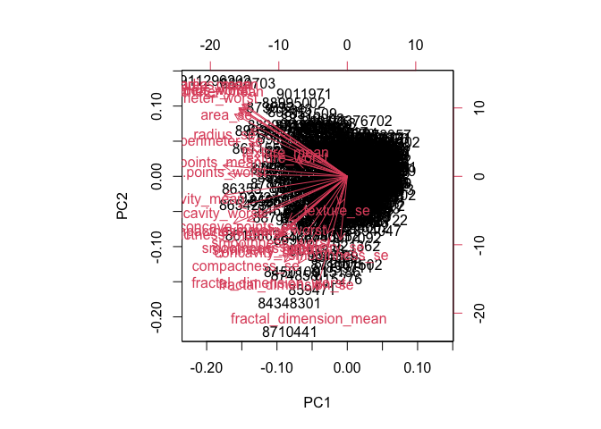<!-- -->

> Q7. What stands out to you about this plot? Is it easy or difficult to
> understand? Why?

There is too much clutter, it is too congested and it is difficult to
get an idea of how the variance/relationship between the data.

There is too much going on with that plot, so lets clean it up a little
by doing a scatter plot

``` r
plot(wisc.pr$x[,1:2], col=diagnosis)
```

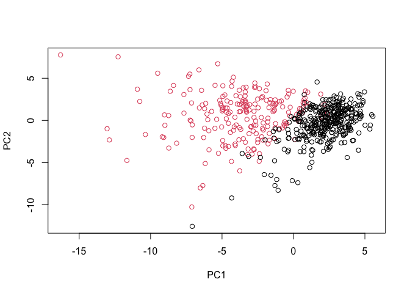<!-- -->

``` r
plot(wisc.pr$x[,c(1,3)], col=diagnosis, xlab = "PC1", ylab = "PC3") # you have to c() to t
```

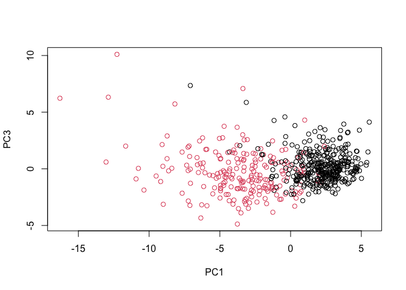<!-- -->
\> Q8. Generate a similar plot for principal components 1 and 3. What do
you notice about these plots?

The plot comparing PC1 to PC3, show there is more variance/difference
between

create a data frame for ggplot

``` r
df <- as.data.frame(wisc.pr$x)
df$diagnosis <- diagnosis
```

load ggplot library

``` r
library(ggplot2)
```

make a scatter plot colored by diagnosis

``` r
ggplot(df) +
  aes(PC1, PC2, col=diagnosis) +
  geom_point()
```

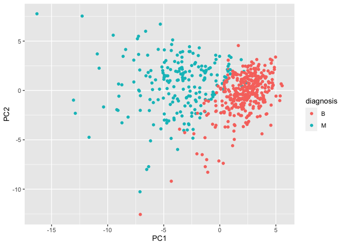<!-- -->

now calculate the variance of each component

``` r
pr.var <- wisc.pr$sdev^2
head(pr.var)
```

    ## [1] 13.281608  5.691355  2.817949  1.980640  1.648731  1.207357

variance explained by each principal component

``` r
total.var <- sum(pr.var)
pve <- pr.var/ total.var
pve
```

    ##  [1] 4.427203e-01 1.897118e-01 9.393163e-02 6.602135e-02 5.495768e-02
    ##  [6] 4.024522e-02 2.250734e-02 1.588724e-02 1.389649e-02 1.168978e-02
    ## [11] 9.797190e-03 8.705379e-03 8.045250e-03 5.233657e-03 3.137832e-03
    ## [16] 2.662093e-03 1.979968e-03 1.753959e-03 1.649253e-03 1.038647e-03
    ## [21] 9.990965e-04 9.146468e-04 8.113613e-04 6.018336e-04 5.160424e-04
    ## [26] 2.725880e-04 2.300155e-04 5.297793e-05 2.496010e-05 4.434827e-06

plot the variance explained for each principal component

``` r
plot(pve, xlab = "Principal Component", 
     ylab = "Proportion of Variance Explained", 
     ylim = c(0, 1), type = "o")
```

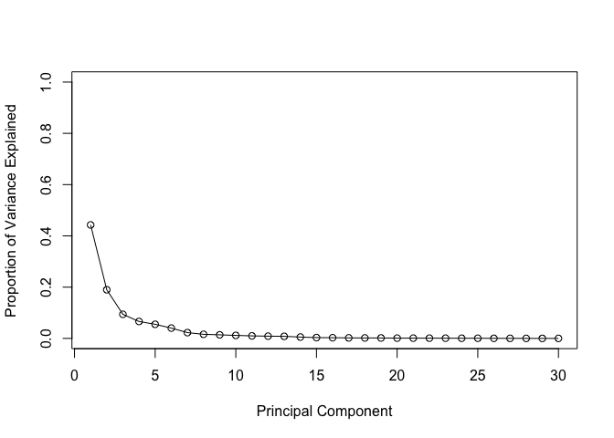<!-- -->

Alternative scree plot of the same data, note data driven y-axis

``` r
barplot(pve, ylab = "Precent of Variance Explained",
     names.arg=paste0("PC",1:length(pve)), las=2, axes = FALSE)
axis(2, at=pve, labels=round(pve,2)*100 )
```

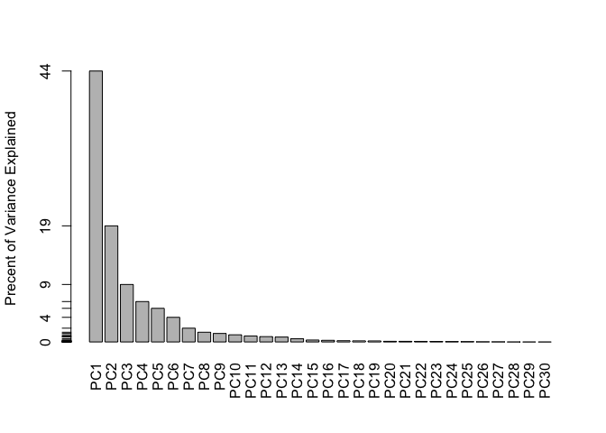<!-- -->

``` r
library(factoextra)
```

    ## Welcome! Want to learn more? See two factoextra-related books at https://goo.gl/ve3WBa

``` r
fviz_eig(wisc.pr, addlabels = TRUE)
```

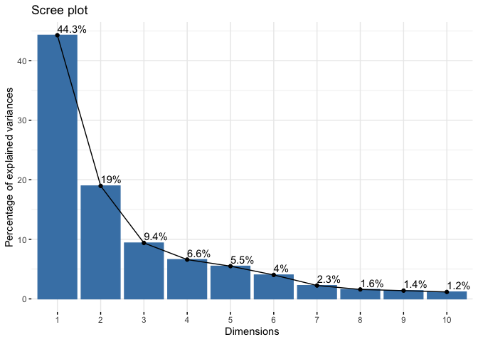<!-- -->

> Q9. For the first principal component, what is the component of the
> loading vector (i.e. wisc.pr$rotation\[,1\]) for the feature
> concave.points_mean?

``` r
wisc.pr$rotation[,1]
```

    ##             radius_mean            texture_mean          perimeter_mean 
    ##             -0.21890244             -0.10372458             -0.22753729 
    ##               area_mean         smoothness_mean        compactness_mean 
    ##             -0.22099499             -0.14258969             -0.23928535 
    ##          concavity_mean     concave.points_mean           symmetry_mean 
    ##             -0.25840048             -0.26085376             -0.13816696 
    ##  fractal_dimension_mean               radius_se              texture_se 
    ##             -0.06436335             -0.20597878             -0.01742803 
    ##            perimeter_se                 area_se           smoothness_se 
    ##             -0.21132592             -0.20286964             -0.01453145 
    ##          compactness_se            concavity_se       concave.points_se 
    ##             -0.17039345             -0.15358979             -0.18341740 
    ##             symmetry_se    fractal_dimension_se            radius_worst 
    ##             -0.04249842             -0.10256832             -0.22799663 
    ##           texture_worst         perimeter_worst              area_worst 
    ##             -0.10446933             -0.23663968             -0.22487053 
    ##        smoothness_worst       compactness_worst         concavity_worst 
    ##             -0.12795256             -0.21009588             -0.22876753 
    ##    concave.points_worst          symmetry_worst fractal_dimension_worst 
    ##             -0.25088597             -0.12290456             -0.13178394

The feature concave.points_mean = -0.26085376

> Q10. What is the minimum number of principal components required to
> explain 80% of the variance of the data?

5 PC

``` r
summary(wisc.pr)
```

    ## Importance of components:
    ##                           PC1    PC2     PC3     PC4     PC5     PC6     PC7
    ## Standard deviation     3.6444 2.3857 1.67867 1.40735 1.28403 1.09880 0.82172
    ## Proportion of Variance 0.4427 0.1897 0.09393 0.06602 0.05496 0.04025 0.02251
    ## Cumulative Proportion  0.4427 0.6324 0.72636 0.79239 0.84734 0.88759 0.91010
    ##                            PC8    PC9    PC10   PC11    PC12    PC13    PC14
    ## Standard deviation     0.69037 0.6457 0.59219 0.5421 0.51104 0.49128 0.39624
    ## Proportion of Variance 0.01589 0.0139 0.01169 0.0098 0.00871 0.00805 0.00523
    ## Cumulative Proportion  0.92598 0.9399 0.95157 0.9614 0.97007 0.97812 0.98335
    ##                           PC15    PC16    PC17    PC18    PC19    PC20   PC21
    ## Standard deviation     0.30681 0.28260 0.24372 0.22939 0.22244 0.17652 0.1731
    ## Proportion of Variance 0.00314 0.00266 0.00198 0.00175 0.00165 0.00104 0.0010
    ## Cumulative Proportion  0.98649 0.98915 0.99113 0.99288 0.99453 0.99557 0.9966
    ##                           PC22    PC23   PC24    PC25    PC26    PC27    PC28
    ## Standard deviation     0.16565 0.15602 0.1344 0.12442 0.09043 0.08307 0.03987
    ## Proportion of Variance 0.00091 0.00081 0.0006 0.00052 0.00027 0.00023 0.00005
    ## Cumulative Proportion  0.99749 0.99830 0.9989 0.99942 0.99969 0.99992 0.99997
    ##                           PC29    PC30
    ## Standard deviation     0.02736 0.01153
    ## Proportion of Variance 0.00002 0.00000
    ## Cumulative Proportion  1.00000 1.00000

First scale the data using the “scale()” function

``` r
data.scaled <- scale(wisc.df)
```

Calculate the distance between observations

``` r
data.dist <- dist(data.scaled)
```

Now create a hierarchical cluster using complete linkage.

``` r
wisc.hclust <- hclust(data.dist, method = "complete")
```

> Q11. Using the plot() and abline() functions, what is the height at
> which the clustering model has 4 clusters?

height = 20

``` r
plot(wisc.hclust)
abline(h= 20, col="red", lty=2)
```

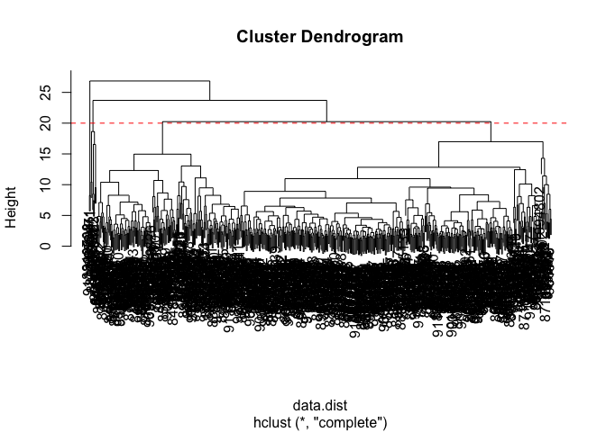<!-- -->
Now cut the tree

``` r
wisc.hclust.clusters <- cutree(wisc.hclust, h=20)
table(wisc.hclust.clusters, diagnosis)
```

    ##                     diagnosis
    ## wisc.hclust.clusters   B   M
    ##                    1  12 165
    ##                    2   2   5
    ##                    3 343  40
    ##                    4   0   2

> Q12. Can you find a better cluster vs diagnoses match by cutting into
> a different number of clusters between 2 and 10?

``` r
wisc.hclust.clusters <- cutree(wisc.hclust, h=24)
table(wisc.hclust.clusters, diagnosis)
```

    ##                     diagnosis
    ## wisc.hclust.clusters   B   M
    ##                    1 357 210
    ##                    2   0   2

> Q13. Which method gives your favorite results for the same data.dist
> dataset? Explain your reasoning.

Complete gives me a better idea of whats going on but ward.D2 is also
really good. I am able to better follow the clusters with complete, but
ward.D2 gives some separation between the text and and the clusters
which makes it easy to follow,

``` r
x <-hclust(data.dist, method = "complete")
plot(x)
```

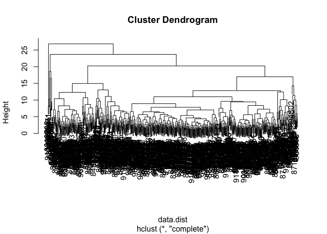<!-- -->
## 5. Clustering on PCA results

make a new dendrogram

``` r
wisc.pr.hclust <- hclust(data.dist, method = "ward.D2")
plot(wisc.pr.hclust)
```

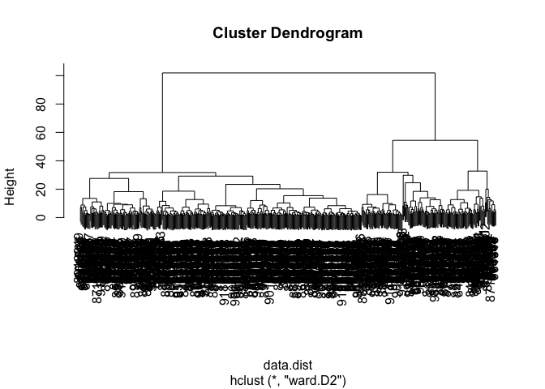<!-- -->

Cut in order to haved 2 clusters

``` r
grps <- cutree(wisc.pr.hclust, k=2)
table(grps)
```

    ## grps
    ##   1   2 
    ## 184 385

``` r
table(grps, diagnosis)
```

    ##     diagnosis
    ## grps   B   M
    ##    1  20 164
    ##    2 337  48

``` r
plot(wisc.pr$x[,1:2], col=grps)
```

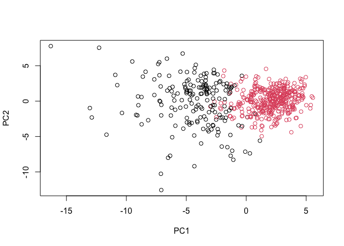<!-- -->

``` r
g <- as.factor(grps)
levels(g)
```

    ## [1] "1" "2"

``` r
#flip
g <- relevel(g,2)
levels(g)
```

    ## [1] "2" "1"

``` r
plot(wisc.pr$x[,1:2], col=diagnosis)
```

<!-- -->

``` r
#plot with reversed order
plot(wisc.pr$x[,1:2], col=g)
```

<!-- -->

Use clustering along the first 7 PCS

``` r
wisc.pr.hclust <- hclust(dist(wisc.pr$x[, 1:7]), method="ward.D2" )
wisc.pr.hclust.clusters <- cutree(wisc.pr.hclust, k=2)
table(wisc.pr.hclust.clusters, diagnosis)
```

    ##                        diagnosis
    ## wisc.pr.hclust.clusters   B   M
    ##                       1  28 188
    ##                       2 329  24

``` r
table(wisc.hclust.clusters, diagnosis)
```

    ##                     diagnosis
    ## wisc.hclust.clusters   B   M
    ##                    1 357 210
    ##                    2   0   2

``` r
wisc.pr.hclust <- hclust(dist(wisc.pr$x[, 1:2]), method="ward.D2")
table(wisc.pr.hclust.clusters, diagnosis)
```

    ##                        diagnosis
    ## wisc.pr.hclust.clusters   B   M
    ##                       1  28 188
    ##                       2 329  24

# 6. Sensitivity/Specificity

**accuary**, essentially how many did we get correct?

``` r
(165+351)/nrow(wisc.df)
```

    ## [1] 0.9068541

Sensitivity TP/(TP+FN)

``` r
(164)/(164+48)
```

    ## [1] 0.7735849

## 7. Prediction

``` r
url <- "https://tinyurl.com/new-samples-CSV"
new <- read.csv(url)
npc <- predict(wisc.pr, newdata=new)
npc
```

    ##            PC1       PC2        PC3        PC4       PC5        PC6        PC7
    ## [1,]  2.576616 -3.135913  1.3990492 -0.7631950  2.781648 -0.8150185 -0.3959098
    ## [2,] -4.754928 -3.009033 -0.1660946 -0.6052952 -1.140698 -1.2189945  0.8193031
    ##             PC8       PC9       PC10      PC11      PC12      PC13     PC14
    ## [1,] -0.2307350 0.1029569 -0.9272861 0.3411457  0.375921 0.1610764 1.187882
    ## [2,] -0.3307423 0.5281896 -0.4855301 0.7173233 -1.185917 0.5893856 0.303029
    ##           PC15       PC16        PC17        PC18        PC19       PC20
    ## [1,] 0.3216974 -0.1743616 -0.07875393 -0.11207028 -0.08802955 -0.2495216
    ## [2,] 0.1299153  0.1448061 -0.40509706  0.06565549  0.25591230 -0.4289500
    ##            PC21       PC22       PC23       PC24        PC25         PC26
    ## [1,]  0.1228233 0.09358453 0.08347651  0.1223396  0.02124121  0.078884581
    ## [2,] -0.1224776 0.01732146 0.06316631 -0.2338618 -0.20755948 -0.009833238
    ##              PC27        PC28         PC29         PC30
    ## [1,]  0.220199544 -0.02946023 -0.015620933  0.005269029
    ## [2,] -0.001134152  0.09638361  0.002795349 -0.019015820

> Q18. Which of these new patients should we prioritize for follow up
> based on your results?

Patient 2 should be prioritized

``` r
plot(wisc.pr$x[,1:2], col=diagnosis)
points(npc[,1], npc[,2], col="blue", pch=16, cex=3)
text(npc[,1], npc[,2], labels=c(1,2), col="white")
```

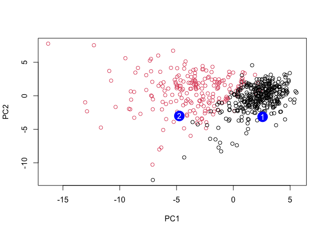<!-- -->
